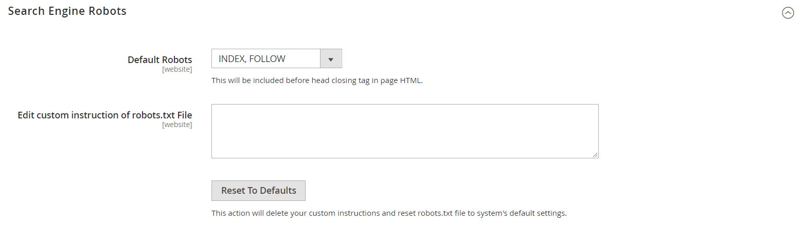

# SEO 개요

_검색 엔진 최적화_(SEO)는 검색 엔진에서 페이지를 인덱싱하는 방식을 개선하기 위해 사이트의 내용과 프레젠테이션을 미세 조정하는 방법입니다. Commerce에는 지속적인 SEO 작업을 지원하는 다양한 기능이 포함되어 있습니다.

>[!TIP]
>
>Adobe Commerce as a Cloud Service의 경우 Commerce Storefront 설명서에서 [SEO 지침](https://experienceleague.adobe.com/developer/commerce/storefront/setup/seo/indexing/?lang=ko)을 참조하십시오

## 메타데이터

[!BADGE PaaS만]{type=Informative url="https://experienceleague.adobe.com/ko/docs/commerce/user-guides/product-solutions" tooltip="Adobe Commerce 온 클라우드 프로젝트(Adobe 관리 PaaS 인프라) 및 온프레미스 프로젝트에만 적용됩니다."}

사이트 및 스토어에 대한 키워드가 풍부한 [메타데이터](meta-data.md)을(를) 추가하고 개선하는 방법에 대해 자세히 알아보세요.

## 사이트 맵 사용

[!BADGE PaaS만]{type=Informative url="https://experienceleague.adobe.com/ko/docs/commerce/user-guides/product-solutions" tooltip="Adobe Commerce 온 클라우드 프로젝트(Adobe 관리 PaaS 인프라) 및 온프레미스 프로젝트에만 적용됩니다."}

[사이트 맵](sitemap-xml.md)은(는) 검색 엔진이 스토어를 인덱싱하는 방식을 개선하고 웹 크롤러가 간과할 수 있는 페이지를 찾을 수 있도록 설계되었습니다. 사이트 맵은 모든 페이지 및 이미지를 색인화하도록 구성할 수 있습니다.

## URL 재작성

[!BADGE PaaS만]{type=Informative url="https://experienceleague.adobe.com/ko/docs/commerce/user-guides/product-solutions" tooltip="Adobe Commerce 온 클라우드 프로젝트(Adobe 관리 PaaS 인프라) 및 온프레미스 프로젝트에만 적용됩니다."}

[URL 다시 작성](url-rewrite.md) 도구를 사용하면 제품, 카테고리 또는 CMS 페이지와 연결된 모든 URL을 변경할 수 있습니다.

## 검색 엔진 로봇

Commerce 구성에는 사이트를 인덱싱하는 웹 크롤러 및 봇에 대한 지침을 생성하고 관리하는 설정이 포함됩니다. `robots.txt`에 대한 요청이 실제 파일이 아닌 Commerce에 도달하면 로봇 컨트롤러로 동적으로 라우팅됩니다. 지침은 인식되어 대부분의 검색 엔진이 따라야 하는 지시문입니다.

기본적으로 Commerce에 의해 생성된 robots.txt 파일에는 웹 크롤러가 시스템에서 내부적으로 사용하는 파일이 포함된 사이트의 특정 부분을 색인화하지 않도록 하는 지침이 포함되어 있습니다. 기본 설정을 사용하거나, 모든 사용자 또는 특정 검색 엔진에 대한 사용자 지정 지침을 정의할 수 있습니다. 온라인상에서는 주제를 자세히 탐구하는 글들이 많이 올라와 있다.

### 사용자 정의 지침 예

**전체 액세스 허용**

    사용자 에이전트:*
    허용 안 함:

**모든 폴더에 대한 액세스 허용 안 함**

    사용자 에이전트:*
    허용 안 함: /

**기본 지침**

    사용자 에이전트: *
    허용 안 함: /index.php/
    허용 안 함: /*?
    허용 안 함: /checkout/
    허용 안 함: /app/
    허용 안 함: /lib/
    허용 안 함: /*.php$
    허용 안 함: /pkginfo/
    허용 안 함: /report/
    허용 안 함: /var/
    허용 안 함: /catalog/
    허용 안 함: /customer/
    허용 안 함: /sendfriend/
    허용 안 함: /review/
    허용 안 함: /*SID=

### `robots.txt` 구성

1. _관리자_ 사이드바에서 **[!UICONTROL Content]** > _[!UICONTROL Design]_>**[!UICONTROL Configuration]**(으)로 이동합니다.

1. 표의 첫 번째 행에서 **[!UICONTROL Global]** 구성을 찾은 다음 **[!UICONTROL Edit]**&#x200B;을(를) 클릭합니다.

   {width="700" zoomable="yes"}

1. 아래로 스크롤하여 **[!UICONTROL Search Engine Robots]** 섹션에서 를 확장하고 다음을 수행합니다.

   {width="600" zoomable="yes"}

   - **[!UICONTROL Default Robots]**&#x200B;을(를) 다음 중 하나로 설정합니다.

     | 옵션 | 설명 |
     |------|------------|
     | `INDEX, FOLLOW` | 웹 크롤러에 사이트를 인덱싱하고 나중에 변경 사항을 다시 확인하도록 지시합니다. |
     | `NOINDEX, FOLLOW` | 웹 크롤러가 사이트를 인덱싱하지 않도록 하지만 나중에 변경 사항을 다시 확인하도록 지시합니다. |
     | `INDEX, NOFOLLOW` | 웹 크롤러가 사이트를 한 번 색인화하지만 나중에 변경 사항을 다시 확인하지 않도록 지시합니다. |
     | `NOINDEX, NOFOLLOW` | 웹 크롤러에 사이트를 인덱싱하지 않도록 하고 나중에 변경 사항을 다시 확인하지 않도록 지시합니다. |

     {style="table-layout:auto"}

   - 필요한 경우 **[!UICONTROL Edit Custom instruction of robots.txt file]** 상자에 사용자 지정 지침을 입력하십시오. 예를 들어 사이트가 개발 중인 동안에는 모든 폴더에 대한 액세스를 허용하지 않을 수 있습니다.

   - 기본 지침을 복원하려면 **[!UICONTROL Reset to Default]**&#x200B;을(를) 클릭합니다.

1. 완료되면 **[!UICONTROL Save Configuration]**&#x200B;을(를) 클릭합니다.
