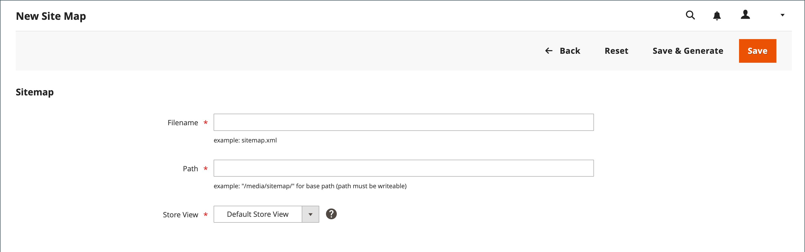
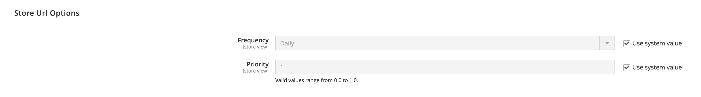

# 사이트 맵

사이트 맵은 검색 엔진이 스토어를 인덱싱하는 방식을 개선하고 웹 크롤러가 간과할 수 있는 페이지를 찾도록 설계되었습니다. 사이트 맵은 모든 페이지 및 이미지를 색인화하도록 구성할 수 있습니다.

활성화되면 Commerce에서 라는 파일을 만듭니다. `sitemap.xml` 지정한 위치에 설치에 저장됩니다. 이 구성을 통해 업데이트 빈도와 각 콘텐츠 유형에 대한 우선 순위를 설정할 수 있습니다. 사이트 맵은 사이트의 콘텐츠가 변경될 때마다(일별, 주별 또는 월별) 자주 업데이트해야 합니다.

사이트가 개발 중인 동안에 `robots.txt` 웹 크롤러에 대한 파일로 사이트를 인덱싱하지 않습니다. 그런 다음 론치 전에 지침을 변경하여 사이트를 인덱싱할 수 있습니다.

기술 정보는 다음을 참조하십시오. [사이트 맵 및 robots.txt 추가][1] 다음에서 _클라우드 인프라의 Commerce 안내서_.

{width="700" zoomable="yes"}

## 1단계. 사이트 맵 구성

다음을 완료합니다. [XML 사이트 맵 구성](#site-map-configuration) 를 사용하여 포함된 항목과 사이트 맵의 업데이트 빈도를 파악할 수 있습니다.

## 2단계. 사이트 맵 생성

1. 다음에서 _관리자_ 메뉴, 이동 **[!UICONTROL Marketing]** > _[!UICONTROL SEO & Search]_>**[!UICONTROL Site Map]**.

1. 클릭 **[!UICONTROL Add Site Map]**.

   {width="700" zoomable="yes"}

1. 사이트 맵 입력 **[!UICONTROL Filename]**. For example: `sitemap.xml`

1. 다음을 입력합니다. **[!UICONTROL Path]** 를 사용하여 서버에서 사이트 맵 파일의 위치를 확인할 수 있습니다. 경로에 쓸 수 있는지 확인하십시오.

   - `/sitemap/` - 라는 디렉터리에 사이트 맵 파일을 배치합니다. _사이트맵_.

   - `/` - 사이트 맵 파일을 상거래 설치의 기본 경로 또는 루트에 배치합니다.

   {width="600" zoomable="yes"}

1. 완료되면 다음을 클릭하십시오. **[!UICONTROL Save & Generate]**.

   사이트 맵이 그리드에 표시되는 데 몇 분 정도 걸릴 수 있습니다.

## 3단계. robots.txt 구성 및 활성화(선택 사항)

다음을 완료합니다. [검색 엔진 로봇](seo-overview.md#search-engine-robots) 인덱싱할 사이트 부분을 검색 엔진이 크롤링하도록 지시하는 지침이 포함된 구성.

## 4단계. 검색 엔진에 사이트 맵 제출

에 대한 링크를 제공하여 사이트 맵을 다른 검색 엔진에 제출할 수 있습니다. `sitemap.xml` 파일을 Commerce 설치에 저장합니다. 링크를 복사하려면 다음을 수행합니다.

1. 다음에서 _사이트 맵_ 목록에서 URL을 **[!UICONTROL Link for Google]** 열.

1. 메뉴에서 **[!UICONTROL Copy Link Address]**.

자세한 내용은 특정 검색 엔진에 대한 지침을 참조하십시오. 다음은 두 개의 상위 검색 엔진에 대한 지침 링크입니다.

- [Google][2]
- [Microsoft ® Bing][3]

## 5단계: 이전 로봇 지침 복원(선택 사항)

이제 원래(기본) 제한 사항을 복원할 수 있습니다.

## 여러 웹 사이트에 대한 사이트 맵 및 robots.txt 관리

여러 웹 사이트가 있는 경우 사이트 맵을 만들고 제출하는 프로세스를 단순화할 수 있습니다. 간단히 [만들기](#site-map-configuration) 확인된 모든 저장소의 URL을 포함하는 하나 이상의 사이트맵을 선택하고 사이트맵을 단일 위치에 저장합니다. 모든 사이트는에서 확인해야 합니다. [Google 검색 콘솔](https://support.google.com/webmasters/answer/7451001).

다중 저장소 인스턴스에 대한 사이트 맵을 만들려면 다음을 수행하십시오.

1. 라는 폴더 만들기 `sitemaps` 웹 사이트의 루트에서 각 도메인에 대한 하위 폴더를 만듭니다.

       /sitemaps/domain_1/
       /sitemaps/domain_2/
   
1. 다음에서 _관리자_ 사이드바, 이동 **[!UICONTROL Marketing]** > _[!UICONTROL SEO & Search]_>**[!UICONTROL Site Map]**.

1. 각 스토어에 대한 사이트 맵 목록을 만들거나 편집하고 **[!UICONTROL Path]** 스토어에 대해 만든 이름으로:

   `/sitemaps/domain_1/`
   `/sitemaps/domain_2/`

1. 필요한 경우 robots.txt 파일을 업데이트합니다.

   검색 엔진 스파이더가 새 사이트 맵으로 올바르게 이동되었는지 확인하려면 robots.txt 파일을 업데이트하거나 만들 수 있습니다. 맨 위에 다음 줄을 추가합니다.

       웹 사이트 사이트 맵
       사이트 맵: https://www.domain_1.com/sitemaps/domain_1/sitemap.xml
       사이트 맵: https://www.domain_2.com/sitemaps/domain_2/sitemap.xml
   
>[!NOTE]
>
>사이트에서 를 사용하는 경우 [Apache](https://experienceleague.adobe.com/docs/commerce-operations/installation-guide/prerequisites/web-server/apache.html) 웹 서버 엔진에서 [`.htaccess`](https://httpd.apache.org/docs/current/howto/htaccess.html) 웹 사이트의 루트에 있는 파일을 사용하여 다른 사이트 맵 요청을 적절한 위치로 보냅니다.

## 열 설명

| 열 | 설명 |
|------|-----------|
| [!UICONTROL ID] | 현재 사이트 맵의 순차적 레코드 번호입니다. |
| [!UICONTROL Filename] | 사이트 맵의 파일 이름입니다. |
| [!UICONTROL Path] | 서버에서 사이트 맵이 있는 위치입니다. 예:  `/sitemap/` - 라는 디렉터리에 사이트 맵 파일을 배치합니다. _사이트맵_, Commerce 설치 루트 한 레벨 아래.  `/` - 사이트 맵 파일을 상거래 설치의 기본 경로 또는 루트에 배치합니다. |
| [!UICONTROL Link for Google] | Google 및 기타 검색 엔진에 제출할 사이트 맵의 URL입니다. |
| [!UICONTROL Last Generated] | 사이트 맵이 마지막으로 생성된 날짜와 시간을 나타냅니다. |
| [!UICONTROL Store View] | 사이트 맵이 적용되는 스토어 보기. |
| [!UICONTROL Generate] | 사이트 맵을 다시 생성합니다. |

{style="table-layout:auto"}

## 사이트 맵 구성

사이트 맵은 사이트의 콘텐츠가 변경될 때마다 매일, 매주 또는 매월 업데이트해야 합니다. 구성을 통해 각 콘텐츠 유형에 대한 빈도와 우선 순위를 설정할 수 있습니다.

### 1단계. 콘텐츠 업데이트 빈도 및 우선 순위 설정

1. 다음에서 _관리자_ 사이드바, 이동 **[!UICONTROL Stores]** > _[!UICONTROL Settings]_>**[!UICONTROL Configuration]**.

1. 왼쪽 패널에서 를 확장합니다. **[!UICONTROL Catalog]** 및 선택 **[!UICONTROL XML Sitemap]**.

1. 확장  다음 **[!UICONTROL Categories Options]** 섹션을 참조하고 다음을 수행합니다.

   >[!NOTE]
   >
   >필요한 경우 **[!UICONTROL Use system value]** 확인란을 선택하여 이 설정을 변경할 수 있습니다.

   - 설정 **[!UICONTROL Frequency]** 다음 중 하나를 수행합니다.

      - `Always`
      - `Hourly`
      - `Daily`
      - `Weekly`
      - `Monthly`
      - `Yearly`
      - `Never`

   - 대상 **[!UICONTROL Priority]**, 다음 범위의 값을 입력합니다. `0.0` 및 `1.0`. 0이 가장 낮은 우선 순위를 갖습니다.

   {width="600" zoomable="yes"}

   이러한 옵션에 대한 자세한 목록은 다음을 참조하십시오. [범주 옵션](../configuration-reference/catalog/xml-sitemap.md#categories-options) 다음에서 _구성 참조_.

1. 확장  다음 **[!UICONTROL Products Options]** 섹션 및 완료 **[!UICONTROL Frequency]** 및 **[!UICONTROL Priority]** 필요에 따라 설정합니다.

   이러한 옵션에 대한 자세한 목록은 다음을 참조하십시오. [제품 옵션](../configuration-reference/catalog/xml-sitemap.md#products-options) 다음에서 _구성 참조_.

1. 사이트맵에 이미지가 포함되는 범위를 결정하려면 을 설정합니다 **[!UICONTROL Add Images into Sitemap]** 다음 중 하나를 수행합니다.

   - `None`
   - `Base Only`
   - `All`

   {width="600" zoomable="yes"}

1. 확장  다음 **[!UICONTROL CMS Pages Options]** 섹션 및 완료 **[!UICONTROL Frequency]** 및 **[!UICONTROL Priority]** 필요에 따라 설정합니다.

   {width="600" zoomable="yes"}

   이러한 옵션에 대한 자세한 목록은 다음을 참조하십시오. [CMS 페이지 옵션](../configuration-reference/catalog/xml-sitemap.md#cms-pages-options) 다음에서 _구성 참조_.

1. 확장  다음 **[!UICONTROL Store Url Options]** 섹션 및 완료 **[!UICONTROL Frequency]** 및 **[!UICONTROL Priority]** 필요에 따라 설정합니다.

   {width="600" zoomable="yes"}

   이러한 옵션에 대한 자세한 목록은 다음을 참조하십시오. [Url 저장 옵션](../configuration-reference/catalog/xml-sitemap.md#store-url-options) 다음에서 _구성 참조_.

1. 완료되면 다음을 클릭하십시오. **[!UICONTROL Save Config]**.

### 2단계. 생성 설정 완료

1. 확장  다음 **[!UICONTROL Generation Settings]** 섹션.

   필요한 경우 **시스템 값 사용** 확인란을 선택하여 이 설정을 변경할 수 있습니다.

   {width="600" zoomable="yes"}

   이러한 옵션에 대한 자세한 목록은 다음을 참조하십시오. [생성 설정](../configuration-reference/catalog/xml-sitemap.md#generation-settings) 다음에서 _구성 참조_.

1. 사이트 맵을 생성하려면 를 설정합니다. **[!UICONTROL Enabled]** 끝 `Yes` 다음을 수행합니다.

   - 설정 **[!UICONTROL Start Time]** 사이트 맵을 업데이트하려는 시간, 분 및 초로 설정합니다.

   - 설정 **[!UICONTROL Frequency]** 다음 중 하나를 수행합니다.

      - `Daily`
      - `Weekly`
      - `Monthly`

   - 대상 **[!UICONTROL Error Email Recipient]**&#x200B;사이트 맵 업데이트 중에 오류가 발생하는 경우 알림을 받을 사람의 이메일 주소를 입력합니다.

   - 설정 **[!UICONTROL Error Email Sender]** 오류 알림의 발신자로 표시되는 스토어 담당자에게 알립니다.

   - 설정 **[!UICONTROL Error Email Template]** 오류 알림에 사용되는 템플릿을 참조하십시오.

### 3단계. 사이트 맵 파일 제한 설정

1. 확장  다음 **[!UICONTROL Sitemap File Limits]** 섹션.

   {width="600" zoomable="yes"}

   이러한 옵션에 대한 자세한 목록은 다음을 참조하십시오. [사이트 맵 파일 제한](../configuration-reference/catalog/xml-sitemap.md#sitemap-file-limits) 다음에서 _구성 참조_.

1. 대상 **[!UICONTROL Maximum No of URLs per File]**&#x200B;사이트맵에 포함할 수 있는 최대 URL 수를 입력합니다.

   기본적으로 제한은 50,000입니다.

1. 대상 **[!UICONTROL Maximum File Size]**&#x200B;사이트맵에 할당된 최대 크기(바이트)를 입력합니다.

   기본 크기는 10,485,760바이트입니다.

### 4단계. 검색 엔진 제출 설정 설정

1. 확장  다음 **[!UICONTROL Search Engine Submission Settings]** 섹션.

   {width="600" zoomable="yes"}

1. 를 사용하는 경우 `robots.txt` 사이트를 크롤링하는 검색 엔진에 대한 지침을 제공하는 파일, **[!UICONTROL Enable Submission to Robots.txt]** 끝 `Yes`.

1. 완료되면 다음을 클릭하십시오. **[!UICONTROL Save Config]**.

[1]: https://experienceleague.adobe.com/docs/commerce-cloud-service/user-guide/configure-store/robots-sitemap.html
[2]: https://support.google.com/webmasters/answer/183669?hl=en
[3]: https://www.bing.com/webmasters/help/Sitemaps-3b5cf6ed
