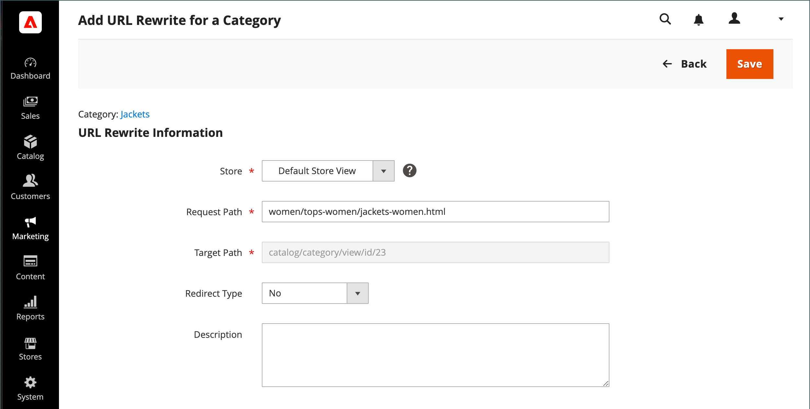

# 범주 URL 재작성

범주가 카탈로그에서 제거된 경우 범주 재작성을 사용하여 링크를 스토어에 있는 다른 범주의 URL로 리디렉션할 수 있습니다. 생각의 기준 _target_ / _원본 요청_  또는 _리디렉션 대상_ / _에서 리디렉션_. 사람들이 검색 엔진 또는 오래된 링크에서 이전 페이지로 계속 이동할 수 있지만 리디렉션으로 인해 저장소가 새 대상으로 전환됩니다.

If [자동 리디렉션](url-redirect-product-automatic.md) 저장소에 대해 활성화되어 있으므로 카테고리가 재작성될 필요가 없습니다. [URL 키](../catalog/catalog-urls.md) 이(가) 변경되었습니다.

{{url-rewrite-skip}}

## 1단계. 다시 작성 계획

실수를 방지하려면 _리디렉션 대상_ 경로 및 _에서 리디렉션_ 경로를 지정하고 URL 키와 접미사를 포함합니다(해당하는 경우).

확실하지 않은 경우 스토어에서 각 카테고리 페이지를 열고 브라우저의 주소 표시줄에서 경로를 복사합니다.

**예:**

리디렉션 대상: `gear/backpacks-and-bags.html`

다음에서 리디렉션: `gear/bags.html`

## 2단계. 다시 작성 만들기

{{url-rewrite-params}}

1. 다음에서 _관리자_ 사이드바, 이동 **[!UICONTROL Marketing]** > _[!UICONTROL SEO & Search]_>**[!UICONTROL URL Rewrites]**.

1. 계속하기 전에 다음을 수행하여 요청 경로를 사용할 수 있는지 확인합니다.

   - 검색 필터 내 **[!UICONTROL Request Path]** 열에서 리디렉션할 범주의 URL 키를 입력하고 **[!UICONTROL Search]**.

   - 페이지에 대한 리디렉션 레코드가 여러 개 있는 경우 해당 저장소 보기와 일치하는 레코드를 찾아 편집 모드로 리디렉션 레코드를 엽니다.

   - 오른쪽 위 모서리에서 을(를) 클릭합니다. **[!UICONTROL Delete]**. 메시지가 표시되면 **[!UICONTROL OK]** 확인할 수 있습니다.

1. 다음으로 돌아가기 _[!UICONTROL URL Rewrites]_페이지, 클릭&#x200B;**[!UICONTROL Add URL Rewrite]**.

1. 설정 **[!UICONTROL Create URL Rewrite]** 끝 `For category` 리디렉션의 대상이 되는 트리에서 대상 범주를 선택합니다.

   {width="700" zoomable="yes"}

1. 다음에서 _URL 다시 작성_ 섹션에서 다음을 수행합니다.

   - 여러 스토어가 있는 경우 **[!UICONTROL Store]** 다시 쓰기가 적용되는 위치입니다.

   - 대상 **[!UICONTROL Request Path]**&#x200B;고객이 요청하는 카테고리의 URL 키를 입력합니다. 다음 은 _에서 리디렉션_ 범주.

     >[!NOTE]
     >
     >지정한 저장소에 대한 요청 경로는 고유해야 합니다. 동일한 요청 경로를 사용하는 리디렉션이 이미 있는 경우 리디렉션을 저장하려고 하면 오류가 표시됩니다. 리디렉션을 만들려면 먼저 이전 리디렉션을 삭제해야 합니다.

   - 설정 **[!UICONTROL Redirect]** 다음 중 하나를 수행합니다.

      - `Temporary (302)`
      - `Permanent (301)`

   - 참조용으로 재작성에 대한 간단한 설명을 입력합니다.

   {width="700" zoomable="yes"}

1. 리디렉션을 저장하기 전에 다음을 검토하십시오.

   - 왼쪽 위 모서리에 있는 링크에 대상 카테고리의 이름이 표시됩니다.
   - 요청 경로에는 원본에 대한 경로가 포함됩니다 _에서 리디렉션_ 범주.

1. 완료되면 다음을 클릭하십시오. **[!UICONTROL Save]** 단추를 클릭합니다.

   새 범주 다시 작성은 URL 다시 작성 그리드 맨 위에 나타납니다.

## 3단계. 결과 테스트

1. 스토어의 홈페이지로 이동합니다.

1. 다음 중 하나를 수행합니다.

   - 원본으로 이동 _에서 리디렉션_ 범주.
   - 브라우저의 주소 표시줄에 원본의 경로를 입력합니다 _에서 리디렉션_ 스토어 URL 바로 뒤에 분류 **[!UICONTROL Enter]**.

   원래 범주 요청 대신 새 대상 범주가 나타납니다.

## 필드 설명

| 필드 | 설명 |
|--- |--- |
| [!UICONTROL Create URL Rewrite] | 다시 작성 유형을 나타냅니다. 다시 작성을 만든 후에는 유형을 변경할 수 없습니다. 옵션: `Custom` / `For category` / `For product` / `For CMS page` |
| [!UICONTROL Request Path] | 리디렉션할 카테고리입니다. 구성에 따라 요청 경로에 .html 또는 .htm 접미사와 상위 카테고리가 포함될 수 있습니다. 요청 경로는 고유해야 하며 다른 리디렉션에서 사용할 수 없습니다. 요청 경로가 존재한다는 오류가 표시되면 기존 리디렉션을 삭제하고 다시 시도하십시오. |
| [!UICONTROL Target Path] | 리디렉션 대상을 가리키기 위해 시스템에서 사용하는 내부 경로입니다. 대상 경로가 회색으로 표시되어 편집할 수 없습니다. |
| [!UICONTROL Redirect] | 리디렉션 유형을 결정합니다. 옵션:  **[!UICONTROL No]**- 리디렉션이 지정되지 않았습니다. 많은 작업에서 이 유형의 리디렉션 요청을 만듭니다. 예를 들어 카테고리에 제품을 추가할 때마다 `No` 각 스토어 조회수는 유형이 생성됩니다. **[!UICONTROL Temporary (302)]** - 제한된 시간 동안 다시 쓰기를 검색하도록 엔진에 표시합니다. 검색 엔진은 일반적으로 임시 재작성에 대한 페이지 등급 정보를 유지하지 않습니다.  **[!UICONTROL Permanent (301)]**- 검색 엔진에 다시 쓰기가 영구적임을 나타냅니다. 검색 엔진은 일반적으로 영구적인 재작성을 위해 페이지 등급 정보를 유지합니다. |
| [!UICONTROL Description] | 내부 참조를 위해 다시 쓰는 목적에 대해 설명합니다. |

{style="table-layout:auto"}
