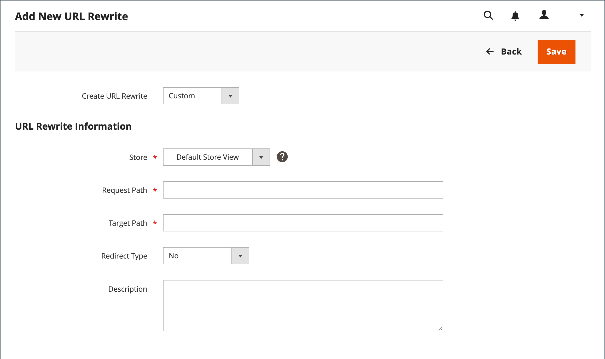

# 사용자 정의 URL 재작성

사용자 지정 다시 작성은 스토어에서 외부 웹 사이트로 페이지를 리디렉션하는 것과 같은 기타 리디렉션을 관리하는 데 사용할 수 있습니다. 예를 들어 각각 고유한 도메인이 있는 두 개의 Commerce 웹 사이트가 있을 수 있습니다. 사용자 지정 리디렉션을 사용하여 제품, 카테고리 또는 페이지에 대한 요청을 다른 웹 사이트로 리디렉션할 수 있습니다. 다른 리디렉션 유형과 달리, 사용자 지정 리디렉션의 대상은 저장소의 기존 페이지 목록에서 선택되지 않습니다.

시작하기 전에 리디렉션이 수행할 작업을 정확히 이해했는지 확인하십시오. 생각의 기준 _target_ / _소스_ 또는 _리디렉션 대상_ / _에서 리디렉션_. 사람들이 검색 엔진 또는 오래된 링크에서 이전 페이지로 계속 이동할 수 있지만 리디렉션으로 인해 저장소가 새 대상으로 전환됩니다.

## 1단계. 다시 작성 계획

실수를 방지하려면 의 URL을 _리디렉션 대상_ 및 의 URL 키 _에서 리디렉션_ 페이지를 가리키도록 업데이트하는 중입니다.

확실하지 않은 경우 각 페이지를 열고 브라우저의 주소 표시줄에서 URL을 복사합니다.

**예**

리디렉션 대상:

    http://www.different-website.com/page.html

다음에서 리디렉션:

    cms-page
    category.html
    category/subcategory.html
    product.html
    category/product.html

## 2단계. 다시 작성 만들기

{{url-rewrite-params}}

1. 다음에서 _관리자_ 사이드바, 이동 **[!UICONTROL Marketing]** > _[!UICONTROL SEO & Search]_>**[!UICONTROL URL Rewrites]**.

1. 계속하기 전에 다음을 수행하여 요청 경로를 사용할 수 있는지 확인합니다.

   - 검색 필터 내 **[!UICONTROL Request Path]** 열에서 리디렉션할 페이지의 URL 키를 입력하고 **[!UICONTROL Search]**.

   - 페이지에 대한 리디렉션 레코드가 여러 개 있는 경우 해당 스토어 보기와 일치하는 레코드를 찾아 편집 모드로 엽니다.

   - 오른쪽 위 모서리에서 을(를) 클릭합니다. **[!UICONTROL Delete]**. 메시지가 표시되면 **[!UICONTROL OK]** 확인할 수 있습니다.

1. URL 재작성 페이지로 돌아가면 다음을 클릭합니다. **[!UICONTROL Add URL Rewrite]**.

1. 설정 **[!UICONTROL Create URL Rewrite]** 끝 `Custom`.

   {width="600" zoomable="yes"}

1. URL 재작성 정보에서 다음을 수행합니다.

   - 저장소 보기가 여러 개 있는 경우 **[!UICONTROL Store]** 다시 쓰기가 적용되는 위치입니다.

   - 대상 **[!UICONTROL Request Path]**&#x200B;에 리디렉션할 제품, 카테고리 또는 CMS 페이지의 URL 키 및 경로(해당하는 경우)를 입력합니다.

     >[!NOTE]
     >
     >지정한 저장소에 대한 요청 경로는 고유해야 합니다. 동일한 요청 경로를 사용하는 리디렉션이 이미 있는 경우 리디렉션을 저장하려고 하면 오류가 표시됩니다. 리디렉션을 만들려면 먼저 이전 리디렉션을 삭제해야 합니다.

   - 대상 **[!UICONTROL Target Path]**&#x200B;를 클릭하고 대상의 URL을 입력합니다. 대상이 다른 웹 사이트에 있는 경우 정규화된 URL을 입력하십시오.

   - 설정 **리디렉션** 다음 중 하나를 수행합니다.

      - `Temporary (302)`
      - `Permanent (301)`

   - 참조용으로 재작성에 대한 간단한 설명을 입력합니다.

1. 리디렉션을 저장하기 전에 다음을 검토하십시오.

   - 다음 [!UICONTROL Request Path] 원본의 URL 키 또는 경로를 포함합니다. _에서 리디렉션_ 페이지를 가리키도록 업데이트하는 중입니다.
   - 다음 [!UICONTROL Target Path] 의 URL을 포함합니다. _리디렉션 대상_ 페이지를 가리키도록 업데이트하는 중입니다.

1. 완료되면 다음을 클릭하십시오. **[!UICONTROL Save]**.

   목록 맨 위의 그리드에 새 다시 쓰기가 나타납니다.

## 3단계. 결과 테스트

1. 스토어의 홈페이지로 이동합니다.

1. 다음 중 하나를 수행합니다.

   - 원본으로 이동 _에서 리디렉션_ 페이지를 가리키도록 업데이트하는 중입니다.
   - 브라우저의 주소 표시줄에 원본의 이름을 입력합니다 _에서 리디렉션_ 스토어 URL 바로 뒤에 페이지를 추가하고 을 누릅니다 **입력**.

   원래 페이지 요청 대신 새 대상 페이지가 나타납니다.

## 필드 설명

| 필드 | 설명 |
|--- |--- |
| [!UICONTROL Create URL Rewrite] | 다시 작성 유형을 나타냅니다. 다시 작성을 만든 후에는 유형을 변경할 수 없습니다. 옵션: `Custom` / `For category` / `For product` / `For CMS page` |
| [!UICONTROL Request Path] | 리디렉션할 페이지입니다. 요청 경로는 고유해야 하며 다른 리디렉션에서 사용할 수 없습니다. 요청 경로가 존재한다는 오류 메시지가 표시되면 기존 리디렉션을 삭제하고 다시 시도하십시오. |
| [!UICONTROL Target Path] | 시스템에서 대상을 지정하는 데 사용하는 내부 경로입니다. 대상 경로가 회색으로 표시되어 편집할 수 없습니다. |
| [!UICONTROL Redirect] | 리디렉션 유형을 결정합니다. 옵션:  **아니요** - 리디렉션이 지정되지 않았습니다.  **[!UICONTROL Temporary (302)]**- 제한된 시간 동안 다시 쓰기를 검색하도록 엔진에 표시합니다. 검색 엔진은 일반적으로 임시 재작성에 대한 페이지 등급 정보를 유지하지 않습니다. **[!UICONTROL Permanent (301)]** - 검색 엔진에 다시 쓰기가 영구적임을 나타냅니다. 검색 엔진은 일반적으로 영구적인 재작성을 위해 페이지 등급 정보를 유지합니다. |
| [!UICONTROL Description] | 내부 참조를 위해 다시 쓰는 목적에 대해 설명합니다. |

{style="table-layout:auto"}
