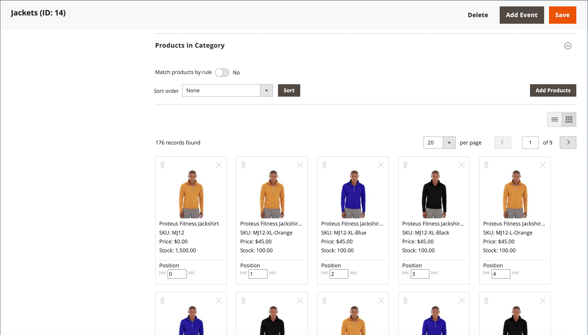

# Visual Merchandiser

{{ee-feature}}

다음 _Visual Merchandiser_ 는 제품을 포지셔닝하고 범주 목록에 표시되는 제품을 결정하는 조건을 적용할 수 있는 고급 도구 세트입니다. 그 결과 카탈로그의 변경 사항에 맞게 조정되는 제품을 동적으로 선택할 수 있습니다. 다음에서 작업할 수 있습니다. _시각적 모드_- 각 제품을 그리드에 타일로 표시하거나 카테고리의 제품 목록에서 작동하게 표시합니다. 각 모드에서 동일한 도구를 사용할 수 있으며 오른쪽 위 모서리에 있는 버튼을 사용하여 각 디스플레이 유형 간에 전환할 수 있습니다.

{width="600" zoomable="yes"}

## Visual Merchandiser 액세스

1. 다음에서 _관리자_ 사이드바, 이동 **[!UICONTROL Catalog]** > **[!UICONTROL Categories]**.

1. 범주 트리를 드릴다운하고 편집할 범주를 클릭합니다.

1. 아래로 스크롤하고 확장합니다.  다음 **[!UICONTROL Products in Category]** 섹션.

1. 다음을 클릭합니다. _타일로 보기_ (  ) 단추를 클릭하여 제품을 그리드로 표시합니다.

1. 완료되면 다음을 클릭하십시오. **[!UICONTROL Save Category]**.

## 제품 위치 변경

1. 사용 [정렬 순서](../catalog/navigation-product-listings.md) 이동할 제품을 봅니다.

   - **방법 1: 드래그 앤 드롭**

     다음 항목을 가져옵니다. _드래그_ () 제품 타일의 오른쪽 상단 모서리에서 을(를) 제어하고 제품을 위치에 놓습니다. 새로운 포지션을 반영하기 위해 제품별 개수가 조정된다.

   - **방법 2: 위치 값 설정**

     다음에서 _위치_ 컨트롤러 () 제품 타일에서 제품을 표시할 번호를 입력합니다. 입력 `0` 을 클릭하여 제품을 목록의 맨 위에 놓습니다.

1. 완료되면 다음을 클릭하십시오. **[!UICONTROL Save Category]**.

>[!NOTE]
>
>깔끔한 설치에서 Adobe Commerce은 범주 ID를 예약합니다 `2` 기본 저장소의 루트 카탈로그에 대해 추적합니다. Visual Merchandiser는 ID 번호가 인 카테고리만 사용할 수 있습니다. `3` 또는 그 이상

## 작업 영역 컨트롤

| 제어 | 설명 |
|--- |--- |
|  | 목록으로 보기 |
|  | 타일로 보기 |
|  | 규칙별 일치 - 아니요 |
|  | 규칙별 일치 - 예 |
|  | 드래그 |
|  | 위치 |
|  | 범주에서 제거 |
|  | 페이지당 보기 |
|  | 다음/이전으로 이동 |

{style="table-layout:auto"}
