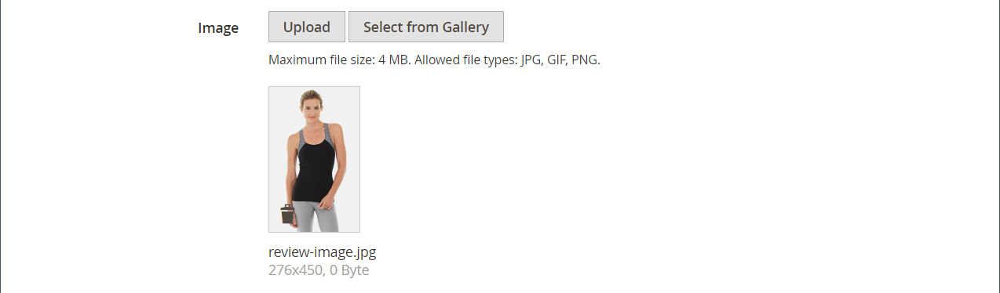

# [!DNL Page Builder] 연습 1부: 단순 페이지

사용자 고유의 디자인에 따라 콘텐츠가 풍부한 페이지를 만드는 것이 얼마나 쉬운지 보여 주는 간단한 페이지를 만들어 [!DNL Page Builder] 작업 영역에 익숙해지려면 이 세 부분으로 구성된 연습을 따르십시오.

{width="700" zoomable="yes"}

>[!NOTE]
>
>이 연습 연습에서는 2.4.1 릴리스의 [!DNL Page Builder] 작업 영역에 대한 최근 변경 사항을 반영하도록 업데이트됩니다. 이전 Adobe Commerce 릴리스를 사용하는 경우 [[!DNL Commerce] 2.3 사용 안내서](https://docs.magento.com/user-guide/v2.3/cms/page-builder-learn.html)에 포함된 [!DNL Page Builder] 연습 연습을 사용하십시오.

## 시작하기 전에

이 연습을 시작하기 전에 작업 중에 세션이 시간 초과되지 않도록 [관리 세션 수명](../systems/security-admin.md)을 늘리는 것이 좋습니다.

필요한 컨텐츠 관리 구성 설정을 확인합니다.

- [WYSIWYG 옵션](../content-design/editor.md#configure-the-editor) 구성에서 WYSIWYG 편집기를 사용할 수 있습니다.

- [!DNL Page Builder]은(는) [고급 콘텐츠 도구](setup.md) 구성에서 사용할 수 있습니다.

### 연습 이미지 자산 다운로드

1. [`simple-page-assets`](./assets/simple-page-assets.zip) 파일을 다운로드하고 로컬 시스템에 저장합니다.

1. 다운로드한 파일로 이동하여 압축한 파일을 추출합니다.

   Windows 시스템에서 마우스 오른쪽 단추를 클릭하고 **[!UICONTROL Extract All]**&#x200B;개의 파일을 선택합니다. 그런 다음 대상 폴더를 선택하고 **[!UICONTROL Extract]**&#x200B;을(를) 클릭합니다.

   Mac 시스템에서는 zip 파일을 두 번 클릭하고 추출한 파일을 대상 폴더로 이동할 수 있습니다.

   폴더에는 다음 이미지 파일이 포함되어 있습니다.

   ![[!DNL Page Builder] 연습 파일 - 단순 페이지 자산](./assets/pb-tutorial-simple-page-assets.png){width="500"}

이 연습의 세 부분을 순서대로 따르십시오.

## 1부: 배너가 있는 전체 도련 행

이 간단한 페이지 연습에서는 전체 도련 행과 배너가 있는 페이지를 만듭니다. 행에는 데스크톱 및 모바일 장치에 대한 다른 배경 이미지가 있습니다.

배너가 있는 ![[!DNL Page Builder] 전체 도련 행](./assets/pb-tutorial1-full-bleed-with-banner.png){width="700" zoomable="yes"}

### 1단계: 페이지 만들기

1. _관리자_ 사이드바에서 **[!UICONTROL Content]** > _[!UICONTROL Elements]_>**[!UICONTROL Pages]**(으)로 이동합니다.

1. 오른쪽 상단 모서리에서 **[!UICONTROL Add New Page]**&#x200B;을(를) 클릭하고 다음을 수행합니다.

   - 이 페이지가 스토어에 게시되지 않도록 하려면 **[!UICONTROL Enable Page]**&#x200B;을(를) `No`(으)로 설정하십시오.

   - **[!UICONTROL Page Title]**&#x200B;에 대해 `Simple Page`을(를) 입력하십시오.

   {width="600" zoomable="yes"}

1. **[!UICONTROL Design]** 섹션에서 를 확장합니다.

   기본적으로 **[!UICONTROL Layout]**&#x200B;이(가) `Page -- Full Width`(으)로 설정되어 있습니다. [!DNL Page Builder]은(는) 다섯 가지 표준 [레이아웃](../content-design/page-layout.md) 옵션 외에도 페이지, 카테고리 및 제품에 대한 전체 레이아웃 을 추가합니다.

1. 샘플 데이터를 사용할 수 있으면 **[!UICONTROL New Theme]**&#x200B;을(를) `Magento Luma`(으)로 설정하십시오. 그렇지 않으면 사용 가능한 다른 테마를 선택하거나 비워 두어 기본 테마를 사용할 수 있습니다.

   _[!UICONTROL New Theme]_설정을 사용하여 기본 테마를 재정의하고 다른 테마를 페이지에 적용할 수 있습니다.

   >[!NOTE]
   >
   >전체 너비 레이아웃은 호환되는 [테마](../content-design/themes.md)에서만 사용할 수 있습니다.

   {width="600" zoomable="yes"}

1. 오른쪽 상단에서 **[!UICONTROL Save]**&#x200B;을(를) 클릭합니다.

   페이지를 저장하면 페이지의 왼쪽 상단에 _단순 페이지_ 이름이 나타납니다.

### 2단계: 행 서식 지정

1. **[!UICONTROL Content]** 섹션에서 를 확장합니다.

   이 작업은 행이 비어 있는 [!DNL Page Builder] 미리 보기를 표시합니다.

   >[!NOTE]
   >
   >[콘텐츠 제목](workspace.md) 필드는 선택 사항입니다. 기본적으로 테마에 따라 제목 수준 1(H1)로 형식이 지정됩니다. 이 연습에서는 _콘텐츠 제목_&#x200B;이 비어 있습니다.

   {width="600" zoomable="yes"}

1. 콘텐츠 미리 보기 영역 내에서 **[!UICONTROL Edit with Page Builder]** 또는 을(를) 클릭합니다.

   확장된 [!DNL Page Builder] [작업 영역](workspace.md)에서 왼쪽의 패널은 스테이지에서 콘텐츠를 빌드하는 데 사용할 수 있는 콘텐츠 도구를 제공합니다.

1. 빈 행을 마우스로 가리키면 도구 상자가 표시됩니다.

   각 콘텐츠 컨테이너에는 유사한 옵션 세트가 있는 도구 상자가 있습니다.

   ![[!DNL Page Builder]행 도구 상자](./assets/pb-layout-page-add-content-row-tools.png){width="600" zoomable="yes"}

1. 행 도구 상자에서 _설정_({width="20"})을 선택합니다.

1. _[!UICONTROL Appearance]_에서&#x200B;**전체 도련**을 선택합니다.

   전체 도련 모양 설정은 행과 배경의 내용 영역의 왼쪽 및 오른쪽 테두리를 페이지의 전체 너비로 확장합니다.

   {width="600" zoomable="yes"}

1. _[!UICONTROL Advanced]_섹션까지 아래로 스크롤하고 모든&#x200B;**[!UICONTROL Margins and Padding]**설정을 `0`(으)로 설정합니다.

   이 설정을 사용하면 배너가 행의 전체 폭을 확장합니다.

   {width="600" zoomable="yes"}

1. 설정을 저장하고 [!DNL Page Builder] 작업 영역으로 돌아가려면 페이지 맨 위로 스크롤하고 오른쪽 상단 모서리에서 **[!UICONTROL Save]**&#x200B;을(를) 클릭합니다.

### 3단계: 배너 추가

>[!NOTE]
>
>[!DNL Page Builder]에는 이 단계에서 사용할 수 있는 _배너_&#x200B;라는 새로운 콘텐츠 형식이 있습니다. 이전에 콘텐츠 메뉴의 _배너_ 옵션이었던 것이 이제 _동적 블록_&#x200B;입니다.

1. [!DNL Page Builder] 패널에서 **[!UICONTROL Media]**&#x200B;을(를) 확장하고 **배너** 자리 표시자를 스테이지로 드래그합니다.

   {width="600" zoomable="yes"}
1. 도구 상자를 표시하려면 배너 컨테이너 위로 마우스를 가져갑니다.

   >[!NOTE]
   >
   >이제 스테이지에 두 개의 콘텐츠 컨테이너가 있으며 각 콘텐츠 컨테이너에는 별도의 도구 상자가 있습니다. 배너가 행 내부에 중첩되어 있으므로 올바른 도구 상자에서 작업하고 있는지 확인하십시오.

   도구 상자 외에도 _이미지 업로드_ 및 _갤러리에서 선택_ 단추가 포함되어 있으므로 스테이지에서 직접 배너를 빠르게 변경할 수 있습니다.

   {width="600" zoomable="yes"}

1. 배너 도구 상자에서 _설정_ ( {width="20"} ) 아이콘을 선택합니다.

1. _[!UICONTROL Appearance]_에서&#x200B;**[!UICONTROL Collage Right]**을(를) 선택합니다.

   콜라주 오른쪽 설정은 배너의 오른쪽에 컨텐츠를 배치합니다.

   {width="600" zoomable="yes"}

1. _[!UICONTROL Background]_섹션까지 아래로 스크롤하고 배너의 배경 이미지를 설정합니다.

   - **[!UICONTROL Background Image]**&#x200B;의 경우 **업로드**&#x200B;를 클릭합니다.

     {width="600" zoomable="yes"}

     추출된 단순 페이지 자산을 저장한 디렉터리로 이동한 다음 `wide-banner-background.jpg` 파일을 선택합니다.

     이미지가 업로드되고 업로드된 이미지의 썸네일이 나타납니다. 파일 이름, 이미지 치수 및 파일 크기는 아래에 설명되어 있습니다.

     {width="600" zoomable="yes"}

   - **[!UICONTROL Background Mobile Image]**&#x200B;의 경우 **업로드**&#x200B;를 클릭합니다.

     동일한 파일 디렉터리에서 `wide-banner-background-mobile.jpg` 파일을 선택합니다.

     모바일 배경 이미지는 모바일 디바이스에 사용되며 데스크탑 브라우저 창의 크기가 모바일 디바이스의 너비로 변경될 때마다 사용됩니다.

     {width="600" zoomable="yes"}

   - 페이지 맨 위로 스크롤한 다음 **[!UICONTROL Save]**&#x200B;을(를) 클릭하여 설정을 저장하고 [!DNL Page Builder] 작업 영역으로 돌아갑니다.

     배경이 스테이지에 나타나고 행의 전체 너비가 확장됩니다.

     {width="600" zoomable="yes"}

   행의 오른쪽에 나타나는 자리 표시자 텍스트를 확인합니다. 이 텍스트의 위치는 _오른쪽 콜라주_ 모양 설정을 반영합니다.

1. 자리 표시자 텍스트를 클릭하고 다음 메시지를 두 줄로 입력합니다.

   `Get fit and look fab in new seasonal styles.`

   `New LUMA yoga collection`

   편집기 도구 모음이 텍스트 상자 위에 나타납니다. 스테이지에서 직접 또는 배너 도구 상자에서 _설정_&#x200B;을 선택하여 텍스트를 입력하고 서식을 지정할 수 있습니다.

   {width="600" zoomable="yes"}

1. 텍스트에 서식 적용:

   - 텍스트의 첫 번째 줄을 선택합니다. **형식** 아래의 편집기 도구 모음에서 `Heading 2`을(를) 선택합니다.

     {width="600" zoomable="yes"}

   - 텍스트 두 번째 줄을 선택합니다. **형식** 아래의 편집기 도구 모음에서 `Paragraph`을(를) 선택합니다.

   서식 설정은 현재 테마와 연결된 스타일 시트의 스타일을 적용합니다.

   {width="600" zoomable="yes"}
__

1. 마우스로 가리키면 배너 도구 상자를 표시하고 _설정_( {width="20"}) 아이콘을 다시 선택한 다음 _[!UICONTROL Content]_섹션으로 스크롤합니다.

   텍스트가 _메시지 텍스트_ 상자에 표시됩니다. 스테이지 또는 배너 설정의 _[!UICONTROL Content]_섹션에서 텍스트를 입력하고 편집할 수 있습니다.

   {width="600" zoomable="yes"}

1. _[!UICONTROL Content]_섹션에서 계속 진행하여 배너 링크 및 단추를 설정합니다.

   - **Link**&#x200B;을(를) `Category`(으)로 설정한 다음 **[!UICONTROL Select]**&#x200B;을(를) 클릭하여 범주 트리를 표시합니다.

   - `What's New`을(를) 연결된 범주로 선택합니다.

     {width="600" zoomable="yes"}

   - **[!UICONTROL Show Button]**&#x200B;을(를) `Always`(으)로 설정합니다.

   - **[!UICONTROL Button Text]**&#x200B;의 경우 단추에 나타나는 텍스트로 `Shop Now`을(를) 입력하십시오.

   - **[!UICONTROL Button Type]**&#x200B;의 경우 `Primary` 기본값을 사용합니다.

     현재 테마의 단추 스타일에 따라 단추 형식이 결정됩니다.

1. 배너 오버레이 설정:

   오버레이를 사용하여 모양새 설정으로 정의된 활성 컨텐트 영역에 배경색을 적용할 수 있습니다. 배너 배경 이미지는 배너의 전체 너비에 대해 계속 표시됩니다.

   - **[!UICONTROL Show Overlay]**&#x200B;을(를) `Always`(으)로 설정합니다.

   - **[!UICONTROL Overlay Color]**&#x200B;의 경우 다음 중 하나를 수행합니다.

      - 색상 사각형을 클릭하고 흰색 색상 견본을 선택합니다.
      - _색상 없음_ 텍스트 상자를 클릭하고 `White` 또는 16진수 값 `#ffffff`을(를) 입력하십시오.

     **[!UICONTROL Apply]**&#x200B;을(를) 클릭합니다.

     {width="600" zoomable="yes"}

   - 페이지 맨 위로 스크롤한 다음 **[!UICONTROL Save]**&#x200B;을(를) 클릭하여 설정을 저장하고 [!DNL Page Builder] 작업 영역으로 돌아갑니다.

     스테이지의 배너 메시지 아래에 단추가 표시됩니다.

     {width="600" zoomable="yes"}

1. 스테이지의 오른쪽 위 모서리에서 _전체 화면 닫기_() 아이콘을 클릭합니다.

   이 아이콘을 클릭하면 미리보기가 표시된 페이지의 _[!UICONTROL Content]_섹션으로 돌아갑니다.

   언제든지 원하는 대로 두 작업 영역 모드 간을 전환할 수 있습니다.

1. 오른쪽 상단 모서리에서 **[!UICONTROL Save]** 화살표를 클릭하고 **[!UICONTROL Save & Close]**&#x200B;을(를) 선택합니다.

1. 메시지가 표시되면 페이지 상단에 있는 메시지에서 [캐시 관리](../systems/cache-management.md) 링크를 클릭하고 잘못된 캐시를 새로 고칩니다.

## 2부: 2개의 동일한 열이 있는 포함된 행

이 연습 부분에서는 페이지에 행을 추가하고 해당 행을 동일한 두 열로 나눕니다. 그런 다음 각 열에 연결된 이미지를 추가합니다. 지침에서 [!DNL Page Builder] 패널을 스테이지와 정렬하기 위해 첫 번째 행 앞에 새 행이 각각 추가됩니다. 연습이 끝나면 단순 페이지 예와 일치하도록 행을 재배열합니다.

{width="600" zoomable="yes"}

### 1단계: 행 추가

1. 페이지 그리드에서 이 연습의 첫 번째 부분에서 만든 _단순 페이지_&#x200B;를 찾은 다음 _[!UICONTROL Action]_열에서&#x200B;**[!UICONTROL Edit]**을(를) 선택합니다.

1. **[!UICONTROL Content]** 섹션에서 를 확장합니다.

1. 콘텐츠 미리 보기 영역 내에서 **[!UICONTROL Edit with Page Builder]** 또는 을(를) 클릭합니다.

1. _[!UICONTROL Layout]_아래의 [!DNL Page Builder] 패널에서&#x200B;**[!UICONTROL Row]**자리 표시자를 스테이지로 드래그하여 배너 위에 놓습니다.

   빨간색 지침은 두 행 사이의 경계를 표시합니다.

   {width="600" zoomable="yes"}

1. 새 행 위로 마우스를 가져가면 도구 상자를 표시하고 _설정_({width="20"} ) 아이콘을 선택합니다.

   {width="600" zoomable="yes"}

1. _[!UICONTROL Appearance]_에서&#x200B;**포함**기본 설정을 적용합니다.

   이 설정은 행의 콘텐츠 영역을 테마에 정의된 페이지 너비로 제한합니다.

   {width="600" zoomable="yes"}

1. 오른쪽 상단 모서리에서 **[!UICONTROL Save]**&#x200B;을(를) 클릭하여 설정을 저장하고 [!DNL Page Builder] 작업 영역으로 돌아갑니다.

### 2단계: 열 추가

1. _[!UICONTROL Layout]_아래의 [!DNL Page Builder] 패널에서&#x200B;**[!UICONTROL Column]**자리 표시자를 새 행으로 드래그합니다.

   {width="600" zoomable="yes"}

   이제 행이 동일한 너비의 두 열로 나뉩니다. 각 열은 전용 옵션 도구 상자가 있는 컨텐츠용 별도의 컨테이너입니다.

   {width="600" zoomable="yes"}

1. 첫 번째 열의 왼쪽 상단 모서리에서 원형 _Grid_ 컨트롤()을 클릭하여 눈금 지침을 표시합니다.

   격자를 사용하면 콘텐츠가 일관되게 정렬되고 데스크탑 및 모바일 장치에서 올바르게 렌더링됩니다. 눈금 크기 구성에 대한 자세한 내용은 [!DNL Page Builder] 설정 항목의 [구성 [!DNL Page Builder]](setup.md#configure-page-builder) 섹션을 참조하십시오.

   각 열 컨테이너의 상단 테두리에 있는 괄호 안의 숫자(6/12)는 각 열의 그리드 분할 수와 행의 총 분할 수를 나타냅니다.

   {width="600" zoomable="yes"}

### 3단계: 링크가 있는 이미지 추가

이 단계에서는 배너에 이미지를 업로드하는 방법을 배웁니다.

1. [!DNL Page Builder] 패널에서 **[!UICONTROL Media]** 섹션을 확장하고 **[!UICONTROL Image]** 자리 표시자를 첫 번째 열로 드래그합니다.

   {width="600" zoomable="yes"}

1. 자리 표시자에 샘플 이미지를 삽입합니다.

   {width="600" zoomable="yes"}

   시스템에 있는 이미지의 경우 다음 방법 중 하나를 선택할 수 있습니다.

   - **이미지 파일 업로드**: 첫 번째 열에서 **[!UICONTROL Upload Image]**&#x200B;을(를) 클릭합니다. 그런 다음 추출한 단순 페이지 자산을 저장한 디렉터리로 이동하여 `small-banner-1.jpg` 파일을 선택합니다.

     {width="600" zoomable="yes"}

     이 작업을 반복하여 `small-banner-2.jpg` 파일을 두 번째 열에 추가합니다.

   - **이미지 파일을 끌어서 놓습니다**: 바탕 화면에서 간단한 페이지 에셋 폴더를 열고 [!DNL Page Builder] 단계로 작업하는 관리 브라우저 창과 나란히 놓습니다. 그런 다음 단순 페이지 에셋 폴더에서 `small-banner-1.jpg` 파일을 끌어서 첫 번째 열에 놓습니다.

     {width="600" zoomable="yes"}

     이 작업을 반복하여 `small-banner-2.jpg` 파일을 두 번째 열에 추가합니다.

1. 카탈로그에서 각 이미지에 연결할 페이지를 결정합니다.

1. 첫 번째 열의 이미지 위로 마우스를 가져가 도구 상자를 표시하고 _설정_( {width="20"} ) 아이콘을 선택합니다.

   {width="600" zoomable="yes"}

1. 이미지를 범주에 연결합니다.

   - 아래로 스크롤하여 **Link**&#x200B;을(를) `Category`(으)로 설정합니다.

   - 범주 트리에서 드릴다운하여 `Men's Hoodies & Sweatshirt` 범주를 선택합니다.

   - 오른쪽 상단 모서리에서 설정을 **[!UICONTROL Save]**&#x200B;하고 [!DNL Page Builder] 작업 영역으로 돌아갑니다.

1. 두 번째 열의 이미지를 _Gear_ 범주에 연결하려면 이전 단계를 반복합니다.

1. 스테이지의 오른쪽 위 모서리에서 _전체 화면 닫기_() 아이콘을 클릭합니다.

   이 아이콘을 클릭하면 미리보기가 표시된 페이지의 _[!UICONTROL Content]_섹션으로 돌아갑니다.

1. 오른쪽 상단 모서리에서 **[!UICONTROL Save]** 화살표를 클릭하고 **[!UICONTROL Save & Close]**&#x200B;을(를) 선택합니다.

1. 메시지가 표시되면 페이지 상단의 메시지에서 [캐시 관리](../systems/cache-management.md) 링크를 클릭하고 잘못된 캐시를 새로 고칩니다.

## 3부: 같지 않은 열이 있는 전체 너비 행

이 페이지의 마지막 행은 제품 리뷰의 내용을 다룹니다. 전체 너비 행을 추가하고 서로 다른 너비의 두 열로 나눕니다. 통합 효과를 위해 행에 적용되는 일치하는 배경색과 함께 배경 이미지가 첫 번째 열에 추가됩니다.

{width="500"}

### 1단계: 행 추가

1. 페이지 그리드에서 이 연습의 첫 번째 부분에서 만든 _단순 페이지_&#x200B;를 찾은 다음 _[!UICONTROL Action]_열에서&#x200B;**[!UICONTROL Edit]**을(를) 선택합니다.

1. **[!UICONTROL Content]** 섹션에서 를 확장합니다.

1. 콘텐츠 미리 보기 영역 내에서 **[!UICONTROL Edit with Page Builder]** 또는 을(를) 클릭합니다.

1. _[!UICONTROL Layout]_아래의 [!DNL Page Builder] 패널에서&#x200B;**[!UICONTROL Row]**자리 표시자를 스테이지로 드래그하여 이 연습의 두 번째 부분에서 만든 행 위에 놓습니다.

   빨간색 지침은 두 행 사이의 경계를 표시합니다.

   {width="600" zoomable="yes"}

1. 도구 상자를 표시하고 _설정_({width="20"}) 아이콘을 선택하려면 새 행 위로 마우스를 가져갑니다.

   {width="600" zoomable="yes"}

1. _[!UICONTROL Appearance]_아래의 행 편집 페이지에서&#x200B;**[!UICONTROL Full Width]**을(를) 선택합니다.

   이 설정은 컨텐츠 영역을 테마에 의해 정의된 최대 페이지 너비로 제한합니다. 배경색 및/또는 이미지는 제한되지 않으며 행의 전체 폭을 확장합니다.

   {width="600" zoomable="yes"}

1. _[!UICONTROL Background]_섹션에서 `#f1f1f1`을(를)**[!UICONTROL Background Color]**(으)로 입력합니다.

   {width="600" zoomable="yes"}

1. _[!UICONTROL Advanced]_섹션까지 아래로 스크롤하고 모든&#x200B;**여백 및 패딩**값을 `0`(으)로 설정합니다.

   {width="600" zoomable="yes"}

1. 페이지 맨 위로 스크롤한 다음 **[!UICONTROL Save]**&#x200B;을(를) 클릭하여 설정을 저장하고 [!DNL Page Builder] 작업 영역으로 돌아갑니다.

   그 행의 배경색은 이제 옅은 베이지색이다.

   {width="600" zoomable="yes"}

### 2단계: 다른 너비의 열 추가

1. _[!UICONTROL Layout]_아래의 [!DNL Page Builder] 패널에서&#x200B;**[!UICONTROL Column]**자리 표시자를 스테이지의 맨 위 행으로 드래그합니다.

   {width="600" zoomable="yes"}

1. 첫 번째 열의 오른쪽 테두리를 그리드에서 12개(`4/12`) 위치 중 4개 위치로 끕니다.

   두 번째 열의 크기가 12(`8/12`) 중 8개로 조정됩니다.

   {width="600" zoomable="yes"}

1. 첫 번째 열 컨테이너 위로 마우스를 가져가면 도구 상자를 표시하고 _설정_({width="20"} ) 아이콘을 선택합니다.

1. _[!UICONTROL Advanced]_섹션까지 아래로 스크롤하고 모든&#x200B;**여백 및 패딩**값을 `0`(으)로 설정합니다.

   {width="600" zoomable="yes"}

1. 페이지 맨 위로 스크롤한 다음 **[!UICONTROL Save]**&#x200B;을(를) 클릭하여 설정을 저장하고 [!DNL Page Builder] 작업 영역으로 돌아갑니다.

### 3단계: 첫 번째 열에 이미지 추가

1. [!DNL Page Builder] 패널에서 **[!UICONTROL Media]**&#x200B;을(를) 확장하고 **[!UICONTROL Image]** 콘텐츠 형식을 첫 번째 열로 드래그합니다.

   {width="600" zoomable="yes"}

1. 이미지 자리 표시자에서 **[!UICONTROL Upload Image]**&#x200B;을(를) 클릭합니다.

   {width="600" zoomable="yes"}

1. 추출된 단순 페이지 자산을 저장한 디렉터리로 이동한 다음 `review-image.jpg` 파일을 선택합니다.

   업로드된 이미지는 첫 번째 열에 표시되며 행의 배경색과 매끄럽게 혼합됩니다.

   {width="600" zoomable="yes"}

### 4단계: 두 번째 열에 검토 컨텐츠 추가

행의 두 번째 열에는 별 5개 등급 이미지와 서식 있는 텍스트 메시지를 포함하여 고객 리뷰의 콘텐츠가 포함되어야 합니다.

1. [!DNL Page Builder] 패널에서 **[!UICONTROL Elements]** 섹션을 확장하고 **[!UICONTROL Text]** 콘텐츠 형식을 두 번째 열로 드래그합니다.

   {width="600" zoomable="yes"}

1. 텍스트 요소를 클릭하여 편집기 도구 모음을 표시합니다.

1. 도구 모음에서 _이미지 삽입_() 아이콘을 클릭하고 다음을 수행합니다.

   {width="600" zoomable="yes"}

   - _[!UICONTROL Insert/edit image]_대화 상자에서_[!UICONTROL Source]_ 필드 옆에 있는 _찾기_( ) 아이콘을 클릭합니다.

     {width="600" zoomable="yes"}

   - _[!UICONTROL Select Images]_페이지에서&#x200B;**[!UICONTROL Choose Files]**을(를) 클릭합니다.

   - 단순 페이지 자산을 저장한 폴더에서 `rating.png`을(를) 선택합니다.

   - 페이지로 돌아가서, 이미지 타일을 두 번 클릭하여 선택하고 Source 필드에 해당 URL을 삽입합니다.

     {width="600" zoomable="yes"}

   - **[!UICONTROL Image Description]**&#x200B;에 대해 `5-Star Rating`을(를) 입력하고 **[!UICONTROL OK]**&#x200B;을(를) 클릭하여 열에 이미지를 삽입합니다.

   - 편집기 도구 모음에서 **가운데 정렬**()을 클릭하여 열에서 이미지를 가운데로 맞춥니다.

     {width="600" zoomable="yes"}

1. 5성급 이미지 바로 뒤에 삽입 포인터를 놓고 Enter/Return 키를 눌러 새 줄을 시작한 후 다음 텍스트를 입력합니다.

   `Awesome Tank!`

   `I'm a long distance runner and it keeps me pretty comfortable, although these companies always act like their shirts are magical and really it's just pretty basic stuff. Still it's a great shirt, and I would recommend it.`

   `Antonia Racer Tank – Reviewed by Allyson`

   입력하는 동안 텍스트의 가운데가 표시됩니다.

   {width="600" zoomable="yes"}

1. 텍스트 서식 지정:

   - 텍스트 첫 줄의 아무 곳이나 클릭하고 편집기 도구 모음의 **서식**&#x200B;에서 `Heading 2`을(를) 선택합니다.

   - 나머지 텍스트를 선택하고 편집기 도구 모음의 **형식**&#x200B;에서 `Paragraph`을(를) 선택합니다.

   테마에 연결된 스타일시트에 따라 텍스트 서식이 지정됩니다.

1. 열에서 콘텐츠를 세로로 가운데에 배치할 수 있도록 이미지의 치수를 가져옵니다.

   - 첫 번째 열의 이미지 위로 마우스를 가져가 도구 상자를 표시하고 _설정_({width="20"}) 아이콘을 선택합니다.

   - 이미지 축소판 아래에 이미지 크기를 기록합니다.

     {width="600" zoomable="yes"}

   - 오른쪽 상단에서 **닫기**&#x200B;를 클릭합니다.

1. 두 번째 열에서 컨텐츠를 세로로 가운데 맞춥니다.

   - 두 번째 열 위로 마우스를 가져가 도구 상자를 표시하고 _설정_({width="20"}) 아이콘을 선택합니다.

   >[!NOTE]
   >
   >올바른 도구 상자를 표시하려면 텍스트 컨테이너가 아닌 열 컨테이너를 선택해야 합니다.

   - **[!UICONTROL Minimum Height]**&#x200B;의 경우 첫 번째 열에 있는 이미지의 높이(픽셀)로 `450`을(를) 입력하십시오.

   - **[!UICONTROL Vertical Alignment]**&#x200B;을(를) `Center`(으)로 설정합니다.

   {width="600" zoomable="yes"}

1. _[!UICONTROL Advanced]_섹션까지 아래로 스크롤한 다음 모든&#x200B;**[!UICONTROL Margins and Padding]**값을 0( `0` )으로 설정합니다.

   {width="600" zoomable="yes"}

1. 페이지 맨 위로 스크롤하고 오른쪽 상단 모서리에서 **[!UICONTROL Save]**&#x200B;을(를) 클릭하여 설정을 저장하고 [!DNL Page Builder] 작업 영역으로 돌아갑니다.

   {width="600" zoomable="yes"}

### 5단계: 카탈로그 제품 링크 삽입

1. `Antonia Racer Tank` 텍스트를 선택하고 편집기 도구 모음에서 _링크 삽입_() 아이콘을 클릭합니다.

1. _링크 삽입_ 대화 상자에서 카탈로그 제품에 대한 링크를 지정합니다.

   - 제품 **[!UICONTROL URL]**&#x200B;을(를) 입력하십시오.

     상대 URL 또는 정규화된 URL을 입력할 수 있습니다. 이 예제에서는 다음과 같은 상대 링크를 입력합니다.

     `../antonia-racer-tank.html`

   - (선택 사항) **Title**&#x200B;에 제품 이름을 입력하십시오.

     Title 링크 속성은 일부 브라우저에서 툴팁으로 사용됩니다.

     {width="600" zoomable="yes"}

   - 완료되면 **[!UICONTROL OK]**&#x200B;을(를) 클릭하여 링크를 저장합니다.

     이제 연결된 텍스트가 배너에 강조 표시됩니다.

     {width="600" zoomable="yes"}

1. 스테이지의 오른쪽 위 모서리에서 _전체 화면 닫기_() 아이콘을 클릭합니다.

   이 아이콘을 클릭하면 미리보기가 표시된 페이지의 _[!UICONTROL Content]_섹션으로 돌아갑니다.

1. 오른쪽 상단에서 **[!UICONTROL Save]**&#x200B;을(를) 클릭합니다.

### 6단계: 행 재배열

세 행을 모두 완료하면 마지막 단계에서 원래 _단순 페이지_ 예제와 일치하도록 행을 다시 정렬합니다. 원래 예와 일치시키려면 첫 번째 행을 맨 아래로 이동해야 하고 마지막 행을 맨 위로 이동해야 합니다.

1. 필요한 경우 **[!UICONTROL Content]** 섹션에서 를 확장합니다.

1. 콘텐츠 미리 보기 영역 내에서 **[!UICONTROL Edit with Page Builder]** 또는 을(를) 클릭합니다.

1. 스테이지의 첫 번째 행을 가리키면 도구 상자가 표시되고 _이동_() 아이콘을 선택합니다.

   {width="600" zoomable="yes"}

1. 행의 모든 컨텐츠가 선택되어 있는지 확인하려면 마우스 단추를 누른 채 행을 페이지 하단에 있는 빨간색 지침 아래 위치로 드래그합니다.

   >[!NOTE]
   >
   >실수로 이미지와 같은 컨텐츠의 일부만 이동한 경우 컨텐츠를 해당 컨텐츠가 속한 위치로 다시 이동하고 다시 시도하십시오.

   {width="600" zoomable="yes"}

1. 첫 번째 행을 두 번째 위치로 이동하려면 이 프로세스를 반복합니다.

   이제 페이지의 행 순서가 단순 페이지 예와 일치합니다.

1. 스테이지의 오른쪽 위 모서리에서 _전체 화면 닫기_() 아이콘을 클릭합니다.

   이 아이콘을 클릭하면 미리보기가 표시된 페이지의 _[!UICONTROL Content]_섹션으로 돌아갑니다.

1. 오른쪽 상단 모서리에서 **[!UICONTROL Save]** 화살표를 클릭하고 **[!UICONTROL Save & Close]**&#x200B;을(를) 선택합니다.

1. 메시지가 표시되면 페이지 상단에 있는 메시지에서 [캐시 관리](../systems/cache-management.md) 링크를 클릭하고 잘못된 캐시를 새로 고칩니다.

단순 페이지 연습을 완료했습니다. 생성한 작업은 나중에 참조할 수 있도록 보관합니다.

준비가 되면 [파트2: 블록](2-blocks.md)로 진행하십시오.
