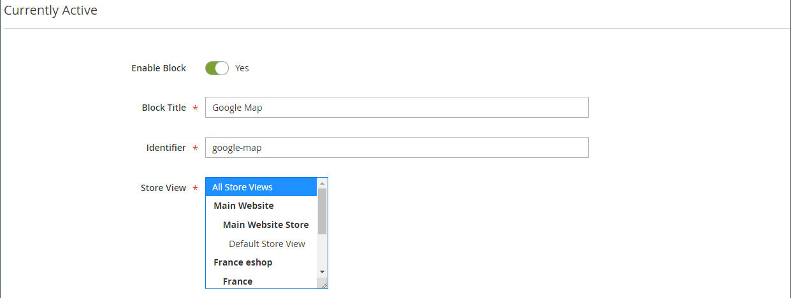
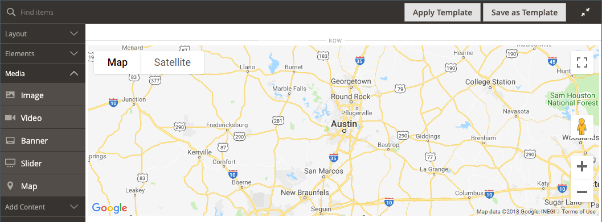
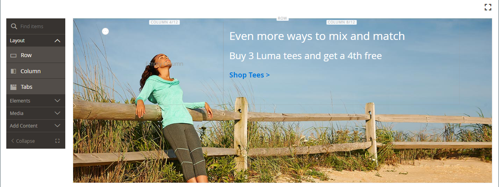
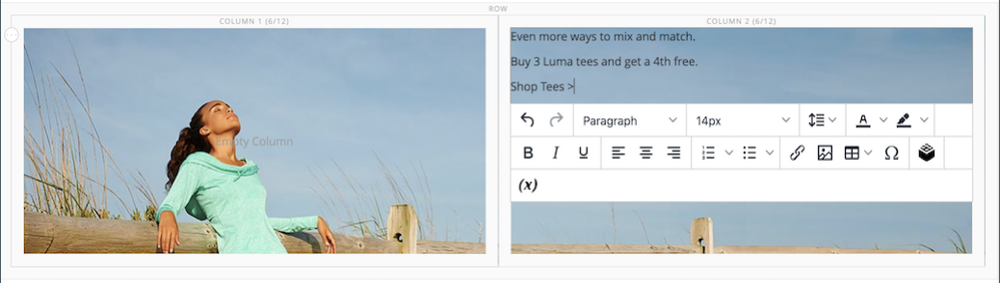
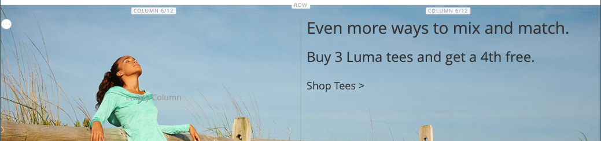
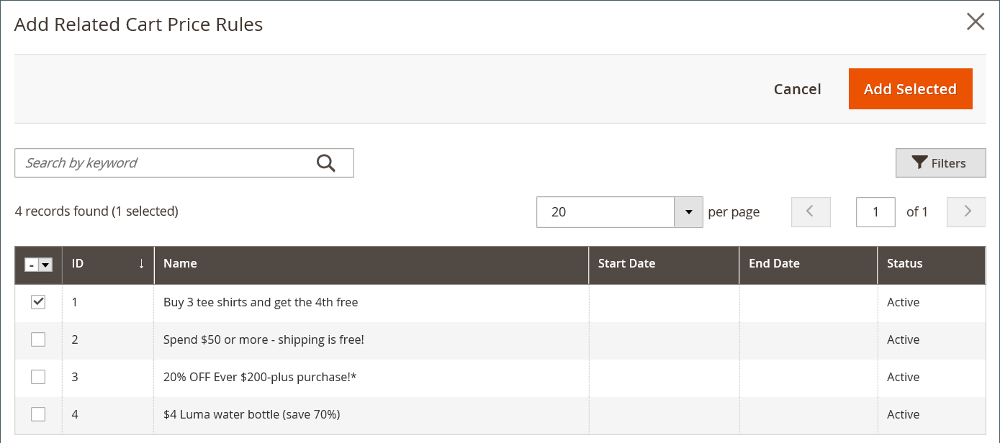
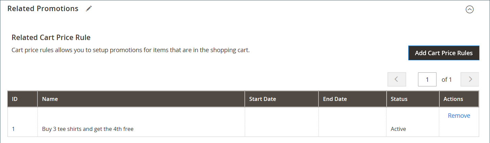
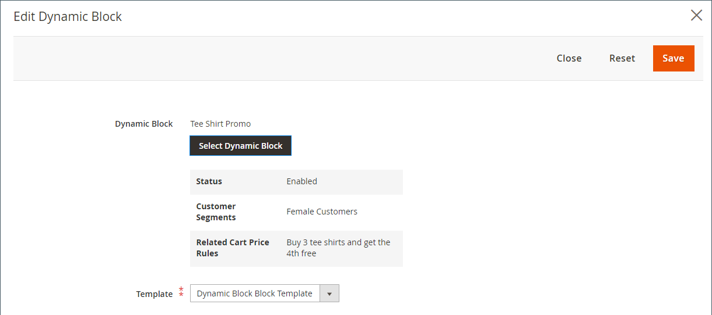

# [!DNL Page Builder] 연습 2부: 블록

다음 연습에서는 [단순 블록](../content-design/blocks.md)과(와) [동적 블록](dynamic-block.md) 간의 차이점 및 [!DNL Page Builder]을(를) 사용하여 각 유형의 블록을 만드는 방법을 보여 줍니다.

>[!NOTE]
>
>[!DNL Page Builder]은(는) 첫 번째 연습 연습에서 다루고 이전 배너 기능과 관련이 없는 _배너_&#x200B;이라는 새로운 콘텐츠 형식을 갖습니다. 이전에는 [콘텐츠 메뉴](../content-design/content-menu.md)에서 배너 옵션이었던 것이 이제 _동적 블록_&#x200B;입니다.

{width="700" zoomable="yes"}

이 연습에서는 필수 구성 요소 및 [다운로드한 샘플 파일](1-simple-page.md)을(를) 포함하여 [파트1: 단순 페이지](./assets/simple-page-assets.zip)를 완료한 것으로 가정합니다. 이 연습 연습의 각 부분을 순서대로 따르십시오.

>[!NOTE]
>
>이 연습 연습에서는 2.4.1 릴리스의 [!DNL Page Builder] 작업 영역에 대한 최근 변경 사항을 반영하도록 업데이트됩니다.

## 1부: 간단한 블록 만들기

이 연습 연습에서는 [!DNL Google Maps]의 콘텐츠로 간단한 블록을 만듭니다. 단순 블록은 콘텐츠가 변경되지 않으므로 _CMS 블록_ 또는 _정적 블록_&#x200B;이라고도 합니다. 단순 블록은 재사용할 수 있는 콘텐츠에 이상적입니다.

### 1단계: 블록 만들기

1. _관리자_ 사이드바에서 **[!UICONTROL Content]** > _[!UICONTROL Elements]_>**[!UICONTROL Blocks]**(으)로 이동합니다.

1. 오른쪽 상단에서 **[!UICONTROL Add New Block]**&#x200B;을(를) 클릭합니다.

1. **[!UICONTROL Block Title]**&#x200B;에 대해 `Google Map`을(를) 입력하십시오.

1. **[!UICONTROL Identifier]**&#x200B;에 대해 `google-map`을(를) 입력하십시오.

1. 블록을 사용할 수 있는 **[!UICONTROL Store View]**&#x200B;을(를) 선택하십시오.

   {width="600" zoomable="yes"}

1. 오른쪽 상단에서 **[!UICONTROL Save]**&#x200B;을(를) 클릭합니다.

### 2단계: [!DNL Google Map] 추가

1. [!DNL Page Builder] 콘텐츠 미리 보기(현재 비어 있음)까지 아래로 스크롤한 다음 **[!UICONTROL Edit with Page Builder]**&#x200B;을(를) 클릭합니다.

1. [!DNL Page Builder] 패널에서 **[!UICONTROL Media]**&#x200B;을(를) 확장하고 **[!UICONTROL Map]** 자리 표시자를 스테이지로 드래그합니다.

   {width="600" zoomable="yes"}

   스토어에 대해 [!DNL Google Maps]이(가) 구성된 경우 스토어 위치에 대한 맵이 나타납니다.

   {width="600" zoomable="yes"}

   [!DNL Google Maps]이(가) 스토어에 대해 아직 구성되지 않은 경우 자리 표시자 맵이 표시됩니다.

   ![[!DNL Google Maps] 자리 표시자](./assets/pb-tutorial2-media-map-not-configured.png){width="600" zoomable="yes"}

1. 스테이지의 오른쪽 위 모서리에서 _전체 화면 닫기_() 아이콘을 클릭합니다.

   이 아이콘을 클릭하면 미리 보기가 표시된 블록의 _[!UICONTROL Content]_&#x200B;섹션으로 돌아갑니다.

1. 오른쪽 상단 모서리에서 **[!UICONTROL Save]** 화살표를 클릭하고 **[!UICONTROL Save & Close]**&#x200B;을(를) 선택합니다.

### 3단계: [!DNL Google Maps] 구성

스토어에 대해 [!DNL Google Maps]이(가) 이미 구성된 경우 이 단계를 건너뛰고 다음 단계로 진행할 수 있습니다.

1. [Google Cloud Platform Console](https://console.cloud.google.com/google/maps-apis/overview)&#x200B;(으)로 이동합니다.

1. 프로젝트 드롭다운을 클릭하고 API 키를 추가할 프로젝트를 선택하거나 만듭니다.

1. API 자격 증명을 구성하려면 [&#x200B; 설명서의 &#x200B;](https://developers.google.com/maps/documentation/javascript/get-api-key)지침[!DNL Google Maps]을(를) 따르십시오.

1. API 키를 클립보드에 복사합니다.

1. [!DNL Commerce] 관리자로 돌아가서 **[!UICONTROL Stores]** > _[!UICONTROL Settings]_>**[!UICONTROL Configuration]**(으)로 이동합니다.

1. _[!UICONTROL General]_&#x200B;아래의 왼쪽 패널에서&#x200B;**[!UICONTROL Content Management]**&#x200B;을(를) 선택합니다.

1.  **[!UICONTROL Advanced Content Tools]**&#x200B;을 확장합니다.

   {width="600" zoomable="yes"}

   [!UICONTROL Content Management Advanced Tools] 구성 옵션에 대한 자세한 내용은 [_구성 참조 안내서_](../configuration-reference/general/content-management.md)&#x200B;를 참조하십시오.

1. **[!UICONTROL Google Maps API Key]**&#x200B;의 경우 복사한 키를 붙여 넣으십시오.

1. **[!UICONTROL Test Key]**&#x200B;을(를) 클릭합니다.

   키에 문제가 있는 경우 [!DNL Google Maps] 플랫폼 사이트로 돌아가 문제를 해결하십시오. 그런 다음 다시 시도하십시오.

1. 키를 확인한 후 **[!UICONTROL Save Config]**&#x200B;을(를) 클릭합니다.

### 4단계: 페이지에 블록 추가

1. _관리자_ 사이드바에서 **[!UICONTROL Content]** > _[!UICONTROL Elements]_>**[!UICONTROL Pages]**(으)로 이동합니다.

1. 그리드에서 첫 번째 자습서에서 만든 _[!UICONTROL Simple Page]_&#x200B;을(를) 찾은 다음&#x200B;**[!UICONTROL Edit]**&#x200B;열에서&#x200B;_[!UICONTROL Action]_&#x200B;을(를) 선택합니다.

1. 확장 선택기&#x200B;**[!UICONTROL Content]**&#x200B;를 확장하고 **[!UICONTROL Edit with Page Builder]** 또는 콘텐츠 미리 보기 영역 내부를 클릭합니다.

1. [!DNL Page Builder] 아래의 _[!UICONTROL Layout]_&#x200B;패널에서&#x200B;**[!UICONTROL Row]**&#x200B;자리 표시자를 스테이지의 맨 위로 드래그합니다.

   {width="600" zoomable="yes"}

1. [!DNL Page Builder] 패널에서 **[!UICONTROL Add Content]**&#x200B;을(를) 확장하고 **[!UICONTROL Block]** 자리 표시자를 새 행으로 드래그합니다.

1. 빈 블록 컨테이너에 마우스를 가져다 대고 도구 상자를 표시하고 _설정_({width="20"}) 아이콘을 선택합니다.

   {width="600" zoomable="yes"}

1. [블록 편집] 페이지에서 **[!UICONTROL Select Block]**&#x200B;을(를) 클릭합니다.

   {width="600" zoomable="yes"}

1. 검색 상자에 `map`을(를) 입력하고 Enter/Return 키를 눌러 만든 블록을 찾습니다.

   {width="600" zoomable="yes"}

1. 그리드에서 **[!UICONTROL Select]**&#x200B;을(를) 클릭하여 [!DNL Google Maps] 블록을 선택합니다.

1. 오른쪽 상단 모서리에서 **[!UICONTROL Save]**&#x200B;을(를) 클릭하여 설정을 저장하고 [!DNL Page Builder] 작업 영역으로 돌아갑니다.

1. 스테이지의 오른쪽 위 모서리에서 _전체 화면 닫기_() 아이콘을 클릭합니다.

   이 아이콘을 클릭하면 미리보기가 표시된 페이지의 _[!UICONTROL Content]_&#x200B;섹션으로 돌아갑니다.

1. 오른쪽 상단 모서리에서 **[!UICONTROL Save]** 화살표를 클릭하고 **[!UICONTROL Save & Close]**&#x200B;을(를) 선택합니다.

**축하합니다!** 블록 연습의 첫 번째 부분을 완료했습니다. 참고용으로 작업한 것을 잊지 말아라.

## 2부: 동적 블록 만들기

동적 블록에는 블록 표시 위치, 시기 및 대상을 결정하는 논리가 포함되어 있습니다. 이 연습에서는 가격 규칙 조건이 충족될 때 트리거되고 특정 고객 세그먼트에만 표시되는 프로모션에 대한 동적 블록을 만듭니다. 이 예제의 결과는 첫 번째 연습에서 만든 배너와 유사하지만 상점 첫 번째 연습에서 나타나는 시점을 제어하는 논리를 사용합니다.

{width="600" zoomable="yes"}

### 1단계: 새 동적 블록 만들기

1. _관리자_ 사이드바에서 **[!UICONTROL Content]** > _[!UICONTROL Elements]_>**[!UICONTROL Dynamic Blocks]**(으)로 이동합니다.

   {width="700" zoomable="yes"}

1. 오른쪽 상단에서 **[!UICONTROL Add Dynamic Block]**&#x200B;을(를) 클릭합니다.

   {width="600" zoomable="yes"}

1. 새 동적 블록에 대한 기본 설정을 완료합니다.

   - **[!UICONTROL Enable Dynamic Block]**&#x200B;을(를) `Yes`(으)로 설정합니다.

   - **[!UICONTROL Dynamic Block Name]**&#x200B;에 대해 `Tee Shirt Promo`을(를) 입력하십시오.

   - **[!UICONTROL Dynamic Block Type]**&#x200B;을(를) `Content Area`(으)로 설정하고 **[!UICONTROL Done]**&#x200B;을(를) 클릭합니다.

     동적 블록 형식은 [페이지 레이아웃](../content-design/page-layout.md)에서 블록이 배치되는 위치를 결정합니다. 스토어에 대한 동적 블록을 설정할 때는 사용 가능한 공간을 잘 사용할 수 있도록 페이지 레이아웃과 [테마](../content-design/themes.md)를 모두 고려하십시오. 일부 스토어에는 고정된 너비로 제한된 활성 콘텐츠 영역이 있는 반면, 다른 스토어는 화면의 전체 너비를 확장합니다.

     {width="600" zoomable="yes"}

   - **[!UICONTROL Customer Segment]**&#x200B;의 경우 동적 블록에 적용할 각 세그먼트의 확인란을 선택하고 **완료**&#x200B;를 클릭하여 세그먼트 목록을 저장합니다.

     다음 예제에서는 성별에 따라 등록된 고객을 식별하는 두 개의 [고객 세그먼트](../customers/customer-segments.md)가 있습니다. 이 동적 블록은 매장에서 쇼핑하는 동안 계정에 로그인한 등록된 여성 고객에게만 표시됩니다.

     {width="600" zoomable="yes"}

### 2단계: 설정 완료

_[!UICONTROL Content]_&#x200B;섹션까지 아래로 스크롤하여 빈 [!DNL Page Builder] 콘텐츠 미리 보기를 표시하고&#x200B;**[!UICONTROL Edit with Page Builder]**&#x200B;을(를) 클릭합니다. 그런 다음 다음 다음 작업을 완료하십시오.

**작업 1:** 배경 이미지 추가

1. 행 컨테이너 위로 마우스를 가져가 도구 상자를 표시하고 _설정_({width="20"}) 아이콘을 선택합니다.

1. _[!UICONTROL Appearance]_&#x200B;에서&#x200B;**[!UICONTROL Full Bleed]**&#x200B;을(를) 선택합니다.

1. **[!UICONTROL Minimum Height]**&#x200B;에 대해 `400px`을(를) 입력하십시오.

1. _[!UICONTROL Background]_&#x200B;을(를) 클릭하고 첫 번째 자습서에서 업로드한&#x200B;**[!UICONTROL Background Image]**&#x200B;이미지를 선택하여&#x200B;**[!UICONTROL Select from Gallery]**&#x200B;섹션으로 스크롤하고 `wide-banner-background.png`을(를) 설정합니다.

1. 오른쪽 상단 모서리에서 **[!UICONTROL Save]**&#x200B;을(를) 클릭하여 설정을 적용하고 [!DNL Page Builder] 작업 영역으로 돌아갑니다.

   이미지가 있는 {width="600" zoomable="yes"}

**작업 2:** 열 추가

[!DNL Page Builder] 아래의 _[!UICONTROL Layout]_&#x200B;패널에서&#x200B;**[!UICONTROL Column]**&#x200B;자리 표시자를 행으로 드래그합니다.

{width="600" zoomable="yes"}

이제 행이 동일한 너비의 두 열로 나뉩니다.

**작업 3:** 텍스트 추가

1. [!DNL Page Builder] 패널에서 **[!UICONTROL Elements]**&#x200B;을(를) 확장하고 **Text** 자리 표시자를 두 번째 열로 드래그합니다.

   {width="600" zoomable="yes"}

1. 편집기에 다음 세 줄의 텍스트를 입력합니다.

   `Even more ways to mix and match.`

   `Buy 3 Luma tees and get a 4th free.`

   `Shop Tees >`

   {width="600" zoomable="yes"}

1. 세 줄의 텍스트를 모두 선택하고 도구 모음을 사용하여 **줄 높이**&#x200B;를 `40px`(으)로 설정합니다.

   {width="600" zoomable="yes"}

1. 각 줄에 대해 **[!UICONTROL Font Size]**&#x200B;을(를) 다음과 같이 설정합니다.

   | 라인 | 글꼴 크기 |
   |-----| ---------- |
   | 1행: | `28px` |
   | 2행: | `24px` |
   | 3행: | `18px` |

   이 블록은 페이지의 어디에나 배치할 수 있으므로 제목 수준이 아닌 기본 단락 스타일을 사용하십시오. 또한 텍스트가 아직 열에 올바르게 감싸지지 않을 수도 있습니다.  

   {width="600" zoomable="yes"}

**작업 4:** 링크 추가

첫 번째 연습에서는 [Button](buttons.md) 콘텐츠 형식을 사용하여 링크를 만드는 방법을 배웠습니다. 이 예에서는 편집기 도구 모음에서 링크를 삽입하는 방법을 보여 줍니다.

1. 다른 브라우저 탭에서 스토어프런트를 열고 링크의 대상 페이지로 이동합니다.

   저장소 도메인에 대한 참조를 생략하는 상대 URL 또는 정규화된 URL을 사용할 수 있습니다.

   전체 URL
: `https://mystore.com/women/tops-women/tees-women.html`

   상대 URL
: `../women/tops-women/tees-women.html`

1. [!DNL Page Builder] 작업 영역 탭과 텍스트 편집기로 돌아가서 세 번째 줄에서 `Shop Tees >` 텍스트를 선택하고 편집기 도구 모음에서 **굵게**()을 선택합니다.

1. 세 번째 줄의 `Shop Tees >` 텍스트를 계속 선택한 상태에서 편집기 도구 모음에서 **링크 삽입/편집**()을(를) 선택하십시오.

   {width="600" zoomable="yes"}

1. **[!UICONTROL URL]**&#x200B;에 대해 준비한 상대 링크를 입력하십시오.

1. **[!UICONTROL Target]**&#x200B;을(를) `None`(으)로 설정합니다.

   이 설정은 새 탭을 열지 않고 동일한 브라우저 창에서 페이지를 엽니다.

1. **[!UICONTROL Title]**&#x200B;에 대해 `Shop Tees`을(를) 입력하십시오.

   Title 링크 속성은 일부 브라우저에서 툴팁으로 사용됩니다.

1. 링크를 저장하고 [!DNL Page Builder] 작업 영역으로 돌아가려면 **[!UICONTROL OK]**&#x200B;을(를) 클릭합니다.

   {width="600" zoomable="yes"}

1. 스테이지의 오른쪽 위 모서리에서 _전체 화면 닫기_() 아이콘을 클릭합니다.

   이 아이콘을 클릭하면 미리 보기가 표시된 동적 블록의 _[!UICONTROL Content]_&#x200B;섹션으로 돌아갑니다.

1. 오른쪽 상단에서 **[!UICONTROL Save]**&#x200B;을(를) 클릭합니다.

### 3단계: 가격 규칙 추가

1. 편집 모드에서 _티셔츠 프로모션_ 동적 블록을 다시 엽니다.

1. 확장 선택기&#x200B;**[!UICONTROL Related Promotions]**&#x200B;를 확장하고 **[!UICONTROL Add Cart Price Rules]**&#x200B;을(를) 클릭합니다.

   {width="600" zoomable="yes"}

1. _관련 장바구니 가격 규칙 추가_ 페이지에서 _3개 티셔츠 구매_ 가격 규칙에 대한 확인란을 선택하고 **[!UICONTROL Add Selected]**&#x200B;을(를) 클릭합니다.

   {width="600" zoomable="yes"}

   가격 규칙은 _관련 장바구니 가격 규칙_ 아래의 _관련 프로모션_ 섹션에 표시됩니다. 여러 가격 규칙을 동적 블록과 연관시킬 수 있습니다. 그러나 이 간단한 예제는 하나만 사용합니다.

   {width="600" zoomable="yes"}

1. 오른쪽 상단에서 **[!UICONTROL Save]**&#x200B;을(를) 클릭합니다.

### 4단계: 페이지에 동적 블록 추가

1. _관리자_ 사이드바에서 **[!UICONTROL Content]** > _[!UICONTROL Elements]_>**[!UICONTROL Pages]**(으)로 이동합니다.

1. _첫 번째 연습 연습 연습_&#x200B;에서 만든 [단순 페이지](1-simple-page.md)를 찾아 편집 모드로 엽니다.

1. 확장 선택기&#x200B;**[!UICONTROL Content]**&#x200B;를 확장하고 **[!UICONTROL Edit with Page Builder]**&#x200B;을(를) 클릭합니다.

1. 동적 블록과 같은 이미지를 사용하여 맨 위 행에 마우스를 올려 놓으면 도구 상자와 _제거_({width="20"}) 아이콘이 표시됩니다.

   페이지에서 행 제거를 확인하려면 **[!UICONTROL OK]** 을(를) 클릭합니다.

1. [!DNL Page Builder] 아래의 _[!UICONTROL Layout]_&#x200B;패널에서 새&#x200B;**[!UICONTROL Row]**&#x200B;자리 표시자를 스테이지의 맨 위로 드래그합니다.

1. [!DNL Page Builder] 패널에서 **[!UICONTROL Add Content]**&#x200B;을(를) 확장하고 **[!UICONTROL Dynamic Block]** 자리 표시자를 새 행으로 드래그합니다.

   {width="600" zoomable="yes"}

1. 동적 블록 컨테이너에 마우스를 가져다 대고 도구 상자를 표시하고 _설정_( {width="20"} ) 아이콘을 선택합니다.

   {width="600" zoomable="yes"}

1. _[!UICONTROL Edit Dynamic Block]_&#x200B;페이지에서&#x200B;**[!UICONTROL Select Dynamic Block]**&#x200B;을(를) 클릭합니다.

   {width="600" zoomable="yes"}

1. 만든 _[!DNL Tee Shirt Promo]_&#x200B;동적 블록을 찾아&#x200B;**[!UICONTROL Select]**&#x200B;을(를) 클릭합니다.

   동적 블록 정보의 요약이 아래에 나타납니다.

   {width="600" zoomable="yes"}

1. 기본 **[!UICONTROL Template]**, `Dynamic Block Block Template`을(를) 수락합니다.

1. 완료되면 **[!UICONTROL Save]**&#x200B;을(를) 클릭하여 설정을 저장하고 [!DNL Page Builder] 작업 영역으로 돌아갑니다.

   {width="600" zoomable="yes"}

1. 스테이지의 오른쪽 위 모서리에서 _전체 화면 닫기_() 아이콘을 클릭합니다.

   이 아이콘을 클릭하면 미리보기가 표시된 페이지의 _[!UICONTROL Content]_&#x200B;섹션으로 돌아갑니다.

1. 오른쪽 상단 모서리에서 **[!UICONTROL Save]** 화살표를 클릭하고 **[!UICONTROL Save & Close]**&#x200B;을(를) 선택합니다.

블록 연습의 두 번째 부분을 완료했습니다. 참고용으로 작업한 것을 잊지 말아라.

## 3부: 동적 블록 업데이트

연습의 마지막 부분에서는 페이지가 스토어에서 라이브되는 동안 동적 블록을 편집합니다. 그런 다음 고객 세그먼트의 멤버로 스토어에 로그인하여 블록이 나타나도록 합니다.

{width="600" zoomable="yes"}

### 1단계: 동적 블록 편집

1. _관리자_ 사이드바에서 **[!UICONTROL Content]** > _[!UICONTROL Elements]_>**[!UICONTROL Dynamic Blocks]**(으)로 이동합니다.

1. 그리드에서 _[!DNL Tee Shirt Promo]_&#x200B;동적 블록을 찾아 편집 모드로 엽니다.

1. 확장 선택기&#x200B;**[!UICONTROL Content]**&#x200B;를 확장하고 **[!UICONTROL Edit with Page Builder]**&#x200B;을(를) 클릭합니다.

1. 열 너비를 변경합니다.

   - 두 열 사이의 테두리를 마우스로 가리킵니다.

   - 마우스 단추를 누른 채 테두리 두 구획을 왼쪽으로 드래그합니다.

     {width="600" zoomable="yes"}

     이제 첫 번째 열은 12개(4/12) 격자 분할 중 4개 너비이고 두 번째 열은 12개(8/12) 분할 중 8개 너비입니다.

     {width="600" zoomable="yes"}

1. 텍스트 색상 변경:

   - 처음 두 줄의 텍스트를 선택합니다.

   - 편집기 도구 모음에서 **[!UICONTROL Text Color]**&#x200B;을(를) 선택하고 **[!UICONTROL White]** 견본을 클릭합니다.

   {width="600" zoomable="yes"}

1. 스테이지의 오른쪽 위 모서리에서 _전체 화면 닫기_() 아이콘을 클릭합니다.

   이 아이콘을 클릭하면 미리 보기가 표시된 동적 블록의 _[!UICONTROL Content]_&#x200B;섹션으로 돌아갑니다.

1. 오른쪽 상단에서 **[!UICONTROL Save]**&#x200B;을(를) 클릭합니다.

### 2단계: 동적 블록 보기

이 동적 블록은 특정 고객 세그먼트의 구성원에게만 표시되므로 고객 세그먼트의 구성원인 고객으로 로그인하여 판촉을 확인해야 합니다. 이 예에서는 블록이 여성 고객에게만 표시됩니다.

1. 상점으로 브라우저 창을 엽니다.

1. 샘플 페이지를 보려면 주소 표시줄의 URL을 다음과 같이 수정하십시오.

   mystore.com/sample-page

   스토어에서 html 접미사를 포함하도록 구성한 경우 접미사를 다음과 같이 포함하십시오.

   mystore.com/sample-page.html

1. 여성 고객으로 로그인:

   - 홈 페이지의 오른쪽 상단 모서리에서 **[!UICONTROL Sign In]**&#x200B;을(를) 클릭합니다.

   - 샘플 Luma 데이터가 시스템에 설치된 경우 다음 자격 증명을 사용합니다.

     **[!UICONTROL Email]** - `roni_cost@example.com`

     **[!UICONTROL Password]** - `roni_cost3@example.com`

   - **[!UICONTROL Sign In]**&#x200B;을(를) 클릭합니다.

   - Tee Shirt 프로모션으로 만든 다이내믹 블록을 보려면 샘플 페이지로 돌아갑니다.

   고객 세그먼트에 대해 {width="700" zoomable="yes"}

차단 연습을 완료했습니다. 참고용으로 작업한 것을 잊지 말아라.

준비가 되면 [파트3: 카탈로그 콘텐츠](3-catalog-content.md)로 진행하십시오.
