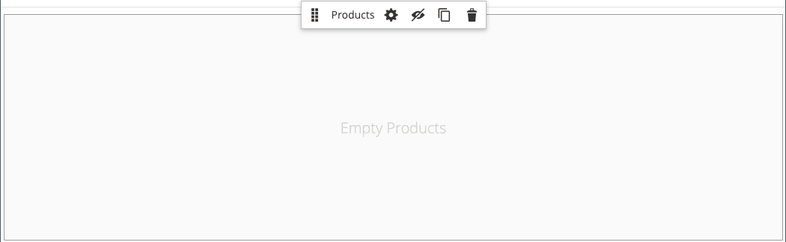
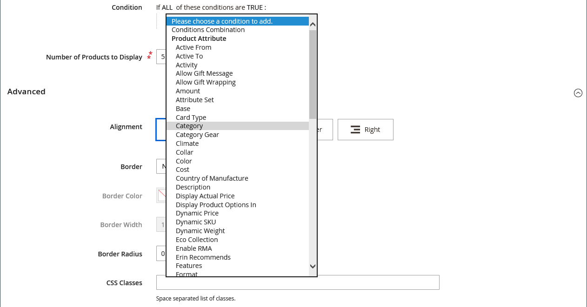
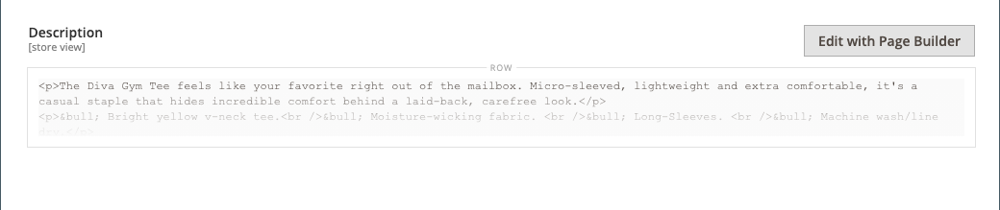
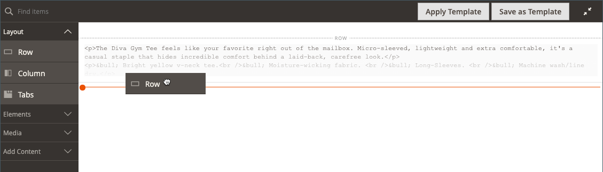
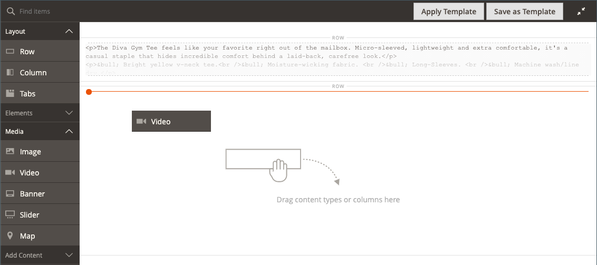
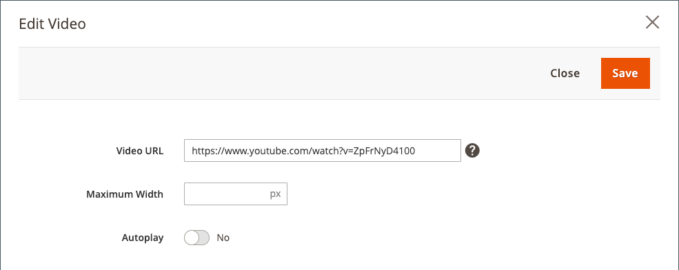
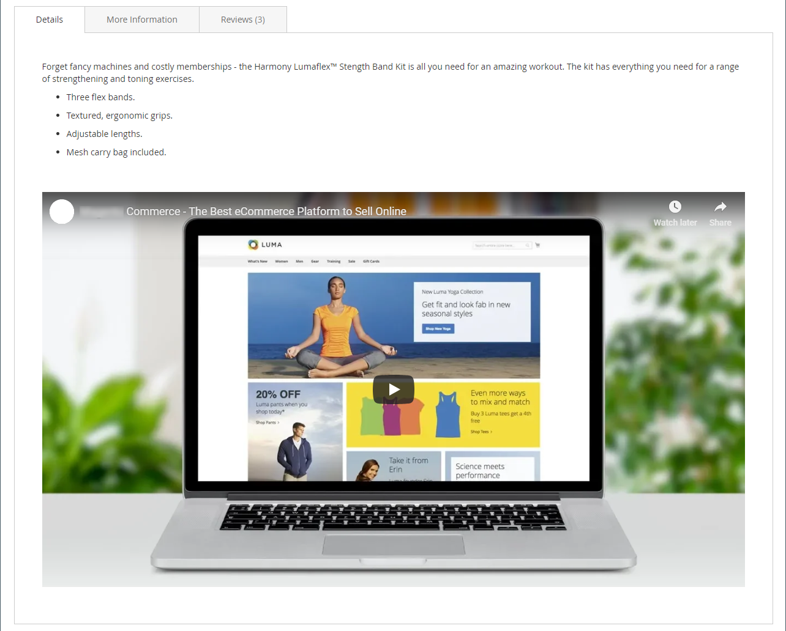
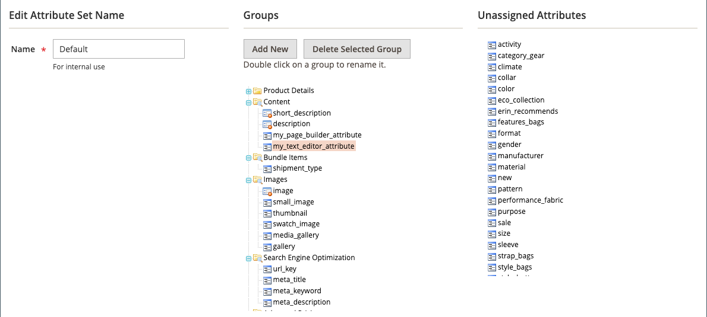

# [!DNL Page Builder] 연습 3부: 카탈로그 콘텐츠

이 연습에서는 제품 목록을 페이지에 추가하고, 제품 페이지를 사용자 지정하고, [!DNL Page Builder] 작업 영역을 제품 특성 집합에 추가하는 사용자 지정 특성을 만드는 것이 얼마나 쉬운지 보여 줍니다.

{width="600" zoomable="yes"}

이 연습에서는 필수 구성 요소 및 다운로드한 샘플 파일을 포함하여 [파트1: 단순 페이지](1-simple-page.md) 및 [파트2: 블록](2-blocks.md)을(를) 완료했다고 가정합니다. 이 연습의 세 부분을 순서대로 따라라.

## 1부: 제품 목록 추가

[!DNL Page Builder]을(를) 사용하면 제품 목록을 단계에 쉽게 추가할 수 있습니다. 이 예에서는 제품 목록이 페이지에 바로 추가됩니다.

### 1단계: 단계에 제품 목록 추가

1. _관리자_ 사이드바에서 **[!UICONTROL Content]** > _[!UICONTROL Elements]_>**[!UICONTROL Pages]**(으)로 이동합니다.

1. 첫 번째 연습에서 만들고 두 번째 연습에서 수정한 _단순 페이지_&#x200B;를 찾은 다음 **[!UICONTROL Edit]** 열에서 _[!UICONTROL Action]_을(를) 선택합니다.

1. 확장 선택기&#x200B;**[!UICONTROL Content]**&#x200B;를 확장하고 **[!UICONTROL Edit with Page Builder]** 또는 콘텐츠 미리 보기 영역 내부를 클릭합니다.

1. [!DNL Page Builder] 아래의 _[!UICONTROL Layout]_패널에서&#x200B;**[!UICONTROL Row]**을(를) 단계 맨 위로 드래그합니다.

1. [!DNL Page Builder] 패널에서 **[!UICONTROL Add Content]**&#x200B;을(를) 확장하고 **[!UICONTROL Products]** 자리 표시자를 새 행으로 드래그합니다.

   {width="600" zoomable="yes"}

### 2단계: 조건 작성

1. 빈 제품 컨테이너 위로 마우스를 가져가면 도구 상자를 표시하고 _설정_( {width="20"} ) 아이콘을 선택합니다.

   {width="600" zoomable="yes"}

1. **[!UICONTROL Select Products By]**&#x200B;의 경우 `Condition`을(를) 선택하십시오.

1. 조건 추가:

   - _추가_() 아이콘을 클릭합니다.

   - _[!UICONTROL Product Attribute]_에서&#x200B;**[!UICONTROL Category]**을(를) 선택합니다.

     {width="600" zoomable="yes"}

   - 자세히(...) 아이콘을 클릭하여 _[!UICONTROL Category is]..._ 조건 부분을 완료한 다음 _선택기_() 아이콘을 클릭합니다.

     {width="600" zoomable="yes"}

   - 범주 트리에서 **여성 > 최상위** 범주로 드릴다운한 다음 **티** 확인란을 선택하십시오.

     {width="600" zoomable="yes"}

   - 확인 표시() 아이콘을 클릭합니다.

     해당 카테고리 ID가 필드에 표시되어 조건을 완료합니다.

### 3단계: 설정 완료

1. **[!UICONTROL Number of Products to Display]** 입력.

   기본적으로 목록에는 5개의 제품이 표시됩니다.

1. 필요에 따라 나머지 설정을 완료합니다.

   필요한 경우 [콘텐츠 추가 - 제품](products.md) 페이지의 끝에 있는 필드 설명을 참조하여 참조하십시오.

1. 완료되면 **[!UICONTROL Save]**&#x200B;을(를) 클릭하여 설정을 저장하고 [!DNL Page Builder] 작업 영역으로 돌아갑니다.

   {width="600" zoomable="yes"}

1. 스테이지의 오른쪽 위 모서리에서 _전체 화면 닫기_({width="20"} ) 아이콘을 클릭합니다.

   이 아이콘을 클릭하면 미리보기가 표시된 페이지의 _[!UICONTROL Content]_섹션으로 돌아갑니다.

1. 오른쪽 상단 모서리에서 **[!UICONTROL Save]** 화살표를 클릭하고 **[!UICONTROL Save & Close]**&#x200B;을(를) 선택합니다.

## 2부: 제품 페이지 사용자 지정

>[!NOTE]
>
>[!UICONTROL Content] 단추를 보고 Page Builder를 사용하려면 관리자가 [역할 범위](../systems/permissions-user-roles.md)에 대해 [!UICONTROL Edit with Page Builder] 권한을 가지고 있어야 합니다.

이 연습 부분에서는 제품 페이지의 탭 집합 아래에 비디오를 배치하여 제품 페이지를 손쉽게 사용자 정의하는 방법을 알아봅니다. [범주 페이지](../catalog/categories-content-settings.md) 콘텐츠를 업데이트하는 프로세스는 기본적으로 동일합니다.

1. _관리자_ 사이드바에서 **[!UICONTROL Catalog]** > **[!UICONTROL Products]**(으)로 이동합니다.

1. 이 예제에 사용할 수 있는 간단한 제품을 찾아 편집 모드로 엽니다.

1. 아래로 스크롤하여 확장 선택기&#x200B;**[!UICONTROL Content]**&#x200B;를 확장합니다.

1. _[!UICONTROL Description]_옆에 있는&#x200B;**[!UICONTROL Edit with Page Builder]**을(를) 클릭합니다.

   {width="600" zoomable="yes"}

   이전에 [!DNL Page Builder] 없이 제품 설명을 입력한 경우 현재 설명은 [HTML 코드](html-code.md) 컨테이너에 HTML으로 표시됩니다. Luma 테마를 사용하면 제품 설명이 세부 사항 탭에 표시됩니다.

1. [!DNL Page Builder] 아래의 _[!UICONTROL Layout]_패널에서&#x200B;**[!UICONTROL Row]**을(를) 스테이지로 드래그하여 HTML 코드 컨테이너 아래에 놓습니다.

   행이 올바른 위치에 있을 때 빨간색 지침이 나타나는지 확인합니다.

   {width="600" zoomable="yes"}

1. [!DNL Page Builder] 패널에서 **[!UICONTROL Media]**&#x200B;을(를) 확장하고 **[!UICONTROL Video]** 자리 표시자를 새 행으로 드래그합니다.

   {width="600" zoomable="yes"}

1. 빈 비디오 컨테이너 위로 마우스를 가져가면 도구 상자를 표시하고 _설정_( {width="20"} ) 아이콘을 선택합니다.

   {width="500" zoomable="yes"}

1. **[!UICONTROL Video URL]** 입력.

   비디오는 [YouTube](https://www.youtube.com/) 또는 [Vimeo](https://vimeo.com/)에서 호스팅할 수 있습니다. 이 예제의 비디오는 YouTube의 다음 URL에서 찾을 수 있습니다.

   `https://www.youtube.com/watch?v=ZpFrNyD4100`

   {width="500" zoomable="yes"}

1. 비디오 표시에 사용할 **[!UICONTROL Maximum Width]**&#x200B;을(를) 픽셀 단위로 입력하십시오.

   이 옵션을 비워 두면 비디오는 사용 가능한 공간을 채웁니다.

1. 설정을 저장하고 **[!UICONTROL Save]** 작업 영역으로 돌아가려면 [!DNL Page Builder]을(를) 클릭합니다.

   {width="600" zoomable="yes"}

1. 스테이지의 오른쪽 위 모서리에서 _전체 화면 닫기_({width="20"} ) 아이콘을 클릭합니다.

   이 아이콘을 클릭하면 미리보기가 표시된 페이지의 _[!UICONTROL Content]_섹션으로 돌아갑니다.

1. 오른쪽 상단 모서리에서 **[!UICONTROL Save]** 화살표를 클릭하고 **[!UICONTROL Save & Close]**&#x200B;을(를) 선택합니다.

상점 첫 화면에서 이 비디오는 탭 집합 아래에 표시됩니다. 모바일 장치에서 페이지가 어떻게 표시되는지 보려면 창 크기를 조정할 수 있습니다.

{width="600" zoomable="yes"}

**축하합니다!** 카탈로그 콘텐츠 자습서의 두 번째 부분을 완료했습니다. 생성한 작업은 나중에 참조할 수 있도록 보관합니다.

## 3부: 사용자 지정 속성 추가

[!DNL Page Builder] 사용자 지정 특성을 사용하여 완전히 작동하는 [!DNL Page Builder] 작업 영역을 제품 페이지에 추가하고, 이를 사용하여 매력적인 콘텐츠를 만들 수 있습니다. 이 연습 부분에서는 [!DNL Page Builder] 입력 유형을 사용하여 사용자 지정 특성을 만들고 이를 카탈로그의 제품 페이지에 적용하는 방법을 배웁니다. 이러한 특성에 대한 자세한 내용은 [제품 특성](../catalog/product-attributes.md)을 참조하세요.

### 1단계: 제품 만들기

라이브 스토어가 변경되지 않도록 하려면 설명된 속성을 사용하여 제품을 만듭니다.

1. _관리자_ 사이드바에서 **[!UICONTROL Catalog]** > **[!UICONTROL Products]**(으)로 이동합니다.

1. 오른쪽 상단에서 **[!UICONTROL Add Product]**&#x200B;을(를) 클릭합니다.

1. 다음 속성을 사용하여 제품을 만듭니다.

   - 
     [!UICONTROL 속성 세트]: Default
   - [!UICONTROL Product Name]: 내 제품
   - 
     [!UICONTROL SKU]: Tutorial
   - 
     [!UICONTROL Price]: 75.00
   - 
     [!UICONTROL Quantity]: 100
   - [!UICONTROL Stock Status]: 재고 있음
   - 
     [!UICONTROL Weight]: 1
   - [!UICONTROL Categories]: 여성 > 위쪽 > 티

1. 오른쪽 상단 모서리에서 **[!UICONTROL Save]** 화살표를 클릭하고 **[!UICONTROL Save & Close]**&#x200B;을(를) 선택합니다.

### 2단계: 사용자 지정 속성 만들기

이 단계에서는 [!DNL Page Builder] 및 텍스트 편집기 입력 유형을 사용할 수 있는 방법을 보여 주는 두 개의 새 사용자 지정 특성을 만듭니다.

1. _관리자_ 사이드바에서 **[!UICONTROL Stores]** > _[!UICONTROL Attributes]_>**[!UICONTROL Product]**(으)로 이동합니다.

1. 오른쪽 상단에서 **[!UICONTROL Add New Attribute]**&#x200B;을(를) 클릭합니다.

1. 특성에 **[!UICONTROL Default Label]**&#x200B;을(를) 입력하십시오.

   이 예제에서는 레이블에 `My Page Builder Attribute`을(를) 사용합니다.

1. **[!UICONTROL Catalog Input Type for Store Owner]**&#x200B;을(를) `Page Builder`(으)로 설정합니다.

   사용자 지정 특성을 만들 때 응용 프로그램에 가장 적합한 편집기를 `Page Builder` 또는 표준 WYSIWYG `Text Editor`(으)로 지정할 수 있습니다.

   ![[!DNL Page Builder] 입력 형식](./assets/pb-attribute-page-builder.png){width="600" zoomable="yes"}

1. 확장 선택기&#x200B;**[!UICONTROL Advanced Attribute Properties]**&#x200B;를 확장하고 다음 설정을 만듭니다.

   - [!UICONTROL Attribute Code]: 공백 대신 하이픈을 사용하여 속성 코드를 소문자로 입력하십시오. 이 예제에서는 `my_page_builder_attribute`을(를) 사용합니다.
   - [!UICONTROL Scope]: 기본값 `Store View`을(를) 사용합니다.
   - [!UICONTROL Default Value]: 특성의 기본값을 입력하십시오.
   - 
     [!UICONTROL Unique Value]: `No`
   - 
     [!UICONTROL Add to Column Options]: `No`
   - 
     [!UICONTROL Use in Filter Options]: `Yes`

1. 왼쪽의 _[!UICONTROL Attribute Information]_패널에서&#x200B;**[!UICONTROL Storefront Properties]**을(를) 선택하고 다음 설정을 만듭니다.

   - 
     [!UICONTROL Use for Promo Rule Conditions]: `Yes`
   - 
     [!UICONTROL Visible on Catalog Pages on Storefront]: `Yes`
   - 
     [!UICONTROL Used in Product Listing]: `Yes`

1. 완료되면 **[!UICONTROL Save Attribute]**&#x200B;을(를) 클릭합니다.

1. 이전 단계를 반복하여 다음과 같이 기본 등록 정보가 동일하지만 텍스트 편집기 입력 유형이 있는 두 번째 속성을 만듭니다.

   - [!UICONTROL Default Label]: 내 텍스트 편집기 특성
   - [!UICONTROL Catalog Input Type for Store Owner]: 텍스트 편집기
   - 
     [!UICONTROL 속성 코드]: `my_text_editor_attribute`

### 3단계: 제품 속성 세트 업데이트

1. _관리자_ 사이드바에서 **[!UICONTROL Stores]** > _[!UICONTROL Attributes]_>**[!UICONTROL Attribute Set]**(으)로 이동합니다.

   이 예제에서는 `default` 특성 집합에 새 특성을 임시로 추가합니다. 이 연습이 끝나면 속성 집합에서 속성을 제거하므로 카탈로그에 영향을 주지 않습니다.

   >[!NOTE]
   >
   >라이브 스토어를 변경하지 않으려면 속성 세트를 업데이트하지 않고 따를 수 있습니다.

1. 목록에서 _[!UICONTROL Default]_특성 집합을 찾아 두 번 클릭하여 편집 모드로 엽니다.

1. _미할당 특성_ 목록에서 새로 만든 특성을 찾아 _[!UICONTROL Groups]_아래의&#x200B;**[!UICONTROL Content]**열로 끌어 옵니다.

   [!UICONTROL Groups] 열의 특성 위치에 따라 페이지에서 특성이 나타나는 위치가 결정됩니다.

   {width="600" zoomable="yes"}

1. 특성 집합 목록으로 돌아가려면 **[!UICONTROL Save]**&#x200B;을(를) 클릭합니다.

1. 메시지가 표시되면 페이지 상단에 있는 **[!UICONTROL Cache Management]** 링크를 클릭하고 잘못된 캐시를 새로 고칩니다.

### 4단계: 제품 업데이트

1. _관리자_ 사이드바에서 **[!UICONTROL Catalog]** > **[!UICONTROL Products]**(으)로 이동합니다.

1. 제품 그리드에서 _내 제품_&#x200B;을 찾아 편집 모드로 엽니다.

1. 아래로 스크롤하여 확장 선택기&#x200B;**[!UICONTROL Content]**&#x200B;를 확장합니다.

   섹션의 맨 위에는 제품 콘텐츠에 대한 두 가지 표준 속성이 있습니다.

   - 표준 WYSIWYG _editor_&#x200B;을 사용하는 [간단한 설명](../content-design/editor.md).
   - _미리 보기를 표시하는_&#x200B;설명[!DNL Page Builder].

   {width="600" zoomable="yes"}

   섹션의 하단으로 스크롤할 때 작성 및 할당한 두 가지 속성이 있습니다.

   - _내 [!DNL Page Builder] 특성_&#x200B;입니다. [!DNL Page Builder] 미리 보기를 표시합니다.
   - 표준 WYSIWYG 편집기를 사용하는 _내 텍스트 편집기 특성_&#x200B;입니다.

   {width="600" zoomable="yes"}

1. **내 텍스트 편집기 특성** 편집기에서 `Text Editor Attribute placeholder text`을(를) 입력하십시오.

   - 오른쪽 상단 모서리에서 **[!UICONTROL Save]** 화살표를 클릭하고 **[!UICONTROL Save & Close]**&#x200B;을(를) 선택합니다.

1. **내 Page Builder 특성**&#x200B;에 대해 **[!UICONTROL Edit with Page Builder]**&#x200B;을(를) 클릭하고 설명 텍스트를 추가하십시오.

   - [!DNL Page Builder] 패널에서 **[!UICONTROL Elements]**&#x200B;을(를) 확장하고 **[!UICONTROL Text object]**&#x200B;을(를) 스테이지로 드래그합니다.

   - `Page Builder attribute placeholder text` 입력.

   - 스테이지의 오른쪽 위 모서리에서 _전체 화면 닫기_({width="20"} ) 아이콘을 클릭합니다.

     {width="600" zoomable="yes"}

1. **[!UICONTROL Description]**(으)로 스크롤하고 **[!UICONTROL Edit with Page Builder]**&#x200B;을(를) 클릭한 다음 이전 단계와 동일한 방법을 사용하여 원하는 텍스트를 추가합니다.

1. 제품 페이지의 오른쪽 상단 모서리에서 **[!UICONTROL Save]** 화살표를 클릭하고 **[!UICONTROL Save & Close]**&#x200B;을(를) 선택합니다.

1. 메시지가 표시되면 페이지 상단에 있는 메시지의 **[!UICONTROL Cache Management]** 링크를 클릭하고 잘못된 캐시를 새로 고칩니다.

### 5단계: 결과 보기

1. 상점 첫 화면에서 샘플 제품 페이지로 이동합니다.

   이 예에서 제품은 여성 > 상단 > 티 아래의 상단 탐색에서 찾을 수 있습니다.

1. _내 페이지 빌더 특성_ 정보로 스크롤합니다.

   제품 페이지에서의 속성 위치는 테마에 의해 결정됩니다. Luma 테마에서 새 속성은 제품 설명 바로 뒤에 있습니다.

   ![[!DNL Page Builder] 및 Storefront의 텍스트 편집기 특성](./assets/pb-storefront-product-attribute.png){width="600" zoomable="yes"}

[!DNL Page Builder] 카탈로그 콘텐츠 연습을 완료했습니다. 생성한 작업은 나중에 참조할 수 있도록 보관합니다.
