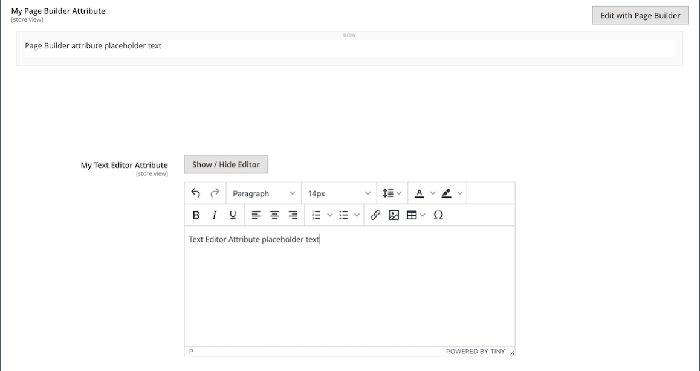

# [!DNL Page Builder] 3부: 카탈로그 컨텐츠

이 연습에서는 페이지에 제품 목록을 추가하고, 제품 페이지를 사용자 지정하고, 를 추가하는 사용자 지정 특성을 만드는 것이 얼마나 쉬운지 보여 줍니다. [!DNL Page Builder] 작업 영역을 제품 속성 세트로 복사합니다.

{width="600" zoomable="yes"}

이 연습에서는 이 작업을 완료했다고 가정합니다 [1부: 단순 페이지](1-simple-page.md) 및 [2부: 블록](2-blocks.md)사전 요구 사항 및 다운로드한 샘플 파일을 포함합니다. 이 연습의 세 부분을 순서대로 따라라.

## 1부: 제품 목록 추가

[!DNL Page Builder] 를 사용하면 단계에 제품 목록을 쉽게 추가할 수 있습니다. 이 예에서는 제품 목록이 페이지에 바로 추가됩니다.

### 1단계: 단계에 제품 목록 추가

1. 다음에서 _관리자_ 사이드바, 이동 **[!UICONTROL Content]** > _[!UICONTROL Elements]_>**[!UICONTROL Pages]**.

1. 다음 찾기 _단순 페이지_ 첫 번째 연습에서 만들고 두 번째 연습에서 수정한 후에 **[!UICONTROL Edit]** 다음에서 _[!UICONTROL Action]_열.

1. 확장  다음 **[!UICONTROL Content]** 섹션 및 클릭 **[!UICONTROL Edit with Page Builder]** 또는 콘텐츠 미리 보기 영역 내부에 있습니다.

1. 다음에서 [!DNL Page Builder] 패널 아래 _[!UICONTROL Layout]_, 드래그&#x200B;**[!UICONTROL Row]**무대 꼭대기까지.

1. 다음에서 [!DNL Page Builder] 패널, 확장 **[!UICONTROL Add Content]** 드래그 **[!UICONTROL Products]** 자리 표시자를 새 행에 추가합니다.

   {width="600" zoomable="yes"}

### 2단계: 조건 작성

1. 빈 제품 컨테이너에 마우스를 가져다 대고 도구 상자를 표시하고 _설정_ ( {width="20"} ) 아이콘.

   {width="600" zoomable="yes"}

1. 대상 **[!UICONTROL Select Products By]**, 선택 `Condition`.

1. 조건 추가:

   - 다음을 클릭합니다. _추가_ () 아이콘.

   - 아래 _[!UICONTROL Product Attribute]_, 선택&#x200B;**[!UICONTROL Category]**.

     {width="600" zoomable="yes"}

   - 다음을 완료합니다. _[!UICONTROL Category is]..._ 자세히(...) 아이콘을 클릭한 다음 _선택기_ () 아이콘.

     {width="600" zoomable="yes"}

   - 범주 트리에서 **여성 > 위쪽** 범주를 선택한 다음 **티** 확인란.

     {width="600" zoomable="yes"}

   - 확인 표시() 아이콘.

     해당 카테고리 ID가 필드에 표시되어 조건을 완료합니다.

### 3단계: 설정 완료

1. 다음을 입력합니다. **[!UICONTROL Number of Products to Display]**.

   기본적으로 목록에는 5개의 제품이 표시됩니다.

1. 필요에 따라 나머지 설정을 완료합니다.

   필요한 경우 의 끝에 있는 필드 설명을 사용합니다. [콘텐츠 추가 - 제품](products.md) 참조할 페이지입니다.

1. 완료되면 다음을 클릭하십시오. **[!UICONTROL Save]** 설정을 저장하고 [!DNL Page Builder] 작업 영역.

   {width="600" zoomable="yes"}

1. 스테이지의 오른쪽 위 모서리에서 _전체 화면 닫기_ ( {width="20"} ) 아이콘.

   이 아이콘을 클릭하면 _[!UICONTROL Content]_미리보기가 표시된 페이지의 섹션입니다.

1. 오른쪽 위 모서리에서 **[!UICONTROL Save]** 화살표 및 선택 **[!UICONTROL Save & Close]**.

## 2부: 제품 페이지 사용자 지정

>[!NOTE]
>
>관리자는 다음을 보유해야 합니다. [!UICONTROL Content] 에 대한 권한 [역할 범위](../systems/permissions-user-roles.md) 보기 [!UICONTROL Edit with Page Builder] 단추를 클릭하여 페이지 빌더를 사용할 수 있습니다.

이 연습 부분에서는 제품 페이지의 탭 집합 아래에 비디오를 배치하여 제품 페이지를 손쉽게 사용자 정의하는 방법을 알아봅니다. 업데이트할 프로세스 [카테고리 페이지](../catalog/categories-content-settings.md) 콘텐츠는 기본적으로 동일합니다.

1. 다음에서 _관리자_ 사이드바, 이동 **[!UICONTROL Catalog]** > **[!UICONTROL Products]**.

1. 이 예제에 사용할 수 있는 간단한 제품을 찾아 편집 모드로 엽니다.

1. 아래로 스크롤하고 확장합니다.  다음 **[!UICONTROL Content]** 섹션.

1. 다음 _[!UICONTROL Description]_, 클릭&#x200B;**[!UICONTROL Edit with Page Builder]**.

   {width="600" zoomable="yes"}

   이전에 없이 제품 설명을 입력한 경우 [!DNL Page Builder], 현재 설명은 의 HTML으로 표시됩니다. [HTML 코드](html-code.md) 컨테이너. Luma 테마를 사용하면 제품 설명이 세부 사항 탭에 표시됩니다.

1. 다음에서 [!DNL Page Builder] 패널 아래 _[!UICONTROL Layout]_, 드래그&#x200B;**[!UICONTROL Row]**스테이지로 이동하여 HTML 코드 컨테이너 아래에 놓습니다.

   행이 올바른 위치에 있을 때 빨간색 지침이 나타나는지 확인합니다.

   {width="600" zoomable="yes"}

1. 다음에서 [!DNL Page Builder] 패널, 확장 **[!UICONTROL Media]** 드래그 **[!UICONTROL Video]** 자리 표시자를 새 행에 추가합니다.

   {width="600" zoomable="yes"}

1. 빈 비디오 컨테이너에 마우스를 가져다 대고 도구 상자를 표시한 다음 _설정_ ( {width="20"} ) 아이콘.

   {width="500" zoomable="yes"}

1. 다음을 입력합니다. **[!UICONTROL Video URL]**.

   다음 중 하나에서 비디오를 호스팅할 수 있습니다. [YouTube][1] 또는 [Vimeo][2]. 이 예제의 비디오는 YouTube의 다음 URL에서 찾을 수 있습니다.

   `https://www.youtube.com/watch?v=ZpFrNyD4100`

   {width="500" zoomable="yes"}

1. 다음을 입력합니다. **[!UICONTROL Maximum Width]** 비디오 디스플레이용 픽셀 단위.

   이 옵션을 비워 두면 비디오는 사용 가능한 공간을 채웁니다.

1. 클릭 **[!UICONTROL Save]** 설정을 저장하고 [!DNL Page Builder] 작업 영역.

   {width="600" zoomable="yes"}

1. 스테이지의 오른쪽 위 모서리에서 _전체 화면 닫기_ ( {width="20"} ) 아이콘.

   이 아이콘을 클릭하면 _[!UICONTROL Content]_미리보기가 표시된 페이지의 섹션입니다.

1. 오른쪽 위 모서리에서 **[!UICONTROL Save]** 화살표 및 선택 **[!UICONTROL Save & Close]**.

상점 첫 화면에서 이 비디오는 탭 집합 아래에 표시됩니다. 모바일 장치에서 페이지가 어떻게 표시되는지 보려면 창 크기를 조정할 수 있습니다.

{width="600" zoomable="yes"}

**축하합니다!** 카탈로그 콘텐츠 자습서의 두 번째 부분을 완료했습니다. 생성한 작업은 나중에 참조할 수 있도록 보관합니다.

## 3부: 사용자 지정 속성 추가

사용 [!DNL Page Builder] 완전히 기능하는 을(를) 추가하는 사용자 지정 속성 [!DNL Page Builder] 매력적인 콘텐츠를 만드는 데 사용할 수 있는 제품 페이지에 대한 작업 영역입니다. 이 연습 부분에서는 다음을 사용하여 사용자 지정 속성을 만드는 방법을 알아봅니다. [!DNL Page Builder] 유형을 입력하고 카탈로그의 제품 페이지에 적용합니다. 이러한 속성에 대한 자세한 내용은 [제품 속성](../catalog/product-attributes.md).

### 1단계: 제품 만들기

라이브 스토어가 변경되지 않도록 하려면 설명된 속성을 사용하여 제품을 만듭니다.

1. 다음에서 _관리자_ 사이드바, 이동 **[!UICONTROL Catalog]** > **[!UICONTROL Products]**.

1. 오른쪽 위 모서리에서 을(를) 클릭합니다. **[!UICONTROL Add Product]**.

1. 다음 속성을 사용하여 제품을 만듭니다.

   - 
     [!UICONTROL 속성 세트]: Default
   - [!UICONTROL Product Name]: 내 제품
   - 
     [!UICONTROL SKU]: Tutorial
   - 
     [!UICONTROL Price]: 75.00
   - 
     [!UICONTROL Quantity]: 100
   - [!UICONTROL Stock Status]: 재고 있음
   - 
     [!UICONTROL Weight]: 1
   - [!UICONTROL Categories]: 여성 > 위쪽 > 티

1. 오른쪽 위 모서리에서 **[!UICONTROL Save]** 화살표 및 선택 **[!UICONTROL Save & Close]**.

### 2단계: 사용자 지정 속성 만들기

이 단계에서는 다음 방법을 보여주는 두 개의 새 사용자 지정 특성을 만듭니다. [!DNL Page Builder] 및 텍스트 편집기 입력 유형을 사용할 수 있습니다.

1. 다음에서 _관리자_ 사이드바, 이동 **[!UICONTROL Stores]** > _[!UICONTROL Attributes]_>**[!UICONTROL Product]**.

1. 오른쪽 위 모서리에서 을(를) 클릭합니다. **[!UICONTROL Add New Attribute]**.

1. 입력 **[!UICONTROL Default Label]** 속성용.

   이 예에서는 를 사용합니다. `My Page Builder Attribute` 레이블에 사용됩니다.

1. 설정 **[!UICONTROL Catalog Input Type for Store Owner]** 끝 `Page Builder`.

   사용자 지정 속성을 만들 때 애플리케이션에 가장 적합한 편집기를 다음 중 하나로 지정할 수 있습니다 `Page Builder` 또는 표준, WYSIWYG `Text Editor`.

   ![[!DNL Page Builder] 입력 유형](./assets/pb-attribute-page-builder.png){width="600" zoomable="yes"}

1. 확장  다음 **[!UICONTROL Advanced Attribute Properties]** 을 클릭하고 다음 설정을 지정합니다.

   - [!UICONTROL Attribute Code]: 공백 대신 하이픈을 사용하여 속성 코드를 소문자로 입력합니다. 이 예에서는 를 사용합니다. `my_page_builder_attribute`.
   - [!UICONTROL Scope]: 기본값을 사용합니다. `Store View`.
   - [!UICONTROL Default Value]: 속성의 기본값을 입력합니다.
   - 
     [!UICONTROL Unique Value]: `No`
   - 
     [!UICONTROL Add to Column Options]: `No`
   - 
     [!UICONTROL Use in Filter Options]: `Yes`

1. 다음에서 _[!UICONTROL Attribute Information]_왼쪽 패널에서 선택&#x200B;**[!UICONTROL Storefront Properties]**을 설정하고 다음 설정을 수행합니다.

   - 
     [!UICONTROL Use for Promo Rule Conditions]: `Yes`
   - 
     [!UICONTROL Visible on Catalog Pages on Storefront]: `Yes`
   - 
     [!UICONTROL Used in Product Listing]: `Yes`

1. 완료되면 다음을 클릭하십시오. **[!UICONTROL Save Attribute]**.

1. 이전 단계를 반복하여 다음과 같이 기본 등록 정보가 동일하지만 텍스트 편집기 입력 유형이 있는 두 번째 속성을 만듭니다.

   - [!UICONTROL Default Label]: 내 텍스트 편집기 속성
   - [!UICONTROL Catalog Input Type for Store Owner]: 텍스트 편집기
   - 
     [!UICONTROL 속성 코드]: `my_text_editor_attribute`

### 3단계: 제품 속성 세트 업데이트

1. 다음에서 _관리자_ 사이드바, 이동 **[!UICONTROL Stores]** > _[!UICONTROL Attributes]_>**[!UICONTROL Attribute Set]**.

   이 예제에서는 새 속성을 `default` 속성 집합입니다. 이 연습이 끝나면 속성 집합에서 속성을 제거하므로 카탈로그에 영향을 주지 않습니다.

   >[!NOTE]
   >
   >라이브 스토어를 변경하지 않으려면 속성 세트를 업데이트하지 않고 따를 수 있습니다.

1. 다음 찾기 _[!UICONTROL Default]_목록에 설정된 속성을 두 번 클릭하여 편집 모드로 엽니다.

1. 다음에서 _지정되지 않은 속성_ 목록에서 만든 새 속성을 찾아 각 속성을 _[!UICONTROL Groups]_열, 아래&#x200B;**[!UICONTROL Content]**.

   에서 속성의 위치 [!UICONTROL Groups] 열은 페이지에 표시되는 위치를 결정합니다.

   {width="600" zoomable="yes"}

1. 클릭 **[!UICONTROL Save]** 속성 세트 목록으로 돌아갑니다.

1. 메시지가 표시되면 **[!UICONTROL Cache Management]** 페이지 맨 위에 있는 를 연결하고 잘못된 캐시를 새로 고칩니다.

### 4단계: 제품 업데이트

1. 다음에서 _관리자_ 사이드바, 이동 **[!UICONTROL Catalog]** > **[!UICONTROL Products]**.

1. Products 그리드에서 _내 제품_ 편집 모드로 엽니다.

1. 아래로 스크롤하고 확장합니다.  다음 **[!UICONTROL Content]** 섹션.

   섹션의 맨 위에는 제품 콘텐츠에 대한 두 가지 표준 속성이 있습니다.

   - _간단한 설명_&#x200B;표준 WYSIWYG를 사용하는 [편집자](../content-design/editor.md).
   - _설명_, 다음을 표시합니다. [!DNL Page Builder] 미리 보기.

   {width="600" zoomable="yes"}

   섹션의 하단으로 스크롤할 때 작성 및 할당한 두 가지 속성이 있습니다.

   - _내 [!DNL Page Builder] 속성_, 다음을 표시합니다. [!DNL Page Builder] 미리 보기.
   - _내 텍스트 편집기 속성_&#x200B;표준 WYSIWYG 편집기를 사용합니다.

   {width="600" zoomable="yes"}

1. 다음에서 **내 텍스트 편집기 속성** 편집자, 입력 `Text Editor Attribute placeholder text`.

   - 오른쪽 위 모서리에서 **[!UICONTROL Save]** 화살표 및 선택 **[!UICONTROL Save & Close]**.

1. 대상 **내 Page Builder 속성**, 클릭 **[!UICONTROL Edit with Page Builder]** 설명 텍스트를 추가합니다.

   - 다음에서 [!DNL Page Builder] 패널, 확장 **[!UICONTROL Elements]** 드래그 **[!UICONTROL Text object]** 무대로

   - 입력 `Page Builder attribute placeholder text`.

   - 스테이지의 오른쪽 위 모서리에서 _전체 화면 닫기_ ( {width="20"} ) 아이콘.

     {width="600" zoomable="yes"}

1. 위로 스크롤 **[!UICONTROL Description]**, 클릭 **[!UICONTROL Edit with Page Builder]**&#x200B;을 클릭하고 이전 단계와 동일한 방법을 사용하여 원하는 텍스트를 추가합니다.

1. 제품 페이지의 오른쪽 위 모서리에서 **[!UICONTROL Save]** 화살표 및 선택 **[!UICONTROL Save & Close]**.

1. 메시지가 표시되면 **[!UICONTROL Cache Management]** 페이지 상단에 있는 메시지에 연결하고 잘못된 캐시를 새로 고칩니다.

### 5단계: 결과 보기

1. 상점 첫 화면에서 샘플 제품 페이지로 이동합니다.

   이 예에서 제품은 여성 > 상단 > 티 아래의 상단 탐색에서 찾을 수 있습니다.

1. 아래로 스크롤하여 _내 Page Builder 속성_ 정보.

   제품 페이지에서의 속성 위치는 테마에 의해 결정됩니다. Luma 테마에서 새 속성은 제품 설명 바로 뒤에 있습니다.

   ![[!DNL Page Builder] 및 상점 첫 화면의 텍스트 편집기 특성](./assets/pb-storefront-product-attribute.png){width="600" zoomable="yes"}

다음을 완료했습니다. [!DNL Page Builder] 카탈로그 콘텐츠 연습입니다. 생성한 작업은 나중에 참조할 수 있도록 보관합니다.

[1]: https://www.youtube.com/
[2]: https://vimeo.com/
