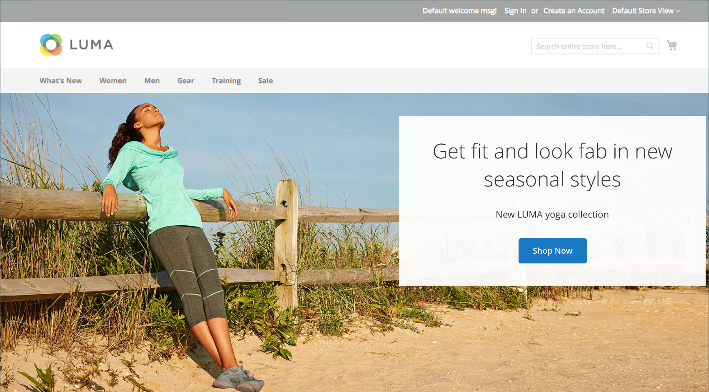

# 미디어 - 배너

_배너_ 콘텐츠 형식을 사용하여 [[!DNL Page Builder] 단계](workspace.md#stage)에서 call to action 및 단추로 사용자를 유도하는 그림 같은 대화형 구성 요소를 추가하십시오.

>[!NOTE]
>
>이전에 콘텐츠 메뉴의 _배너_ 옵션이었던 것이 이제 [동적 블록](../content-design/dynamic-blocks.md)입니다.

{width="700" zoomable="yes"}

{{$include /help/_includes/page-builder-save-timeout.md}}

## 배너 도구 상자

배너 컨테이너 위로 마우스를 가져가면 배너 도구 상자가 나타납니다.

{width="600" zoomable="yes"}

| 도구 | 아이콘 | 설명 |
|--- |--- |--- |
| 이동 | {width="25"} | 배너를 스테이지의 다른 위치로 이동합니다. |
| (레이블) | 배너 | 현재 콘텐츠 컨테이너를 배너로 식별합니다. 도구 상자를 보려면 컨테이너 위로 마우스를 가져갑니다. |
| 설정 | {width="25"} | 배너 및 컨테이너의 속성을 변경할 수 있는 배너 편집 페이지를 엽니다. |
| 숨기기 | {width="25"} | 현재 배너를 숨깁니다. |
| 표시 | {width="25"} | 숨겨진 배너를 표시합니다. |
| 복제 | {width="25"} | 배너를 복사합니다. |
| 제거 | {width="25"} | 스테이지에서 배너를 삭제합니다. |
| [!UICONTROL Upload New Image] |  | 배너 배경에 대한 이미지를 로컬 파일 시스템에서 갤러리로 업로드합니다. |
| [!UICONTROL Select from Gallery] |  | 갤러리의 기존 이미지를 배너 배경에 사용합니다. |

{style="table-layout:auto"}

{{$include /help/_includes/page-builder-hidden-element-note.md}}

## 배너 추가

1. [!DNL Page Builder] 패널에서 **[!UICONTROL Media]**&#x200B;을(를) 확장하고 **[!UICONTROL Banner]** 자리 표시자를 스테이지로 드래그합니다.

   {width="600" zoomable="yes"}

   _[!UICONTROL Upload Image]_&#x200B;및&#x200B;_[!UICONTROL Select from Gallery]_ 버튼이 포함되어 있으므로 스테이지에서 직접 배너 콘텐츠를 빠르게 변경할 수 있습니다. _[!UICONTROL Edit Banner]_&#x200B;페이지에서 내용을 변경할 수도 있습니다.

1. 배너 자리 표시자를 클릭하여 [텍스트 편집기](../content-design/editor.md)를 표시하고 배너의 콘텐츠를 입력합니다.

   [콘텐츠](#content) 설정을 사용하여 보다 복잡한 배너 콘텐츠를 포함할 수도 있습니다.

## 배너 설정 변경

1. 도구 상자를 표시하고 _설정_() 아이콘을 선택하려면 배너 컨테이너 위로 마우스를 가져갑니다.

1. 사용 가능한 설정 업데이트에 대한 자세한 내용을 보려면 다음 섹션을 사용하십시오.

   - [[!UICONTROL Appearance]](#appearance)
   - [[!UICONTROL Content]](#content)
   - [[!UICONTROL Background]](#background)
   - [[!UICONTROL Advanced]](#advanced)

1. 완료되면 오른쪽 상단의 **[!UICONTROL Save]**&#x200B;을(를) 클릭하여 _[!UICONTROL Edit Banner]_&#x200B;페이지를 닫습니다.

1. 오른쪽 상단 모서리에서 **[!UICONTROL Save]**&#x200B;을(를) 클릭하여 설정을 적용하고 [!DNL Page Builder] 작업 영역으로 돌아갑니다.

## [!UICONTROL Appearance]

배너는 사전 정의된 4개의 템플릿 중 하나를 기반으로 하므로 쉽게 설정하고 유지 관리할 수 있습니다.

- 다음 배너 배치 유형 중 하나를 선택합니다.

  | 배치 | 설명 |
  | --------- | ----------- |
  | [!UICONTROL Poster] | 배너에 콘텐츠 및 단추를 가운데로 맞춥니다. 오버레이를 사용하는 경우 배너의 전체 너비를 확장합니다. |
  | [!UICONTROL Collage Left] | 배너의 왼쪽에 정의된 영역에 컨텐츠와 단추를 배치합니다. 오버레이는 사용되는 경우 정의된 영역만 포함합니다. |
  | [!UICONTROL Collage Center] | 배너 중앙에 정의된 영역에 컨텐츠와 단추를 배치합니다. 오버레이는 사용되는 경우 정의된 영역만 포함합니다. |
  | [!UICONTROL Collage Right] | 배너 오른쪽의 정의된 영역에 컨텐츠와 단추를 배치합니다. 오버레이는 사용되는 경우 정의된 영역만 포함합니다. |

  {style="table-layout:auto"}

  {width="600" zoomable="yes"}

- (선택 사항) 행의 **[!UICONTROL Minimum Height]**&#x200B;을(를) 입력합니다.

  최소 높이는 유효한 CSS 단위(예: `100px`, `50%`, `50em`, `100vh`) 또는 계산(예: `100vh - 237px`)이 있는 숫자일 수 있습니다.

  예를 들어 배너의 최소 높이를 설정하여 페이지의 전체 높이를 늘리므로 전체 페이지 배경 이미지와 비디오에 대한 매력적인 옵션을 사용할 수 있습니다.

## [!UICONTROL Background]

배너의 배경 표시를 정의하는 데 여러 가지 옵션이 있습니다. 단순한 색상이나 배경 이미지를 적용하고 보다 정교한 효과를 관리할 수 있습니다.

### [!UICONTROL Background Color]

색상 견본을 선택하거나 색상 선택기를 클릭하거나 유효한 색상 이름 또는 이에 해당하는 16진수 값을 입력하여 배경색을 지정합니다. 이 설정은 행의 배경색을 결정합니다. 색상의 불투명도를 조정할 수도 있습니다.

{width="200"}

다음 세 가지 방법 중 하나로 값을 설정할 수 있습니다.

- 미리 정의된 색상 이름(예: `White`)
- 색상에 대한 16진수 색상 값(예: `#ffffff`)
- 불투명도 비율이 있는 색상의 rgba 값(예: `rgba(255, 255, 255, 0.75)`)

색상을 선택하려면 _색상 없음_ 상자의 왼쪽에 있는 견본을 클릭합니다.

{width="600" zoomable="yes"}

색상 상자를 클릭하여 색상 선택기를 다시 열면 슬라이더 아래의 상자에 현재 빨강, 녹색, 파랑 및 알파 값(rgba)이 표시됩니다. 마지막 숫자는 현재 불투명도 비율을 소수점으로 나타냅니다. 슬라이더를 사용하여 불투명도를 조정하거나 원하는 십진수 값을 입력할 수 있습니다.

{width="600" zoomable="yes"}

>[!NOTE]
>
>[!DNL Page Builder]은(는) 불투명도가 다양한 배경을 만드는 데 사용할 수 있는 배경 이미지에서 투명도 레이어 또는 _알파 채널_&#x200B;도 지원합니다.

### [!UICONTROL Background Type]

배경 유형은 이미지 또는 비디오일 수 있습니다. [!DNL Page Builder]은(는) 기본적으로 `Image`이고 다양한 이미지 설정을 표시합니다. `Video`을(를) 선택하면 [!DNL Page Builder]에서 이미지 설정을 비디오 설정으로 바꿉니다. 두 배경 유형 설정은 다음 섹션에 설명되어 있습니다.

{width="200"}

### 이미지 유형 설정

_배경 유형_&#x200B;을(를) `Image`(으)로 설정하는 경우 다음 설정을 사용하여 배경 이미지 표시를 정의합니다.

{width="600" zoomable="yes"}

- **[!UICONTROL Background Image]** - 필요한 경우 제공된 도구를 사용하여 배너에 적용할 배경 이미지를 선택하십시오.

  | 도구 | 설명 |
  | ---- | ----------- |
  | [!UICONTROL Upload] | 이미지 파일을 로컬 컴퓨터에서 갤러리로 업로드한 다음 배너의 배경 이미지로 적용합니다. |
  | [!UICONTROL Select from Gallery] | 갤러리에서 기존 이미지를 배너의 배경 이미지로 선택하라는 메시지가 표시됩니다. |
  | {width="25"} | 이미지를 카메라 타일로 드래그하거나 로컬 파일 시스템에서 이미지를 검색할 수 있습니다. |

  {style="table-layout:auto"}

- **[!UICONTROL Background Mobile Image]** - 필요한 경우 동일한 도구를 사용하여 모바일 장치에서 표시하는 데 사용할 다른 배경 이미지를 선택하십시오.

- **[!UICONTROL Background Size]** - 배너의 너비와 관련하여 배경 이미지의 크기를 조정하는 방법을 결정하려면 이 옵션을 설정하십시오.

  | 옵션 | 설명 |
  | ------ | ----------- |
  | `Cover` | 배경 이미지는 배너의 전체 너비를 포함합니다. |
  | `Contain` | 배경 이미지는 컨텐츠 영역의 너비로 제한됩니다. |
  | `Auto` | 현재 스타일 시트의 크기를 적용합니다. |

  {style="table-layout:auto"}

  {width="200"}

- **[!UICONTROL Background Position]** - 배너를 기준으로 배경 이미지가 고정되는 방법을 결정하려면 이 옵션을 설정하십시오.

  | 앵커 | 위치 |
  | ------ | ----------- |
  | `Top` | 왼쪽/가운데/오른쪽 |
  | `Center` | 왼쪽/가운데/오른쪽 |
  | `Bottom` | 왼쪽/가운데/오른쪽 |

  {style="table-layout:auto"}

  기준점은 지정된 배경 위치에서 배너에 이미지를 첨부하는 누름 핀과 같습니다.

- **[!UICONTROL Background Attachment]** - 스크롤 페이지와 관련하여 배경 이미지가 어떻게 이동하는지 확인하려면 첨부 파일 형식을 설정하십시오.

  | 옵션 | 설명 |
  | ------ | ----------- |
  | `Scroll` | 첨부된 배경 이미지는 페이지가 스크롤될 때 아래로 이동하도록 동기화됩니다. |
  | `Fixed` | (모바일에서는 사용할 수 없음) 컨테이너가 이미지를 스크롤하고 지정된 배경 위치에서 고정되므로 배경 이미지가 이동하지 않습니다. |

  {style="table-layout:auto"}

- **[!UICONTROL Background Repeat]** - 배경 이미지를 반복하여 공백을 채우려면 이 설정 `Yes`을(를) 변경하십시오.

### 비디오 유형 설정

_[!UICONTROL Background Type]_&#x200B;을(를) `Video`(으)로 설정하는 경우 다음 설정을 사용하여 배경 이미지 표시를 정의합니다.

- **[!UICONTROL Video URL]** - 올바른 비디오 URL을 입력하십시오. 유효한 비디오 URL은 다음에 대한 링크일 수 있습니다.

   - YouTube 비디오: `https://youtu.be/CoDhMRUUjeI`
   - Vimeo 비디오: `https://vimeo.com/190156113`
   - 올바른 비디오 파일(`.mp4`개 권장): `https://myvideos.com/spiral.mp4`

  {width="200"}

- **[!UICONTROL Overlay Color]** - 비디오에 투명 색조를 적용할 색상을 선택합니다.

- **[!UICONTROL Infinite Loop]** - 비디오를 한 번 재생하고 중지하려면 `No`(으)로 설정합니다. `Yes`(기본값)으로 설정하면 비디오가 무한 루프로 반복됩니다.

- **[!UICONTROL Lazy Load]** - 표시되지 않더라도 페이지에서 비디오를 로드하려면 `No`(으)로 설정합니다. `Yes`(기본값)으로 설정하면 화면에 표시되는 경우에만 원본에서 비디오가 로드됩니다.

- **[!UICONTROL Play Only When Visible]** - 표시 여부에 관계없이 비디오가 로드된 후 바로 재생을 시작하려면 `No`(으)로 설정합니다. `Yes`(기본값)으로 설정하면 표시되는 경우에만 비디오 재생이 시작됩니다.

- **[!UICONTROL Fallback Image]** - 필요한 경우 비디오가 로드되기 전에 화면에 표시할 이미지를 지정하고 비디오가 어떤 이유로 로드되지 않는 경우 지정합니다.

## [!UICONTROL Content]

스테이지에서 직접 또는 설정을 변경할 때 배너 콘텐츠를 수정할 수 있습니다. 이 설정은 배너 링크 및 버튼, 오버레이와 같은 보다 복잡한 콘텐츠 기능을 제공합니다. 콘텐츠의 위치는 [Appearance](#appearance) 배치 설정을 반영합니다.

### 스테이지의 간단한 콘텐츠

1. 자리 표시자 텍스트를 클릭하고 배너에 표시할 텍스트를 입력합니다.

   편집기 도구 모음이 텍스트 상자 위에 나타납니다.

   {width="600" zoomable="yes"}

1. 편집기 도구 모음을 사용하여 텍스트를 입력하고 서식을 지정할 수 있을 뿐만 아니라 링크, 이미지 및 위젯과 같은 요소를 삽입할 수 있습니다.

   {width="600" zoomable="yes"}

### 설정의 복잡한 콘텐츠

1. 도구 상자를 표시하고 _설정_( {width="25"} ) 아이콘을 선택하려면 배너 컨테이너 위로 마우스를 가져갑니다.

1. _[!UICONTROL Content]_&#x200B;섹션까지 아래로 스크롤한 다음&#x200B;**[!UICONTROL Message Text]**&#x200B;편집기를 사용하여 배너 텍스트를 입력하고 서식을 지정합니다.

   텍스트 링크, 이미지 및 위젯과 같은 요소를 삽입할 수도 있습니다.

   {width="600" zoomable="yes"}

1. 필요한 경우 배너에 대해 **[!UICONTROL Link]**&#x200B;을(를) 지정하십시오.

   링크는 고객이 배너 단추 또는 영역을 클릭할 때 나타나는 대상 페이지입니다. 다음 세 가지 링크 유형 중 하나를 사용할 수 있습니다.

   - **[!UICONTROL URL]** - 상대 URL 또는 정규화된 URL에 연결된 링크입니다.
   - **[!UICONTROL Product]** - 제품 이름 또는 SKU를 기반으로 대상 페이지를 식별합니다. 부분 또는 전체 이름을 기반으로 이름으로 제품을 검색합니다. 검색 결과 목록에서 제품을 선택합니다.
   - **[!UICONTROL Category]** - 대상 페이지를 범주 트리에서 특정 범주 또는 하위 범주로 식별합니다. 부분 이름 또는 전체 이름을 기반으로 범주를 검색합니다. 표시된 트리의 확장된 섹션에서 범주를 선택합니다.
   - **[!UICONTROL Page]** - 대상 페이지를 특정 콘텐츠 페이지로 식별합니다. 부분 이름 또는 전체 이름을 기반으로 페이지를 검색합니다. 검색 결과 목록에서 페이지를 선택합니다.

   >[!NOTE]
   >
   >2.4.1 릴리스부터 [!DNL Page Builder]은(는) 상점에서의 표시 문제로 인해 더 이상 배너 및 중첩된 텍스트 내의 링크 연결을 지원하지 않습니다. _[!UICONTROL Message Text]_&#x200B;에서 링크를 사용하는 경우&#x200B;_[!UICONTROL Link]_ 옵션을 구성할 수 없습니다. 전체 배너에 대해 하나의 링크를 사용하려는 경우 텍스트에서 모든 링크를 제거할 수 있습니다. 
   >
   >{width="200"}

1. 필요한 경우 고객에게 링크를 따라가라는 메시지를 표시하는 버튼을 추가합니다.

   배너 모양 설정은 텍스트 아래에 단일 링크 또는 단추를 배치합니다. 추가하려는 링크 또는 버튼의 속성을 완료합니다.

   {width="600" zoomable="yes"}

   >[!NOTE]
   >
   >배너에 [block](block.md)을(를) 추가하여 여러 단추 또는 링크를 사용할 수도 있습니다. 충돌을 방지하려면 모든 링크 또는 단추를 별도의 블록에 두고 링크 또는 단추를 배너에 바로 추가하지 마십시오.

   - **[!UICONTROL Show Button]**&#x200B;을(를) 다음 중 하나로 설정합니다.

     | 옵션 | 설명 |
     | ------ | ----------- |
     | `Always` | 배너에 항상 단추가 표시됩니다. |
     | `On Hover` | 단추를 마우스로 가리키면 배너에 단추가 표시됩니다. |
     | `Never Show` | 배너에 단추가 표시되지 않습니다. |

     {style="table-layout:auto"}

   - 단추에 표시할 **[!UICONTROL Button Text]**&#x200B;을(를) 입력하십시오.

   - **[!UICONTROL Button Type]**&#x200B;을(를) 다음 중 하나로 설정합니다.

     | 옵션 | 설명 |
     | ------ | ----------- |
     | `Primary` | 현재 스타일 시트의 기본 단추 스타일을 적용합니다. |
     | `Secondary` | 해당하는 경우 현재 스타일 시트의 보조 단추 스타일을 적용합니다. |
     | `Link` | 단추가 아닌 하이퍼링크를 만듭니다. |

     {style="table-layout:auto"}

     현재 테마의 단추 스타일에 따라 단추 형식이 결정됩니다. 일반적으로 기본 단추는 보조 단추보다 배경색이 더 두드러집니다.

1. **[!UICONTROL Show Overlay]**&#x200B;을(를) 다음 중 하나로 설정합니다.

   | 옵션 | 설명 |
   | ------ | ----------- |
   | `Always` | 오버레이는 항상 표시됩니다. |
   | `On Hover` | 오버레이는 마우스로 가리키기만 표시됩니다. |
   | `Never Show` | 오버레이가 표시되지 않습니다. |

   {style="table-layout:auto"}

   오버레이를 사용하여 [!UICONTROL Appearance] 설정으로 정의된 활성 콘텐츠 영역에 배경색을 적용할 수 있습니다. 배너 배경 이미지는 배너의 전체 너비에 대해 계속 표시됩니다.

   오버레이를 표시하도록 선택한 경우 **[!UICONTROL Overlay Color]**&#x200B;을(를) 설정합니다.

   - **색상 없음** 견본을 클릭하고 견본을 선택합니다.
   - **색상 없음** 필드에 올바른 색상 이름 또는 16진수 값을 입력하십시오.

   {width="600" zoomable="yes"}

1. 오른쪽 상단 모서리에서 **[!UICONTROL Save]**&#x200B;을(를) 클릭하여 설정을 적용하고 [!DNL Page Builder] 작업 영역으로 돌아갑니다.

   {width="600" zoomable="yes"}

## [!UICONTROL Search Engine Optimization] {#seo}

이러한 설정에 대한 텍스트는 검색 엔진에 표시되며 페이지 색인 지정 방식을 개선합니다.

- **[!UICONTROL Alternative Text]**&#x200B;에 표시할 디지털 접근성 도구에 대한 _대체_ 텍스트 설명을 입력하십시오.

  대체 텍스트를 사용하는 것은 접근성 모범 사례이며 일부 로케일에서 법률에 의해 필수입니다. HTML에서 `alt` 특성은 `image` 태그의 하위 집합입니다. `<image title="tooltip" alt="description" src="image.jpg">`.

- **[!UICONTROL Title Attribute]**&#x200B;의 경우 마우스를 올려 놓을 때 툴팁으로 표시할 텍스트를 입력하십시오.

  검색 엔진에서 이미지를 인덱싱하는 방식을 개선하기 위해 설명하는 키워드가 풍부한 제목을 선택하는 것이 좋습니다. HTML에서 `title` 특성은 `image` 태그의 하위 집합입니다. `<image title="tooltip" alt="description" src="image.jpg">`.

## [!UICONTROL Advanced]

1. 배너에 추가된 콘텐츠 컨테이너의 가로 위치를 제어하려면 **[!UICONTROL Alignment]**&#x200B;을(를) 선택하세요.

   | 옵션 | 설명 |
   | ------ | ----------- |
   | `Default` | 현재 테마의 스타일시트에 지정된 정렬 기본 설정을 적용합니다. |
   | `Left` | 지정된 패딩을 허용하여 배너 컨테이너의 왼쪽 테두리를 따라 콘텐츠 컨테이너를 정렬합니다. |
   | `Center` | 지정된 패딩을 허용하여 배너 컨테이너의 중앙에 콘텐츠 컨테이너를 정렬합니다. |
   | `Right` | 지정된 패딩을 허용하여 배너 컨테이너의 오른쪽 테두리를 따라 콘텐츠 컨테이너를 정렬합니다. |

   {style="table-layout:auto"}

1. 배너 컨테이너의 네 면 모두에 적용되는 **[!UICONTROL Border]** 스타일을 설정합니다.

   | 옵션 | 설명 |
   | ------ | ----------- |
   | `Default` | 연관된 스타일 시트에서 지정한 기본 테두리 스타일을 적용합니다. |
   | `None` | 컨테이너 테두리를 시각적으로 표시하지 않습니다. |
   | `Dotted` | 컨테이너 테두리가 점선으로 표시됩니다. |
   | `Dashed` | 컨테이너 테두리는 파선으로 표시됩니다. |
   | `Solid` | 컨테이너 테두리가 실선으로 표시됩니다. |
   | `Double` | 컨테이너 테두리는 이중 선으로 표시됩니다. |
   | `Groove` | 컨테이너 테두리는 홈이 있는 선으로 표시됩니다. |
   | `Ridge` | 컨테이너 테두리는 절선으로 표시됩니다. |
   | `Inset` | 컨테이너 테두리는 인세트 선으로 표시됩니다. |
   | `Outset` | 컨테이너 테두리는 외곽선으로 표시됩니다. |

   {style="table-layout:auto"}

1. `None` 이외의 테두리 스타일을 설정하는 경우 테두리 표시 옵션을 완료하십시오.

   - **[!UICONTROL Border Color]** - 견본을 선택하거나, 색상 선택기를 클릭하거나, 올바른 색상 이름 또는 이에 해당하는 16진수 값을 입력하여 색상을 지정합니다.

     {width="600" zoomable="yes"}

   - **[!UICONTROL Border Width]** - 테두리 라인 너비의 픽셀 수를 입력합니다.

   - **[!UICONTROL Border Radius]** - 테두리의 각 모퉁이를 둥글게 만드는 데 사용되는 반경의 크기를 정의할 픽셀 수를 입력합니다.

1. (선택 사항) 배너 컨테이너에 적용할 현재 스타일 시트의 **[!UICONTROL CSS classes]** 이름을 지정합니다.

   여러 클래스 이름은 공백으로 구분합니다.

1. **[!UICONTROL Margins and Padding]**&#x200B;에 대한 값을 픽셀 단위로 입력하여 배너의 외부 여백과 내부 패딩을 지정합니다.

   배너 컨테이너 다이어그램에 해당하는 각 값을 입력합니다.

   | 옵션 | 설명 |
   | ------ | ----------- |
   | [!UICONTROL Margins] | 컨테이너의 모든 면 바깥쪽 가장자리에 적용되는 빈 공간의 양입니다. |
   | [!UICONTROL Padding] | 컨테이너의 모든 측면 안쪽 가장자리에 적용되는 빈 공간의 양입니다. |

   {style="table-layout:auto"}

<!-- Last updated from includes: 2023-09-11 14:30:19 -->
