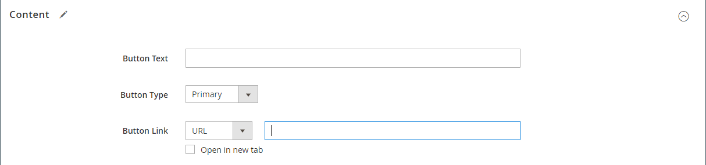
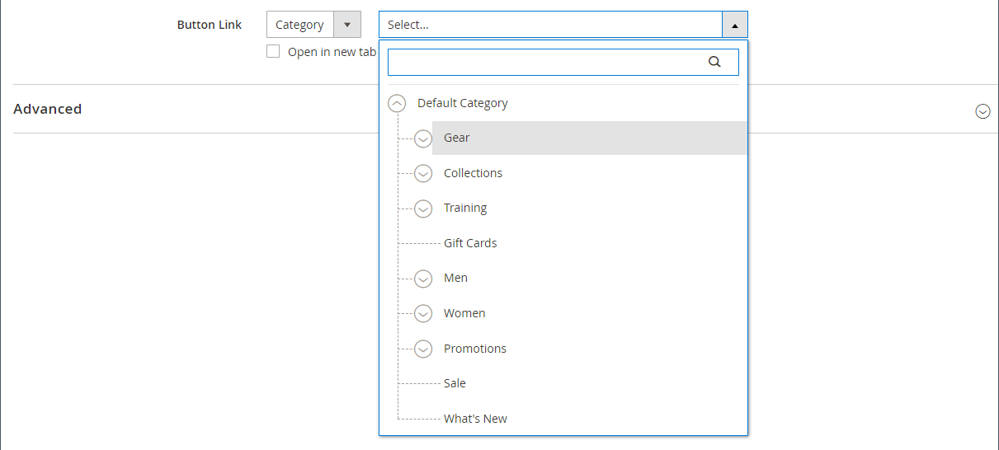
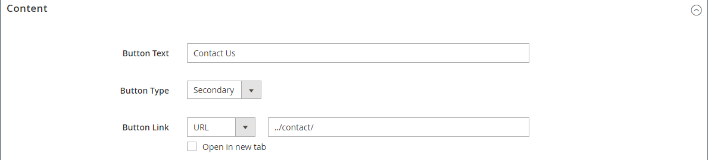
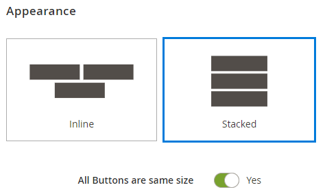

# 요소 - 단추

_단계_&#x200B;에서 개별 단추 또는 단추 집합을 추가하려면 [[!DNL Page Builder] 단추](workspace.md#stage) 콘텐츠 형식을 사용하십시오. 가로 또는 세로 방향으로 단추를 배열하고 스테이지의 행, 열, 탭 및 배너에 직접 추가할 수 있습니다.

{width="600" zoomable="yes"}

{{$include /help/_includes/page-builder-save-timeout.md}}

## 툴박스

단추 콘텐츠 유형을 사용하여 작업하는 경우 개별 단추와 하나 이상의 단추가 들어 있는 단추 컨테이너를 추가하고 편집합니다. 각 단계에는 [!DNL Page Builder] 단계의 단추를 디자인하는 데 사용하는 도구 상자가 있습니다.

### 개별 단추 도구 상자

{width="500" zoomable="yes"}

| 도구 | 아이콘 | 설명 |
| --------- | -------- | -------------- |
| 설정 | {width="25"} | 단추 속성을 변경할 수 있는 [단추 편집] 페이지를 엽니다. |
| 복제 | {width="25"} | 버튼을 복사합니다. |
| 제거 | {width="25"} | 스테이지에서 버튼을 삭제합니다. |

{style="table-layout:auto"}

### 단추 컨테이너 도구 상자

{width="500" zoomable="yes"}

| 도구 | 아이콘 | 설명 |
| --------- | ----------------- | ----------- |
| 이동 | {width="25"} | 단추 컨테이너를 페이지의 다른 올바른 위치로 이동합니다. |
| 추가 | {width="25"} | 컨테이너에 단추를 추가합니다. |
| (레이블) | 단추 | 현재 컨테이너를 단추 요소로 식별합니다. |
| 설정 | {width="25"} | 컨테이너의 속성을 변경할 수 있는 [단추 편집] 페이지를 엽니다. |
| 숨기기 | {width="25"} | 단추 컨테이너를 숨깁니다. |
| 표시 | {width="25"} | 숨겨진 단추 컨테이너를 표시합니다. |
| 복제 | {width="25"} | 단추 컨테이너의 복사본을 만듭니다. |
| 제거 | {width="25"} | 스테이지에서 버튼 컨테이너와 해당 콘텐츠를 삭제합니다. |

{style="table-layout:auto"}

{{$include /help/_includes/page-builder-hidden-element-note.md}}

## 개별 버튼 추가

1. [!DNL Page Builder] 패널에서 **[!UICONTROL Elements]**&#x200B;을(를) 확장하고 **[!UICONTROL Buttons]** 자리 표시자를 스테이지의 행, 열 또는 탭 집합으로 드래그합니다.

   {width="500" zoomable="yes"}

1. 단추 위로 마우스를 가져가 도구 상자를 표시하고 _설정_() 아이콘을 선택합니다.

1. 단추에 표시할 **[!UICONTROL Button Text]**&#x200B;을(를) 입력하십시오.

   {width="600" zoomable="yes"}

1. **[!UICONTROL Button Type]**&#x200B;을(를) 다음 중 하나로 설정합니다.

   | 유형 | 설명 |
   | ------ | ----------- |
   | `Primary` | 현재 스타일 시트의 기본 단추 스타일을 적용합니다. |
   | `Secondary` | 해당하는 경우 현재 스타일 시트의 보조 단추 스타일을 적용합니다. |
   | `Link` | 단추가 아닌 하이퍼링크를 만듭니다. |

   {style="table-layout:auto"}

   {width="500" zoomable="yes"}

1. 다음 형식 중 하나를 사용하여 **[!UICONTROL Button Link]**&#x200B;을(를) 설정합니다.

   - **[!UICONTROL URL]** - 링크의 대상 URL을 입력합니다.

     URL은 스토어의 제품 또는 페이지에 대한 상대 링크이거나 정규화된 URL일 수 있습니다.

     상대 URL 예 - `../luma-analog-watch.html`

     정규화된 URL 예 - `http://mystore.com/luma-analog-watch.html`

     링크가 다른 웹 사이트로 이동하면 새 브라우저 탭에서 링크를 열어 스토어에 대해 현재 페이지를 열어 둘 수 있습니다.

     방문자가 스토어에서 나가지 못하도록 하려면 **[!UICONTROL Open in new tab]** 확인란을 선택하십시오.

   - **[!UICONTROL Product]** - 제품 이름(일부 또는 전체) 또는 SKU를 입력한 다음 목록에서 제품 이름을 선택합니다.

     >[!NOTE]
     >
     >_재고 부족 제품 표시_ 설정에 따라 목록에 제품이 표시됩니다. [Inventory management](../inventory-management/introduction.md)을(를) 사용하는 여러 Source 판매자의 경우 제품 목록은 기본 웹 사이트에만 할당된 소스로 제한됩니다.

     {width="600" zoomable="yes"}

   - **[!UICONTROL Category]** - 범주 이름(일부 또는 전체)을 입력하거나 빈 필드를 클릭하여 범주 트리를 표시합니다. 그런 다음 트리에서 카테고리 이름을 선택합니다.

     {width="600" zoomable="yes"}

   - **[!UICONTROL Page]** - CMS 페이지의 이름(일부 또는 전체)을 입력하거나 빈 필드를 클릭하여 전체 목록을 표시합니다. 그런 다음 검색 결과 목록에서 페이지 이름을 선택합니다.

     {width="600" zoomable="yes"}

1. 필요에 따라 [고급 설정][advanced-settings]을 완료합니다.

1. 완료되면 오른쪽 상단의 **[!UICONTROL Save]**&#x200B;을(를) 클릭하여 설정을 적용하고 [!DNL Page Builder] 작업 영역으로 돌아갑니다.

## 단추 집합 추가

다음 섹션에서는 개별 단추로 시작하고 단추 컨테이너 내에 세 개의 단추 세트를 만드는 일련의 단계를 설명합니다. 개별 버튼이 없는 경우 앞의 지침에 따라 개별 버튼을 스테이지에 추가합니다.

### 1단계: 두 번째 단추 만들기

1. 단추 컨테이너 위로 마우스를 가져가 도구 상자를 표시하고 _추가_( {width="20"}) 아이콘을 선택합니다.

   {width="500" zoomable="yes"}

1. 두 번째 단추에 표시할 텍스트를 입력합니다.

1. 새 단추를 클릭하여 도구 상자를 표시하고 _설정_( {width="20"} ) 아이콘을 선택합니다.

   {width="500" zoomable="yes"}

1. **[!UICONTROL Button Type]**&#x200B;을(를) `Secondary`(으)로 설정합니다.

1. 필요에 따라 **[!UICONTROL Button Link]**&#x200B;을(를) 설정합니다.

   다음 예제에서 링크는 [연락처](../getting-started/store-details.md#contact-us-form) 페이지로 이동하는 상대 URL입니다.

   {width="600" zoomable="yes"}

1. 필요에 따라 [고급 설정][advanced-settings]을 완료합니다.

1. 완료되면 **[!UICONTROL Save]**&#x200B;을(를) 클릭하여 설정을 적용하고 [!DNL Page Builder] 작업 영역으로 돌아갑니다.

### 2단계: 세 번째 단추 만들기

1. 스테이지에서 두 번째 버튼을 다시 클릭하고 _복제_( {width="20"} ) 아이콘을 선택합니다.

   {width="500" zoomable="yes"}

1. 세 번째 단추에 표시할 텍스트를 입력합니다.

1. 세 번째 단추를 클릭하여 도구 상자를 표시하고 _설정_( {width="20"} ) 아이콘을 선택합니다.

   {width="500" zoomable="yes"}

1. 필요에 따라 **[!UICONTROL Button Link]**&#x200B;을(를) 업데이트합니다.

1. 오른쪽 상단 모서리에서 **[!UICONTROL Save]**&#x200B;을(를) 클릭하여 설정을 적용하고 [!DNL Page Builder] 작업 영역으로 돌아갑니다.

### 3단계: 단추 컨테이너 업데이트

1. 단추 컨테이너 위로 마우스를 가져가 도구 상자를 표시하고 _설정_( {width="20"} ) 아이콘을 선택합니다.

   {width="500" zoomable="yes"}

1. _[!UICONTROL Appearance]_에서&#x200B;**[!UICONTROL Stacked]**을(를) 선택합니다.

1. **[!UICONTROL All Buttons are same size]**&#x200B;을(를) `Yes`(으)로 설정합니다.

   {width="300"}

1. [단추 컨테이너에 대한 설정 변경][button-container]의 설명을 사용하여 나머지 설정을 필요에 따라 업데이트합니다.

1. 완료되면 **[!UICONTROL Save]**&#x200B;을(를) 클릭하여 설정을 적용하고 [!DNL Page Builder] 작업 영역으로 돌아갑니다.

   1차 버튼과 2개의 보조 버튼이 있는 전체 스택 버튼 세트가 스테이지에 나타납니다.

   스테이지에서 {width="500" zoomable="yes"}

## 단추 이동

1. 이동할 단추를 클릭합니다.

1. 단추 텍스트 바로 앞에 표시되는 이동( {width="20"}) 아이콘을 선택하여 단추 컨테이너 내의 단추에 대한 새 위치로 드래그합니다.

   {width="500" zoomable="yes"}

## 단추 설정 변경

1. 스테이지의 단추를 클릭하여 도구 상자를 표시하고 _설정_( {width="20"} ) 아이콘을 선택합니다.

   {width="500" zoomable="yes"}

1. 필요에 따라 표준 설정을 업데이트합니다.

   - **[!UICONTROL Button Text]** - 단추에 표시할 텍스트를 입력합니다(단계에서 직접 업데이트할 수도 있음).

   - **[!UICONTROL Button Type]** - 단추 형식을 결정합니다.

     | 유형 | 설명 |
     | ------ | ----------- |
     | `Primary` | 현재 스타일 시트의 기본 단추 스타일을 적용합니다. |
     | `Secondary` | 해당하는 경우 현재 스타일 시트의 보조 단추 스타일을 적용합니다. |
     | `Link` | 단추가 아닌 하이퍼링크를 만듭니다. |

     {style="table-layout:auto"}

   - **[!UICONTROL Button Link]** - 단추를 클릭할 때 제공되는 대상 페이지를 결정합니다.

     | 옵션 | 설명 |
     | ------ | ----------- |
     | `URL` | 상대 URL 또는 정규화된 URL을 사용하여 대상 페이지를 식별합니다. |
     | `Product` | 제품 이름 또는 SKU를 기반으로 대상 페이지를 식별합니다. 부분 이름 또는 전체 이름을 기반으로 제품 이름을 검색할 수 있습니다. 그런 다음 검색 결과 목록에서 제품이 선택됩니다. |
     | `Category` | 대상 페이지를 범주 트리에서 특정 범주 또는 하위 범주로 식별합니다. |
     | `Page` | 대상 페이지를 특정 CMS 페이지로 식별합니다. |

     {style="table-layout:auto"}

1. 필요에 따라 [고급 설정][advanced-settings]을 완료합니다.

1. 설정을 저장하고 [!DNL Page Builder] 작업 영역으로 돌아가려면 오른쪽 상단의 **[!UICONTROL Save]**&#x200B;을(를) 클릭합니다.

## 단추 컨테이너의 설정 변경

1. 단추 컨테이너 위로 마우스를 가져가 도구 상자를 표시하고 _설정_( {width="20"} ) 아이콘을 선택합니다.

1. 필요에 따라 **[!UICONTROL Appearance]** 설정을 업데이트합니다.

   - 배열 옵션을 사용하여 컨테이너에 가로 또는 세로로 단추를 표시합니다.

     | 옵션 | 설명 |
     | ------ | ----------- |
     | `Inline` | 단추를 가로로 정렬합니다. |
     | `Stacked` | 단추를 세로로 정렬합니다. |

     {style="table-layout:auto"}

   - 기본 설정에 따라 **[!UICONTROL All buttons are same size]** 옵션을 설정하십시오.

     `Yes`(으)로 설정된 경우 컨테이너의 모든 단추는 가장 긴 단추 텍스트의 길이에 따라 크기가 같습니다.

1. 필요에 따라 [고급 설정][advanced-settings]을 완료합니다.

1. 완료되면 **[!UICONTROL Save]**&#x200B;을(를) 클릭하여 설정을 적용하고 [!DNL Page Builder] 작업 영역으로 돌아갑니다.

## 고급 설정 변경

개별 단추 및 단추 컨테이너에 대한 _[!UICONTROL Advanced]_설정을 수정할 수 있습니다.

1. 상위 컨테이너 내의 위치를 제어하려면 **[!UICONTROL Alignment]**&#x200B;을(를) 선택하십시오.

   | 옵션 | 설명 |
   | ------ | ----------- |
   | `Default` | 현재 테마의 스타일시트에 지정된 정렬 기본 설정을 적용합니다. |
   | `Left` | 지정된 패딩을 허용하여 상위 컨테이너의 왼쪽 테두리를 따라 컨텐츠를 정렬합니다. |
   | `Center` | 지정된 패딩을 허용하여 상위 컨테이너의 가운데에 내용을 맞춥니다. |
   | `Right` | 지정된 패딩을 허용하여 상위 컨테이너의 오른쪽 테두리를 따라 컨텐츠를 정렬합니다. |

   {style="table-layout:auto"}

1. 단추 또는 단추 컨테이너의 네 면에 모두 적용되는 **[!UICONTROL Border]** 스타일을 설정합니다.

   | 옵션 | 설명 |
   | ------ | ----------- |
   | `Default` | 연관된 스타일 시트에서 지정한 기본 테두리 스타일을 적용합니다. |
   | `None` | 컨테이너 테두리를 시각적으로 표시하지 않습니다. |
   | `Dotted` | 컨테이너 테두리가 점선으로 표시됩니다. |
   | `Dashed` | 컨테이너 테두리는 파선으로 표시됩니다. |
   | `Solid` | 컨테이너 테두리가 실선으로 표시됩니다. |
   | `Double` | 컨테이너 테두리는 이중 선으로 표시됩니다. |
   | `Groove` | 컨테이너 테두리는 홈이 있는 선으로 표시됩니다. |
   | `Ridge` | 컨테이너 테두리는 절선으로 표시됩니다. |
   | `Inset` | 컨테이너 테두리는 인세트 선으로 표시됩니다. |
   | `Outset` | 컨테이너 테두리는 외곽선으로 표시됩니다. |

   {style="table-layout:auto"}

1. `None` 이외의 테두리 스타일을 설정하는 경우 테두리 표시 옵션을 완료하십시오.

   | 옵션 | 설명 |
   | ------ |------------ |
   | [!UICONTROL Border Color] | 색상 견본을 선택하거나 색상 선택기를 클릭하거나 유효한 색상 이름 또는 이에 해당하는 16진수 값을 입력하여 색상을 지정합니다. |
   | [!UICONTROL Border Width] | 테두리 라인 너비의 픽셀 수를 입력합니다. |
   | [!UICONTROL Border Radius] | 테두리의 각 모퉁이를 둥글게 만드는 데 사용되는 반경의 크기를 정의하려면 픽셀 수를 입력합니다. |

   {style="table-layout:auto"}

1. (선택 사항) 단추 또는 단추 컨테이너에 적용할 현재 스타일 시트의 **[!UICONTROL CSS classes]** 이름을 지정합니다.

   여러 클래스 이름은 공백으로 구분합니다.

1. **[!UICONTROL Margins and Padding]**&#x200B;의 값을 픽셀 단위로 입력하여 단추 또는 단추 컨테이너의 외부 여백과 내부 패딩을 결정합니다.

   다이어그램에 해당 값을 입력합니다.

   | 컨테이너 영역 | 설명 |
   | -------------- | ----------- |
   | [!UICONTROL Margins] | 컨테이너의 모든 면 바깥쪽 가장자리에 적용되는 빈 공간의 양입니다. 옵션: `Top` / `Right` / `Bottom` / `Left` |
   | [!UICONTROL Padding] | 컨테이너의 모든 측면 안쪽 가장자리에 적용되는 빈 공간의 양입니다. 옵션: `Top` / `Right` / `Bottom` / `Left` |

   {style="table-layout:auto"}

[advanced-settings]: #change-advanced-settings
[button-container]: #change-settings-for-a-button-container

<!-- Last updated from includes: 2023-09-11 14:30:19 -->
