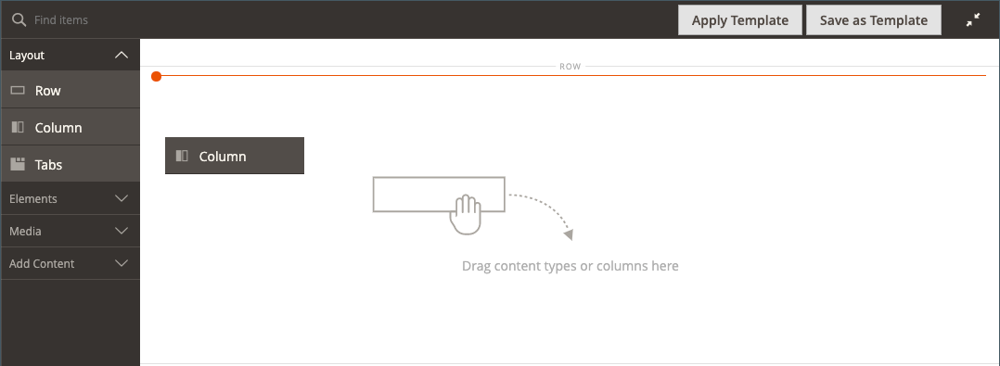
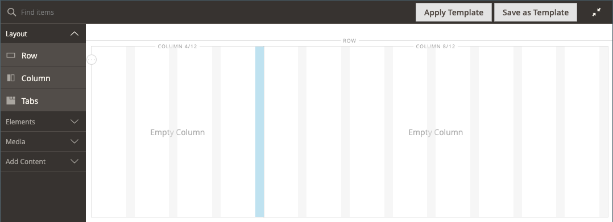

# 레이아웃 - 열

사용 _열_ 에서 페이지를 여러 열로 분할하는 콘텐츠 유형 [[!DNL Page Builder] 단계](workspace.md#stage). 행이나 탭에 열을 추가하거나 스테이지에 직접 열을 추가하면 열 그룹은 처음에는 동일한 너비의 두 열로 분할됩니다. 필요에 따라 열을 추가하거나 제거할 수 있습니다. 두 열 사이의 테두리를 끌어 열 크기를 조정할 수 있습니다. 다음 열의 너비는 행, 탭 또는 단계 내에서 사용 가능한 공간을 채우도록 조정됩니다. 단일 열이 스테이지 또는 해당 컨테이너의 전체 폭을 확장합니다.

{width="600" zoomable="yes"}

{{$include /help/_includes/page-builder-save-timeout.md}}

## 2.4.5 릴리스의 업데이트

페이지 빌더 기능은 2.4.5 릴리스에서 업데이트되어 이제 사용자가 _[!DNL Columns]_개별 열의 상위 컨테이너입니다. 이 새 컨테이너는 배경에 대한 속성도 지원하므로 열을 행으로 둘러싸지 않아도 됩니다. 불필요한 마크업을 줄이고 상점 표시 및 경험을 세밀하게 제어할 수 있습니다.

의 레이아웃을 변경할 수 있습니다. [!DNL Columns] 그룹의 다른 열 위나 아래에 열을 끌어 놓은 다음 스택하는 컨테이너. 이렇게 하면 개발자가 맞춤화할 필요 없이 수행할 수 있는 새로운 다양한 레이아웃 조합이 열립니다.

이 비디오 를 시청하여 다음을 수행하는 방법 데모 [!DNL Columns] 컨테이너를 사용하여 페이지 레이아웃을 정의할 수 있습니다.

>[!VIDEO](https://video.tv.adobe.com/v/345828?quality=12)

## 열 도구 상자

각 열에는 컨테이너를 마우스로 가리키면 표시되는 옵션의 도구 상자가 있습니다.

| 도구 | 아이콘 | 설명 |
|--- |--- |--- |
| 이동 | {width="25"} | 열과 해당 콘텐츠를 다른 열을 기준으로 다른 위치로 이동합니다. |
| (레이블) | 열 | 현재 컨테이너를 열로 식별합니다. 열 컨테이너 위로 마우스를 가져가 도구 상자를 표시합니다. |
| 설정 | {width="25"} | 컨테이너의 속성을 변경할 수 있는 열 편집 페이지를 엽니다. |
| 복제 | {width="25"} | 현재 열의 복사본을 만듭니다. |
| 제거 | {width="25"} | 현재 열과 해당 콘텐츠를 삭제합니다. |

{style="table-layout:auto"}

## 열 그리드

다음 [격자](workspace.md) 컨텐츠가 열에서 일관되게 정렬되도록 하고 데스크탑 및 모바일 장치 모두에서 페이지가 올바르게 렌더링되도록 합니다. 자세한 내용은 [고급 콘텐츠 도구](setup.md) 의 섹션 [!DNL Page Builder] 구성.

{width="500" zoomable="yes"}

다음의 2열 예에서 각 열 컨테이너의 상단 테두리에 있는 괄호 안의 숫자(6/12)는 각 열의 그리드 분할 수와 총 분할 수를 나타냅니다. 이 경우 열은 총 12개 중 6개 격자 단위의 너비이다.

{width="600" zoomable="yes"}

## 열 추가

1. 다음에서 [!DNL Page Builder] 패널 아래 _[!UICONTROL Layout]_, 드래그&#x200B;**[!UICONTROL Column]**무대로

   {width="600" zoomable="yes"}

   이제 열 그룹이 동일한 너비의 두 열로 나뉩니다. 각 열에는 별도의 콘텐츠 컨테이너이며 고유한 도구 상자 옵션 세트가 있습니다.

   {width="600" zoomable="yes"}

1. 열 그룹의 왼쪽 위 모서리에서 _격자_ 도구()를 클릭하고 필요에 따라 격자 크기를 조정합니다.

   격자에 컨텐츠를 배치하면 컨텐츠를 일관되게 정렬하고 데스크탑 및 모바일 장치에서 페이지를 올바르게 렌더링하는 데 도움이 됩니다. 자세한 내용은 [고급 콘텐츠 도구](../configuration-reference/general/content-management.md) 의 섹션 [!DNL Page Builder] 구성.

   {width="600" zoomable="yes"}

## 열 크기 조정

1. 두 열 사이의 테두리를 마우스로 가리킵니다.

   테두리가 강조 표시되고 선택한 열에 대한 도구 상자가 나타납니다.

   {width="600" zoomable="yes"}

1. 마우스 단추를 누른 채 그리드를 표시하고 테두리를 그리드의 새 위치로 드래그합니다.

   두 열의 너비는 변경 사항을 반영하도록 조정됩니다. 각 열의 새 너비는 레이블 뒤에 표시됩니다. 예: `4/12` (12개 중 4개) 및 `8/12` (12개 중 8개).

   {width="600" zoomable="yes"}

## 열 제거

1. 제거할 열 위로 마우스를 가져가면 도구 상자가 표시되고 _제거_ ( {width="20"} ) 아이콘.

   {width="600" zoomable="yes"}

1. 열에 콘텐츠가 포함되어 있으면 **[!UICONTROL OK]** 확인할 수 있습니다.

   향후 프로세스 속도를 높이려면 다음을 선택하여 확인 단계를 건너뛸 수 있습니다. **[!UICONTROL Do not show this again]** 확인란.

   이제 열 그룹에 단일 열(12/12)과 격자가 있습니다. 격자는 열에만 사용할 수 있으므로 이 방법을 사용하여 격자를 표시할 수 있습니다.

   {width="600" zoomable="yes"}

1. 열 그룹이 나머지 열을 행 또는 단계의 전체 너비로 확장하도록 하려면 다음을 수행합니다.

   - 열 위로 마우스를 가져가면 도구 상자가 표시되고 _설정_ ( {width="20"} ) 아이콘.

   - 아래로 스크롤하여 _[!UICONTROL Advanced]_섹션 및 세트 모두 4개&#x200B;**[!UICONTROL Padding]**값: 까지 `0`.

     {width="600" zoomable="yes"}

   - 오른쪽 위 모서리에서 을(를) 클릭합니다. **[!UICONTROL Save]** 닫으려면 다음을 수행하십시오. _[!UICONTROL Edit Column]_페이지를 가리키도록 업데이트하는 중입니다.

1. 다음을 클릭합니다. _전체 화면 닫기_ ( {width="20"} ) 아이콘을 클릭한 다음 **[!UICONTROL Save]** 오른쪽 상단 모서리입니다.

## 열 설정 변경

1. 열 위로 마우스를 가져가면 도구 상자가 표시되고 _설정_ ( {width="20"} ) 아이콘.

   {width="600" zoomable="yes"}

1. 변경 **[!UICONTROL Appearance]** 필요에 따라 설정합니다.

   - 컨테이너를 기준으로 열의 위치를 결정하는 정렬 설정을 선택합니다.

     | 옵션 | 설명 |
     | ------ | ----------- |
     | `Full Height` | 열은 컨테이너의 전체 높이를 확장합니다. |
     | `Top Aligned` | 열은 컨테이너의 맨 위에 정렬됩니다. |
     | `Centered` | 컨테이너의 중앙에 있는 열입니다. |
     | `Bottom Aligned` | 열은 컨테이너의 하단에 정렬됩니다. |

     {style="table-layout:auto"}

   - 필요한 경우 **[!UICONTROL Minimum Height]** 열. 예를 들어, 배경 이미지의 높이와 일치하도록 최소 높이를 설정할 수 있습니다.

   - 최소 높이를 설정하는 경우 **[!UICONTROL Vertical Alignment]**  열에 추가되는 콘텐츠 컨테이너의 위치를 제어하려면(`Top`, `Center`, 또는 `Bottom`).

1. 열 콘텐츠의 배경을 변경합니다.

   - **[!UICONTROL Background Color]** - 색상 견본을 선택하거나 색상 선택기를 클릭하거나 유효한 색상 이름 또는 이에 해당하는 16진수 값을 입력하여 색상을 지정합니다. 이 설정은 열의 배경색을 결정합니다.

   - **[!UICONTROL Background Image]** - 필요한 경우 제공된 도구를 사용하여 열에 적용할 배경 이미지를 선택합니다.

     | 도구 | 설명 |
     | ------ | ----------- |
     | [!UICONTROL Upload] | 로컬 컴퓨터의 이미지 파일을 갤러리로 업로드한 다음 열의 배경 이미지로 적용합니다. |
     | [!UICONTROL Select from Gallery] | 갤러리에서 기존 이미지를 열의 배경 이미지로 선택하라는 메시지가 표시됩니다. |
     | {width="25"} | 이미지를 카메라 타일로 드래그하거나 로컬 파일 시스템에서 이미지를 검색할 수 있습니다. |

     {style="table-layout:auto"}

   - **[!UICONTROL Background Mobile Image]** - 필요한 경우 동일한 도구를 사용하여 모바일 장치에서 표시하는 데 사용할 다른 배경 이미지를 선택하십시오.

   - **[!UICONTROL Background Size]** - 이 설정을 변경하여 열의 너비와 관련하여 배경 이미지의 크기 조정 방법을 결정합니다.

     | 옵션 | 설명 |
     | ------ | ----------- |
     | `Cover` | 배경 이미지는 열의 전체 너비를 포함합니다. |
     | `Contain` | 배경 이미지는 컨텐츠 영역의 너비로 제한됩니다. |
     | `Auto` | 현재 테마의 스타일 시트에 지정된 기본 배경 크기를 적용합니다. |

     {style="table-layout:auto"}

   - **[!UICONTROL Background Position]** - 이 설정을 변경하여 열을 기준으로 이미지의 기준점을 결정합니다. 옵션: `Top Left`, `Top Center`, `Top Right`, `Center Left`, `Center`, `Center Right`, `Bottom Left`, `Bottom Center`, 또는 `Bottom Right`

   - **[!UICONTROL Background Attachment]** - 이 설정을 변경하여 스크롤 페이지와 관련하여 배경 이미지가 이동하는 방식을 결정합니다.

     | 옵션 | 설명 |
     | ------ | ----------- |
     | `Scroll` | 페이지가 스크롤될 때 배경 이미지가 아래로 이동하도록 동기화됩니다. |
     | `Fixed` | (모바일에서는 사용할 수 없음) 컨테이너가 이미지 위로 스크롤할 때 배경 이미지가 이동하지 않고 지정된 배경 위치에서 고정됩니다. |

     {style="table-layout:auto"}

   - **[!UICONTROL Background Repeat]** - 배경 이미지를 반복하여 공백을 채우려면 이 설정을 변경합니다. `Yes`.

1. 업데이트 _[!UICONTROL Advanced]_필요에 따라 설정합니다.

   - 열에 추가되는 콘텐츠 컨테이너의 가로 위치를 제어하려면 **[!UICONTROL Alignment]**:

     | 옵션 | 설명 |
     | ------ | ----------- |
     | `Default` | 현재 테마의 스타일시트에 지정된 정렬 기본 설정을 적용합니다. |
     | `Left` | 지정된 패딩을 허용하여 열 컨테이너의 왼쪽 테두리를 따라 콘텐츠 컨테이너를 정렬합니다. |
     | `Center` | 지정된 패딩을 허용하여 열 컨테이너의 가운데에 컨텐츠 컨테이너를 맞춥니다. |
     | `Right` | 지정된 패딩을 허용하여 열 컨테이너의 오른쪽 테두리를 따라 콘텐츠 컨테이너를 정렬합니다. |

     {style="table-layout:auto"}

   - 설정 **[!UICONTROL Border]** 스타일 - 열 컨테이너의 네 면에 모두 적용됩니다.

     | 옵션 | 설명 |
     | ------ | ----------- |
     | `Default` | 연관된 스타일 시트에서 지정한 기본 테두리 스타일을 적용합니다. |
     | `None` | 컨테이너 테두리를 시각적으로 표시하지 않습니다. |
     | `Dotted` | 컨테이너 테두리가 점선으로 표시됩니다. |
     | `Dashed` | 컨테이너 테두리는 파선으로 표시됩니다. |
     | `Solid` | 컨테이너 테두리가 실선으로 표시됩니다. |
     | `Double` | 컨테이너 테두리는 이중 선으로 표시됩니다. |
     | `Groove` | 컨테이너 테두리는 홈이 있는 선으로 표시됩니다. |
     | `Ridge` | 컨테이너 테두리는 절선으로 표시됩니다. |
     | `Inset` | 컨테이너 테두리는 인세트 선으로 표시됩니다. |
     | `Outset` | 컨테이너 테두리는 외곽선으로 표시됩니다. |

     {style="table-layout:auto"}

   - 테두리 스타일을 설정할 때 `None`테두리 표시 옵션을 완료합니다.

     | 옵션 | 설명 |
     | ------ |------------ |
     | [!UICONTROL Border Color] | 색상 견본을 선택하거나 색상 선택기를 클릭하거나 유효한 색상 이름 또는 이에 해당하는 16진수 값을 입력하여 색상을 지정합니다. |
     | [!UICONTROL Border Width] | 테두리 라인 너비의 픽셀 수를 입력합니다. |
     | [!UICONTROL Border Radius] | 테두리의 각 모퉁이를 둥글게 만드는 데 사용되는 반경의 크기를 정의하려면 픽셀 수를 입력합니다. |

     {style="table-layout:auto"}

   - (선택 사항) 다음 이름을 지정합니다 **[!UICONTROL CSS classes]** 열 컨테이너에 적용할 현재 스타일 시트에서 가져옵니다.

     여러 클래스 이름은 공백으로 구분합니다.

   - 다음에 대한 값을 픽셀 단위로 입력하십시오. **[!UICONTROL Margins and Padding]** 을 클릭하여 열의 외부 여백 및 내부 패딩을 지정합니다.

     열 컨테이너 다이어그램에 해당하는 각 값을 입력합니다.

     | 컨테이너 영역 | 설명 |
     | -------------- | ----------- |
     | [!UICONTROL Margins] | 컨테이너의 모든 면 바깥쪽 가장자리에 적용되는 빈 공간의 양입니다. 옵션: `Top` / `Right` / `Bottom` / `Left` |
     | [!UICONTROL Padding] | 컨테이너의 모든 측면 안쪽 가장자리에 적용되는 빈 공간의 양입니다. 옵션: `Top` / `Right` / `Bottom` / `Left` |

     {style="table-layout:auto"}

1. 완료되면 다음을 클릭하십시오. **[!UICONTROL Save]** 설정을 적용하고 로 돌아가려면 [!DNL Page Builder] 작업 영역.
