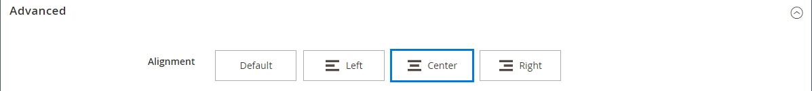

# 요소 - 분할자

_분할기_ 콘텐츠 형식을 사용하여 [[!DNL Page Builder] 단계](workspace.md#stage)에서 콘텐츠 섹션 사이에 시각적 구분으로 규칙을 추가합니다. 구분선의 선 색상, 두께 및 너비를 지정할 수 있습니다. 또한 컨테이너 테두리의 정렬, 여백 및 패딩 설정, 서식을 제어할 수 있습니다. 기본적으로 구분선은 패딩을 허용하면서 컨테이너의 전체 너비를 확장하는 헤어라인 규칙입니다.

{width="500" zoomable="yes"}

대부분의 구분선 컨테이너는 보이지 않지만 다음 예제에서는 구분선, 패딩 및 컨테이너 간의 관계를 볼 수 있도록 컨테이너를 빨간색 파선 테두리로 표시합니다. 구분선 위쪽과 아래쪽에 있는 패딩을 조정하여 요소 간의 간격을 제어할 수 있습니다.

{width="500" zoomable="yes"}

{{$include /help/_includes/page-builder-save-timeout.md}}

## 구분선 도구 상자

| 도구 | 아이콘 | 설명 |
| ---- | --------------------| ------------|
| 이동 | {width="25"} | 구분선 컨테이너를 페이지의 다른 올바른 위치로 이동합니다. |
| (레이블) | 분할자 | 현재 컨테이너를 분할자 요소로 식별합니다. |
| 설정 | {width="25"} | 구분선 및 해당 컨테이너의 속성을 변경할 수 있는 구분선 편집 페이지를 엽니다. |
| 숨기기 | {width="25"} | 구분선 컨테이너를 숨깁니다. |
| 표시 | {width="25"} | 숨겨진 분할자 컨테이너를 표시합니다. |
| 복제 | {width="25"} | 구분선 컨테이너의 복사본을 만듭니다. |
| 제거 | {width="25"} | 스테이지에서 분할자 컨테이너와 그 콘텐츠를 삭제합니다. |

{style="table-layout:auto"}

{{$include /help/_includes/page-builder-hidden-element-note.md}}

## 구분선 추가

1. [!DNL Page Builder] 패널에서 **[!UICONTROL Elements]**&#x200B;을(를) 확장하고 **[!UICONTROL Divider]** 자리 표시자를 스테이지의 행, 열 또는 탭 집합으로 드래그합니다.

   스테이지의 다른 콘텐츠 컨테이너 앞 또는 뒤에 구분선을 배치하려면 빨간색 지침을 참조하여 참조하십시오.

   {width="600" zoomable="yes"}

   다음 예제에서는 구분선이 새 텍스트 섹션의 시작 부분을 표시합니다.

   {width="500" zoomable="yes"}

1. 새 구분선의 설정을 지정하려면 다음 절차를 따르십시오.

## 구분선 설정 변경

1. 구분선 컨테이너 위로 마우스를 가져가면 도구 상자를 표시하고 _설정_({width="20"} ) 아이콘을 선택합니다.

   {width="500" zoomable="yes"}

1. 다음 방법 중 하나를 사용하여 구분선 **[!UICONTROL Line Color]**&#x200B;을(를) 변경합니다.

   - 올바른 [HTML 색 이름][1]을(를) 입력하십시오. 예: `Teal`.
   - 16진수 색상 값을 입력합니다. 예: `#008080`.

   완료되면 **[!UICONTROL Apply]**&#x200B;을(를) 클릭합니다.

   {width="600" zoomable="yes"}

1. **[!UICONTROL Line Thickness]**&#x200B;을(를) 픽셀 단위로 입력하십시오.

1. 측정 단위를 나타내려면 **[!UICONTROL Line Width]** 다음에 `px` 또는 `%`을(를) 입력하십시오.

   {width="600" zoomable="yes"}

1. 필요에 따라 _[!UICONTROL Advanced]_설정을 업데이트합니다.

   - 부모 컨테이너 내의 구분선 위치를 제어하려면 **[!UICONTROL Alignment]**&#x200B;을(를) 선택하세요.

     | 옵션 | 설명 |
     | ------ | ----------- |
     | `Default` | 현재 테마의 스타일시트에 지정된 정렬 기본 설정을 적용합니다. |
     | `Left` | 지정된 패딩을 허용하여 부모 컨테이너의 왼쪽 테두리를 따라 목록을 정렬합니다. |
     | `Center` | 지정된 패딩을 허용하여 부모 컨테이너의 중앙에 있는 목록을 정렬합니다. |
     | `Right` | 지정된 패딩을 허용하여 부모 컨테이너의 오른쪽 테두리를 따라 블록을 정렬합니다. |

     {style="table-layout:auto"}

     다음 예제에서는 구분선에 가운데 정렬을 사용하도록 옵션을 설정합니다.

     {width="600" zoomable="yes"}

   - 구분선 컨테이너의 네 면 모두에 적용된 **[!UICONTROL Border]** 스타일을 설정합니다.

     | 옵션 | 설명 |
     | ------ | ----------- |
     | `Default` | 연관된 스타일 시트에서 지정한 기본 테두리 스타일을 적용합니다. |
     | `None` | 컨테이너 테두리를 시각적으로 표시하지 않습니다. |
     | `Dotted` | 컨테이너 테두리가 점선으로 표시됩니다. |
     | `Dashed` | 컨테이너 테두리는 파선으로 표시됩니다. |
     | `Solid` | 컨테이너 테두리가 실선으로 표시됩니다. |
     | `Double` | 컨테이너 테두리는 이중 선으로 표시됩니다. |
     | `Groove` | 컨테이너 테두리는 홈이 있는 선으로 표시됩니다. |
     | `Ridge` | 컨테이너 테두리는 절선으로 표시됩니다. |
     | `Inset` | 컨테이너 테두리는 인세트 선으로 표시됩니다. |
     | `Outset` | 컨테이너 테두리는 외곽선으로 표시됩니다. |

     {style="table-layout:auto"}

   - `None` 이외의 테두리 스타일을 설정하는 경우 테두리 표시 옵션을 완료하십시오.

     | 옵션 | 설명 |
     | ------ |------------ |
     | [!UICONTROL Border Color] | 색상 견본을 선택하거나 색상 선택기를 클릭하거나 유효한 색상 이름 또는 이에 해당하는 16진수 값을 입력하여 색상을 지정합니다. |
     | [!UICONTROL Border Width] | 테두리 라인 너비의 픽셀 수를 입력합니다. |
     | [!UICONTROL Border Radius] | 테두리의 각 모퉁이를 둥글게 만드는 데 사용되는 반경의 크기를 정의하려면 픽셀 수를 입력합니다. |

     {style="table-layout:auto"}

   - (선택 사항) 컨테이너에 적용할 현재 스타일 시트의 **[!UICONTROL CSS classes]** 이름을 지정합니다.

     여러 클래스 이름은 공백으로 구분합니다.

   - 분할기 컨테이너의 외부 여백과 내부 패딩을 확인하려면 **[!UICONTROL Margins and Padding]**&#x200B;에 대한 값을 픽셀 단위로 입력하십시오.

     다이어그램에 해당 값을 입력합니다.

     | 컨테이너 영역 | 설명 |
     | -------------- | ----------- |
     | [!UICONTROL Margins] | 컨테이너의 모든 면 바깥쪽 가장자리에 적용되는 빈 공간의 양입니다. 옵션: `Top` / `Right` / `Bottom` / `Left` |
     | [!UICONTROL Padding] | 컨테이너의 모든 측면 안쪽 가장자리에 적용되는 빈 공간의 양입니다. 옵션: `Top` / `Right` / `Bottom` / `Left` |

     {style="table-layout:auto"}

1. 완료되면 **[!UICONTROL Save]**&#x200B;을(를) 클릭하여 설정을 적용하고 [!DNL Page Builder] 작업 영역으로 돌아갑니다.

   {width="500" zoomable="yes"}

## 분할자 복제

특정 설정이 있는 서식이 지정된 구분자의 경우 새 자리 표시자로 다시 시작하는 것보다 중복을 만드는 것이 더 효율적입니다.

1. 구분선 컨테이너에 마우스를 가져다 대고 도구 상자를 표시한 다음 _복제_( {width="20"}) 아이콘을 선택합니다.

   원본 바로 아래에 중복 구분선 컨테이너가 나타납니다.

   {width="500" zoomable="yes"}

1. 도구 상자를 표시하고 _이동_( {width="20"} ) 아이콘을 선택하려면 새 구분선 컨테이너 위로 마우스를 가져갑니다.

   {width="500" zoomable="yes"}

1. 빨간색 지침이 새 위치를 표시할 때까지 구분선을 선택하고 드래그합니다.

   구분선이 이동하는 동안 각 컨테이너의 위쪽 및 아래쪽 테두리가 파선으로 표시됩니다.

   {width="500" zoomable="yes"}

[1]: https://en.wikipedia.org/wiki/Web_colors

<!-- Last updated from includes: 2023-09-11 14:30:19 -->
