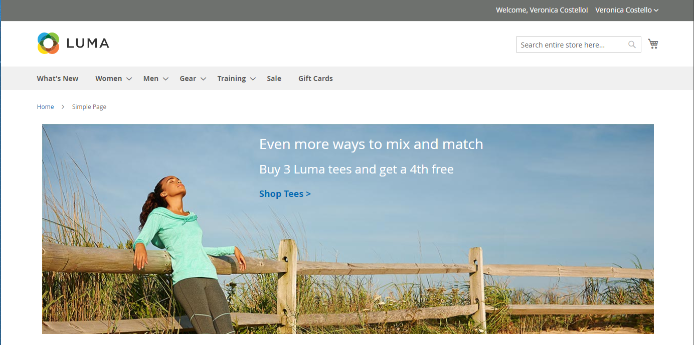
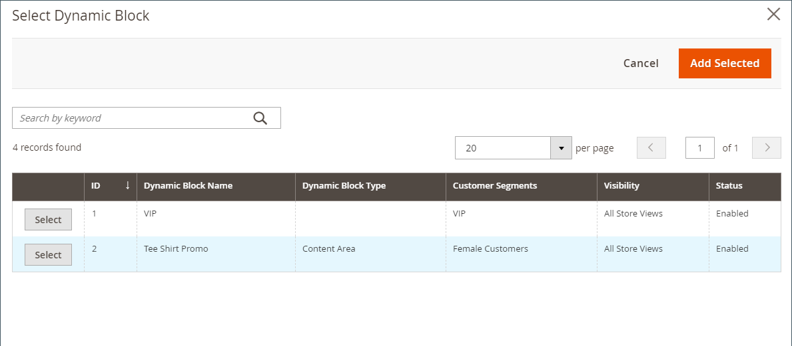
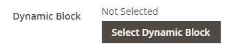

# 콘텐츠 추가 - 동적 블록

동적 블록 콘텐츠 형식을 사용하여 기존 [동적 블록](../content-design/dynamic-blocks.md)을(를) [[!DNL Page Builder] 단계](workspace.md#stage)에 추가하십시오.

{width="700" zoomable="yes"}

{{$include /help/_includes/page-builder-save-timeout.md}}

## 동적 블록 도구 상자

| 도구 | 아이콘 | 설명 |
| --------- | ------------- | ----------------- |
| 이동 | {width="25"} | 블록 컨테이너와 해당 콘텐츠를 스테이지의 다른 위치로 이동합니다. |
| 설정 | {width="25"} | 블록을 선택하고 컨테이너의 속성을 변경할 수 있는 _블록 편집_ 페이지를 엽니다. |
| 숨기기 | {width="25"} | 현재 블록 컨테이너와 해당 콘텐츠를 숨깁니다. |
| 표시 | {width="25"} | 숨겨진 블록 컨테이너와 해당 콘텐츠를 표시합니다. |
| 복제 | {width="25"} | 블록 컨테이너와 해당 콘텐츠의 복사본을 만듭니다. |
| 제거 | {width="25"} | 스테이지에서 블록 컨테이너와 해당 콘텐츠를 삭제합니다. |

{style="table-layout:auto"}

{{$include /help/_includes/page-builder-hidden-element-note.md}}

## 스테이지에 기존 동적 블록 추가

1. 대상 페이지, 블록, 제품 또는 범주의 [!DNL Page Builder] 작업 영역으로 이동합니다.

1. [!DNL Page Builder] 패널에서 **[!UICONTROL Add Content]**&#x200B;을(를) 확장하고 **[!UICONTROL Dynamic Block]** 자리 표시자를 스테이지로 드래그합니다.

   {width="600" zoomable="yes"}

1. 빈 동적 블록 컨테이너에 마우스를 가져다 대고 도구 상자를 표시하고 _설정_( {width="20"} ) 아이콘을 선택합니다.

   {width="600" zoomable="yes"}

1. _동적 블록 편집_ 페이지에서 **[!UICONTROL Select Dynamic Block]**&#x200B;을(를) 클릭하고 목록을 사용하여 블록을 선택합니다.

   {width="600" zoomable="yes"}

   목록에서 삽입할 동적 블록을 찾은 다음 **[!UICONTROL Select]**&#x200B;을(를) 클릭합니다. **[!UICONTROL Add Selected]**&#x200B;을(를) 클릭합니다.

   {width="600" zoomable="yes"}

   동적 블록 정보의 요약이 아래에 나타납니다.

   {width="600" zoomable="yes"}

1. **[!UICONTROL Template]**&#x200B;을(를) 다음 중 하나로 설정합니다.

   | 옵션 | 설명 |
   | ------ | ----------- |
   | `Dynamic Block Block Template` | 독립형 블록을 추가합니다. |
   | `Dynamic Block Inline Template` | 블록 내용을 텍스트에 삽입합니다. |

   {style="table-layout:auto"}

   {width="200"}

1. 필요에 따라 고급 설정을 완료합니다.

1. 완료되면 **[!UICONTROL Save]**&#x200B;을(를) 클릭하여 설정을 적용하고 [!DNL Page Builder] 작업 영역으로 돌아갑니다.

### 고급 설정

1. 상위 컨테이너 내에서 동적 블록의 위치를 제어하려면 **[!UICONTROL Alignment]**&#x200B;을(를) 선택하십시오.

   | 옵션 | 설명 |
   | ------ | ----------- |
   | `Default` | 현재 테마의 스타일시트에 지정된 정렬 기본 설정을 적용합니다. |
   | `Left` | 지정된 패딩을 허용하여 부모 컨테이너의 왼쪽 테두리를 따라 목록을 정렬합니다. |
   | `Center` | 지정된 패딩을 허용하여 부모 컨테이너의 중앙에 있는 목록을 정렬합니다. |
   | `Right` | 지정된 패딩을 허용하여 부모 컨테이너의 오른쪽 테두리를 따라 블록을 정렬합니다. |

   {style="table-layout:auto"}

1. 동적 블록 컨테이너의 네 면에 모두 적용되는 **[!UICONTROL Border]** 스타일을 설정합니다.

   | 옵션 | 설명 |
   | ------ | ----------- |
   | `Default` | 연관된 스타일 시트에서 지정한 기본 테두리 스타일을 적용합니다. |
   | `None` | 컨테이너 테두리를 시각적으로 표시하지 않습니다. |
   | `Dotted` | 컨테이너 테두리가 점선으로 표시됩니다. |
   | `Dashed` | 컨테이너 테두리는 파선으로 표시됩니다. |
   | `Solid` | 컨테이너 테두리가 실선으로 표시됩니다. |
   | `Double` | 컨테이너 테두리는 이중 선으로 표시됩니다. |
   | `Groove` | 컨테이너 테두리는 홈이 있는 선으로 표시됩니다. |
   | `Ridge` | 컨테이너 테두리는 절선으로 표시됩니다. |
   | `Inset` | 컨테이너 테두리는 인세트 선으로 표시됩니다. |
   | `Outset` | 컨테이너 테두리는 외곽선으로 표시됩니다. |

   {style="table-layout:auto"}

1. `None` 이외의 테두리 스타일을 설정하는 경우 테두리 표시 옵션을 완료하십시오.

   | 옵션 | 설명 |
   | ------ |------------ |
   | [!UICONTROL Border Color] | 색상 견본을 선택하거나 색상 선택기를 클릭하거나 유효한 색상 이름 또는 이에 해당하는 16진수 값을 입력하여 색상을 지정합니다. |
   | [!UICONTROL Border Width] | 테두리 라인 너비의 픽셀 수를 입력합니다. |
   | [!UICONTROL Border Radius] | 테두리의 각 모퉁이를 둥글게 만드는 데 사용되는 반경의 크기를 정의하려면 픽셀 수를 입력합니다. |

   {style="table-layout:auto"}

1. (선택 사항) 컨테이너에 적용할 현재 스타일 시트의 **[!UICONTROL CSS classes]** 이름을 지정합니다.

   여러 클래스 이름은 공백으로 구분합니다.

1. **[!UICONTROL Margins and Padding]**&#x200B;에 대한 값을 픽셀 단위로 입력하여 동적 블록 컨테이너의 외부 여백과 내부 패딩을 결정합니다.

   다이어그램에 해당 값을 입력합니다.

   | 컨테이너 영역 | 설명 |
   | -------------- | ----------- |
   | [!UICONTROL Margins] | 컨테이너의 모든 면 바깥쪽 가장자리에 적용되는 빈 공간의 양입니다. 옵션: `Top` / `Right` / `Bottom` / `Left` |
   | [!UICONTROL Padding] | 컨테이너의 모든 측면 안쪽 가장자리에 적용되는 빈 공간의 양입니다. 옵션: `Top` / `Right` / `Bottom` / `Left` |

   {style="table-layout:auto"}

## 동적 블록 컨테이너 설정 편집

1. 동적 블록 컨테이너에 마우스를 가져다 대고 도구 상자를 표시하고 _설정_( {width="20"} ) 아이콘을 선택합니다.

   {width="500" zoomable="yes"}

1. 필요한 경우 동적 블록을 변경합니다.

   - **[!UICONTROL Select Dynamic Block]**&#x200B;을(를) 클릭합니다.

     {width="20"}

   - 활성 동적 블록 목록에서 추가할 블록에 대해 **[!UICONTROL Select]**&#x200B;을(를) 클릭합니다.

1. 필요에 따라 나머지 설정을 업데이트합니다.

1. 완료되면 **[!UICONTROL Save]**&#x200B;을(를) 클릭하여 설정을 적용하고 [!DNL Page Builder] 작업 영역으로 돌아갑니다.

## 동적 블록 복제

1. 동적 블록 컨테이너에 마우스를 가져다 대고 도구 상자를 표시한 다음 _복제_({width="20"}) 아이콘을 선택합니다.

   복제본이 원본 바로 아래에 나타납니다.

   {width="500" zoomable="yes"}

1. 새 동적 블록을 다른 위치로 이동하려면 해당 컨테이너를 마우스로 가리킨 다음 도구 상자에서 _이동_( {width="20"})을 선택합니다.

1. 빨간색 지침이 새 위치에 나타날 때까지 동적 블록을 선택하고 드래그합니다.

   동적 블록이 이동하는 동안 각 컨테이너의 위쪽 및 아래쪽 테두리가 파선으로 표시됩니다.

## 스테이지에서 동적 블록 제거

1. 동적 블록 컨테이너에 마우스를 가져다 대고 도구 상자를 표시한 다음 _제거_( {width="20"} ) 아이콘을 선택합니다.

1. 확인 메시지가 표시되면 **[!UICONTROL OK]**&#x200B;을(를) 클릭합니다.

<!-- Last updated from includes: 2023-09-11 14:30:19 -->
