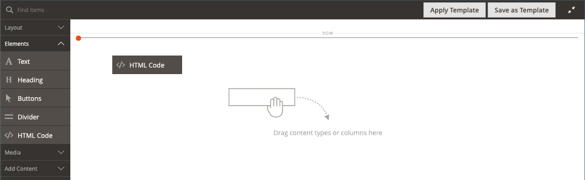

# 요소 - HTML 코드

사용 _HTML 코드_ HTML, CSS 및 JavaScript 코드 스니펫을 추가할 콘텐츠 유형 [[!DNL Page Builder] 단계](workspace.md#stage). 예를 들어 사용자 지정 HTML을 추가하고 페이지의 요소에 적용할 수 있는 CSS 클래스를 선언할 수 있습니다. 또는 서드파티 공급자로부터 받은 로고, 버튼 또는 배너에 대한 코드 조각을 추가할 수 있습니다.

## HTML 코드 도구 상자

{width="500" zoomable="yes"}

| 도구 | 아이콘 | 설명 |
| --------- | ---------- | ----------------- |
| 이동 | {width="25"} | HTML 코드 컨테이너를 페이지의 다른 올바른 위치로 이동합니다. |
| 설정 | {width="25"} | 컨테이너의 속성을 변경할 수 있는 HTML 코드 편집 페이지를 엽니다. |
| 숨기기 | {width="25"} | HTML 코드 컨테이너를 숨깁니다. |
| 표시 | {width="25"} | 숨겨진 HTML 코드 컨테이너를 표시합니다. |
| 복제 | {width="25"} | HTML 코드 컨테이너의 복사본을 만듭니다. |
| 제거 | {width="25"} | 스테이지에서 HTML 코드 컨테이너 및 해당 콘텐츠를 삭제합니다. |

{{$include /help/_includes/page-builder-hidden-element-note.md}}

## HTML 코드 추가

다음 예제에서는 를 포함하는 방법을 보여 줍니다 [Google 글꼴][1] 현재 스타일시트를 재정의하는 사용자 지정 제목 클래스를 코딩하고 선언합니다.

### 1단계: Google 글꼴 선택

1. 다음 방문: [Google 글꼴][1] 사이트에서 사용할 글꼴 모음을 선택합니다.

1. 에 포함할 생성된 코드를 복사합니다. `<head>` 섹션에 붙여 넣어 일시적으로 텍스트 편집기에 붙여 넣습니다.

   - 글꼴 코드 포함
   - CSS 규칙

1. 각 제목 클래스에 font-family 규칙을 추가하여 제목 클래스를 `<style>` 태그에 가깝게 배치하십시오.

   이 코드는에 붙여넣어집니다. [!DNL Page Builder].

   ```html
   <style>
      h1 {color: teal; font-family: 'Khand', sans-serif; }
      h2 {color: teal; font-family: 'Khand', sans-serif; }
      h3 {color: teal; font-family: 'Khand', sans-serif; }
   </style>
   ```

### 2단계: 페이지에 코드 추가

1. 다음에서 _관리자_ 상점의 사이드바 **[!UICONTROL Content]** > _[!UICONTROL Elements]_>**[!UICONTROL Pages]**.

1. 글꼴을 사용할 수 있는 페이지를 찾아 편집 모드로 엽니다.

1. 아래로 스크롤하고 를 확장합니다. **[!UICONTROL Content]** 섹션.

1. 다음에서 [!DNL Page Builder] 패널, 확장 **[!UICONTROL Elements]** 을(를) 끌어서 놓습니다. **[!UICONTROL HTML Code]** 스테이지에서 행, 열 또는 탭 세트에 대한 자리 표시자

   빨간색 가이드라인을 사용하여 행, 열 또는 탭 집합에서 다른 콘텐츠 컨테이너 앞 또는 뒤에 구분선을 배치합니다.

   {width="600" zoomable="yes"}

1. HTML 컨테이너 위로 마우스를 가져가 도구 상자를 표시하고 _설정_ ( {width="20"} ), 아이콘

1. 텍스트 상자에 준비한 포함 Google 글꼴 코드와 스타일 선언을 붙여넣습니다.

   읽기 쉽도록 몇 개의 공백을 입력하여 코드를 들여쓸 수 있습니다.

   {width="500" zoomable="yes"}

1. 필요에 따라 나머지 설정을 업데이트합니다( 참조) [HTML 코드 설정 변경](#html-settings) 을 참조하십시오.

1. 오른쪽 위 모서리에서 을(를) 클릭합니다. **[!UICONTROL Save]** 설정을 적용하고 로 돌아가려면 [!DNL Page Builder] 작업 영역.

   브라우저를 통해 페이지를 보면 새 글꼴이 렌더링됩니다.

### 3단계: 페이지 미리보기

1. 다음에서 _[!UICONTROL Currently Active]_섹션, 설정&#x200B;**[!UICONTROL Enable Page]**끝 `Yes`.

   {width="600" zoomable="yes"}

1. 오른쪽 위 모서리에서 **[!UICONTROL Save]** 화살표 및 선택 **[!UICONTROL Save & Close]**.

1. 그리드에서 페이지를 찾아 다음을 선택합니다. **[!UICONTROL View]** 다음에서 _[!UICONTROL Actions]_열.

   {width="700" zoomable="yes"}

## HTML 코드 설정 변경 {#html-settings}

1. HTML 컨테이너 위로 마우스를 가져가 도구 상자를 표시하고 _설정_ ( {width="20"} ) 아이콘.

1. 텍스트 상자에서 필요에 따라 코드를 편집합니다.

   HTML, CSS 및 JavaScript 코드가 지원됩니다. 에 속한 코드 조각 `<head>` 페이지의 섹션은 여기에 입력할 수 있습니다.

   또한 편집기는 코드에 특수 요소를 삽입하는 단추도 제공합니다.

   | 단추 | 설명 |
   | ------ | ----------- |
   | 위젯 삽입... | [HTML] 텍스트 상자의 커서 위치에 위젯을 삽입하려면 을 클릭합니다. |
   | 이미지 삽입... | HTML 텍스트 상자의 커서 위치에 업로드된 이미지 또는 갤러리의 이미지를 삽입하려면 를 클릭합니다. |
   | 변수 삽입... | 를 클릭하여 HTML 텍스트 상자의 커서 위치에 변수를 삽입합니다. |

1. 업데이트 _[!UICONTROL Advanced]_필요에 따라 설정합니다.

   - 상위 컨테이너 내의 코드 위치를 제어하려면 **[!UICONTROL Alignment]**:

     | 옵션 | 설명 |
     | ------ | ----------- |
     | `Default` | 현재 테마의 스타일시트에 지정된 정렬 기본 설정을 적용합니다. |
     | `Left` | 지정된 패딩을 허용하여 부모 컨테이너의 왼쪽 테두리를 따라 목록을 정렬합니다. |
     | `Center` | 지정된 패딩을 허용하여 부모 컨테이너의 중앙에 있는 목록을 정렬합니다. |
     | `Right` | 지정된 패딩을 허용하여 부모 컨테이너의 오른쪽 테두리를 따라 블록을 정렬합니다. |

     다음 예제에서는 렌더링된 코드 블록에 가운데 정렬을 사용하도록 옵션을 설정합니다.

     {width="600" zoomable="yes"}

   - 설정 **[!UICONTROL Border]** 코드 컨테이너의 네 면 모두에 적용된 스타일:

     | 옵션 | 설명 |
     | ------ | ----------- |
     | `Default` | 연관된 스타일 시트에서 지정한 기본 테두리 스타일을 적용합니다. |
     | `None` | 컨테이너 테두리를 시각적으로 표시하지 않습니다. |
     | `Dotted` | 컨테이너 테두리가 점선으로 표시됩니다. |
     | `Dashed` | 컨테이너 테두리는 파선으로 표시됩니다. |
     | `Solid` | 컨테이너 테두리가 실선으로 표시됩니다. |
     | `Double` | 컨테이너 테두리는 이중 선으로 표시됩니다. |
     | `Groove` | 컨테이너 테두리는 홈이 있는 선으로 표시됩니다. |
     | `Ridge` | 컨테이너 테두리는 절선으로 표시됩니다. |
     | `Inset` | 컨테이너 테두리는 인세트 선으로 표시됩니다. |
     | `Outset` | 컨테이너 테두리는 외곽선으로 표시됩니다. |

   - 테두리 스타일을 설정할 때 `None`테두리 표시 옵션을 완료합니다.

     | 옵션 | 설명 |
     | ------ |------------ |
     | [!UICONTROL Border Color] | 색상 견본을 선택하거나 색상 선택기를 클릭하거나 유효한 색상 이름 또는 이에 해당하는 16진수 값을 입력하여 색상을 지정합니다. |
     | [!UICONTROL Border Width] | 테두리 라인 너비의 픽셀 수를 입력합니다. |
     | [!UICONTROL Border Radius] | 테두리의 각 모퉁이를 둥글게 만드는 데 사용되는 반경의 크기를 정의하려면 픽셀 수를 입력합니다. |

     {style="table-layout:auto"}

   - (선택 사항) 다음 이름을 지정합니다 **[!UICONTROL CSS classes]** 현재 스타일 시트에서 컨테이너에 적용

     여러 클래스 이름은 공백으로 구분합니다.

   - 다음에 대한 값을 픽셀 단위로 입력하십시오. **[!UICONTROL Margins and Padding]** 코드 컨테이너의 외부 여백 및 내부 패딩을 결정합니다.

     다이어그램에 해당 값을 입력합니다.

     | 컨테이너 영역 | 설명 |
     | -------------- | ----------- |
     | [!UICONTROL Margins] | 컨테이너의 모든 면 바깥쪽 가장자리에 적용되는 빈 공간의 양입니다. 옵션: `Top` / `Right` / `Bottom` / `Left` |
     | [!UICONTROL Padding] | 컨테이너의 모든 측면 안쪽 가장자리에 적용되는 빈 공간의 양입니다. 옵션: `Top` / `Right` / `Bottom` / `Left` |

[1]: https://fonts.google.com/
