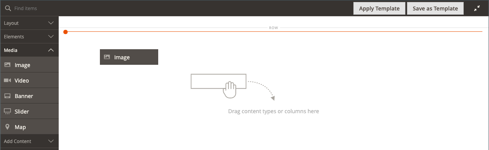
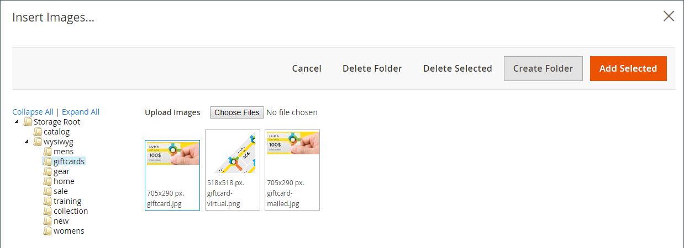
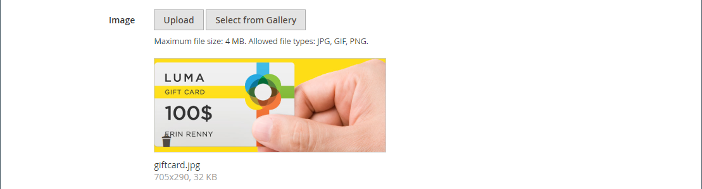
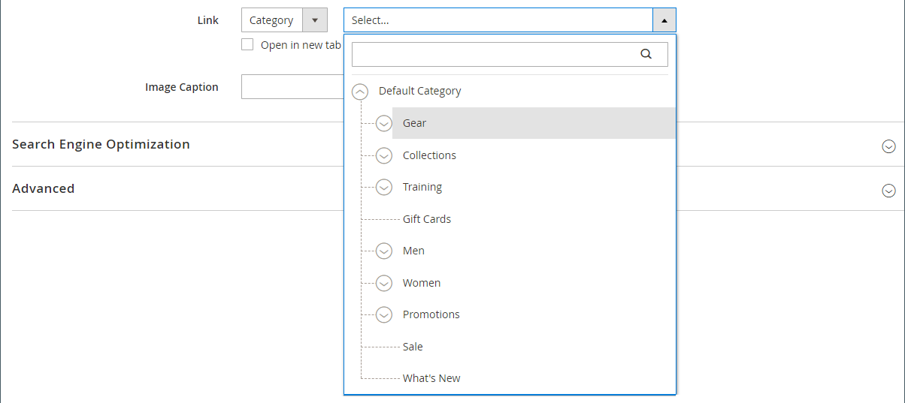

# 미디어 - 이미지

_이미지_ 콘텐츠 형식을 사용하여 JPG, GIF 또는 PNG 이미지를 [[!DNL Page Builder] 단계](workspace.md#stage)에 추가하십시오. 기본 데스크톱 이미지 외에 모바일 장치용 2차 이미지를 지정할 수 있습니다. 이미지 아래에 나타나는 캡션을 추가하고 이미지를 URL, 제품, 카테고리 또는 페이지에 연결할 수도 있습니다.

>[!TIP]
>
>[Adobe Stock 통합](../content-design/adobe-stock.md)을(를) 사용하여 [Adobe Stock](https://stock.adobe.com)에서 제공하는 수백만 개 중 적절한 자산을 찾아 저장할 수 있습니다. 갤러리에 Adobe Stock 에셋을 검색, 구체화 및 저장하는 방법에 대한 자세한 내용은 [Adobe Stock 이미지 사용](../content-design/adobe-stock-manage.md)을 참조하십시오.

{{$include /help/_includes/page-builder-save-timeout.md}}

## 이미지 도구 상자

이미지 컨테이너 위로 마우스를 가져가면 이미지 도구 상자가 나타납니다.

{width="500" zoomable="yes"}

| 도구 | 아이콘 | 설명 |
|--- |--- |--- |
| 이동 | {width="25"} | 이미지를 스테이지의 다른 위치로 이동합니다. |
| (레이블) | 이미지 | 현재 콘텐츠 컨테이너를 이미지로 식별합니다. 이미지 컨테이너 위로 마우스를 가져가면 도구 상자를 볼 수 있습니다. |
| 설정 | {width="25"} | 이미지와 컨테이너의 속성을 변경할 수 있는 _이미지 편집_ 페이지를 엽니다. |
| 숨기기 | {width="25"} | 현재 이미지를 숨깁니다. |
| 표시 | {width="25"} | 숨겨진 이미지를 표시합니다. |
| 복제 | {width="25"} | 이미지를 복사합니다. |
| 제거 | {width="25"} | 스테이지에서 이미지를 삭제합니다. |
| 새 이미지 업로드 |  | 로컬 파일 시스템의 이미지를 갤러리에 업로드합니다. |
| 갤러리에서 선택 |  | 갤러리에서 기존 이미지를 선택합니다. |

{style="table-layout:auto"}

{{$include /help/_includes/page-builder-hidden-element-note.md}}

## 이미지 추가

1. [!DNL Page Builder] 패널에서 **[!UICONTROL Media]**&#x200B;을(를) 확장하고 **[!UICONTROL Image]** 자리 표시자를 대상 컨테이너로 드래그합니다.

   행, 열 또는 탭에 이미지를 추가할 수 있습니다. 다음 예제에서는 이미지가 빈 열로 드래그됩니다.

   {width="600" zoomable="yes"}

1. 다음 방법 중 하나를 사용하여 이미지 에셋을 추가합니다.

   {width="500" zoomable="yes"}

   >[!NOTE]
   >
   >최대 파일 크기는 4MB입니다. 지원되는 파일 유형은 JPG, GIF 및 PNG입니다.

   - _**새 이미지 업로드**_: 이 메서드를 사용하여 시스템에서 새 이미지 파일을 업로드합니다.

      - **[!UICONTROL Upload Image]**&#x200B;을(를) 클릭합니다.

      - 갤러리와 대상 컨테이너에 추가할 이미지를 찾아 선택합니다.

     또는 시스템에서 이미지 파일을 드래그하여 _카메라_( {width="20"} ) 아이콘에 놓을 수도 있습니다.

   - _**기존 에셋 선택**_: 이 메서드를 사용하여 미디어 저장소/갤러리에서 기존 이미지 에셋을 선택합니다.

      - **[!UICONTROL Select from Gallery]**&#x200B;을(를) 클릭합니다.

      - 트리를 사용하여 이미지로 이동합니다.

      - 썸네일을 클릭하고 **[!UICONTROL Add Selected]**&#x200B;을(를) 클릭합니다.

        {width="600" zoomable="yes"}

   - _**Adobe Stock 이미지 검색 및 선택**_: 이 메서드를 사용하여 Adobe Stock에서 이미지를 찾습니다.

     >[!NOTE]
     >
     >이 메서드를 사용하려면 관리자에 대해 [Adobe Stock 통합](../content-design/adobe-stock.md)이(가) 구성되어 있어야 합니다.

      - **[!UICONTROL Search Adobe Stock]**&#x200B;을(를) 클릭하고 이미지를 검색합니다.

      - 미리 보기 또는 라이선스가 부여된 이미지를 갤러리에 저장합니다.

        Adobe Stock 자산 작업에 대한 자세한 내용은 [Adobe Stock 이미지 사용](../content-design/adobe-stock-manage.md)을 참조하십시오.

      - 갤러리에서 자산 축소판을 선택하고 **[!UICONTROL Add Selected]**&#x200B;을(를) 클릭합니다.

   플레이스홀더 위치의 대상 컨테이너에 이미지가 표시됩니다. 배경 이미지와 달리 이미지를 현재 컨테이너 내의 다른 위치나 다른 컨테이너로 이동할 수 있습니다.

   >[!NOTE]
   >
   >[배너](banner.md) 및 [슬라이더](slider.md) 콘텐츠 형식에는 이미지를 추가하기 위한 _이미지 업로드_ 및 _갤러리에서 선택_ 옵션도 포함됩니다.

   {width="500" zoomable="yes"}

## 이미지 설정 변경

1. 이미지 컨테이너 위로 마우스를 가져가 도구 상자를 표시하고 _설정_({width="20"}) 아이콘을 선택합니다.
파일 이름, 치수 및 파일 크기가 현재 이미지 아래에 나타납니다.

   {width="600" zoomable="yes"}

1. 현재 **[!UICONTROL Image]**&#x200B;을(를) 변경하려면 다음 중 하나를 실행하십시오.

   - _**새 이미지 업로드**_: 이 메서드를 사용하여 시스템에서 새 이미지 파일을 업로드합니다.

      - **[!UICONTROL Upload Image]**&#x200B;을(를) 클릭합니다.

      - 갤러리와 대상 컨테이너에 추가할 이미지를 찾아 선택합니다.

   - _**기존 에셋 선택**_: 이 메서드를 사용하여 미디어 저장소/갤러리에서 기존 이미지 에셋을 선택합니다.

      - **[!UICONTROL Select from Gallery]**&#x200B;을(를) 클릭합니다.

      - 트리를 사용하여 이미지로 이동합니다.

      - 썸네일을 클릭하고 **[!UICONTROL Add Selected]**&#x200B;을(를) 클릭합니다.

        {width="600" zoomable="yes"}

   - **Adobe Stock 이미지 검색 및 선택**: 이 메서드를 사용하여 Adobe Stock에서 이미지를 찾습니다.

     >[!NOTE]
     >
     >이 메서드를 사용하려면 관리자에 대해 [Adobe Stock 통합](../content-design/adobe-stock.md)이(가) 구성되어 있어야 합니다.

      - **[!UICONTROL Search Adobe Stock]**&#x200B;을(를) 클릭하고 이미지를 검색합니다.

      - 미리 보기 또는 라이선스가 부여된 이미지를 갤러리에 저장합니다.

        Adobe Stock 자산 작업에 대한 자세한 내용은 [Adobe Stock 이미지 사용](../content-design/adobe-stock-manage.md)을 참조하십시오.

      - 갤러리에서 자산 축소판을 선택하고 **[!UICONTROL Add Selected]**&#x200B;을(를) 클릭합니다.

1. **[!UICONTROL Mobile Image]**&#x200B;을(를) 추가하려면 이전 단계에서 설명한 것과 동일한 방법을 사용하여 모바일 장치에서 표시하는 데 사용할 이미지를 선택하십시오.

   {width="600" zoomable="yes"}

1. 필요한 경우 이미지에 대해 **[!UICONTROL Link]**&#x200B;을(를) 지정하십시오.

   링크는 고객이 이미지를 클릭할 때 나타나는 대상 페이지입니다. 다음 세 가지 링크 유형 중 하나를 사용할 수 있습니다.

   - **[!UICONTROL URL]** - 상대 URL 또는 정규화된 URL에 연결된 링크입니다.

   - **[!UICONTROL Product]** - 제품 이름 또는 SKU를 기반으로 대상 페이지를 식별합니다. 부분 또는 전체 이름을 기반으로 이름으로 제품을 검색합니다. 검색 결과 목록에서 제품을 선택합니다.

     {width="600" zoomable="yes"}

   - **[!UICONTROL Category]** - 대상 페이지를 범주 트리에서 특정 범주 또는 하위 범주로 식별합니다. 부분 이름 또는 전체 이름을 기반으로 범주를 검색합니다. 표시된 트리의 확장된 섹션에서 범주를 선택합니다.

     {width="600" zoomable="yes"}

   - **[!UICONTROL Page]** - 대상 페이지를 특정 콘텐츠 페이지로 식별합니다. 부분 이름 또는 전체 이름을 기반으로 페이지를 검색합니다. 검색 결과 목록에서 페이지를 선택합니다.

     {width="600" zoomable="yes"}

   방문자가 상점에서 나가지 않도록 하려면 **[!UICONTROL Open in new tab]** 확인란을 선택하십시오. 확인란의 선택을 취소하면 연결된 대상이 동일한 브라우저 탭에서 열리고, 이를 통해 방문자가 스토어에서 멀리 떨어진 곳으로 효과적으로 이동할 수 있습니다.

1. **[!UICONTROL Image Caption]**&#x200B;을(를) 추가하려면 이미지 아래에 표시할 텍스트를 입력하십시오.

   캡션의 형식은 현재 테마와 연결된 스타일시트에 의해 결정됩니다.

   캡션은 일반적으로 이미지 아래에 표시되며, 방문자 및 검색 엔진을 위한 이미지에 대한 정보를 제공합니다. 사이트를 여러 언어로 사용할 수 있는 경우 동일한 이미지를 사용할 수 있지만 캡션을 번역할 수 있습니다. HTML에서 `<figcaption>` 태그는 `<figure>` 태그의 하위 집합입니다. `<figcaption>This is the image caption</figcaption>`

1. 필요에 따라 다른 설정을 업데이트합니다.

   - [검색 엔진 최적화](#search-engine-optimization)
   - [고급](#advanced)

1. 완료되면 **[!UICONTROL Save]**&#x200B;을(를) 클릭하여 설정을 적용하고 [!DNL Page Builder] 작업 영역으로 돌아갑니다.

## 이미지 이동

1. 이미지 컨테이너 위로 마우스를 가져가 도구 상자를 표시하고 _이동_({width="20"}) 아이콘을 선택합니다.

   {width="500" zoomable="yes"}

1. 이미지를 선택하여 빨간색 지침 바로 아래의 새 위치로 드래그합니다.

   {width="500" zoomable="yes"}

## 이미지 제거

1. 이미지 컨테이너 위로 마우스를 가져가 도구 상자를 표시하고 _제거_( {width="20"} ) 아이콘을 선택합니다.

1. 확인 메시지가 표시되면 **[!UICONTROL OK]**&#x200B;을(를) 클릭합니다.

## 검색 엔진 최적화

이러한 설정에 대한 텍스트는 검색 엔진에 표시되며 페이지 색인 지정 방식을 개선합니다.

- **[!UICONTROL Alternative Text]**&#x200B;에 표시할 디지털 접근성 도구에 대한 _대체_ 텍스트 설명을 입력하십시오.

  대체 텍스트를 사용하는 것은 접근성 모범 사례이며 일부 로케일에서 법률에 의해 필수입니다. HTML에서 `alt` 특성은 `image` 태그의 하위 집합입니다. `<image title="tooltip" alt="description" src="image.jpg">`.

- **[!UICONTROL Title Attribute]**&#x200B;의 경우 마우스를 올려 놓을 때 툴팁으로 표시할 텍스트를 입력하십시오.

  검색 엔진에서 이미지를 인덱싱하는 방식을 개선하기 위해 설명하는 키워드가 풍부한 제목을 선택하는 것이 좋습니다. HTML에서 `title` 특성은 `image` 태그의 하위 집합입니다. `<image title="tooltip" alt="description" src="image.jpg">`.

## [!UICONTROL Advanced]

- 컨테이너에 추가된 이미지의 가로 위치를 제어하려면 **[!UICONTROL Alignment]**&#x200B;을(를) 선택하세요.

  | 옵션 | 설명 |
  | ------ | ----------- |
  | `Default` | 현재 테마의 스타일시트에 지정된 정렬 기본 설정을 적용합니다. |
  | `Left` | 이미지 컨테이너의 왼쪽 테두리를 따라 지정된 패딩을 허용하도록 이미지 콘텐츠를 정렬합니다. |
  | `Center` | 지정된 패딩을 허용하여 이미지 컨테이너의 가운데에 이미지 내용을 맞춥니다. |
  | `Right` | 이미지 컨테이너의 오른쪽 테두리를 따라 이미지 내용을 정렬합니다. 지정된 패딩을 허용합니다. |

  {style="table-layout:auto"}

- 이미지 컨테이너의 네 면 모두에 적용된 **[!UICONTROL Border]** 스타일을 설정합니다.

  | 옵션 | 설명 |
  | ------ | ----------- |
  | `Default` | 연관된 스타일 시트에서 지정한 기본 테두리 스타일을 적용합니다. |
  | `None` | 컨테이너 테두리를 시각적으로 표시하지 않습니다. |
  | `Dotted` | 컨테이너 테두리가 점선으로 표시됩니다. |
  | `Dashed` | 컨테이너 테두리는 파선으로 표시됩니다. |
  | `Solid` | 컨테이너 테두리가 실선으로 표시됩니다. |
  | `Double` | 컨테이너 테두리는 이중 선으로 표시됩니다. |
  | `Groove` | 컨테이너 테두리는 홈이 있는 선으로 표시됩니다. |
  | `Ridge` | 컨테이너 테두리는 절선으로 표시됩니다. |
  | `Inset` | 컨테이너 테두리는 인세트 선으로 표시됩니다. |
  | `Outset` | 컨테이너 테두리는 외곽선으로 표시됩니다. |

  {style="table-layout:auto"}

- `None` 이외의 테두리 스타일을 설정하는 경우 테두리 표시 옵션을 완료하십시오.

  {width="600" zoomable="yes"}

  | 옵션 | 설명 |
  | ------ |------------ |
  | [!UICONTROL Border Color] | 색상 견본을 선택하거나 색상 선택기를 클릭하거나 유효한 색상 이름 또는 이에 해당하는 16진수 값을 입력하여 색상을 지정합니다. |
  | [!UICONTROL Border Width] | 테두리 라인 너비의 픽셀 수를 입력합니다. |
  | [!UICONTROL Border Radius] | 테두리의 각 모퉁이를 둥글게 만드는 데 사용되는 반경의 크기를 정의하려면 픽셀 수를 입력합니다. |

  {style="table-layout:auto"}

- (선택 사항) 이미지 컨테이너에 적용할 현재 스타일 시트의 **[!UICONTROL CSS classes]** 이름을 지정합니다.

  여러 클래스 이름은 공백으로 구분합니다.

- **[!UICONTROL Margins and Padding]**&#x200B;에 대한 값을 픽셀 단위로 입력하여 이미지 컨테이너의 외부 여백과 내부 패딩을 지정합니다.

  이미지 컨테이너 다이어그램에 해당하는 각 값을 입력합니다.

  | 컨테이너 영역 | 설명 |
  | -------------- | ----------- |
  | [!UICONTROL Margins] | 컨테이너의 모든 면 바깥쪽 가장자리에 적용되는 빈 공간의 양입니다. |
  | [!UICONTROL Padding] | 컨테이너의 모든 측면 안쪽 가장자리에 적용되는 빈 공간의 양입니다. |

  {style="table-layout:auto"}
