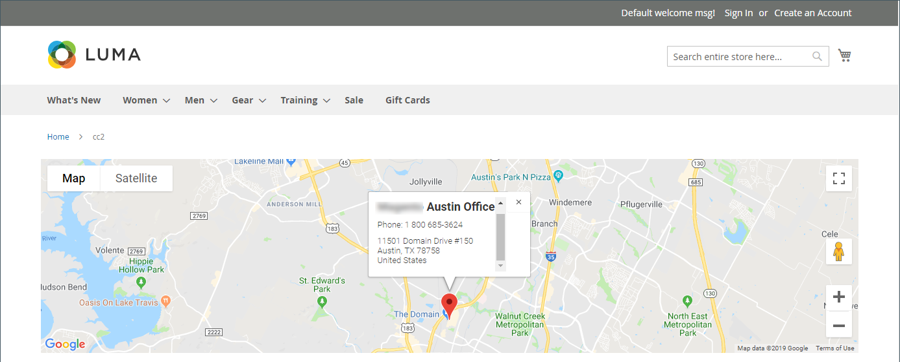
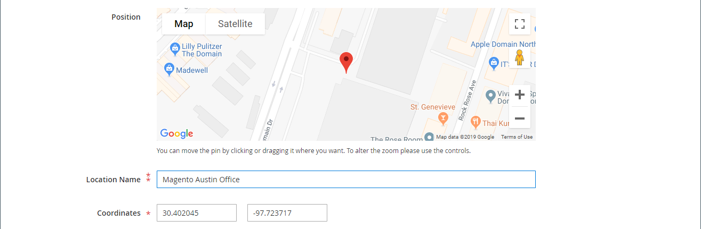
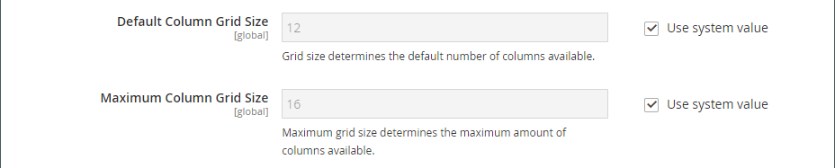

# 미디어 - 맵

_맵_ 콘텐츠 형식을 사용하여 [[!DNL Google Maps] 플랫폼][1]에서 [[!DNL Page Builder] 단계](workspace.md#stage)로의 맵을 추가하십시오. 예를 들어, 블록에 맵을 추가한 다음 [정보](../content-design/pages.md#about-us) 및 [연락처](../getting-started/store-details.md#contact-us-form) 페이지에 블록을 추가할 수 있습니다.

[!DNL Google Maps] 플랫폼을 최대한 활용하려면 맵을 사용자 지정하고, 스토어 위치를 강조 표시하고, Google [위치][2]를 사용하여 스토어에 대한 풍부한 정보를 모든 [!DNL Google Maps]에 추가할 수 있습니다.

## Google 맵 포함의 이점

1. 구매자에게 사이트에 대한 모든 범위의 정보(전화 번호, 웹 사이트, 리뷰, 별점 등)를 제공합니다.

1. Google 지도는 일반적으로 인근 명소, 공원, 레스토랑 등을 강조 표시합니다. 이 정보는 고객이 실제 위치를 결정하고 여행을 계획하는 데 도움이 됩니다.

1. 고객이 새 브라우저 창을 열고 사이트를 떠날 필요 없이 실제 스토어의 주소를 쉽게 찾을 수 있습니다.

1. 물리적 스토어 체인이 있는 경우 사이트에 Google 맵을 추가하면 강조 표시된 항목의 형태로 브랜드 인지도와 신뢰성을 높이는 데 도움이 됩니다.

{width="700" zoomable="yes"}

{{$include /help/_includes/page-builder-save-timeout.md}}

## 맵 도구 상자

맵 컨테이너 위로 마우스를 가져가면 맵 도구 상자가 나타납니다.

| 도구 | 아이콘 | 설명 |
|--- |--- |--- |
| 이동 | {width="25"} | 맵을 스테이지의 다른 위치로 이동합니다. |
| (레이블) | [!UICONTROL Map] | 현재 콘텐츠 컨테이너를 맵으로 식별합니다. 맵 컨테이너 위로 마우스를 가져가면 도구 상자를 볼 수 있습니다. |
| 설정 | {width="25"} | 맵과 컨테이너의 속성을 변경할 수 있는 맵 편집 페이지를 엽니다. |
| 숨기기 | {width="25"} | 현재 맵을 숨깁니다. |
| 표시 | {width="25"} | 숨겨진 맵을 표시합니다. |
| 복제 | {width="25"} | 맵을 복사합니다. |
| 제거 | {width="25"} | 스테이지에서 맵을 삭제합니다. |

{style="table-layout:auto"}

{{$include /help/_includes/page-builder-hidden-element-note.md}}

## 책임자에 대해 [!DNL Google Maps] 구성

맵을 추가하기 전에 먼저 [ 플랫폼의 무료 평가판을 위해 ][3]계정[!DNL Google Maps]을(를) 열어야 합니다. 무료 체험은 12개월 동안 지속되며 300달러의 크레딧이 포함됩니다. 크레딧을 소진하면 Google에서 귀하의 허가 없이 귀하의 계정에 청구하지 않습니다.

### 1단계: [!DNL Google Maps] API 키 가져오기

이미 [!DNL Google Maps] 키가 있는지 여부에 따라 다음 절차 중 하나를 사용하여 구성에 필요한 API 키를 가져옵니다. [!DNL Google Maps] 키를 설정하려면 계정에 대한 결제를 사용하도록 승인된 사이트 관리자여야 합니다. [!DNL Google Maps] Platform 계정을 설정할 준비가 되지 않았다면 이 단계를 건너뛰고 지금은 자리 표시자 맵을 사용할 수 있습니다.

1. [Google Cloud Platform Console](https://cloud.google.com/console/google/maps-apis/overview)&#x200B;(으)로 이동합니다.

1. 프로젝트 드롭다운을 클릭하고 API 키를 추가할 프로젝트를 선택하거나 만듭니다.

1. API 자격 증명을 구성하려면 [ 설명서의 ][4]지침[!DNL Google Maps]을(를) 따르십시오.

1. API 키를 클립보드에 복사합니다.

### 2단계: [!DNL Google Maps]에서 [!DNL Commerce] 구성

1. _관리자_ 사이드바에서 **[!UICONTROL Stores]** > _[!UICONTROL Settings]_>**[!UICONTROL Configuration]**(으)로 이동합니다.

1. _[!UICONTROL General]_&#x200B;아래의 왼쪽 패널에서&#x200B;**[!UICONTROL Content Management]**&#x200B;을(를) 선택합니다.

1.  **[!UICONTROL Advanced Content Tools]**&#x200B;을 확장합니다.

   {width="600" zoomable="yes"}

   콘텐츠 관리 고급 도구 구성 옵션에 대한 자세한 내용은 [구성 참조 안내서](../configuration-reference/general/content-management.md)를 참조하십시오.

1. **[!UICONTROL Google Maps API Key]**&#x200B;의 경우 1단계에서 복사한 키를 붙여넣습니다.

1. **[!UICONTROL Test Key]**&#x200B;을(를) 클릭합니다.

   키에 문제가 있는 경우 [!DNL Google Maps] 플랫폼 사이트로 돌아가 문제를 해결하십시오. 그런 다음 다시 시도하십시오.

1. 키를 확인한 후 **[!UICONTROL Save Config]**&#x200B;을(를) 클릭합니다.

## 스테이지에 맵 추가

1. [!DNL Page Builder] 작업 영역에 대한 페이지, 차단 또는 동적 블록을 엽니다.

1. [!DNL Page Builder] 패널에서 **[!UICONTROL Media]**&#x200B;을(를) 확장하고 **[!UICONTROL Map]** 자리 표시자를 스테이지로 드래그합니다.

   {width="600" zoomable="yes"}

   스토어에 대해 [!DNL Google Maps] 플랫폼이 구성된 경우 스토어 위치에 대한 맵이 나타납니다.

   ![[!DNL Google Maps]](./assets/pb-tutorial2-google-map.png){width="600" zoomable="yes"}

   스토어에 대해 [!DNL Google Maps] 플랫폼이 아직 구성되지 않은 경우 대신 자리 표시자 맵이 나타납니다.

   ![[!DNL Google Maps] 자리 표시자](./assets/pb-tutorial2-media-map-not-configured.png){width="600" zoomable="yes"}

## 사용자 정의 맵 위치 추가

1. 맵 컨테이너 위로 마우스를 가져가 도구 상자를 표시하고 _설정_( {width="20"} ) 아이콘을 선택합니다.

1. _[!UICONTROL Edit Map]_&#x200B;페이지의 오른쪽 상단 모서리에서&#x200B;**[!UICONTROL Add Location]**&#x200B;을(를) 클릭합니다.

1. 지도에서 PIN과 연결할 **[!UICONTROL Location Name]**&#x200B;을(를) 입력하십시오.

1. 사용자 지정 위치에 사용할 위치 좌표를 수집합니다.

   또는 **[!UICONTROL Position]** 상자에서 표시된 맵의 핀을 끌 수 있습니다.

   필요한 경우 새 브라우저 창에서 [[!DNL Google Maps]][5]&#x200B;(으)로 이동하여 다음 방법 중 하나를 사용하여 좌표를 가져옵니다.

   {width="600" zoomable="yes"}

   **메서드 1:** URL에서 복사

   - 왼쪽 상단 모서리에서 **[!UICONTROL Search]** 상자에 주소를 입력하고 _검색_( {width="20"} ) 아이콘을 클릭합니다.

   - URL에서 좌표를 복사하여 메모장에 붙여넣습니다.

   **메서드 2:** &quot;여기 있는 항목&quot;에서 복사

   - 맵에서 위치를 표시하는 빨간색 핀을 마우스 오른쪽 단추로 클릭하고 메뉴에서 **[!UICONTROL What's here?]**&#x200B;을(를) 선택합니다.

   - 표시된 레이블에서 좌표를 포함한 텍스트를 복사하여 메모장에 붙여넣습니다.

1. 각 **[!UICONTROL Coordinates]** 상자에 쉼표 없이 숫자를 입력하십시오.

   나머지 정보 중 맵에 사용할 수 있는 만큼만 입력할 수도 있습니다.

1. 맵 위치와 연결할 다른 모든 정보를 비교합니다.

   | 옵션 | 설명 |
   | ------ | ----------- |
   | [!UICONTROL Phone Number] | 위치의 전화 번호입니다. |
   | [!UICONTROL Street Address] | 위치의 거리 주소입니다. |
   | [!UICONTROL City] | 위치의 도시입니다. |
   | [!UICONTROL Region/State] | 위치의 지역 또는 상태입니다. |
   | [!UICONTROL Zip/Postal Code] | 위치의 ZIP 또는 우편 번호입니다. |
   | [!UICONTROL Country] | 위치의 국가입니다. |
   | [!UICONTROL Comment] | 포함할 모든 주석입니다. |

   {style="table-layout:auto"}

1. 완료되면 **[!UICONTROL Save]**&#x200B;을(를) 클릭합니다.

   새 위치는 맵과 _[!UICONTROL Edit Map]_&#x200B;페이지의 맵 위치 그리드에 나타납니다.

   ![[!DNL Page Builder] - 위치 그리드 매핑](./assets/pb-media-maps-settings-add-location-grid.png){width="600" zoomable="yes"}

## 맵 스타일 지정 {#styling}

미리 정의된 6개의 테마 중 하나를 적용하거나 사용자 지정 테마를 만들려면 [!DNL Google Maps] 플랫폼 스타일 지정 마법사를 사용하십시오. 맵 스타일 속성 또는 스타일이 지정된 맵에 대한 링크를 사용하여 JSON 파일을 생성할 수 있습니다.

### 맵 스타일 변경

1. _관리자_ 사이드바에서 **[!UICONTROL Stores]** > _[!UICONTROL Settings]_>**[!UICONTROL Configuration]**(으)로 이동합니다.

1. _[!UICONTROL General]_&#x200B;아래의 왼쪽 패널에서&#x200B;**[!UICONTROL Content Management]**&#x200B;을(를) 선택합니다.

1.  **[!UICONTROL Advanced Content Tools]**&#x200B;을 확장합니다.

1. **[!UICONTROL Google Maps Style]** 텍스트 상자에서 [맵 스타일 만들기][6]를 클릭합니다.

   이 작업은 별도의 탭에서 [[!DNL Google Maps] 플랫폼 스타일 지정 마법사][6]를 엽니다. 이 탭에서 [!DNL Google Maps] 플랫폼 프로젝트의 스타일을 정의할 수 있습니다.

1. **[!UICONTROL Create a Style]**&#x200B;을(를) 클릭하고 제공된 지침을 따릅니다.

   완료되면 **[!UICONTROL Finish]**&#x200B;을(를) 클릭합니다.

1. 완료된 스타일을 [!DNL Commerce] 구성에 추가할 수 있도록 JSON 코드 또는 URL로 내보냅니다.

   - **JSON**: 생성된 JSON 코드가 있는 상자 아래에서 **[!UICONTROL Copy JSON]**&#x200B;을(를) 클릭합니다.

   - **[!UICONTROL URL]**: 생성된 URL이 있는 상자 아래에서 **[!UICONTROL Copy URL]**&#x200B;을(를) 클릭합니다.

1. 관리자 브라우저 탭으로 돌아가서 생성된 코드 또는 URL을 **Google 맵 스타일** 상자에 붙여 넣습니다.

   URL을 사용하는 경우 `YOUR_API_KEY` 자리 표시자를 [!DNL Google Maps] API 키로 바꾸십시오. 이 URL은 스타일이 지정된 Google 맵에 연결됩니다.

1. 오른쪽 상단에서 **[!UICONTROL Save Config]**&#x200B;을(를) 클릭합니다.

### 맵 설정 변경

1. 맵 컨테이너 위로 마우스를 가져가 도구 상자를 표시하고 _설정_( {width="20"} ) 아이콘을 선택합니다.

1. 필요에 따라 기본 설정을 변경합니다.

   | 옵션 | 설명 |
   | ------ | ----------- |
   | [!UICONTROL Height] | 표시된 지도의 높이를 픽셀 단위로 지정합니다. |
   | [!UICONTROL Show Controls] | 표준 Google 맵 컨트롤이 표시되는지 여부를 결정합니다. |

   {style="table-layout:auto"}

1. 필요에 따라 _[!UICONTROL Advanced]_&#x200B;설정을 수정합니다.

   - 컨테이너에 추가된 맵 콘텐츠의 가로 위치를 제어하려면 **[!UICONTROL Alignment]**&#x200B;을(를) 선택합니다.

     | 옵션 | 설명 |
     | ------ | ----------- |
     | `Default` | 현재 테마의 스타일시트에 지정된 정렬 기본 설정을 적용합니다. |
     | `Left` | 지정된 패딩을 허용하여 맵 컨테이너의 왼쪽 테두리를 따라 콘텐츠를 정렬합니다. |
     | `Center` | 지정된 패딩을 허용하여 맵 컨테이너의 가운데에 내용을 맞춥니다. |
     | `Right` | 지정된 패딩을 허용하여 맵 컨테이너의 오른쪽 테두리를 따라 콘텐츠를 정렬합니다. |

     {style="table-layout:auto"}

   - 맵 컨테이너의 네 면 모두에 적용된 **[!UICONTROL Border]** 스타일을 설정합니다.

     | 옵션 | 설명 |
     | ------ | ----------- |
     | `Default` | 연관된 스타일 시트에서 지정한 기본 테두리 스타일을 적용합니다. |
     | `None` | 컨테이너 테두리를 시각적으로 표시하지 않습니다. |
     | `Dotted` | 컨테이너 테두리가 점선으로 표시됩니다. |
     | `Dashed` | 컨테이너 테두리는 파선으로 표시됩니다. |
     | `Solid` | 컨테이너 테두리가 실선으로 표시됩니다. |
     | `Double` | 컨테이너 테두리는 이중 선으로 표시됩니다. |
     | `Groove` | 컨테이너 테두리는 홈이 있는 선으로 표시됩니다. |
     | `Ridge` | 컨테이너 테두리는 절선으로 표시됩니다. |
     | `Inset` | 컨테이너 테두리는 인세트 선으로 표시됩니다. |
     | `Outset` | 컨테이너 테두리는 외곽선으로 표시됩니다. |

     {style="table-layout:auto"}

   - `None` 이외의 테두리 스타일을 설정하는 경우 테두리 표시 옵션을 완료하십시오.

     {width="600" zoomable="yes"}

     | 옵션 | 설명 |
     | ------ |------------ |
     | [!UICONTROL Border Color] | 색상 견본을 선택하거나 색상 선택기를 클릭하거나 유효한 색상 이름 또는 이에 해당하는 16진수 값을 입력하여 색상을 지정합니다. |
     | [!UICONTROL Border Width] | 테두리 라인 너비의 픽셀 수를 입력합니다. |
     | [!UICONTROL Border Radius] | 테두리의 각 모퉁이를 둥글게 만드는 데 사용되는 반경의 크기를 정의하려면 픽셀 수를 입력합니다. |

     {style="table-layout:auto"}

   - (선택 사항) 맵 컨테이너에 적용할 현재 스타일 시트의 **[!UICONTROL CSS classes]** 이름을 지정합니다.

     여러 클래스 이름은 공백으로 구분합니다.

   - **[!UICONTROL Margins and Padding]**&#x200B;에 대한 값을 픽셀 단위로 입력하여 맵 컨테이너의 외부 여백과 내부 패딩을 지정합니다.

     맵 컨테이너 다이어그램에 해당하는 각 값을 입력합니다.

     | 컨테이너 영역 | 설명 |
     | -------------- | ----------- |
     | [!UICONTROL Margins] | 컨테이너의 모든 면 바깥쪽 가장자리에 적용되는 빈 공간의 양입니다. |
     | [!UICONTROL Padding] | 컨테이너의 모든 측면 안쪽 가장자리에 적용되는 빈 공간의 양입니다. |

     {style="table-layout:auto"}

     >[!NOTE]
     >
     >맵 콘텐츠 유형에는 패딩을 사용할 수 없습니다.

1. 완료되면 **[!UICONTROL Save]**&#x200B;을(를) 클릭하여 설정을 적용하고 [!DNL Page Builder] 작업 영역으로 돌아갑니다.

### 격자 크기 변경

눈금 크기는 [ 단계의 ](column.md)열[!DNL Page Builder]과(와) 관련된 맵의 크기를 결정합니다. 기본적으로 맵은 너비가 12열이며 최대 16열입니다.

1. _관리자_ 사이드바에서 **[!UICONTROL Stores]** > _[!UICONTROL Settings]_>**[!UICONTROL Configuration]**(으)로 이동합니다.

1. _[!UICONTROL General]_&#x200B;아래의 왼쪽 패널에서&#x200B;**[!UICONTROL Content Management]**&#x200B;을(를) 선택합니다.

1.  **[!UICONTROL Advanced Content Tools]**&#x200B;을 확장합니다.

1. 필요에 따라 격자선 옵션을 업데이트합니다.

   >[!NOTE]
   >
   >필요한 경우 **[!UICONTROL Use system value]** 확인란의 선택을 취소하여 이러한 설정을 수정합니다.

   - **[!UICONTROL Default Column Grid Size]**&#x200B;에 그리드의 기본 크기에 대한 새 값을 입력하십시오.

   - **[!UICONTROL Maximum Column Grid Size]**&#x200B;에 기본 최대 눈금 크기에 대한 새 값을 입력하십시오.

   {width="600" zoomable="yes"}

1. 완료되면 **[!UICONTROL Save Config]**&#x200B;을(를) 클릭합니다.

[1]: https://cloud.google.com/maps-platform/
[2]: https://cloud.google.com/maps-platform/places/
[3]: https://cloud.google.com/maps-platform/user-guide/
[4]: https://developers.google.com/maps/documentation/javascript/get-api-key
[5]: https://www.google.com/maps
[6]: https://mapstyle.withgoogle.com/

<!-- Last updated from includes: 2023-09-11 14:30:19 -->
