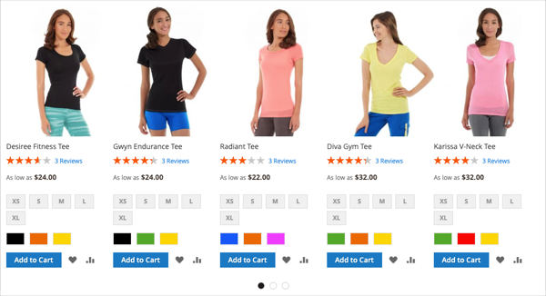
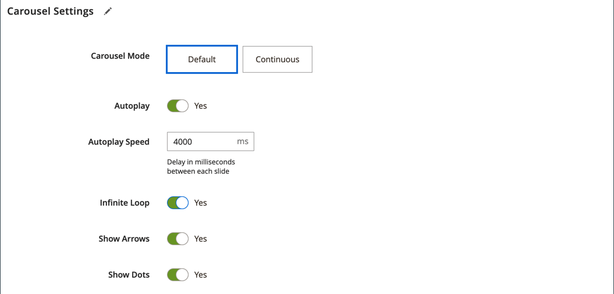

# 콘텐츠 추가 - 제품

_제품_ 콘텐츠 형식을 사용하여 눈금 또는 회전판 레이아웃을 사용하여 [[!DNL Page Builder] 단계](workspace.md#stage)에 제품 목록을 추가하십시오. [콘텐츠 추가 - 블록](block.md) 도구를 사용하여 블록을 [!DNL Page Builder] 단계에 배치한 다음 블록 내에 제품 목록을 배치합니다. 또는 제품 목록을 페이지의 행에 바로 추가할 수 있습니다.

## 제품 캐러셀 사용 지침

제품 캐러셀은 제품을 자랑할 수 있는 강력하고 매력적인 방법을 제공합니다. 이를 최대한 활용하려면 다음 지침을 권장합니다.

- 행, 탭 또는 1열 레이아웃과 같은 페이지 너비 컨테이너에 제품 회전 메뉴를 직접 추가합니다. 페이지 너비 레이아웃을 사용하면 제품을 가장 잘 반응형으로 표시할 수 있습니다. [!DNL Page Builder]은(는) 컨테이너의 너비가 아니라 페이지의 너비에 따라 표시되는 제품 수를 줄입니다.

- 제품 캐러셀을 좁은 열에 추가하지 마십시오. [!DNL Page Builder]은(는) 기본적으로 열 너비가 아닌 페이지 너비를 기준으로 표시할 제품 수를 결정합니다.

- 제품 캐러셀을 계속 자동 스크롤하려면 **[!UICONTROL Autoplay]**&#x200B;과(와) **[!UICONTROL Infinite Loop]**&#x200B;을(를) 모두 `Yes`(으)로 설정하십시오. 자동 재생이 `Yes`(으)로 설정되어 있지만 무한 루프가 `No`(으)로 설정되어 있으면 제품 목록 끝에서 자동 스크롤이 중지됩니다.

- **[!UICONTROL Carousel Mode]**&#x200B;을(를) `Continuous`(으)로 설정하여 캐러셀 내에서 한 번에 한 제품을 강조, 가운데 및 스크롤합니다. 다른 제품은 목록에 표시되지만 가운데 있는 제품을 강조하기 위해 투명합니다.

  {width="600"}

- 회전판 내에서 한 번에 최대 5개의 제품을 표시하고 위로 스크롤하려면 **[!UICONTROL Carousel Mode]**&#x200B;을(를) `Default`(으)로 설정합니다.

  {width="600"}

다음 지침은 블록에 제품 목록을 추가하는 방법을 보여줍니다. 그런 다음 [위젯](../content-design/widgets.md)을 사용하여 저장소의 특정 위치에 블록을 배치할 수 있습니다.

{{$include /help/_includes/page-builder-save-timeout.md}}

## 제품 도구 상자

| 도구 | 아이콘 | 설명 |
| --------- | ------------- | ----------------- |
| 이동 | {width="25"} | 제품 컨테이너와 해당 콘텐츠를 스테이지의 다른 위치로 이동합니다. |
| 설정 | {width="25"} | 제품 목록을 선택하고 컨테이너의 속성을 변경할 수 있는 _제품 편집_ 페이지를 엽니다. |
| 숨기기 | {width="25"} | 현재 제품 컨테이너 및 해당 콘텐츠를 숨깁니다. |
| 표시 | {width="25"} | 숨겨진 제품 컨테이너와 해당 콘텐츠를 표시합니다. |
| 복제 | {width="25"} | 제품 컨테이너 및 해당 콘텐츠의 복사본을 만듭니다. |
| 제거 | {width="25"} | 스테이지에서 제품 컨테이너 및 해당 콘텐츠를 삭제합니다. |

{style="table-layout:auto"}

{{$include /help/_includes/page-builder-hidden-element-note.md}}

## 제품 목록 블록 만들기

1. _관리자_ 사이드바에서 **[!UICONTROL Content]** > _[!UICONTROL Elements]_>**[!UICONTROL Blocks]**(으)로 이동합니다.

1. **[!UICONTROL Add New Block]**&#x200B;을(를) 클릭합니다.

1. **[!UICONTROL Block Title]** 및 **[!UICONTROL Identifier]**&#x200B;을(를) 입력하십시오.

1. 블록을 사용할 수 있는 **[!UICONTROL Store View]**&#x200B;을(를) 선택하십시오.

1. 아래로 스크롤하여 **[!UICONTROL Edit with Page Builder]** 또는 콘텐츠 미리 보기 영역 내부를 클릭하여 [!DNL Page Builder] 작업 영역을 엽니다.

1. [!DNL Page Builder] 패널에서 **[!UICONTROL Add Content]**&#x200B;을(를) 확장하고 **[!UICONTROL Products]** 자리 표시자를 스테이지로 드래그합니다.

   {width="600" zoomable="yes"}

## 제품 목록 컨테이너 구성

빈 _Products_ 컨테이너 위로 마우스를 가져가면 도구 상자를 표시하고 _설정_({width="20"}) 아이콘을 클릭합니다.

{width="500" zoomable="yes"}

다음 섹션에 따라 _설정_&#x200B;을 완료하십시오.

### 모양

1. 페이지에 제품 목록이 표시되는 방식을 결정하려면 모양 유형 중 하나를 선택합니다.

   | 유형 | 설명 |
   | ---- | ----------- |
   | 제품 격자 | 행당 5개의 제품(기본적으로)을 표시하는 표 안에 제품을 표시합니다. **[!UICONTROL Number of Products to Display]** 설정에 입력한 숫자를 표시하는 데 필요한 만큼의 행이 있습니다. |
   | 제품 회전 | 슬라이드(슬라이더라고도 함) 내의 제품을 표시합니다. 슬라이드 하나에 최대 5개의 제품이 표시됩니다.   **응답성 경고**: 이 모양을 선택하면 제품 콘텐츠 형식을 응답형 행, 탭 또는 1열 레이아웃에 직접 추가하여 작은 화면에서 각 면에 더 적은 수의 제품을 표시하는 것이 가장 좋습니다. 페이지 너비보다 좁은 콘텐츠 유형(예: 좁은 열)에 추가하면 슬라이드 하나에 화면 크기에 관계없이 컨테이너가 허용하는 것보다 더 많은 제품이 표시됩니다. |

   {style="table-layout:auto"}

   {width="300"}

   제품 캐러셀을 선택하는 경우 [캐러셀 설정](#carousel-settings)도 구성해야 합니다.

1. **[!UICONTROL Select Products By]**&#x200B;의 경우 제품 선택 방법을 선택하십시오.

   범주, SKU 또는 조건별로 제품을 선택할 수 있습니다. 이러한 옵션은 함께 사용할 수 없습니다. 예를 들어 카테고리 옵션을 선택하고 카테고리 선택기를 사용한 다음 조건 옵션으로 전환하여 일부 조건을 추가할 수 없습니다. 이 세 가지 옵션 중 _1개_&#x200B;에 대해 설정한 내용만 기준으로 제품이 선택됩니다.

   - **[!UICONTROL Category]** - 선택한 범주를 사용하는 제품을 표시하려면 이 옵션을 선택하십시오.

     {width="500"}

     이 옵션을 선택하면 **[!UICONTROL Category]** 선택기가 제공됩니다. 화살표를 클릭하고 드릴다운하여 표시할 제품 카테고리를 선택합니다. 예를 들어, [!DNL Commerce] 샘플 데이터에서 _여성 > 최상위 > 티_&#x200B;를 드릴인하고 선택하면 해당 범주에 대한 모든 제품이 표시됩니다.

     {width="500"}

   - **[!UICONTROL SKU]** - 하나 이상의 SKU를 사용하는 제품을 표시하려면 이 옵션을 선택하십시오.

     이 옵션을 선택하면 표시할 SKU의 쉼표로 구분된 목록을 입력해야 하는 **[!UICONTROL Product SKUs]** 텍스트 상자가 제공됩니다.

     {width="500"}

   - **[!UICONTROL Condition]** - 정의한 하나 이상의 조건에 따라 제품을 표시하려면 이 옵션을 선택합니다.

     이 옵션을 선택하면 제품 선택에 조건을 추가하는 데 사용할 수 있는 도구가 있습니다. 예를 들어 Gender가 Unisex로 설정된 제품만 선택할 수 있습니다.

     {width="500"}

     >[!NOTE]
     >
     >카테고리 또는 SKU 옵션을 선택하면 **[!UICONTROL Sort By]**&#x200B;의 `Position` 옵션이 제공됩니다. 이 정렬 옵션을 사용하면 제품이 카탈로그에 표시되는 순서와 동일한 순서로 나타납니다. 
     >
     >범주 옵션의 경우 위치별로 정렬하면 카탈로그에 표시된 순서와 동일한 순서로 제품이 표시됩니다. SKU 옵션의 경우 위치별로 정렬하면 **[!UICONTROL Product SKUs]** 텍스트 상자에 입력한 순서대로 제품이 표시됩니다.

1. **[!UICONTROL Sort By]**&#x200B;의 경우 목록의 제품에 대한 정렬 순서를 선택하십시오.

   | 옵션 | 설명 |
   | ------ | ----------- |
   | `Position`(범주 및 SKU 옵션만 해당) | 범주 옵션을 선택하면 위치에 카탈로그에서 해당 위치와 동일한 순서로 제품이 표시됩니다. SKU 옵션을 선택하면 위치에 제품 SKU 텍스트 상자 내의 SKU와 동일한 순서로 제품이 표시됩니다. |
   | `Newest products first` | 카탈로그에 추가된 날짜별로 제품을 정렬하고 가장 최근 시작 날짜가 포함된 제품을 먼저 표시합니다. |
   | `Oldest products first` | 카탈로그에 추가된 날짜별로 제품을 정렬하고 시작 날짜가 가장 오래된 제품을 먼저 표시합니다. |
   | `Name: A - Z` | 제품을 알파벳순으로 정렬합니다. |
   | `Name: Z - A` | 제품을 알파벳 역순으로 정렬합니다. |
   | `SKU: ascending` | SKU별로 제품을 영숫자 순서로 정렬합니다. |
   | `SKU: descending` | 제품을 SKU별로 영숫자 역순으로 정렬합니다. |
   | `Stock: low stock first` | 가장 낮은 가용 재고부터 가장 높은 재고까지 제품을 정렬합니다. |
   | `Stock: high stock first` | 사용 가능한 재고가 가장 높은 항목부터 가장 낮은 항목까지 제품을 정렬합니다. |
   | `Price: high to low` | 제품을 최고 가격에서 최저 가격으로 정렬합니다. |
   | `Price: low to high` | 제품을 가장 낮은 가격부터 가장 높은 가격까지 정렬합니다. |

   {style="table-layout:auto"}

   {width="300"}

1. 회전판 또는 눈금에 **[!UICONTROL Number of Products to Display]**&#x200B;을(를) 입력합니다.

   값은 `1`부터 `999`까지입니다. 기본값은 눈금의 경우 `5`이고 회전판의 경우 `20`입니다.

   >[!NOTE]
   >
   >카테고리, SKU 또는 조건 설정의 일부 제품이 제품 표 또는 회전판에 표시되지 않을 수 있습니다. 예를 들어 비활성화된 제품, 표시되지 않는 것으로 표시된 제품, 품절된 제품 및 다른 웹 사이트에 할당된 제품이 표시되지 않습니다.

   >[!IMPORTANT]
   >
   >구성 가능, 그룹화 및 번들(동적 가격) 제품의 가격은 관리자에 정의되지 않습니다. 따라서 이러한 제품은 가격별로 필터링된 경우 **[!UICONTROL Preview]**&#x200B;에 표시되지 않습니다. 가격으로 주문하는 경우 이러한 제품은 **[!UICONTROL Preview]**&#x200B;에서 올바르게 주문할 수 없습니다.

### 회전 메뉴 설정

1. 캐러셀 내에 제품이 표시되는 방식을 확인하려면 **[!UICONTROL Carousel Mode]**&#x200B;을(를) 선택하십시오.

   | 옵션 | 설명 |
   | ------ | ----------- |
   | `Default` | 슬라이드는 기본적으로 슬라이드당 5개의 제품을 표시하며 필요에 따라 해당 숫자를 적절히 줄입니다. |
   | `Continuous` | 회전 메뉴에 기본적으로 슬라이드당 5개의 제품이 표시되지만(제품 절반 오른쪽 및 왼쪽), 한 번에 한 제품을 무한 루프로 가운데로 맞추고 스크롤합니다. 가운데 있는 제품의 좌우에 있는 제품들은 흐리게 표시되어 가운데 있는 제품이 부각되도록 한다. |

   {style="table-layout:auto"}

   이 두 모드 간에 전환하면 다른 회전 메뉴 설정이 유지되며, **[!UICONTROL Infinite Loop]** 설정은 항상 연속 모드에서 `Yes`(으)로 설정되며 필드가 비활성화됩니다.

   {width="600" zoomable="yes"}

1. 필요한 경우 **[!UICONTROL Autoplay]** 옵션을 `Yes`(으)로 설정합니다.

   자동 재생이 활성화되면 페이지가 로드될 때 캐러셀이 자동으로 스크롤을 시작합니다. 기본 설정(`No`)을 그대로 두면 고객은 슬라이드 탐색(점 또는 화살표)을 클릭하여 각 슬라이드를 순서대로 표시해야 합니다.

   이 기능을 사용하려면 **[!UICONTROL Autoplay Speed]**&#x200B;을(를) 입력하여 각 슬라이드 사이의 지연 시간(밀리초)을 지정하십시오. 기본값은 `4000`(4초)입니다.

1. 필요한 경우 **[!UICONTROL Infinite Loop]** 옵션을 `Yes`(으)로 설정합니다.

   무한 루프가 활성화되면 페이지가 열려 있는 동안 슬라이드 쇼가 무기한 재생됩니다. 기본 설정(`No`)을 벗어나면 슬라이드 쇼는 한 번만 재생됩니다.

   >[!NOTE]
   >
   >**[!UICONTROL Infinite Loop]**&#x200B;을(를) `No`(으)로 설정하고 **[!UICONTROL Autoplay]**&#x200B;을(를) `Yes`(으)로 설정하면 표시할 제품 수가 끝날 때 자동 재생이 중지됩니다.

1. 필요한 경우 **[!UICONTROL Show Arrows]** 옵션을 `Yes`(으)로 설정합니다.

   이 옵션을 활성화하면 각 슬라이드의 왼쪽과 오른쪽에 _다음_ 및 _이전_ 탐색 화살표가 포함됩니다. 기본 설정(`No`)을 그대로 두면 슬라이드에 탐색 화살표가 표시되지 않습니다.

1. 필요한 경우 **[!UICONTROL Show Dots]** 옵션을 `No`(으)로 설정합니다.

   기본 설정(`Yes`)으로 설정하면 캐러셀 슬라이더 아래쪽에 탐색 점이 나타납니다. 이 설정을 사용하지 않으면 회전 슬라이더에 탐색 점이 표시되지 않습니다.

### 고급

1. 상위 컨테이너 내에서 제품 목록의 위치를 제어하려면 **[!UICONTROL Alignment]**&#x200B;을(를) 선택하십시오.

   | 옵션 | 설명 |
   | ------ | ----------- |
   | `Default` | 현재 테마의 스타일시트에 지정된 정렬 기본 설정을 적용합니다. |
   | `Left` | 지정된 패딩을 허용하여 부모 컨테이너의 왼쪽 테두리를 따라 목록을 정렬합니다. |
   | `Center` | 지정된 패딩을 허용하여 부모 컨테이너의 중앙에 있는 목록을 정렬합니다. |
   | `Right` | 지정된 패딩을 허용하여 부모 컨테이너의 오른쪽 테두리를 따라 목록을 정렬합니다. |

   {style="table-layout:auto"}

1. Products 컨테이너의 네 면에 모두 적용되는 **[!UICONTROL Border]** 스타일을 설정합니다.

   | 옵션 | 설명 |
   | ------ | ----------- |
   | `Default` | 연관된 스타일 시트에서 지정한 기본 테두리 스타일을 적용합니다. |
   | `None` | 컨테이너 테두리를 시각적으로 표시하지 않습니다. |
   | `Dotted` | 컨테이너 테두리가 점선으로 표시됩니다. |
   | `Dashed` | 컨테이너 테두리는 파선으로 표시됩니다. |
   | `Solid` | 컨테이너 테두리가 실선으로 표시됩니다. |
   | `Double` | 컨테이너 테두리는 이중 선으로 표시됩니다. |
   | `Groove` | 컨테이너 테두리는 홈이 있는 선으로 표시됩니다. |
   | `Ridge` | 컨테이너 테두리는 절선으로 표시됩니다. |
   | `Inset` | 컨테이너 테두리는 인세트 선으로 표시됩니다. |
   | `Outset` | 컨테이너 테두리는 외곽선으로 표시됩니다. |

   {style="table-layout:auto"}

1. `None` 이외의 테두리 스타일을 설정하는 경우 테두리 표시 옵션을 완료하십시오.

   | 옵션 | 설명 |
   | ------ |------------ |
   | [!UICONTROL Border Color] | 색상 견본을 선택하거나 색상 선택기를 클릭하거나 유효한 색상 이름 또는 이에 해당하는 16진수 값을 입력하여 색상을 지정합니다. |
   | [!UICONTROL Border Width] | 테두리 라인 너비의 픽셀 수를 입력합니다. |
   | [!UICONTROL Border Radius] | 테두리의 각 모퉁이를 둥글게 만드는 데 사용되는 반경의 크기를 정의하려면 픽셀 수를 입력합니다. |

   {style="table-layout:auto"}

1. (선택 사항) 컨테이너에 적용할 현재 스타일 시트의 **[!UICONTROL CSS classes]** 이름을 지정합니다.

   여러 클래스 이름은 공백으로 구분합니다.

1. **[!UICONTROL Margins and Padding]**&#x200B;에 대한 값을 픽셀 단위로 입력하여 제품 컨테이너의 외부 여백과 내부 패딩을 결정합니다.

   다이어그램에 해당 값을 입력합니다.

   | 컨테이너 영역 | 설명 |
   | -------------- | ----------- |
   | [!UICONTROL Margins] | 컨테이너의 모든 면 바깥쪽 가장자리에 적용되는 빈 공간의 양입니다. 옵션: `Top` / `Right` / `Bottom` / `Left` |
   | [!UICONTROL Padding] | 컨테이너의 모든 측면 안쪽 가장자리에 적용되는 빈 공간의 양입니다. 옵션: `Top` / `Right` / `Bottom` / `Left` |

## 스테이지에서 저장하고 미리 보기

오른쪽 상단 모서리에서 **[!UICONTROL Save]**&#x200B;을(를) 클릭하여 설정을 적용하고 [!DNL Page Builder] 작업 영역으로 돌아갑니다.

제품 캐러셀을 구성한 경우 다음 예제와 유사해야 합니다.

{width="600"}

이제 [위젯](../content-design/widgets.md)을 사용하여 이 블록을 스토어에 표시할 위치에 배치할 수 있습니다. 또는 [콘텐츠 추가 - 블록](block.md)을 사용하여 기존 페이지, 탭 또는 블록에 블록을 추가할 수 있습니다.

<!-- Last updated from includes: 2023-09-11 14:30:19 -->
