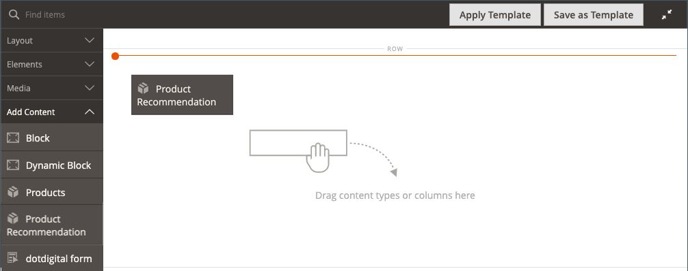

# 콘텐츠 추가 - 제품 권장 사항

_제품 권장 사항_ 콘텐츠 형식을 사용하여 CMS 페이지, 블록 또는 동적 블록의 [[!DNL Page Builder] 단계](workspace.md#stage)에 기존의 활성 [권장 사항 단위](https://experienceleague.adobe.com/en/docs/commerce/product-recommendations/admin/create)를 추가하십시오.

>[!NOTE]
>
>[!DNL Page Builder] _제품 권장 사항_ 콘텐츠 형식은 Adobe Commerce 2.4.4 이상에서 지원되며 [제품 권장 사항 메타패키지 버전 3.0.x 이상](https://commercemarketplace.adobe.com/magento-product-recommendations.html)에서 사용할 수 있습니다. 제품 권장 사항에 대한 [!DNL Page Builder] 지원을 추가하려면 [설치 정보를 참조하십시오](https://experienceleague.adobe.com/en/docs/commerce/product-recommendations/getting-started/install-configure). **이 콘텐츠 형식은 Magento Open Source에서 사용할 수 없습니다.**

{{$include /help/_includes/page-builder-save-timeout.md}}

## 제품 추천 도구 상자

| 도구 | 아이콘 | 설명 |
| --- | --| --- |
| 이동 | {width="25"} | 제품 추천 컨테이너 및 해당 콘텐츠를 스테이지의 다른 위치로 이동합니다. |
| 설정 | {width="25"} | 추천 단위를 선택하고 컨테이너의 속성을 변경할 수 있는 제품 추천 편집 페이지를 엽니다. |
| 숨기기 | {width="25"} | 현재 제품 추천 컨테이너 및 해당 콘텐츠를 숨깁니다. |
| 표시 | {width="25"} | 숨겨진 제품 추천 컨테이너 및 해당 콘텐츠를 표시합니다. |
| 복제 | {width="25"} | 제품 추천 컨테이너 및 해당 콘텐츠의 복사본을 만듭니다. |
| 제거 | {width="25"} | 스테이지에서 제품 추천 컨테이너 및 해당 콘텐츠를 삭제합니다. |

{style="table-layout:auto"}

{{$include /help/_includes/page-builder-hidden-element-note.md}}

## 기존 추천 단위 추가

1. [!DNL Page Builder] 페이지 유형에 대해 이미 [추천 단위를 만들었습니다](https://experienceleague.adobe.com/en/docs/commerce/product-recommendations/admin/create).

>[!NOTE]
>
>기본 저장소 보기에서만 [!DNL Page Builder] 페이지 유형에 대한 추천 단위를 만들 수 있습니다.

1. 편집 모드로 페이지, 블록 또는 동적 블록을 엽니다.

1. _[!UICONTROL Content]_&#x200B;섹션을 확장하고&#x200B;**[!UICONTROL Edit with Page Builder]**&#x200B;또는 콘텐츠 미리 보기 영역 내부를 클릭하여 [!DNL Page Builder] 작업 영역을 엽니다.

1. _[!UICONTROL Layout]_&#x200B;아래의 [!DNL Page Builder] 패널에서&#x200B;**[!UICONTROL Row]**&#x200B;자리 표시자를 스테이지로 드래그합니다.

1. _[!UICONTROL Add Content]_&#x200B;아래의 [!DNL Page Builder] 패널에서&#x200B;**[!UICONTROL Product Recommendation]**&#x200B;자리 표시자를 행으로 드래그합니다.

   {width="600" zoomable="yes"}

1. 다음 중 하나를 수행합니다.

   - **[!UICONTROL Edit Product Recommendation]**&#x200B;을(를) 클릭합니다.
   - 빈 컨테이너에 마우스를 가져다 대고 도구 상자를 표시한 다음 _설정_() 아이콘을 클릭합니다.

   {width="600" zoomable="yes"}

1. _[!UICONTROL Selection]_&#x200B;섹션에서&#x200B;**[!UICONTROL Select]**&#x200B;을(를) 클릭합니다.

1. 활성 제품 권장 사항 목록에서 추가할 권장 사항 단위가 있는 행을 찾고 마지막 열에서 **[!UICONTROL Select]**&#x200B;을(를) 클릭합니다.

   {width="600" zoomable="yes"}

1. 오른쪽 상단에서 **[!UICONTROL Add Selected]**&#x200B;을(를) 클릭합니다.

   선택한 제품 권장 사항의 이름이 _[!UICONTROL Edit Product Recommendation]_&#x200B;페이지의&#x200B;_[!UICONTROL Selection]_ 섹션에 나타납니다.

1. [고급 설정](#advanced-settings)에 필요한 변경 작업을 수행합니다.

   {width="600" zoomable="yes"}

1. 완료되면 다음을 수행합니다.

   - 브라우저 창을 최대화하여 작업하는 경우 작업 영역의 오른쪽 상단에 있는 _전체 화면 닫기_() 아이콘을 클릭합니다.

   - 설정을 적용하고 [!DNL Page Builder] 작업 영역으로 돌아가려면 **[!UICONTROL Save]**&#x200B;을(를) 클릭하십시오.

   스테이지로 돌아가면 제품 자리 표시자 이미지가 컨테이너에 나타납니다.

## 추천 단위 설정 편집

1. 권장 사항 단위 컨테이너 위로 마우스를 가져가면 도구 상자를 표시하고 _설정_() 아이콘을 클릭합니다.

   {width="600" zoomable="yes"}

1. [고급 설정](#advanced-settings)에 필요한 변경 작업을 수행합니다.

1. 완료되면 **[!UICONTROL Save]**&#x200B;을(를) 클릭하여 설정을 적용하고 [!DNL Page Builder] 작업 영역으로 돌아갑니다.

## 추천 단위 복제

1. 권장 사항 단위 컨테이너에 마우스를 가져다 대고 도구 상자를 표시한 다음 도구 상자에서 _복제_() 아이콘을 클릭합니다.

   복제본이 원본 바로 아래에 나타납니다.

1. 중복되는 추천 단위를 새 위치로 이동하려면 컨테이너를 마우스로 가리킨 다음 도구 상자에서 _이동_() 아이콘을 클릭합니다.

1. 빨간색 지침이 새 위치에 나타날 때까지 추천 단위를 선택하고 드래그합니다.

   각 컨테이너의 위쪽 및 아래쪽 테두리는 추천 단위가 이동하는 동안 파선으로 표시됩니다.

## 스테이지에서 추천 단위 제거

1. 권장 사항 단위 컨테이너를 마우스로 가리키고 도구 상자에서 _제거_() 아이콘을 클릭합니다.

1. 확인 메시지가 표시되면 **[!UICONTROL OK]**&#x200B;을(를) 클릭합니다.

## 고급 설정

1. 상위 컨테이너 내에서 제품 권장 사항 장치의 위치를 제어하려면 **[!UICONTROL Alignment]**&#x200B;을(를) 선택하십시오.

   | 옵션 | 설명 |
   | ------ | ----------- |
   | `Default` | 현재 테마의 스타일시트에 지정된 정렬 기본 설정을 적용합니다. |
   | `Left` | 지정된 패딩을 허용하여 부모 컨테이너의 왼쪽 테두리를 따라 단위를 정렬합니다. |
   | `Center` | 부모 컨테이너의 중앙에 있는 단위를 지정된 패딩에 대한 허용으로 맞춥니다. |
   | `Right` | 지정된 패딩을 허용하여 부모 컨테이너의 오른쪽 테두리를 따라 단위를 정렬합니다. |

   {style="table-layout:auto"}

1. 제품 추천 단원의 네 면에 모두 적용되는 **[!UICONTROL Border]** 스타일을 설정합니다.

   | 옵션 | 설명 |
   | ------ | ----------- |
   | `Default` | 연관된 스타일 시트에서 지정한 기본 테두리 스타일을 적용합니다. |
   | `None` | 장치 테두리를 시각적으로 표시하지 않습니다. |
   | `Dotted` | 장치 테두리가 점선으로 표시됩니다. |
   | `Dashed` | 단위 테두리는 파선으로 표시됩니다. |
   | `Solid` | 단위 테두리는 실선으로 표시됩니다. |
   | `Double` | 단위 테두리는 이중 선으로 표시됩니다. |
   | `Groove` | 단위 테두리는 홈이 있는 선으로 표시됩니다. |
   | `Ridge` | 단위 테두리는 절선으로 표시됩니다. |
   | `Inset` | 단위 테두리는 인세트 선으로 표시됩니다. |
   | `Outset` | 단위 테두리는 외곽선으로 표시됩니다. |

   {style="table-layout:auto"}

1. `None` 이외의 테두리 스타일을 설정하는 경우 테두리 표시 옵션을 완료하십시오.

   | 옵션 | 설명 |
   | ------ |------------ |
   | [!UICONTROL Border Color] | 색상 견본을 선택하거나 색상 선택기를 클릭하거나 유효한 색상 이름 또는 이에 해당하는 16진수 값을 입력하여 색상을 지정합니다. |
   | [!UICONTROL Border Width] | 테두리 라인 너비의 픽셀 수를 입력합니다. |
   | [!UICONTROL Border Radius] | 테두리의 각 모퉁이를 둥글게 만드는 데 사용되는 반경의 크기를 정의하려면 픽셀 수를 입력합니다. |

   {style="table-layout:auto"}

1. (선택 사항) 장치에 적용할 현재 스타일 시트의 **[!UICONTROL CSS classes]** 이름을 지정합니다.

   여러 클래스 이름은 공백으로 구분합니다.

1. **[!UICONTROL Margins and Padding]**&#x200B;에 대한 값을 픽셀 단위로 입력하여 장치의 외부 여백과 내부 패딩을 결정합니다.

   다이어그램에 해당 값을 입력합니다.

   | 컨테이너 영역 | 설명 |
   | ------ | ----------- |
   | [!UICONTROL Margins] | 장치의 모든 면 바깥쪽 가장자리에 적용되는 빈 공간의 양입니다. 옵션: `Top` / `Right` / `Bottom` / `Left` |
   | [!UICONTROL Padding] | 장치의 모든 측면 안쪽 가장자리에 적용되는 빈 공간의 양입니다. 옵션: `Top` / `Right` / `Bottom` / `Left` |

   {style="table-layout:auto"}
