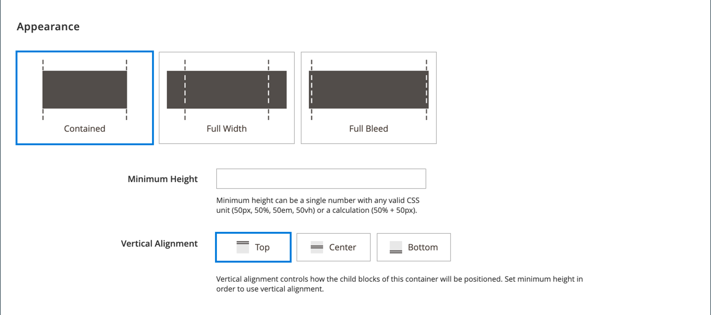
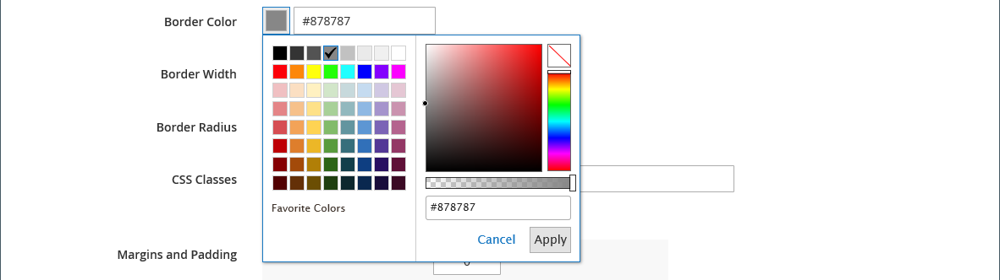

# 레이아웃 - 행

_Row_ 콘텐츠 형식을 사용하여 [[!DNL Page Builder] stage](workspace.md#stage)에 행을 추가하십시오.

{{$include /help/_includes/page-builder-save-timeout.md}}

## 행 도구 상자

행 컨테이너를 마우스로 가리키면 행 도구 상자가 나타납니다. 도구 상자에는 행 이동, 숨기기, 복제, 편집 또는 제거 옵션이 포함되어 있습니다. 설정을 선택하면 행의 모양, 배경 및 레이아웃이 결정됩니다. 추가 콘텐츠 요소를 왼쪽의 [!DNL Page Builder] 패널에서 행으로 끌 수 있습니다.

{width="600" zoomable="yes"}

| 도구 | 아이콘 | 설명 |
| --------- | ---------- | ----------- |
| 이동 | {width="25"} | 스테이지에서 다른 행을 기준으로 다른 위치로 행을 이동합니다. |
| (레이블) | [!UICONTROL Row] | 현재 콘텐츠 컨테이너를 행으로 식별합니다. 도구 상자를 보려면 컨테이너 위로 마우스를 가져갑니다. |
| 설정 | {width="25"} | 컨테이너의 속성을 변경할 수 있는 행 편집 페이지를 엽니다. |
| 숨기기 | {width="25"} | 현재 행을 숨깁니다. |
| 표시 | {width="25"} | 숨겨진 행을 표시합니다. |
| 복제 | {width="25"} | 행의 복사본을 만듭니다. |
| 제거 | {width="25"} | 스테이지에서 행 컨테이너 및 해당 콘텐츠를 삭제합니다. |

{style="table-layout:auto"}

{{$include /help/_includes/page-builder-hidden-element-note.md}}

## 행 추가

1. [!DNL Page Builder] 아래의 _[!UICONTROL Layout]_패널에서 새&#x200B;**[!UICONTROL Row]**을(를) 첫 번째 행 바로 아래에 있는 단계로 드래그합니다.

1. 행의 서식을 지정하려면 행 컨테이너 위로 마우스를 가져가 도구 상자를 표시하고 _설정_({width="20"}) 아이콘을 선택합니다.

   사용 가능한 설정 완료에 대한 자세한 내용을 보려면 다음 섹션을 사용하십시오.

   {width="600" zoomable="yes"}

## 행 설정 변경

1. 행 컨테이너 위로 마우스를 가져가 도구 상자를 표시하고 _설정_( {width="20"} ) 아이콘을 선택합니다.

   {width="600" zoomable="yes"}

1. 사용 가능한 설정 업데이트에 대한 자세한 내용을 보려면 다음 섹션을 사용하십시오.

1. 완료되면 **[!UICONTROL Save]**&#x200B;을(를) 클릭하여 설정을 적용하고 [!DNL Page Builder] 작업 영역으로 돌아갑니다.

## 모양

_모양_ 설정을 사용하여 콘텐츠가 행에 표시되는 방식을 결정합니다.

{width="600" zoomable="yes"}

- 컨텐트 영역의 컨테이너 및 너비와 관련하여 배경색 및/또는 배경 이미지가 표시되는 방식을 결정하려면 정렬을 선택합니다.

  | 옵션 | 설명 |
  | ------ | ----------- |
  | [!UICONTROL Contained] | 배경색 또는 이미지는 테마로 정의된 최대 페이지 너비로 제한됩니다. |
  | [!UICONTROL Full Width] | 테마에 의해 정의된 최대 페이지 너비로 콘텐츠를 제한합니다. 배경색 및/또는 이미지는 제한되지 않으며, 행의 전체 폭을 확장합니다. |
  | [!UICONTROL Full Bleed] | 컨텐츠 및 배경 이미지 및/또는 색상은 제한되지 않으며 행의 전체 폭을 확장합니다. 전체 도련은 레이아웃을 지원하는 [테마](../content-design/themes.md)에서만 사용할 수 있습니다. |

  {style="table-layout:auto"}

- 행의 **[!UICONTROL Minimum Height]**&#x200B;을(를) 입력하십시오. 이 값은 유효한 CSS 단위(예: `100px`, `50%`, `50em`, `100vh`) 또는 계산(예: `100vh - 237px`)이 있는 숫자일 수 있습니다.

  예를 들어 페이지의 전체 높이를 늘리기 위해 행의 최소 높이를 설정할 수 있으므로 전체 페이지 배경 이미지 및 비디오에 대한 매력적인 옵션을 제공합니다.

- **[!UICONTROL Vertical Alignment]** 설정을 선택하여 행에 추가된 모든 콘텐츠 컨테이너(위쪽, 가운데 또는 아래쪽)를 정렬합니다.

## 배경

행의 배경 표시를 정의하는 데 여러 가지 옵션이 있습니다. 단순한 색상이나 배경 이미지를 적용하고 보다 정교한 효과를 관리할 수 있습니다.

### 배경색

색상 견본을 선택하거나, 색상 선택기를 클릭하거나, 유효한 색상 이름이나 이에 해당하는 16진수 값을 입력하여 배경색을 지정합니다. 이 설정은 행의 배경색을 결정합니다. 색상의 불투명도를 조정할 수도 있습니다.

{width="200"}

다음 세 가지 방법 중 하나로 값을 설정할 수 있습니다.

- 미리 정의된 색상 이름(예: `White`)
- 색상에 대한 16진수 색상 값(예: `#ffffff`)
- 불투명도 비율이 있는 색상의 rgba 값(예: `rgba(255, 255, 255, 0.75)`)

색상을 선택하려면 _색상 없음_ 상자의 왼쪽에 있는 견본을 클릭합니다.

{width="600" zoomable="yes"}

색상 상자를 클릭하여 색상 선택기를 다시 열면 슬라이더 아래의 상자에 현재 빨강, 녹색, 파랑 및 알파 값(rgba)이 표시됩니다. 마지막 숫자는 현재 불투명도 비율을 소수점으로 나타냅니다. 슬라이더를 사용하여 불투명도를 조정하거나 원하는 십진수 값을 입력할 수 있습니다.

{width="600" zoomable="yes"}

>[!NOTE]
>
>[!DNL Page Builder]은(는) 불투명도가 다양한 배경을 만드는 데 사용할 수 있는 배경 이미지에서 투명도 레이어 또는 _알파 채널_&#x200B;도 지원합니다.

### [!UICONTROL Background Type]

배경 유형은 이미지 또는 비디오일 수 있습니다. [!DNL Page Builder]은(는) 기본적으로 `Image`이고 다양한 이미지 설정을 표시합니다. `Video`을(를) 선택하면 [!DNL Page Builder]에서 이미지 설정을 비디오 설정으로 바꿉니다. 두 배경 유형은 다음과 같이 설명되어 있습니다.

{width="200"}

### 이미지 유형 설정

_[!UICONTROL Background Type]_을(를) `Image`(으)로 설정하는 경우 다음 설정을 사용하여 배경 이미지 표시를 정의합니다.

{width="600" zoomable="yes"}

- **[!UICONTROL Background Image]** - 필요한 경우 제공된 도구를 사용하여 행에 적용할 배경 이미지를 선택하십시오.

  | 옵션 | 설명 |
  | ------ | ----------- |
  | [!UICONTROL Upload] | 로컬 컴퓨터의 이미지 파일을 갤러리로 업로드한 다음 행의 배경 이미지로 적용합니다. |
  | [!UICONTROL Select from Gallery] | 갤러리에서 기존 이미지를 행의 배경 이미지로 선택하라는 메시지가 표시됩니다. |
  | {width="25"} | 이미지를 카메라 타일로 드래그하거나 로컬 파일 시스템에서 이미지를 검색할 수 있습니다. |

  {style="table-layout:auto"}

- **[!UICONTROL Background Mobile Image]** - 필요한 경우 동일한 도구를 사용하여 모바일 장치에서 표시하는 데 사용할 다른 배경 이미지를 선택하십시오.

- **[!UICONTROL Background Size]** - 이 옵션을 설정하여 행의 너비와 관련하여 배경 이미지의 크기 조절 방법을 결정합니다.

  | 옵션 | 설명 |
  | ------ | ----------- |
  | `Cover` | 배경 이미지는 행의 전체 너비를 포함합니다. |
  | `Contain` | 배경 이미지는 컨텐츠 영역의 너비로 제한됩니다. |
  | `Auto` | 현재 스타일 시트의 크기를 적용합니다. |

  {style="table-layout:auto"}

  {width="250"}

- **[!UICONTROL Background Position]** - 이 옵션을 설정하여 배경 이미지가 행을 기준으로 고정되는 방법을 결정합니다.

  | 고정점 | 위치 |
  | ------ | ----------- |
  | `Top` | 왼쪽/가운데/오른쪽 |
  | `Center` | 왼쪽/가운데/오른쪽 |
  | `Bottom` | 왼쪽/가운데/오른쪽 |

  {style="table-layout:auto"}

  고정점은 지정된 배경 위치의 행에 이미지를 첨부하는 누름 핀과 같습니다.

- **[!UICONTROL Background Attachment]** - 스크롤 페이지와 관련하여 배경 이미지가 어떻게 이동하는지 확인하려면 첨부 파일 형식을 설정하십시오.

  | 옵션 | 설명 |
  | ------ | ----------- |
  | `Scroll` | 첨부된 배경 이미지는 페이지가 스크롤될 때 아래로 이동하도록 동기화됩니다. 스크롤 속도를 제어하려면 Parallax Background 를 사용합니다. |
  | `Fixed` | (모바일에서는 사용할 수 없음) 컨테이너가 이미지를 스크롤하고 지정된 배경 위치에서 고정되므로 배경 이미지가 이동하지 않습니다. |

  {style="table-layout:auto"}

- **[!UICONTROL Background Repeat]** - `Yes`(으)로 설정하여 배경 이미지를 반복하여 행의 사용 가능한 공간을 채웁니다.

### 비디오 유형 설정

_배경 유형_&#x200B;을(를) `Video`(으)로 설정하는 경우 다음 설정을 사용하여 배경 이미지 표시를 정의합니다.

- **[!UICONTROL Video URL]** - 올바른 비디오 URL을 입력하십시오. 유효한 비디오 URL은 다음에 대한 링크일 수 있습니다.

   - YouTube 비디오: `https://youtu.be/CoDhMRUUjeI`
   - Vimeo 비디오: `https://vimeo.com/190156113`
   - 올바른 비디오 파일(`.mp4`개 권장): `https://myvideos.com/spiral.mp4`

  {width="300"}

- **[!UICONTROL Overlay Color]** - 비디오에 투명 색조를 적용할 색상을 선택합니다.

- **[!UICONTROL Infinite Loop]** - 비디오를 한 번 재생하고 중지하려면 `No`(으)로 설정합니다. 이 옵션이 `Yes`(기본값)으로 설정되면 비디오가 무한 루프로 반복됩니다.

- **[!UICONTROL Lazy Load]** - 표시되지 않더라도 페이지에서 비디오를 로드하려면 `No`(으)로 설정합니다. 이 옵션을 `Yes`(기본값)로 설정하면 화면에 표시되는 경우에만 원본에서 비디오가 로드됩니다.

- **[!UICONTROL Play Only When Visible]** - 표시 여부에 관계없이 비디오가 로드된 후 바로 재생을 시작하려면 `No`(으)로 설정합니다. 이 옵션이 `Yes`(기본값)으로 설정되면 비디오가 표시될 때만 재생됩니다.

- **[!UICONTROL Fallback Image]** - 필요한 경우 비디오가 로드되기 전에 화면에 표시할 이미지를 지정하고 비디오가 어떤 이유로 로드되지 않는 경우 지정합니다.

## 시차 배경

페이지 스크롤과 관련하여 스크롤하는 배경 이미지 또는 비디오의 속도를 제어하려면 다음 옵션을 사용합니다. 배경은 몰입감을 만들기 위해 더 천천히 스크롤하도록 설정할 수 있습니다.

- **시차 배경 사용**&#x200B;을(를) `Yes`(으)로 설정합니다.
- **시차 속도**&#x200B;를 `-1.0`에서 `2.0` 사이의 10진수 값으로 입력하십시오.

{width="600" zoomable="yes"}

## 고급

- 행에 추가되는 콘텐츠 컨테이너의 가로 위치를 제어하려면 **[!UICONTROL Alignment]**&#x200B;을(를) 선택합니다.

  | 옵션 | 설명 |
  | ------ | ----------- |
  | `Default` | 현재 테마의 스타일시트에 지정된 정렬 기본 설정을 적용합니다. |
  | `Left` | 지정된 패딩을 허용하여 행 컨테이너의 왼쪽 테두리를 따라 컨텐츠 컨테이너를 정렬합니다. |
  | `Center` | 지정된 패딩을 허용하여 내용 컨테이너를 행 컨테이너의 가운데에 맞춥니다. |
  | `Right` | 지정된 패딩을 허용하여 행 컨테이너의 오른쪽 테두리를 따라 콘텐츠 컨테이너를 정렬합니다. |

  {style="table-layout:auto"}

- 행 컨테이너의 네 면 모두에 적용되는 **[!UICONTROL Border]** 스타일을 설정합니다.

  | 옵션 | 설명 |
  | ------ | ----------- |
  | `Default` | 연관된 스타일 시트에서 지정한 기본 테두리 스타일을 적용합니다. |
  | `None` | 컨테이너 테두리를 시각적으로 표시하지 않습니다. |
  | `Dotted` | 컨테이너 테두리가 점선으로 표시됩니다. |
  | `Dashed` | 컨테이너 테두리는 파선으로 표시됩니다. |
  | `Solid` | 컨테이너 테두리가 실선으로 표시됩니다. |
  | `Double` | 컨테이너 테두리는 이중 선으로 표시됩니다. |
  | `Groove` | 컨테이너 테두리는 홈이 있는 선으로 표시됩니다. |
  | `Ridge` | 컨테이너 테두리는 절선으로 표시됩니다. |
  | `Inset` | 컨테이너 테두리는 인세트 선으로 표시됩니다. |
  | `Outset` | 컨테이너 테두리는 외곽선으로 표시됩니다. |

  {style="table-layout:auto"}

- `None` 이외의 테두리 스타일을 설정하는 경우 테두리 표시 옵션을 완료하십시오.

  {width="600" zoomable="yes"}

  | 옵션 | 설명 |
  | ------ |------------ |
  | [!UICONTROL Border Color] | 색상 견본을 선택하거나 색상 선택기를 클릭하거나 유효한 색상 이름 또는 이에 해당하는 16진수 값을 입력하여 색상을 지정합니다. |
  | [!UICONTROL Border Width] | 테두리 라인 너비의 픽셀 수를 입력합니다. |
  | [!UICONTROL Border Radius] | 테두리의 각 모퉁이를 둥글게 만드는 데 사용되는 반경의 크기를 정의하려면 픽셀 수를 입력합니다. |

  {style="table-layout:auto"}

  다음 예제의 행에는 테두리 반경이 15입니다.

  {width="500"}

- (선택 사항) 행 컨테이너에 적용할 현재 스타일 시트의 **[!UICONTROL CSS classes]** 이름을 지정합니다.

  여러 클래스 이름은 공백으로 구분합니다.

- **[!UICONTROL Margins and Padding]**&#x200B;에 대한 값을 픽셀 단위로 입력하여 행의 바깥쪽 여백과 안쪽 여백을 지정합니다.

  행 컨테이너 다이어그램에 해당하는 각 값을 입력합니다.

  | 컨테이너 영역 | 설명 |
  | -------------- | ----------- |
  | [!UICONTROL Margins] | 컨테이너의 모든 면 바깥쪽 가장자리에 적용되는 빈 공간의 양입니다. 옵션: `Top` / `Right` / `Bottom` / `Left` |
  | [!UICONTROL Padding] | 컨테이너의 모든 측면 안쪽 가장자리에 적용되는 빈 공간의 양입니다. 옵션: `Top` / `Right` / `Bottom` / `Left` |

  {style="table-layout:auto"}

  {width="600" zoomable="yes"}

<!-- Last updated from includes: 2023-09-11 14:30:19 -->
