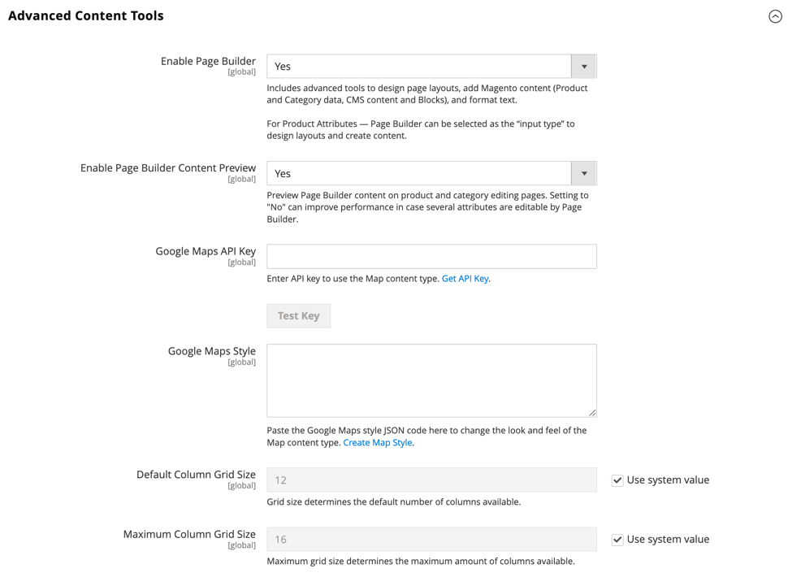
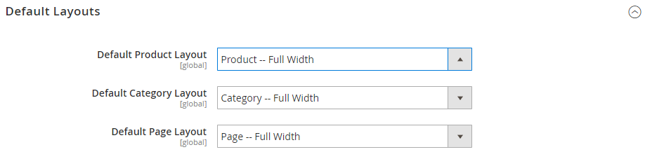

# [!DNL Page Builder] 설정

구성에서 사용하도록 설정된 경우 [!DNL Page Builder]은(는) CMS 페이지, 블록 및 동적 블록에 대한 기본 콘텐츠 만들기 도구입니다. 또한 _[!UICONTROL Enable Advanced CMS]_단추는 범주 및 제품에 대한 옵션으로 [!DNL Page Builder]을(를) 제공합니다. 제품, 카테고리 및 CMS 페이지에 사용할 기본 [페이지 레이아웃](../content-design/page-layout.md)을 선택할 수도 있습니다. [!DNL Page Builder]은(는) WYSIWYG [editor](../content-design/editor.md)을(를) 사용하는 뉴스레터 콘텐츠에 사용할 수 없습니다.

>[!NOTE]
>
>설치 시 [!DNL Page Builder]은(는) [!UICONTROL Mask for Meta Description] 구성 필드에 대한 기본 설정을 재정의합니다. 값이 `{{name}} {{description}}`에서 `{{name}}`(으)로 변경되었습니다.
> >이 설정에 액세스하려면 [!UICONTROL Stores] > _[!UICONTROL Settings]_> [!UICONTROL Configuration]&#x200B;(으)로 이동하여 [!UICONTROL Catalog]을(를) 확장하고 아래의 [!UICONTROL Catalog]을(를) 선택하십시오. [!UICONTROL Mask for Meta Description] 필드는 [!UICONTROL Product Fields Auto-generation] 섹션에 있습니다.

>[!NOTE]
>
>[!UICONTROL Edit with Page Builder] 단추를 보고 Page Builder를 사용하려면 관리자가 [역할 범위](../systems/permissions-user-roles.md)에 대해 [!UICONTROL Content] 권한을 가지고 있어야 합니다.

콘텐츠 관리 고급 도구 구성 옵션에 대한 자세한 내용은 [_구성 참조 안내서_](../configuration-reference/general/content-management.md)&#x200B;를 참조하십시오.

## [!DNL Page Builder] 구성

1. _관리자_ 사이드바에서 **[!UICONTROL Stores]** > _[!UICONTROL Settings]_>**[!UICONTROL Configuration]**(으)로 이동합니다.

1. _[!UICONTROL General]_아래의 왼쪽 패널에서&#x200B;**[!UICONTROL Content Management]**을(를) 선택합니다.

1.  **[!UICONTROL Advanced Content Tools]**&#x200B;을(를) 확장하고 **[!UICONTROL Enable Page Builder]**&#x200B;이(가) `Yes`(으)로 설정되어 있는지 확인합니다.

   {width="600" zoomable="yes"}

1. [!DNL Google Maps]을(를) 설정할 준비가 되었으면 다음을 수행하십시오.

   - 필요한 경우 [API 키 가져오기](https://developers.google.com/maps/documentation/javascript/get-api-key) 지침을 따른 다음 **[!UICONTROL Google Maps API Key]**&#x200B;을(를) 복사하여 붙여 넣으십시오.

   - **[!UICONTROL Google Maps Style]**&#x200B;을(를) 변경하려면 [[!DNL Google Maps] API 스타일 지정 마법사](https://mapstyle.withgoogle.com/)에서 생성된 JSON 코드를 붙여 넣으십시오.

   >[!NOTE]
   >
   >[!DNL Page Builder] 콘텐츠에서 [!DNL Google Maps]을(를) 사용하는 방법에 대한 자세한 내용은 [미디어 - 맵](map.md)을 참조하십시오.

1. [!DNL Page Builder] 열 그리드의 지침 수를 구성하려면 다음을 수행합니다.

   - **[!UICONTROL Default Column Grid Size]**&#x200B;의 경우 그리드에 표시할 기본 열 수를 입력합니다.

   - **[!UICONTROL Maximum Column Grid Size]**&#x200B;의 경우 그리드에서 사용할 수 있는 열 수를 가장 많이 입력합니다.

   >[!NOTE]
   >
   >[!DNL Page Builder] 콘텐츠로 작업할 때 열 그리드를 사용하는 방법에 대한 자세한 내용은 [레이아웃 - 열](column.md)을 참조하십시오.

1. 완료되면 **[!UICONTROL Save Config]**&#x200B;을(를) 클릭합니다.

## 기본 레이아웃 구성

1. _관리자_ 사이드바에서 **[!UICONTROL Stores]** > _[!UICONTROL Settings]_>**[!UICONTROL Configuration]**(으)로 이동합니다.

1. _[!UICONTROL General]_아래의 왼쪽 패널에서&#x200B;**[!UICONTROL Web]**을(를) 선택합니다.

1.  **[!UICONTROL Default Layouts]**&#x200B;을(를) 확장하고 다음을 수행합니다.

   {width="600" zoomable="yes"}

   웹 구성 옵션에 대한 자세한 내용은 [_구성 참조 안내서_](../configuration-reference/general/web.md#default-layouts)&#x200B;를 참조하십시오.

   - 제품 페이지에 사용할 **[!UICONTROL Default Product Layout]**&#x200B;을(를) 선택하십시오.

   - 범주 페이지에 사용할 **[!UICONTROL Default Category Layout]**&#x200B;을(를) 선택하십시오.

   - CMS 페이지에 사용할 **[!UICONTROL Default Page Layout]**&#x200B;을(를) 선택하십시오.

1. 완료되면 **[!UICONTROL Save Config]**&#x200B;을(를) 클릭합니다.

## [!DNL Page Builder] 사용 안 함

>[!NOTE]
>
>[!DNL Page Builder]을(를) 사용하지 않도록 설정하면 고급 콘텐츠 도구가 WYSIWYG [editor](../content-design/editor.md)(으)로 대체되며, 이로 인해 상점 앞에 표시 오류가 발생할 수 있습니다. 이전에 [!DNL Page Builder]을(를) 사용하여 만든 콘텐츠를 관리자가 편집할 수 없습니다.

1. _관리자_ 사이드바에서 **[!UICONTROL Stores]** > _[!UICONTROL Settings]_>**[!UICONTROL Configuration]**(으)로 이동합니다.

1. _[!UICONTROL General]_아래의 왼쪽 패널에서&#x200B;**[!UICONTROL Content Management]**을(를) 선택합니다.

1.  **[!UICONTROL Advanced Content Tools]**&#x200B;을(를) 확장하고 **[!UICONTROL Enable Page Builder]**&#x200B;을(를) `No`(으)로 설정합니다.

1. 확인 메시지가 표시되면 **[!UICONTROL Turn Off]**&#x200B;을(를) 클릭합니다.

1. 완료되면 **[!UICONTROL Save Config]**&#x200B;을(를) 클릭합니다.

1. 메시지가 표시되면 잘못된 캐시를 [새로 고침](../systems/cache-management.md)합니다.
