# 미디어 - 슬라이더

_Slider_ 콘텐츠 형식을 사용하여 [[!DNL Page Builder] stage](workspace.md#stage)에 이미지 슬라이드 쇼를 추가하십시오. 갤러리나 제품 카탈로그에서 새로운 이미지를 업로드하거나 기존 이미지를 선택할 수 있습니다. 슬라이더는 자동으로 재생되도록 설정하거나 탐색 단추를 사용하여 수동으로 제어할 수 있습니다. 슬라이더를 특정 프로모션과 연결하려면 [동적 블록](dynamic-block.md)을(를) 참조하십시오.

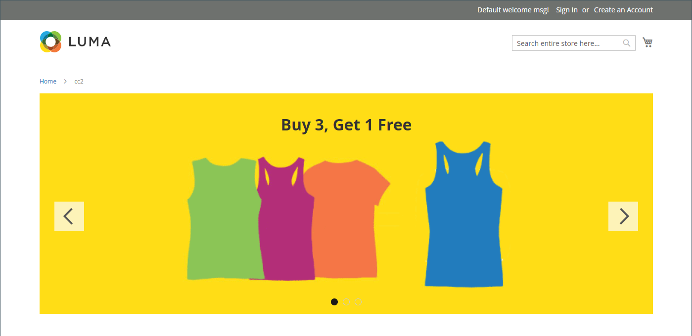{width="700" zoomable="yes"}

{{$include /help/_includes/page-builder-save-timeout.md}}

## 툴박스

Slider 콘텐츠 유형을 사용하여 작업하는 경우 개별 슬라이드와 하나 이상의 슬라이드가 들어 있는 슬라이더 컨테이너를 추가하고 편집합니다. 각 슬라이드에는 [!DNL Page Builder] 단계에서 슬라이드를 디자인하는 데 사용하는 도구 상자가 있습니다.

## 개별 슬라이드 도구 상자

{width="500" zoomable="yes"}

| 도구 | 아이콘 | 설명 |
|--- |--- |--- |
| 이동 | {width="25"} | 슬라이드를 슬라이더의 다른 위치로 이동합니다. |
| (레이블) | 슬라이드 번호 | 현재 슬라이드의 수를 식별합니다. |
| 설정 | {width="25"} | 현재 슬라이드의 속성을 변경할 수 있는 _[!UICONTROL Edit Slide]_페이지를 엽니다. |
| 복제 | {width="25"} | 현재 슬라이드를 복사합니다. |
| 제거 | {width="25"} | 슬라이더에서 현재 슬라이드를 삭제합니다. |

{style="table-layout:auto"}

## 슬라이더 도구 상자

| 도구 | 아이콘 | 설명 |
|--- |--- |--- |
| 이동 | {width="25"} | 슬라이더를 스테이지의 다른 위치로 이동합니다. |
| (레이블) | [!UICONTROL Slider] | 슬라이더 컨테이너를 식별합니다. |
| 설정 | {width="25"} | 비디오 및 컨테이너의 속성을 변경할 수 있는 _[!UICONTROL Edit Slider]_페이지를 엽니다. |
| 숨기기 | {width="25"} | 현재 슬라이더를 숨깁니다. |
| 표시 | {width="25"} | 숨겨진 슬라이더를 표시합니다. |
| 복제 | {width="25"} | 슬라이더를 복사합니다. |
| 제거 | {width="25"} | 스테이지에서 슬라이더를 삭제합니다. |

{style="table-layout:auto"}

{{$include /help/_includes/page-builder-hidden-element-note.md}}

## 개별 슬라이드 추가

1. 슬라이더를 배치할 페이지, 블록 또는 동적 블록을 열고 **[!UICONTROL Content]** 섹션을 확장합니다.

1. [!DNL Page Builder] 패널에서 **[!UICONTROL Media]**&#x200B;을(를) 확장하고 **[!UICONTROL Slider]** 자리 표시자를 스테이지의 행, 열 또는 탭으로 드래그합니다.

   다음 예제에서는 행의 배경색이 노란색(`#fffd16`)입니다.

   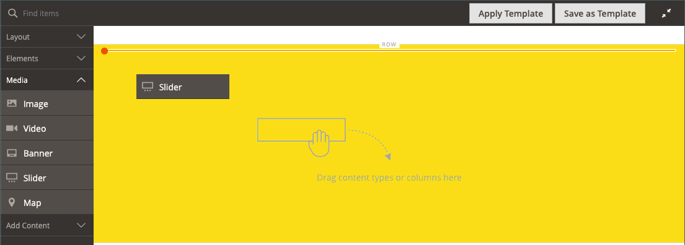{width="600" zoomable="yes"}

   슬라이더 컨테이너는 단 하나의 빈 슬라이드로 스테이지에 표시됩니다.

1. 슬라이더 컨테이너를 클릭하여 [텍스트 편집기](../content-design/editor.md)를 표시하고 첫 번째 슬라이드의 내용을 입력합니다.

   [콘텐츠](#content) 설정을 사용하여 보다 복잡한 배너 콘텐츠를 포함할 수도 있습니다.

1. 슬라이더 하단에 있는 탐색 점을 클릭하여 개별 슬라이드의 도구 상자를 표시하고 _설정_( {width="20"} ) 아이콘을 선택합니다.

   슬라이더에는 두 개의 도구 상자가 있습니다. 맨 아래에 있는 슬라이드 도구 상자를 사용하고 있는지 확인합니다.

1. 필요에 따라 다음 섹션에 따라 설정을 완료합니다.

   - [[!UICONTROL Appearance]](#appearance)
   - [[!UICONTROL Background]](#background)
   - [[!UICONTROL Content]](#content)
   - [[!UICONTROL Search Engine Optimization]](#seo)
   - [[!UICONTROL Advanced]](#advanced)

1. 완료되면 **[!UICONTROL Save]**&#x200B;을(를) 클릭하여 설정을 적용하고 [!DNL Page Builder] 작업 영역으로 돌아갑니다.

## 슬라이드 추가

다음 섹션에서는 개별 슬라이드로 시작하고 특정 제품에 대한 기능과 링크를 제공하는 반응형 슬라이더를 만드는 일련의 단계에 대해 설명합니다. 개별 슬라이드가 없는 경우 앞의 지침에 따라 개별 슬라이드를 스테이지에 추가합니다.

슬라이드를 추가하려면 다음 방법 중 하나 또는 조합을 사용합니다.

### 방법 1: 기존 슬라이드 복제

필요한 설정으로 이미 구성된 슬라이드를 복제하여 시간을 절약할 수 있습니다.

1. 슬라이드 아래 탐색 점을 클릭하여 도구 상자를 표시하고 _복제_({width="20"} ) 아이콘을 선택합니다.

   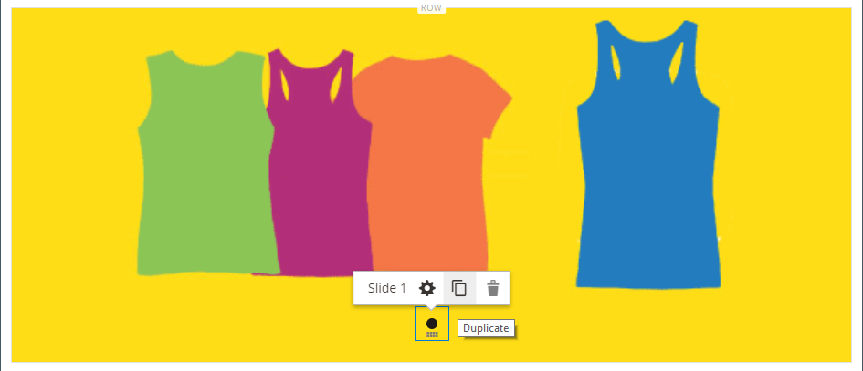{width="500" zoomable="yes"}

1. 새 슬라이드의 탐색 점을 클릭하고 도구 상자를 표시하고 _설정_( {width="20"} ) 아이콘을 선택합니다.

1. 필요에 따라 다음 섹션에 따라 설정을 수정합니다.

   - [[!UICONTROL Appearance]](#appearance)
   - [[!UICONTROL Background]](#background)
   - [[!UICONTROL Content]](#content)
   - [[!UICONTROL Advanced]](#advanced)

1. 완료되면 **[!UICONTROL Save]**&#x200B;을(를) 클릭하여 설정을 적용하고 [!DNL Page Builder] 작업 영역으로 돌아갑니다.

### 방법 2: 새 빈 슬라이드 추가

1. 상단의 슬라이더 컨테이너 위로 마우스를 가져가면 도구 상자를 표시하고 _추가_( {width="20"}) 아이콘을 선택합니다.

   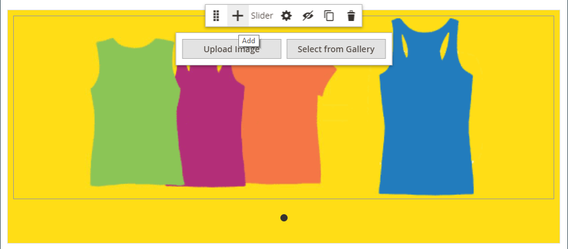{width="500" zoomable="yes"}

   고유한 탐색 점과 도구 상자가 있는 새 빈 슬라이드가 슬라이더에 추가되어 스테이지에 표시됩니다.

   {width="500" zoomable="yes"}

1. 새 슬라이드의 탐색 점을 클릭하고 도구 상자를 표시하고 _설정_( {width="20"} ) 아이콘을 선택합니다.

1. 필요에 따라 다음 섹션에 따라 설정을 수정합니다.

   - [[!UICONTROL Appearance]](#appearance)
   - [[!UICONTROL Background]](#background)
   - [[!UICONTROL Content]](#content)
   - [[!UICONTROL Advanced]](#advanced)

1. 완료되면 오른쪽 상단의 **[!UICONTROL Save]**&#x200B;을(를) 클릭하여 _[!UICONTROL Edit Slide]_페이지를 닫습니다.

### 슬라이드에 위젯 추가

다음 단계를 사용하여 [!DNL Page Builder] 단계의 슬라이드에 [위젯 유형](../content-design/widgets.md#widget-types)을(를) 추가할 수 있습니다.

1. 슬라이드에 표시할 [위젯을 만듭니다](../content-design/widget-create.md).

1. 슬라이더를 배치할 페이지, 블록 또는 동적 블록을 열고 **[!UICONTROL Content]** 섹션을 확장합니다.

1. [!DNL Page Builder] 패널에서 **[!UICONTROL Media]**&#x200B;을(를) 확장하고 **[!UICONTROL Slider]** 자리 표시자를 스테이지의 행, 열 또는 탭으로 드래그합니다.

1. 슬라이더 컨테이너를 클릭하여 [텍스트 편집기](../content-design/editor.md) 도구 모음을 표시하고 _위젯 삽입_( {width="20"} ) 아이콘을 클릭합니다.

1. 필요한 **[!UICONTROL Widget Type]**&#x200B;을(를) 선택하십시오.

1. 위젯 유형에 따라 다르게 설정을 지정합니다

   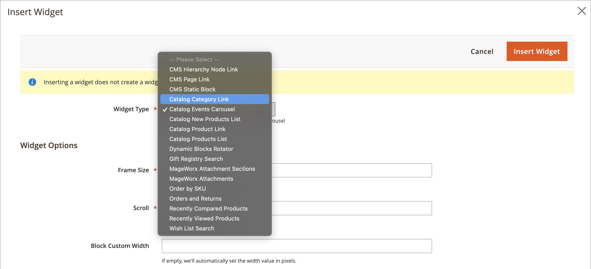{width="600" zoomable="yes"}

1. 완료되면 오른쪽 상단의 **[!UICONTROL Insert Widget]**&#x200B;을(를) 클릭합니다.

1. 필요에 따라 다른 설정을 수정합니다.

1. 완료되면 오른쪽 상단의 **[!UICONTROL Save]**&#x200B;을(를) 클릭합니다.

   {width="600" zoomable="yes"}

### 각 슬라이드 보기

각 슬라이드를 스테이지에 표시하려면 현재 표시된 슬라이드 아래의 다음 점을 클릭합니다.

{width="500" zoomable="yes"}

이전 예의 슬라이드에는 텍스트 편집기에서 추가한 배경 이미지, 투명 모바일 이미지 및 인라인 이미지가 있습니다. 이 기술은 배경 이미지를 끄고 더 작은 인라인 이미지만 표시하여 모바일 장치에서 잘 작동합니다. 이 예의 제품 슬라이드에는 다음과 같은 추가 설정이 있습니다.

| 옵션 | 예제 설정 |
|--- |--- |
| [!UICONTROL Appearance] | `Collage Right` |
| [!UICONTROL Background Color] | `#ffffff`(흰색) |
| [!UICONTROL Background Image] | 이 슬라이드의 이미지는 제품 페이지에서 저장되었으며 갤러리에 업로드되었습니다. |
| [!UICONTROL Mobile Background Image] | 모바일 배경 이미지는 10픽셀 정사각형인 투명 이미지입니다. 모바일에 빈 이미지를 사용하면 표준 배경 이미지가 보이지 않는 이미지로 효과적으로 교체됩니다. |
| [!UICONTROL Background Size] | `Auto` |
| [!UICONTROL Message Text] | 삽입 이미지가 40%로 조정된 `Minerva LumaTech&trade; V-Tee`(가운데 정렬)(가운데 정렬) |
| [!UICONTROL Link] | `Product` |
| [!UICONTROL Show Button] | `Always` |
| [!UICONTROL Button Text] | `Buy Now` |
| [!UICONTROL Show Overlay] | `Never Show` |
| [!UICONTROL Alignment] | `Center`(단추를 정렬하기 위해) |
| [!UICONTROL Border] | `Solid` |
| [!UICONTROL Border Color] | `#000000`(검정) |
| [!UICONTROL Border Width] | `1 px` |

{style="table-layout:auto"}

## 개별 슬라이드 설정 변경

1. 스테이지에서 슬라이더 표시를 변경하고 변경할 슬라이드를 봅니다.

1. 개별 슬라이드 도구 상자에서 _설정_( {width="20"}) 아이콘을 선택하고 필요에 따라 다음 섹션에 따라 설정을 완료합니다.

1. 오른쪽 상단 모서리에서 **[!UICONTROL Save]**&#x200B;을(를) 클릭하여 설정을 적용하고 [!DNL Page Builder] 작업 영역으로 돌아갑니다.

### [!UICONTROL Appearance]

1. 다음 슬라이드 배치 유형 중 하나를 선택합니다.

   | 유형 | 설명 |
   | ---- | ----------- |
   | `Poster` | 슬라이드 내용을 슬라이더 컨테이너에 가운데로 맞춥니다. 오버레이를 사용하는 경우 슬라이더의 전체 너비를 확장합니다. |
   | `Collage Left` | 슬라이드 컨테이너의 왼쪽에 있는 정의된 영역에 슬라이드 내용을 배치합니다. 오버레이는 사용되는 경우 정의된 영역만 포함합니다. |
   | `Collage Center` | 슬라이드 컨테이너를 중심으로 정의된 영역에 슬라이드 내용을 배치합니다. 오버레이는 사용되는 경우 정의된 영역만 포함합니다. |
   | `Collage Right` | 슬라이드 컨테이너의 오른쪽에 있는 정의된 영역에 슬라이드 내용을 배치합니다. 오버레이는 사용되는 경우 정의된 영역만 포함합니다. |

   {style="table-layout:auto"}

   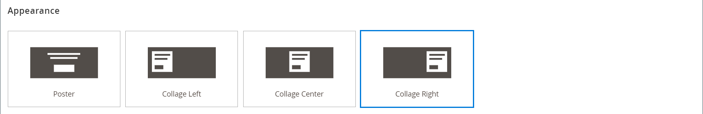{width="600" zoomable="yes"}

1. **[!UICONTROL Slide Name]** 입력.

   편집 모드로 작업하는 경우 슬라이드 이름이 탐색 점 위에 도구 설명으로 나타납니다. 슬라이드 이름이 상점 앞에 표시되지 않습니다.

   {width="500" zoomable="yes"}

1. 슬라이드의 **[!UICONTROL Minimum Height]**&#x200B;을(를) 입력하십시오.

   최소 높이는 유효한 CSS 단위(예: `100px`, `50%`, `50em`, `100vh`) 또는 계산(예: `100vh - 237px`)이 있는 숫자일 수 있습니다.

   예를 들어, 페이지의 전체 높이를 포함하도록 슬라이드의 최소 높이를 설정한 다음 배경 이미지와 비디오를 사용하여 매력적인 디자인 옵션을 선택할 수 있습니다.

   >[!NOTE]
   >
   >슬라이드를 페이지의 전체 높이(100vh)로 설정하면 슬라이드가 들어 있는 슬라이더도 슬라이드의 높이를 수용할 수 있도록 페이지의 전체 높이를 늘립니다.

## [!UICONTROL Background]

슬라이드의 배경 표시를 정의하는 데 여러 가지 옵션이 있습니다. 단순한 색상이나 배경 이미지를 적용하고 보다 정교한 효과를 관리할 수 있습니다.

### [!UICONTROL Background Color]

색상 견본을 선택하거나 색상 선택기를 클릭하거나 유효한 색상 이름 또는 이에 해당하는 16진수 값을 입력하여 배경색을 지정합니다. 이 설정은 행의 배경색을 결정합니다. 색상의 불투명도를 조정할 수도 있습니다.

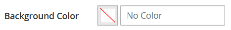{width="200"}

다음 세 가지 방법 중 하나로 값을 설정할 수 있습니다.

- 미리 정의된 색상 이름(예: `White`)
- 색상에 대한 16진수 색상 값(예: `#ffffff`)
- 불투명도 비율이 있는 색상의 rgba 값(예: `rgba(255, 255, 255, 0.75)`)

색상을 선택하려면 _색상 없음_ 상자의 왼쪽에 있는 견본을 클릭합니다.

{width="600" zoomable="yes"}

색상 상자를 클릭하여 색상 선택기를 다시 열면 슬라이더 아래의 상자에 현재 빨강, 녹색, 파랑 및 알파 값(rgba)이 표시됩니다. 마지막 숫자는 현재 불투명도 비율을 소수점으로 나타냅니다. 슬라이더를 사용하여 불투명도를 조정하거나 원하는 십진수 값을 입력할 수 있습니다.

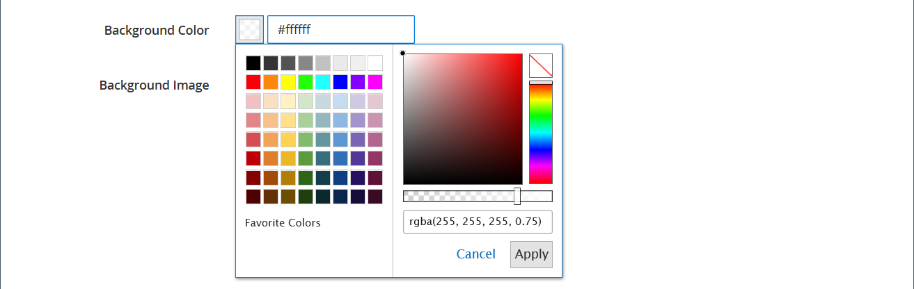{width="600" zoomable="yes"}

>[!NOTE]
>
>[!DNL Page Builder]은(는) 불투명도가 다양한 배경을 만드는 데 사용할 수 있는 배경 이미지에서 투명도 레이어 또는 _알파 채널_&#x200B;도 지원합니다.

### [!UICONTROL Background Type]

배경 유형은 이미지 또는 비디오일 수 있습니다. [!DNL Page Builder]은(는) 기본적으로 `Image`이고 다양한 이미지 설정을 표시합니다. `Video`을(를) 선택하면 [!DNL Page Builder]에서 이미지 설정을 비디오 설정으로 바꿉니다. 두 배경 유형 설정은 다음 섹션에 설명되어 있습니다.

{width="400"}

### 이미지 유형 설정

_[!UICONTROL Background Type]_을(를) `Image`(으)로 설정하는 경우 다음 설정을 사용하여 배경 이미지 표시를 정의합니다.

{width="600" zoomable="yes"}

- **[!UICONTROL Background Image]** - 필요한 경우 제공된 도구를 사용하여 배너에 적용할 배경 이미지를 선택하십시오.

  | 도구 | 설명 |
  | ---- | ----------- |
  | [!UICONTROL Upload] | 이미지 파일을 로컬 컴퓨터에서 갤러리로 업로드한 다음 배너의 배경 이미지로 적용합니다. |
  | [!UICONTROL Select from Gallery] | 갤러리에서 기존 이미지를 배너의 배경 이미지로 선택하라는 메시지가 표시됩니다. |
  | {width="25"} | 이미지를 카메라 타일로 드래그하거나 로컬 파일 시스템에서 이미지를 검색할 수 있습니다. |

  {style="table-layout:auto"}

- **[!UICONTROL Background Mobile Image]** - 필요한 경우 동일한 도구를 사용하여 모바일 장치에서 표시하는 데 사용할 다른 배경 이미지를 선택하십시오.

- **[!UICONTROL Background Size]** - 배너의 너비를 기준으로 배경 이미지의 크기 조정 방법 선택:

  | 옵션 | 설명 |
  | ------ | ----------- |
  | `Cover` | 배경 이미지는 배너의 전체 너비를 포함합니다. |
  | `Contain` | 배경 이미지는 컨텐츠 영역의 너비로 제한됩니다. |
  | `Auto` | 현재 스타일 시트의 크기를 적용합니다. |

  {style="table-layout:auto"}

  {width="400"}

- **[!UICONTROL Background Position]** - 배너를 기준으로 배경 이미지가 고정되는 방법 선택:

  | 고정점 | 위치 |
  | ------------ | -------- |
  | `Top` | 왼쪽/가운데/오른쪽 |
  | `Center` | 왼쪽/가운데/오른쪽 |
  | `Bottom` | 왼쪽/가운데/오른쪽 |

  {style="table-layout:auto"}

  기준점은 지정된 배경 위치에서 배너에 이미지를 첨부하는 누름 핀과 같습니다.

- **[!UICONTROL Background Repeat]** - 배경 이미지를 반복하여 공백을 채우려면 이 설정 `Yes`을(를) 변경하십시오.

### 비디오 유형 설정

_배경 유형_&#x200B;을(를) `Video`(으)로 설정하는 경우 다음 설정을 사용하여 배경 이미지 표시를 정의합니다.

- **[!UICONTROL Video URL]** - 올바른 비디오 URL을 입력하십시오. 유효한 비디오 URL은 다음에 대한 링크일 수 있습니다.

   - YouTube 비디오: `https://youtu.be/CoDhMRUUjeI`
   - Vimeo 비디오: `https://vimeo.com/190156113`
   - 올바른 비디오 파일(`.mp4`개 권장): `https://myvideos.com/spiral.mp4`

  {width="500"}

- **[!UICONTROL Overlay Color]** - 비디오에 투명 색조를 적용할 색상을 선택합니다.

- **[!UICONTROL Infinite Loop]** - 비디오를 한 번 재생하고 중지하려면 `No`(으)로 설정합니다. 이 옵션이 `Yes`(기본값)으로 설정되면 비디오가 무한 루프로 반복됩니다.

- **[!UICONTROL Lazy Load]** - 표시되지 않더라도 페이지에서 비디오를 로드하려면 `No`(으)로 설정합니다. 이 옵션을 `Yes`(기본값)로 설정하면 화면에 표시되는 경우에만 원본에서 비디오가 로드됩니다.

- **[!UICONTROL Play Only When Visible]** - 표시 여부에 관계없이 비디오가 로드된 후 바로 재생을 시작하려면 `No`(으)로 설정합니다. 이 옵션이 `Yes`(기본값)으로 설정되면 비디오가 표시될 때만 재생됩니다.

- **[!UICONTROL Fallback Image]** - 필요한 경우 비디오가 로드되기 전에 화면에 표시할 이미지를 지정하고 비디오가 어떤 이유로 로드되지 않는 경우 지정합니다.

## [!UICONTROL Content]

스테이지에서 직접 또는 설정을 변경할 때 슬라이드 내용을 수정할 수 있습니다. 이 설정은 슬라이드 링크, 단추 및 오버레이와 같은 보다 복잡한 콘텐츠 기능을 제공합니다. 콘텐츠의 위치는 [Appearance](#appearance) 배치 설정을 반영합니다.

### 스테이지의 간단한 콘텐츠

1. 자리 표시자 또는 기존 텍스트를 클릭하고 슬라이드에 표시할 새 텍스트를 입력합니다.

   편집기 도구 모음이 텍스트 상자 위에 나타납니다.

1. 편집기 도구 모음을 사용하여 텍스트를 입력하고 서식을 지정할 수 있을 뿐만 아니라 링크, 이미지 및 위젯과 같은 요소를 삽입할 수 있습니다.

   {width="500" zoomable="yes"}

### 설정의 복잡한 콘텐츠

1. 슬라이더 하단에 있는 탐색 점을 클릭하여 개별 슬라이드의 도구 상자를 표시하고 _설정_( {width="20"} ) 아이콘을 선택합니다.

1. _[!UICONTROL Content]_섹션에서 슬라이드와 함께 표시할&#x200B;**[!UICONTROL Message Text]**을(를) 입력합니다.

1. _[!UICONTROL Content]_섹션까지 아래로 스크롤한 다음&#x200B;**[!UICONTROL Message Text]**편집기를 사용하여 배너 텍스트를 입력하고 서식을 지정합니다.

   텍스트 링크, 이미지 및 위젯과 같은 요소를 삽입할 수도 있습니다.

1. 편집기 도구 모음을 사용하여 필요에 따라 텍스트 서식을 지정합니다.

   이 예제의 첫 번째 슬라이드에는 배경 이미지가 있지만 메시지 텍스트는 없습니다. 슬라이더 위에 있는 `Buy 3 Get 1 Free` 텍스트는 텍스트 컨테이너에 있습니다(나중에 추가됨).

1. 필요한 경우 슬라이드에 대해 **[!UICONTROL Link]**&#x200B;을(를) 지정하십시오.

   링크는 고객이 슬라이드 영역을 클릭할 때 나타나는 대상 페이지입니다. 다음 세 가지 링크 유형 중 하나를 사용할 수 있습니다.

   - **[!UICONTROL URL]** - 상대 URL 또는 정규화된 URL에 연결된 링크입니다.

   - **[!UICONTROL Product]** - 제품 이름 또는 SKU를 기반으로 대상 페이지를 식별합니다. 부분 또는 전체 이름을 기반으로 이름으로 제품을 검색합니다. 검색 결과 목록에서 제품을 선택합니다.

     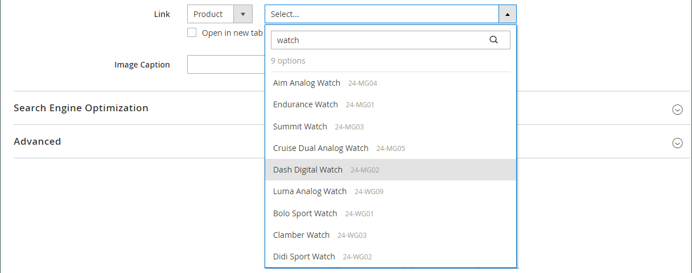{width="600" zoomable="yes"}

   - **[!UICONTROL Category]** - 대상 페이지를 범주 트리에서 특정 범주 또는 하위 범주로 식별합니다. 부분 이름 또는 전체 이름을 기반으로 범주를 검색합니다. 표시된 트리의 확장된 섹션에서 범주를 선택합니다.

     {width="600" zoomable="yes"}

   - **[!UICONTROL Page]** - 대상 페이지를 특정 콘텐츠 페이지로 식별합니다. 부분 이름 또는 전체 이름을 기반으로 페이지를 검색합니다. 검색 결과 목록에서 페이지를 선택합니다.

     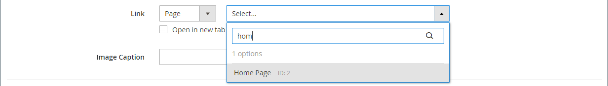{width="600" zoomable="yes"}

   

   2.4.1 릴리스부터 [!DNL Page Builder]은(는) 상점에서의 표시 문제로 인해 더 이상 중첩 텍스트 내에서 슬라이드 및 링크 연결을 지원하지 않습니다. _[!UICONTROL Message Text]_에서 링크를 사용하는 경우 _[!UICONTROL Link]_ 옵션을 구성할 수 없습니다. 전체 슬라이드에 하나의 링크를 사용하려는 경우 텍스트에서 모든 링크를 제거할 수 있습니다.

   {width="300"}
   

   방문자가 상점에서 나가지 않도록 하려면 **[!UICONTROL Open in new tab]** 확인란을 선택하십시오. 확인란의 선택을 취소하면 연결된 대상이 동일한 브라우저 탭에서 열리고, 이를 통해 방문자가 스토어에서 멀리 떨어진 곳으로 효과적으로 이동할 수 있습니다.

1. 필요한 경우 고객에게 링크를 따라가라는 메시지를 표시하는 버튼을 추가합니다.

   슬라이드 _모양_ 위치는 텍스트 아래에 하나의 링크나 단추를 배치합니다. 추가하려는 링크 또는 버튼의 속성을 완료합니다.

   {width="600" zoomable="yes"}

   >[!NOTE]
   >
   >배너에 [block](block.md)을(를) 추가하여 여러 단추 또는 링크를 사용할 수도 있습니다. 충돌을 방지하려면 모든 링크 또는 단추를 별도의 블록에 두고 링크 또는 단추를 배너에 바로 추가하지 마십시오.

   - **[!UICONTROL Show Button]**&#x200B;을(를) 다음 중 하나로 설정합니다.

     | 옵션 | 설명 |
     | ------ | ----------- |
     | `Always` | 단추는 항상 슬라이드에 나타납니다. |
     | `On Hover` | 마우스로 가리키면 슬라이드에 단추가 표시됩니다. |
     | `Never Show` | 단추는 슬라이드에 나타나지 않습니다. |

     {style="table-layout:auto"}

   - 단추에 표시할 **[!UICONTROL Button Text]**&#x200B;을(를) 입력하십시오.

   - **[!UICONTROL Button Type]**&#x200B;을(를) 다음 중 하나로 설정합니다.

     | 옵션 | 설명 |
     | ------ | ----------- |
     | `Primary` | 현재 스타일 시트의 기본 단추 스타일을 적용합니다. |
     | `Secondary` | 해당하는 경우 현재 스타일 시트의 보조 단추 스타일을 적용합니다. |
     | `Link` | 단추가 아닌 하이퍼링크를 만듭니다. |

     {style="table-layout:auto"}

     현재 테마의 단추 스타일에 따라 단추 형식이 결정됩니다. 일반적으로 기본 단추는 보조 단추보다 배경색이 더 두드러집니다.

1. **[!UICONTROL Show Overlay]**&#x200B;을(를) 다음 중 하나로 설정합니다.

   | 옵션 | 설명 |
   | ------ | ----------- |
   | `Always` | 오버레이는 항상 표시됩니다. |
   | `On Hover` | 오버레이는 마우스로 가리키기만 표시됩니다. |
   | `Never Show` | 오버레이가 표시되지 않습니다. |

   {style="table-layout:auto"}

   오버레이를 사용하여 모양새 설정으로 정의된 활성 컨텐트 영역에 배경색을 적용할 수 있습니다. 슬라이드 배경 이미지는 슬라이드의 전체 너비로 계속 표시됩니다.

   {width="600" zoomable="yes"}

   오버레이를 표시하도록 선택한 경우 **[!UICONTROL Overlay Color]**&#x200B;을(를) 설정합니다.

   - _색상 없음_ 견본을 클릭하고 견본을 선택합니다.
   - **[!UICONTROL Color]** 필드에 올바른 색상 이름 또는 16진수 값을 입력하십시오.

   {width="600" zoomable="yes"}

## [!UICONTROL Search Engine Optimization] {#seo}

이러한 설정에 대한 텍스트는 검색 엔진에 표시되며 페이지 색인 지정 방식을 개선합니다.

- **[!UICONTROL Alternative Text]**&#x200B;에 표시할 디지털 접근성 도구에 대한 _대체_ 텍스트 설명을 입력하십시오.

  대체 텍스트를 사용하는 것은 접근성 모범 사례이며 일부 로케일에서 법률에 의해 필수입니다. HTML에서 `alt` 특성은 `image` 태그의 하위 집합입니다. `<image title="tooltip" alt="description" src="image.jpg">`.

- **[!UICONTROL Title Attribute]**&#x200B;의 경우 마우스를 올려 놓을 때 툴팁으로 표시할 텍스트를 입력하십시오.

  검색 엔진에서 이미지를 인덱싱하는 방식을 개선하기 위해 설명하는 키워드가 풍부한 제목을 선택하는 것이 좋습니다. HTML에서 `title` 특성은 `image` 태그의 하위 집합입니다. `<image title="tooltip" alt="description" src="image.jpg">`.

## [!UICONTROL Advanced]

1. 슬라이드에 추가된 콘텐츠의 가로 위치를 제어하려면 **[!UICONTROL Alignment]**&#x200B;을(를) 선택합니다.

   | 옵션 | 설명 |
   | ------ | ----------- |
   | `Default` | 현재 테마의 스타일시트에 지정된 정렬 기본 설정을 적용합니다. |
   | `Left` | 지정된 패딩을 허용하도록 슬라이드의 왼쪽 테두리를 따라 컨텐츠를 정렬합니다. |
   | `Center` | 지정된 패딩을 허용하도록 슬라이드 가운데의 내용을 정렬합니다. |
   | `Right` | 지정된 패딩을 허용하여 슬라이드의 오른쪽 테두리를 따라 내용을 정렬합니다. |

   {style="table-layout:auto"}

1. 슬라이드의 네 면에 모두 적용되는 **[!UICONTROL Border]** 스타일을 설정합니다.

   | 옵션 | 설명 |
   | ------ | ----------- |
   | `Default` | 연관된 스타일 시트에서 지정한 기본 테두리 스타일을 적용합니다. |
   | `None` | 슬라이드 테두리를 시각적으로 표시하지 않습니다. |
   | `Dotted` | 컨테이너 테두리가 점선으로 표시됩니다. |
   | `Dashed` | 컨테이너 테두리는 파선으로 표시됩니다. |
   | `Solid` | 컨테이너 테두리가 실선으로 표시됩니다. |
   | `Double` | 컨테이너 테두리는 이중 선으로 표시됩니다. |
   | `Groove` | 컨테이너 테두리는 홈이 있는 선으로 표시됩니다. |
   | `Ridge` | 컨테이너 테두리는 절선으로 표시됩니다. |
   | `Inset` | 컨테이너 테두리는 인세트 선으로 표시됩니다. |
   | `Outset` | 컨테이너 테두리는 외곽선으로 표시됩니다. |

   {style="table-layout:auto"}

1. `None` 이외의 테두리 스타일을 설정하는 경우 테두리 표시 옵션을 완료하십시오.

   {width="600" zoomable="yes"}

   | 옵션 | 설명 |
   | ------ |------------ |
   | [!UICONTROL Border Color] | 색상 견본을 선택하거나 색상 선택기를 클릭하거나 유효한 색상 이름 또는 이에 해당하는 16진수 값을 입력하여 색상을 지정합니다. |
   | [!UICONTROL Border Width] | 테두리 라인 너비의 픽셀 수를 입력합니다. |
   | [!UICONTROL Border Radius] | 테두리의 각 모퉁이를 둥글게 만드는 데 사용되는 반경의 크기를 정의하려면 픽셀 수를 입력합니다. |

   {style="table-layout:auto"}

1. (선택 사항) 슬라이드에 적용할 현재 스타일 시트의 **[!UICONTROL CSS classes]** 이름을 지정합니다.

   여러 클래스 이름은 공백으로 구분합니다.

1. **[!UICONTROL Margins and Padding]**&#x200B;에 대한 값을 픽셀 단위로 입력하여 슬라이드의 외부 여백과 내부 패딩을 지정합니다.

   슬라이드 다이어그램에 해당하는 각 값을 입력합니다.

   | 컨테이너 영역 | 설명 |
   | -------------- | ----------- |
   | [!UICONTROL Margins] | 슬라이드 모든 면의 바깥쪽 가장자리에 적용되는 빈 공간입니다. |
   | [!UICONTROL Padding] | 슬라이드의 모든 면 안쪽 가장자리에 적용되는 빈 공간입니다. |

   {style="table-layout:auto"}

## 슬라이더 제목 추가

슬라이더 위에 제목을 추가하려면 슬라이더 위에 [텍스트 콘텐츠 형식]을 추가하기만 하면 됩니다. 그런 다음 필요에 따라 텍스트 서식을 지정합니다.

1. [!DNL Page Builder] 패널에서 **[!UICONTROL Elements]**&#x200B;을(를) 확장하고 **Text** 자리 표시자를 스테이지의 행, 열 또는 탭 집합으로 드래그합니다.

   드래그하면 빨간색 지침이 슬라이더 위에 있는 삽입점을 표시합니다.

   {width="600" zoomable="yes"}

1. 편집기를 사용하여 필요에 따라 텍스트 서식을 지정합니다.

   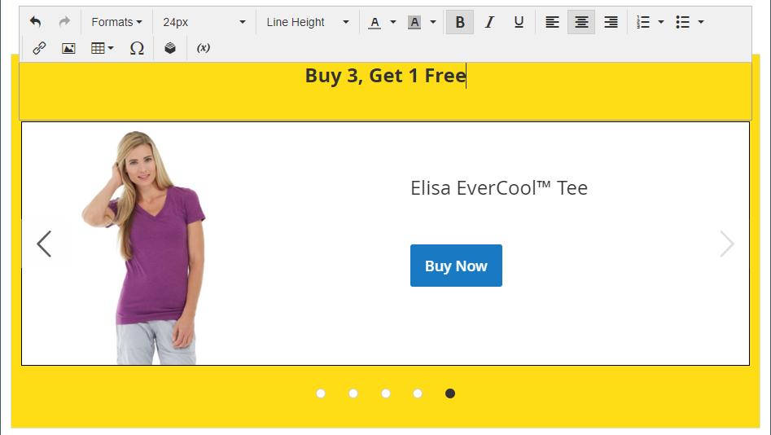{width="500" zoomable="yes"}

## 슬라이더 설정 변경

1. 슬라이더 컨테이너 위로 마우스를 가져가 기본 도구 상자를 표시하고 _설정_( {width="20"} ) 아이콘을 선택합니다.

   {width="500" zoomable="yes"}

1. 슬라이드의 **[!UICONTROL Minimum Height]**&#x200B;을(를) 입력하십시오.

   최소 높이는 유효한 CSS 단위(예: `100px`, `50%`, `50em`, `100vh`) 또는 계산(예: `100vh - 237px`)이 있는 숫자일 수 있습니다.

   예를 들어 슬라이더의 최소 높이를 설정하여 페이지의 전체 높이를 늘릴 수 있으므로 전체 페이지 배경 이미지 및 비디오에 대한 매력적인 옵션을 제공합니다.

   {width="400"}

1. 페이지가 로드될 때 슬라이더를 시작하려면 **[!UICONTROL Autoplay]**&#x200B;을(를) `Yes`(으)로 설정하고 슬라이드 사이의 지연 시간(밀리초)으로 **[!UICONTROL Autoplay Speed]**&#x200B;을(를) 설정합니다.

   기본적으로 속도는 4초인 4000ms로 설정되어 있습니다. 자동 재생을 `No`(으)로 설정하면 첫 번째 슬라이드가 기본적으로 나타나며 고객은 슬라이드 탐색(점 또는 화살표)을 클릭하여 다음 슬라이드를 순서대로 표시해야 합니다.

   {width="600" zoomable="yes"}

1. 한 슬라이드에서 다음 슬라이드로 원활하게 전환하려면 **[!UICONTROL Fade]**&#x200B;을(를) `Yes`(으)로 설정하십시오.

   페이드를 사용하면 슬라이드가 제자리에 있는 것처럼 보이지만, 콘텐츠는 하나에서 다음으로 매끄럽게 변경됩니다. 페이드를 사용하지 않으면 한 슬라이드에서 다음 슬라이드로 수평 이동이 표시됩니다.

   {width="600" zoomable="yes"}

1. 페이지가 열려 있는 동안 슬라이드 쇼를 무한정 반복하려면 **[!UICONTROL Infinite Loop]**&#x200B;을(를) `Yes`(으)로 설정하십시오.

1. 슬라이더에 대한 탐색 컨트롤의 유형을 선택하려면 다음을 수행하십시오.

   - 각 슬라이드의 왼쪽과 오른쪽에 _다음_ 및 _이전_ 화살표를 포함하려면 **[!UICONTROL Show Arrows]**&#x200B;을(를) `Yes`(으)로 설정하십시오.

   - 슬라이더 아래에 탐색 점 집합을 포함하려면 **[!UICONTROL Show Dots]**&#x200B;을(를) `Yes`(으)로 설정하십시오.

   {width="600" zoomable="yes"}

1. 필요에 따라 [고급](#slider-advanced) 슬라이더 설정을 완료합니다.

1. 완료되면 **[!UICONTROL Save]**&#x200B;을(를) 클릭하여 설정을 적용하고 [!DNL Page Builder] 작업 영역으로 돌아갑니다.

### 고급 - 슬라이더 {#slider-advanced}

1. 상위 슬라이더 컨테이너 내의 슬라이드 위치를 제어하려면 **[!UICONTROL Alignment]**&#x200B;을(를) 선택하십시오.

   | 옵션 | 설명 |
   | ------ | ----------- |
   | `Default` | 현재 테마의 스타일시트에 지정된 정렬 기본 설정을 적용합니다. |
   | `Left` | 지정된 패딩을 허용하여 슬라이더를 슬라이더 컨테이너의 왼쪽 테두리에 맞춰 정렬합니다. |
   | `Center` | 지정된 패딩을 허용하여 슬라이더를 슬라이더 컨테이너의 가운데에 맞춥니다. |
   | `Right` | 지정된 패딩을 허용하여 슬라이더를 슬라이더 컨테이너의 오른쪽 테두리에 맞춰 정렬합니다. |

   {style="table-layout:auto"}

1. 슬라이더 컨테이너의 네 면에 모두 적용되는 **[!UICONTROL Border]** 스타일을 설정합니다.

   | 옵션 | 설명 |
   | ------ | ----------- |
   | `Default` | 연관된 스타일 시트에서 지정한 기본 테두리 스타일을 적용합니다. |
   | `None` | 컨테이너 테두리를 시각적으로 표시하지 않습니다. |
   | `Dotted` | 컨테이너 테두리가 점선으로 표시됩니다. |
   | `Dashed` | 컨테이너 테두리는 파선으로 표시됩니다. |
   | `Solid` | 컨테이너 테두리가 실선으로 표시됩니다. |
   | `Double` | 컨테이너 테두리는 이중 선으로 표시됩니다. |
   | `Groove` | 컨테이너 테두리는 홈이 있는 선으로 표시됩니다. |
   | `Ridge` | 컨테이너 테두리는 절선으로 표시됩니다. |
   | `Inset` | 컨테이너 테두리는 인세트 선으로 표시됩니다. |
   | `Outset` | 컨테이너 테두리는 외곽선으로 표시됩니다. |

   {style="table-layout:auto"}

1. `None` 이외의 테두리 스타일을 설정하는 경우 테두리 표시 옵션을 완료하십시오.

   | 옵션 | 설명 |
   | ------ |------------ |
   | [!UICONTROL Border Color] | 색상 견본을 선택하거나 색상 선택기를 클릭하거나 유효한 색상 이름 또는 이에 해당하는 16진수 값을 입력하여 색상을 지정합니다. |
   | [!UICONTROL Border Width] | 테두리 라인 너비의 픽셀 수를 입력합니다. |
   | [!UICONTROL Border Radius] | 테두리의 각 모퉁이를 둥글게 만드는 데 사용되는 반경의 크기를 정의하려면 픽셀 수를 입력합니다. |

   {style="table-layout:auto"}

1. (선택 사항) 슬라이더 컨테이너에 적용할 현재 스타일 시트의 **[!UICONTROL CSS classes]** 이름을 지정합니다.

   여러 클래스 이름은 공백으로 구분합니다.

1. 슬라이더 컨테이너의 외부 여백과 내부 패딩을 확인하려면 **[!UICONTROL Margins and Padding]**&#x200B;에 대한 값을 픽셀 단위로 입력하십시오.

   다이어그램에 해당 값을 입력합니다.

   | 컨테이너 영역 | 설명 |
   | -------------- | ----------- |
   | [!UICONTROL Margins] | 컨테이너의 모든 면 바깥쪽 가장자리에 적용되는 빈 공간의 양입니다. |
   | [!UICONTROL Padding] | 컨테이너의 모든 측면 안쪽 가장자리에 적용되는 빈 공간의 양입니다. |

   {style="table-layout:auto"}

## 슬라이더 테스트

1. 슬라이더를 포함한 페이지를 열고 **[!UICONTROL Enable Page]**&#x200B;을(를) `Yes`(으)로 설정합니다.

1. 오른쪽 상단 모서리에서 **[!UICONTROL Save]** 화살표를 클릭하고 **[!UICONTROL Save & Close]**&#x200B;을(를) 선택합니다.

1. _페이지_ 그리드에서 페이지를 찾은 다음 _[!UICONTROL Action]_열에서&#x200B;**[!UICONTROL View]**을(를) 선택합니다.

   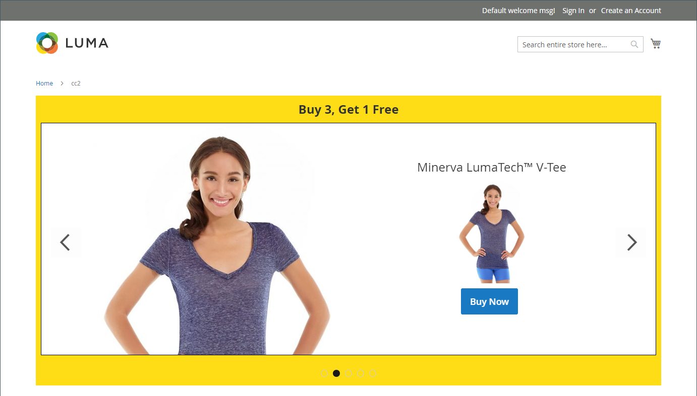{width="600" zoomable="yes"}

   슬라이더를 미리 볼 때 모바일 디바이스에서 슬라이더가 어떻게 표시되는지 볼 수 있도록 창 크기를 조정합니다.

   {width="400" zoomable="yes"}
