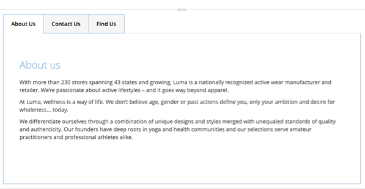

# 레이아웃 - 탭

_탭_ 콘텐츠 형식을 사용하여 [[!DNL Page Builder] 단계](workspace.md#stage)에 탭 집합을 추가하십시오. 패널에서 단계로 탭 자리 표시자를 드래그하면 처음에는 단일 기본 탭이 나타납니다. 탭을 더 추가하여 전체 세트를 만들 수 있습니다. 탭 세트의 너비는 상위 컨테이너의 너비와 패딩 설정에 의해 결정됩니다.

{width="500" zoomable="yes"}

{{$include /help/_includes/page-builder-save-timeout.md}}

## 툴박스

_탭_ 콘텐츠 형식을 사용하여 작업할 때 개별 탭과 하나 이상의 탭이 있는 탭 컨테이너를 추가하고 편집합니다. 각 탭에는 [!DNL Page Builder] 단계에서 탭을 디자인하는 데 사용하는 자체 도구 상자가 있습니다.

### 개별 탭 도구 상자

{width="500" zoomable="yes"}

| 도구 | 아이콘 | 설명 |
|--- |--- |--- |
| 이동 | {width="25"} | 탭 레이블 옆에 있는 이 컨트롤은 개별 탭을 탭 집합의 다른 위치로 이동하는 데 사용됩니다. |
| 설정 | {width="25"} | 개별 탭의 속성을 변경할 수 있는 탭 편집 페이지를 엽니다. |
| 복제 | {width="25"} | 탭의 복사본을 만듭니다. |
| 제거 | {width="25"} | 탭 집합에서 탭을 삭제합니다. |

{style="table-layout:auto"}

### 탭 컨테이너 도구 상자

{width="500" zoomable="yes"}

| 도구 | 아이콘 | 설명 |
|--- |--- |--- |
| 이동 | {width="25"} | 탭 집합을 부모 컨테이너의 그리드에서 다른 위치로 이동합니다. |
| 추가 | {width="25"} | 탭 세트에 탭을 추가합니다. |
| (레이블) | [!UICONTROL Tabs] | 현재 컨테이너를 탭 집합으로 식별합니다. 컨테이너의 위쪽 테두리를 마우스로 가리키면 도구 상자가 표시됩니다. |
| 설정 | {width="25"} | 컨테이너의 속성을 변경할 수 있는 탭 편집 페이지를 엽니다. |
| 숨기기 | {width="25"} | 탭 컨테이너를 숨깁니다. |
| 표시 | {width="25"} | 숨겨진 탭 컨테이너를 표시합니다. |
| 복제 | {width="25"} | 현재 탭의 복사본을 만듭니다. |
| 제거 | {width="25"} | 스테이지에서 현재 탭 세트를 삭제합니다. |

{style="table-layout:auto"}

{{$include /help/_includes/page-builder-hidden-element-note.md}}

## 개별 탭 추가

1. _[!UICONTROL Layout]_아래의 [!DNL Page Builder] 패널에서&#x200B;**[!UICONTROL Tabs]**자리 표시자를 스테이지 또는 스테이지의 행 또는 열로 직접 드래그합니다.

   {width="600" zoomable="yes"}

1. **[!UICONTROL Tab 1]** 레이블을 클릭하여 개별 탭 도구 상자를 표시하고 _설정_({width="20"} ) 아이콘을 선택합니다.

1. 레이블로 사용할 **[!UICONTROL Tab Name]**&#x200B;을(를) 입력하십시오.

   {width="600" zoomable="yes"}

1. 필요한 경우 탭의 **[!UICONTROL Minimum Height]**&#x200B;을(를) 입력합니다.

   이 값은 유효한 CSS 단위(예: `100px`, `50%`, `50em`, `100vh`) 또는 계산(예: `100vh - 237px`)이 있는 숫자일 수 있습니다.

1. **[!UICONTROL Vertical Alignment]** 설정을 선택하여 탭에 추가된 모든 콘텐츠 컨테이너(위쪽, 가운데 또는 아래쪽)를 정렬합니다.

1. 필요한 경우 다음 섹션을 지침으로 사용하여 다른 옵션을 설정합니다.

   - [[!UICONTROL Background]][background]
   - [[!UICONTROL Advanced]][advanced]

1. 오른쪽 상단 모서리에서 **[!UICONTROL Save]**&#x200B;을(를) 클릭하여 설정을 적용하고 [!DNL Page Builder] 작업 영역으로 돌아갑니다.

## 탭 집합 추가

다음 단계는 개별 탭으로 시작하여 탭 컨테이너 내에 세 개의 탭 집합을 만듭니다. 개별 탭이 아직 없는 경우 이전 지침에 따라 스테이지에 단일 탭을 추가합니다.

1. 도구 상자를 표시하고 _추가_( {width="20"} ) 아이콘을 선택하려면 탭 컨테이너 위로 마우스를 가져갑니다.

1. **[!UICONTROL Tab 2]** 레이블을 클릭하여 커서를 표시하고 탭의 사용자 지정 레이블을 입력합니다.

1. 스테이지에서 두 번째 탭을 다시 클릭하고 _복제_( {width="20"} ) 아이콘을 선택합니다.

1. YourName **[!UICONTROL Copy]** 레이블을 클릭하여 커서를 표시하고 세 번째 탭에 대한 사용자 지정 레이블을 입력합니다.

{width="600" zoomable="yes"}

## 세트 내에서 탭 이동

1. 이동할 탭을 클릭합니다.

1. 탭 레이블 텍스트 바로 앞에 표시되는 _이동_( {width="20"}) 아이콘을 선택하여 탭 집합 내의 새 위치로 드래그합니다.

## 탭에 콘텐츠 추가

행에서와 마찬가지로 모든 콘텐츠 유형을 탭에 입력할 수 있습니다. 다음 단계를 사용하여 텍스트 콘텐츠 유형을 예로 추가하십시오.

1. 콘텐츠를 추가할 탭을 클릭합니다.

1. [!DNL Page Builder] 패널에서 **[!UICONTROL Elements]**&#x200B;을(를) 확장하고 **Text** 자리 표시자를 탭으로 드래그합니다.

1. 편집기에 텍스트를 입력하거나 붙여 넣고 편집기 도구 모음을 사용하여 필요에 따라 서식을 지정합니다.

   텍스트 콘텐츠 형식 작업에 대한 자세한 내용은 [요소 - 텍스트](text.md)를 참조하십시오.

   {width="500" zoomable="yes"}

1. 오른쪽 상단에서 **[!UICONTROL Save]**&#x200B;을(를) 클릭합니다.

## 개별 탭 설정 변경

1. 도구 상자를 표시하고 _설정_( {width="20"} ) 아이콘을 선택하려면 개별 탭 위로 마우스를 가져갑니다.

1. 필요한 경우 탭의 기본 설정을 변경합니다.

   - **[!UICONTROL Tab Name]** - 탭 레이블에 대해 수정된 텍스트를 입력합니다. 스테이지에서 직접 레이블을 수정할 수도 있습니다.

   - **[!UICONTROL Minimum Height]** - 자동 높이를 재정의하려면 픽셀로 입력하십시오. 예를 들어, 전체 이미지가 표시되도록 하기 위해 배경 이미지의 높이와 일치하도록 최소 높이를 설정할 수 있습니다.

   - **[!UICONTROL Vertical Alignment]** - 탭에 추가되는 콘텐츠 컨테이너의 세로 위치를 선택합니다.

1. 자세한 내용은 다음 섹션을 사용하여 필요에 따라 다른 설정을 변경합니다.

1. 완료되면 **[!UICONTROL Save]**&#x200B;을(를) 클릭하여 설정을 적용하고 [!DNL Page Builder] 작업 영역으로 돌아갑니다.

### 배경

- **[!UICONTROL Background Color]** - 견본을 선택하거나, 색상 선택기를 클릭하거나, 올바른 색상 이름 또는 이에 해당하는 16진수 값을 입력하여 배경색을 지정합니다. 이 설정은 행의 배경색을 결정합니다. 색상의 불투명도를 조정할 수도 있습니다.

  {width="200"}

  다음 세 가지 방법으로 값을 입력할 수 있습니다.

   - 미리 정의된 색상 이름(예: `White`)

   - 색상에 대한 16진수 색상 값(예: `#ffffff`)

   - 불투명도 비율이 있는 색상의 rgba 값(예: `rgba(255, 255, 255, 0.75)`)

  색상을 선택하려면 _색상 없음_ 상자의 왼쪽에 있는 견본을 클릭합니다.

  {width="600" zoomable="yes"}

  색상 상자를 클릭하여 색상 선택기를 다시 열면 슬라이더 아래의 상자에 현재 빨강, 녹색, 파랑 및 알파 값(rgba)이 표시됩니다. 마지막 숫자는 현재 불투명도 비율을 소수점으로 나타냅니다. 슬라이더를 사용하여 불투명도를 조정하거나 원하는 십진수 값을 입력할 수 있습니다.

  {width="600" zoomable="yes"}

  >[!NOTE]
  >
  >[!DNL Page Builder]은(는) 불투명도가 다양한 배경을 만드는 데 사용할 수 있는 배경 이미지에서 투명도 레이어 또는 _알파 채널_&#x200B;도 지원합니다.

- **[!UICONTROL Background Image]** - 필요한 경우 제공된 도구를 사용하여 탭에 적용할 배경 이미지를 선택하십시오.

  | 도구 | 설명 |
  |--- |--- |
  | [!UICONTROL Upload] | 로컬 컴퓨터의 이미지 파일을 갤러리로 업로드한 다음 탭의 배경 이미지로 적용합니다. |
  | [!UICONTROL Select from Gallery] | 갤러리에서 기존 이미지를 탭의 배경 이미지로 선택하라는 메시지가 표시됩니다. |
  | {width="25"} | 이미지를 카메라 타일로 드래그하거나 로컬 파일 시스템에서 이미지를 검색할 수 있습니다. |

  {style="table-layout:auto"}

- **[!UICONTROL Background Mobile Image]** - 필요한 경우 동일한 도구를 사용하여 모바일 장치에서 표시하는 데 사용할 다른 배경 이미지를 선택하십시오.

- **[!UICONTROL Background Size]** - 탭의 너비를 기준으로 배경 이미지의 크기 조정 방법을 선택합니다.

  | 옵션 | 설명 |
  |--- |--- |
  | `Cover` | 배경 이미지는 탭의 전체 너비를 포함합니다. |
  | `Contain` | 배경 이미지는 탭 영역의 너비로 제한됩니다. |
  | `Auto` | 현재 스타일 시트의 크기를 적용합니다. |

  {style="table-layout:auto"}

- **[!UICONTROL Background Position]** - `Top Left` / `Top Center` / `Top Right` / `Center Left` / `Center` / `Center Right` / `Bottom Left` / `Bottom Center` / `Bottom Right` 탭에서 배경 이미지가 고정되는 방법을 선택합니다.

- **[!UICONTROL Background Attachment]** - 스크롤 페이지와 관련하여 배경 이미지가 어떻게 이동하는지 확인하려면 첨부 파일 형식을 선택하십시오.

  | 옵션 | 설명 |
  | --- | --- |
  | `Scroll` | 첨부된 배경 이미지는 페이지가 스크롤될 때 아래로 이동하도록 동기화됩니다. |
  | `Fixed` | (모바일에서는 사용할 수 없음) 컨테이너가 이미지를 스크롤하고 지정된 배경 위치에서 고정되므로 배경 이미지가 이동하지 않습니다. |

  {style="table-layout:auto"}

- **[!UICONTROL Background Repeat]** - `Yes`(으)로 설정하여 탭에서 사용 가능한 공간을 채우도록 배경 이미지를 반복합니다.

### 고급

- 탭에 추가되는 콘텐츠 컨테이너의 가로 맞춤을 제어하려면 **[!UICONTROL Alignment]** 을(를) 선택합니다.

  | 옵션 | 설명 |
  | --- | --- |
  | `Default` | 현재 테마의 스타일시트에 지정된 정렬 기본 설정을 적용합니다. |
  | `Left` | 지정된 패딩을 허용하여 탭의 왼쪽 테두리를 따라 콘텐츠 컨테이너를 정렬합니다. |
  | `Center` | 지정된 패딩을 허용하여 탭의 중앙에 콘텐츠 컨테이너를 정렬합니다. |
  | `Right` | 지정된 패딩을 허용하여 탭의 오른쪽 테두리를 따라 콘텐츠 컨테이너를 정렬합니다. |

  {style="table-layout:auto"}

- 탭 컨테이너의 네 면에 모두 적용되는 **[!UICONTROL Border]** 스타일을 설정합니다.

  | 옵션 | 설명 |
  | --- | --- |
  | `Default` | 연관된 스타일 시트에서 지정한 기본 테두리 스타일을 적용합니다. |
  | `None` | 컨테이너 테두리를 시각적으로 표시하지 않습니다. |
  | `Dotted` | 컨테이너 테두리가 점선으로 표시됩니다. |
  | `Dashed` | 컨테이너 테두리는 파선으로 표시됩니다. |
  | `Solid` | 컨테이너 테두리가 실선으로 표시됩니다. |
  | `Double` | 컨테이너 테두리는 이중 선으로 표시됩니다. |
  | `Groove` | 컨테이너 테두리는 홈이 있는 선으로 표시됩니다. |
  | `Ridge` | 컨테이너 테두리는 절선으로 표시됩니다. |
  | `Inset` | 컨테이너 테두리는 인세트 선으로 표시됩니다. |
  | `Outset` | 컨테이너 테두리는 외곽선으로 표시됩니다. |

  {style="table-layout:auto"}

- `None` 이외의 테두리 스타일을 설정하는 경우 테두리 표시 옵션을 완료하십시오.

  {width="600" zoomable="yes"}

  | 옵션 | 설명 |
  | ------ |------------ |
  | [!UICONTROL Border Color] | 색상 견본을 선택하거나 색상 선택기를 클릭하거나 유효한 색상 이름 또는 이에 해당하는 16진수 값을 입력하여 색상을 지정합니다. |
  | [!UICONTROL Border Width] | 테두리 라인 너비의 픽셀 수를 입력합니다. |
  | [!UICONTROL Border Radius] | 테두리의 각 모퉁이를 둥글게 만드는 데 사용되는 반경의 크기를 정의하려면 픽셀 수를 입력합니다. |

  {style="table-layout:auto"}

  다음 예제의 행에는 테두리 반경이 15입니다.

  {width="500"}

- (선택 사항) 열 컨테이너에 적용할 현재 스타일 시트의 **[!UICONTROL CSS classes]** 이름을 지정합니다.

  여러 클래스 이름은 공백으로 구분합니다.

- **[!UICONTROL Margins and Padding]**&#x200B;에 대한 값을 픽셀 단위로 입력하여 열의 외부 여백과 내부 패딩을 지정합니다.

  탭 컨테이너 다이어그램에 해당하는 각 값을 입력합니다.

  | 컨테이너 영역 | 설명 |
  | -------------- | ---------- |
  | [!UICONTROL Margins] | 컨테이너의 모든 면 바깥쪽 가장자리에 적용되는 빈 공간의 양입니다. 옵션: `Top` / `Right` / `Bottom` / `Left` |
  | [!UICONTROL Padding] | 컨테이너의 모든 측면 안쪽 가장자리에 적용되는 빈 공간의 양입니다. 옵션: `Top` / `Right` / `Bottom` / `Left` |

  {style="table-layout:auto"}

## 탭 집합 설정 변경

1. 도구 상자를 표시하고 _설정_( {width="20"} ) 아이콘을 선택하려면 탭 집합 컨테이너의 위쪽 테두리를 마우스로 가리킵니다.

1. 필요한 경우 **[!UICONTROL Default Active Tab]**&#x200B;을(를) 변경합니다.

   페이지가 로드될 때 활성화할 세트에서 탭을 선택합니다.

1. 탭 집합의 자동 높이를 무시하려면 **[!UICONTROL Minimum Height]**&#x200B;을(를) 픽셀 단위로 입력하십시오.

1. 탐색 탭을 탭 집합의 맨 위에 배치하려면 **[!UICONTROL Tab Navigation Alignment]**(`Left`, `Center` 또는 `Right`)을(를) 선택합니다.

   {width="500" zoomable="yes"}

1. 탭 세트에 대한 고급 옵션을 설정합니다.

   - 상위 컨테이너 내에 있는 탭 집합의 위치를 제어하려면 **[!UICONTROL Alignment]**&#x200B;을(를) 선택하십시오.

     | 옵션 | 설명 |
     | ------ | ---------- |
     | `Default` | 현재 테마의 스타일시트에 지정된 정렬 기본 설정을 적용합니다. |
     | `Left` | 지정된 패딩을 허용하여 부모 컨테이너의 왼쪽 테두리를 따라 탭 세트를 정렬합니다. |
     | `Center` | 지정된 패딩을 허용하여 부모 컨테이너의 중앙에 있는 탭 집합을 정렬합니다. |
     | `Right` | 지정된 패딩을 허용하여 부모 컨테이너의 오른쪽 테두리를 따라 탭 세트를 정렬합니다. |

     {style="table-layout:auto"}

   - 탭 컨테이너의 네 면 모두에 적용되는 **[!UICONTROL Border]** 스타일을 설정합니다.

     | 옵션 | 설명 |
     | ------ | ---------- |
     | `Default` | 연관된 스타일 시트에서 지정한 기본 테두리 스타일을 적용합니다. |
     | `None` | 컨테이너 테두리를 시각적으로 표시하지 않습니다. |
     | `Dotted` | 컨테이너 테두리가 점선으로 표시됩니다. |
     | `Dashed` | 컨테이너 테두리는 파선으로 표시됩니다. |
     | `Solid` | 컨테이너 테두리가 실선으로 표시됩니다. |
     | `Double` | 컨테이너 테두리는 이중 선으로 표시됩니다. |
     | `Groove` | 컨테이너 테두리는 홈이 있는 선으로 표시됩니다. |
     | `Ridge` | 컨테이너 테두리는 절선으로 표시됩니다. |
     | `Inset` | 컨테이너 테두리는 인세트 선으로 표시됩니다. |
     | `Outset` | 컨테이너 테두리는 외곽선으로 표시됩니다. |

     {style="table-layout:auto"}

   - `None` 이외의 테두리 스타일을 설정하는 경우 테두리 표시 옵션을 완료하십시오.

     | 옵션 | 설명 |
     | ------ |------------ |
     | [!UICONTROL Border Color] | 색상 견본을 선택하거나 색상 선택기를 클릭하거나 유효한 색상 이름 또는 이에 해당하는 16진수 값을 입력하여 색상을 지정합니다. |
     | [!UICONTROL Border Width] | 테두리 라인 너비의 픽셀 수를 입력합니다. |
     | [!UICONTROL Border Radius] | 테두리의 각 모퉁이를 둥글게 만드는 데 사용되는 반경의 크기를 정의하려면 픽셀 수를 입력합니다. |

     {style="table-layout:auto"}

   - (선택 사항) 탭 컨테이너에 적용할 현재 스타일 시트의 **[!UICONTROL CSS classes]** 이름을 지정합니다.

     여러 클래스 이름은 공백으로 구분합니다.

   - **[!UICONTROL Margins and Padding]**&#x200B;의 값을 픽셀 단위로 입력하여 탭 컨테이너의 외부 여백과 내부 패딩을 결정합니다.

     탭 컨테이너 다이어그램에 해당 값을 입력합니다.

     | 컨테이너 영역 | 설명 |
     | -------------- | ---------- |
     | [!UICONTROL Margins] | 컨테이너의 모든 면 바깥쪽 가장자리에 적용되는 빈 공간의 양입니다. 옵션: `Top` / `Right` / `Bottom` / `Left` |
     | [!UICONTROL Padding] | 컨테이너의 모든 측면 안쪽 가장자리에 적용되는 빈 공간의 양입니다. 옵션: `Top` / `Right` / `Bottom` / `Left` |

     {style="table-layout:auto"}

1. 완료되면 **[!UICONTROL Save]**&#x200B;을(를) 클릭하여 설정을 적용하고 [!DNL Page Builder] 작업 영역으로 돌아갑니다.

[background]: #background
[advanced]: #advanced
