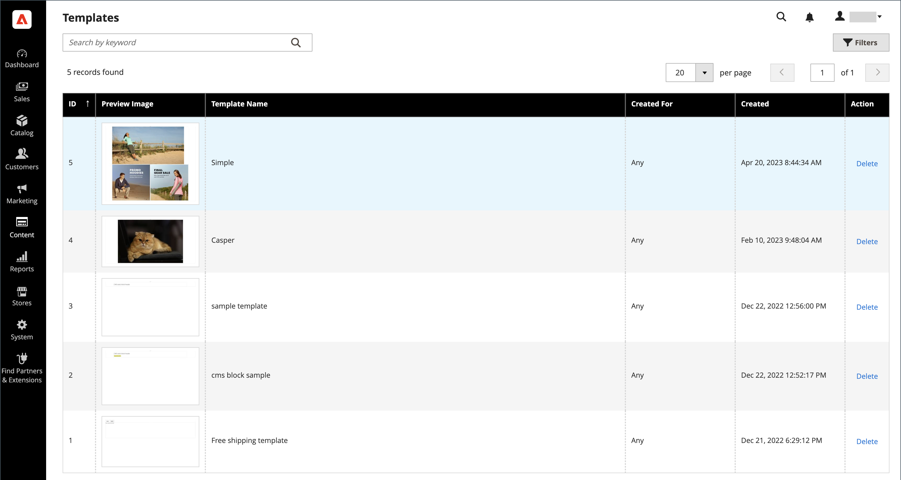

# 템플릿 [!DNL Page Builder]개

템플릿은 [!DNL Page Builder] 콘텐츠와 기존 페이지, 블록, 동적 블록, 제품 특성 및 범주 설명의 레이아웃을 저장하는 컨테이너입니다. 템플릿을 사용하면 콘텐츠를 만들거나 이전 콘텐츠를 바꿀 때 시간과 노력을 절약할 수 있습니다. 예를 들어 기존 [!DNL Page Builder] 콘텐츠를 템플릿으로 저장한 다음 해당 템플릿(모든 콘텐츠 및 레이아웃 포함)을 다른 영역에 적용하여 [!DNL Page Builder] 콘텐츠를 빠르게 만들 수 있습니다.

## 템플릿 액세스

_관리자_ 사이드바에서 **[!UICONTROL Content]** > _[!UICONTROL Elements]_>**[!UICONTROL Templates]**(으)로 이동합니다.

{width="700" zoomable="yes"}

## [!DNL Page Builder] 콘텐츠를 템플릿으로 저장

1. [[!DNL Page Builder] 단계](workspace.md#stage)(으)로 이동하여 템플릿으로 저장할 콘텐츠에 액세스합니다.

   페이지, 블록, 동적 블록, 제품 속성 또는 범주 설명이 될 수 있습니다.

1. 단계 위에서 오른쪽 상단의 **[!UICONTROL Save as Template]**&#x200B;을(를) 클릭합니다.

   템플릿으로 저장 단추가 있는 ![[!DNL Page Builder] 단계](./assets/pb-templates-saveastemplate-button.png){width="600" zoomable="yes"}

   이 작업은 _[!UICONTROL Save Content as Template]_&#x200B;대화 상자를 표시합니다.

   ![[!DNL Page Builder] 템플릿으로 저장 대화 상자](./assets/pb-templates-save-dialog.png){width="400" zoomable="yes"}

1. **[!UICONTROL Template Name]**&#x200B;의 경우 템플릿의 고유한 이름을 입력하십시오.

   필요에 따라 다른 콘텐츠 영역을 검색하고 선택하고 적용할 수 있도록 고유한 이름이 필요합니다.

1. 필요한 경우 **Created For**&#x200B;을(를) 설정하여 특정 콘텐츠 영역 형식에 템플릿을 할당하십시오.

   이 할당을 추가하면 나중에 해당 템플릿을 적용할 때 필터링되어 더 쉽게 찾을 수 있습니다. 하지만 그 부분에 대해서는 사용을 제한하지 않습니다. [!DNL Page Builder] 콘텐츠가 허용되는 모든 위치에서 템플릿을 사용할 수 있습니다.

1. **[!UICONTROL Save]**&#x200B;을(를) 클릭합니다.

   템플릿이 저장되었음을 나타내는 확인 메시지가 나타납니다.

## 템플릿 적용

[!DNL Page Builder] 콘텐츠 영역(페이지, 블록, 동적 블록, 제품 특성 또는 범주 설명)에 템플릿을 적용할 수 있습니다.

1. 템플릿을 적용할 콘텐츠 영역으로 이동합니다.

1. 콘텐츠 영역에서 오른쪽 상단의 **[!UICONTROL Apply Template]**&#x200B;을(를) 클릭합니다.

   ![[!DNL Page Builder] 템플릿 적용 단추](./assets/pb-templates-applytemplate-button.png){width="600" zoomable="yes"}

1. _[!UICONTROL Apply Template]_&#x200B;그리드에서 템플릿을 선택하고 행 끝에 있는&#x200B;**[!UICONTROL Apply]**&#x200B;을(를) 클릭합니다.

   전체 템플릿을 보려면 템플릿 썸네일 이미지를 클릭할 수 있습니다. 이 작업은 이미지를 확장하므로 필요에 따라 전체 템플릿을 볼 수 있습니다.

   ![[!DNL Page Builder] 템플릿 표 적용](./assets/pb-templates-apply-slideout-nofilters.png){width="600" zoomable="yes"}

## 템플릿 삭제

1. _관리자_ 사이드바에서 **[!UICONTROL Content]** > **[!UICONTROL Templates]**(으)로 이동합니다.

1. _템플릿_ 페이지에서 템플릿을 선택하고 행 끝에 있는 **[!UICONTROL Delete]**&#x200B;을(를) 클릭합니다.

   전체 템플릿을 보려면 템플릿 썸네일 이미지를 클릭할 수 있습니다. 이 작업은 이미지를 확장하므로 필요에 따라 전체 템플릿을 볼 수 있습니다.

1. 메시지가 표시되면 템플릿 제거를 확인합니다.

## 템플릿 필터링

_템플릿 적용_ 그리드와 _템플릿_ 페이지 그리드는 템플릿 그리드를 필터링하는 두 가지 방법을 제공합니다.

- 왼쪽 상단의 검색 상자를 사용하여 입력한 텍스트를 기반으로 템플릿 이름으로 그리드를 필터링합니다.

- 다음을 기준으로 템플릿을 필터링할 수 있는 필터 옵션을 열려면 **[!UICONTROL Filters]**&#x200B;을(를) 클릭하십시오.

   - 템플릿 ID 범위(**[!UICONTROL ID]**)
   - 만든 날짜 범위(**[!UICONTROL Created]**)
   - 템플릿 이름(**[!UICONTROL Template Name]**)
   - 지정된 콘텐츠 영역(**[!UICONTROL Created For]**)

![[!DNL Page Builder] 템플릿 표 적용](./assets/pb-templates-apply-slideout-withfilters.png){width="600" zoomable="yes"}

## 콘텐츠 템플릿 데모

이 비디오를 통해 페이지 빌더 콘텐츠 템플릿에 대해 알아보십시오.

>[!VIDEO](https://video.tv.adobe.com/v/343787?quality=12&learn=on)
