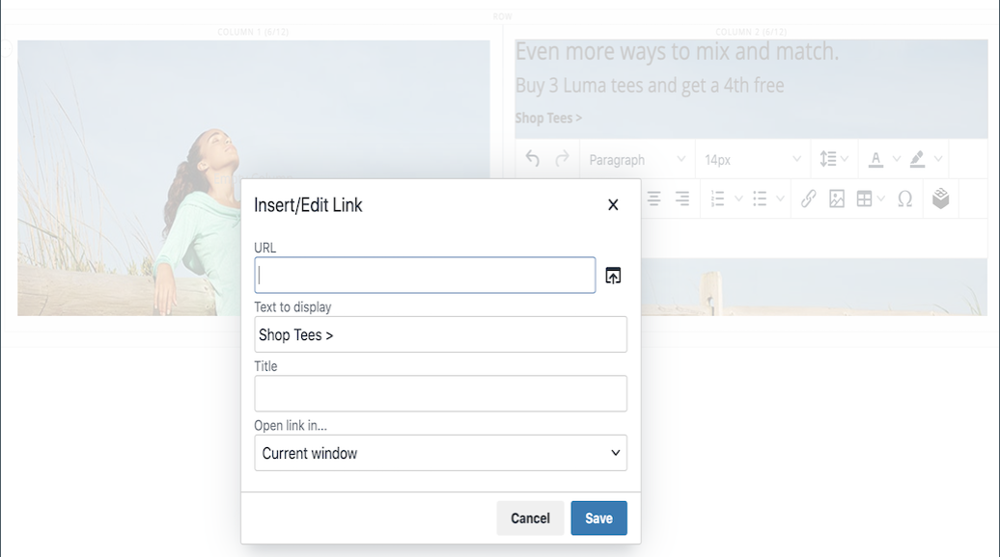
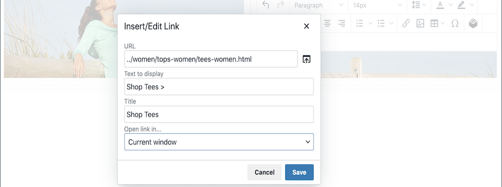

# 요소 - 텍스트

_단계_&#x200B;에서 WYSIWYG(&quot;What You See Is What You Get&quot;) 편집기가 있는 텍스트 컨테이너를 추가하려면 [[!DNL Page Builder] Text](workspace.md#stage) 콘텐츠 형식을 사용하십시오. 또한 편집기 도구 모음에서 텍스트에 링크, 이미지, [변수](../systems/variables-predefined.md) 및 위젯을 추가할 수 있습니다.

{width="700"}

{{$include /help/_includes/page-builder-save-timeout.md}}

## 텍스트 편집기 도구

스테이지 또는 설정 페이지에서 직접 텍스트 편집기에 액세스할 수 있습니다. 단계에 직접 수행된 변경 사항은 자동으로 저장됩니다. 자세한 내용은 [편집기 사용](../content-design/editor.md)을 참조하세요.

{width="600"}

## 텍스트 컨테이너 도구 상자

{width="600"}

| 도구 | 아이콘 | 설명 |
| --------- | --------------------- | -------------- |
| 이동 | {width="25"} | 텍스트 컨테이너를 페이지의 다른 올바른 위치로 이동합니다. |
| (레이블) | 텍스트 | 현재 컨테이너를 텍스트 요소로 식별합니다. |
| 설정 | {width="25"} | 편집 모드에서 텍스트 컨테이너 속성을 엽니다. |
| 숨기기 | {width="25"} | 텍스트 컨테이너를 숨깁니다. |
| 표시 | {width="25"} | 숨겨진 텍스트 컨테이너를 표시합니다. |
| 복제 | {width="25"} | 텍스트 컨테이너의 복사본을 만듭니다. |
| 제거 | {width="25"} | 스테이지에서 텍스트 컨테이너와 해당 콘텐츠를 삭제합니다. |

{style="table-layout:auto"}

{{$include /help/_includes/page-builder-hidden-element-note.md}}

## 텍스트 추가

1. [!DNL Page Builder] 패널에서 **[!UICONTROL Elements]**&#x200B;을(를) 확장하고 **[!UICONTROL Text]** 자리 표시자를 스테이지의 행, 열 또는 탭 집합으로 드래그합니다.

   {width="600" zoomable="yes"}

1. 편집기를 사용하여 필요에 따라 텍스트를 입력하고 서식을 지정합니다.

   자세한 내용은 [편집기 사용](../content-design/editor.md)을 참조하세요.

   {width="600"}

## 링크 만들기

편집기의 링크 삽입 버튼을 사용하면 갤러리의 이미지에 하이퍼링크를 쉽게 추가할 수 있습니다. 그러나 미리 URL이 있는 경우 텍스트에 인라인 링크를 만드는 데 사용할 수도 있습니다. [위젯] 버튼과 달리 [링크 삽입/편집] 버튼은 스토어의 페이지, 제품 또는 카테고리와 통합되지 않습니다.

전화 번호 또는 전자 메일에 대한 링크를 만들려면 [사용자 지정 변수 추가](../systems/variables-custom.md)를 참조하세요.

1. 상점 첫 화면에서 링크의 대상 페이지로 이동하여 링크 정보를 복사합니다.

   저장소 도메인에 대한 참조를 생략하는 상대 URL 또는 정규화된 URL을 사용할 수 있습니다.

   전체 URL - `https://mystore.com/women/tops-women/tees-women.html`

   상대 URL - `../women/tops-women/tees-women.html`

1. 편집기 공간에서 텍스트를 선택하고 편집기 도구 모음에서 _링크 삽입/편집_({width="20"} )을 클릭합니다.

   {width="500" zoomable="yes"}

1. **[!UICONTROL URL]**&#x200B;에 대해 준비한 상대 링크를 입력하십시오.

1. **[!UICONTROL Target]**&#x200B;을(를) `None`(으)로 설정합니다.

   이 설정은 새 탭을 열지 않고 동일한 브라우저 창에서 페이지를 엽니다.

1. **[!UICONTROL Title]**&#x200B;에 대해 `Shop Tees`을(를) 입력하십시오.

   `Title` 링크 특성은 일부 브라우저에서 도구 설명으로 사용됩니다.

1. 링크를 저장하고 [!DNL Page Builder] 작업 영역으로 돌아가려면 **[!UICONTROL OK]**&#x200B;을(를) 클릭합니다.

   {width="500" zoomable="yes"}

## 이미지 삽입

1. 이미지를 삽입할 텍스트에 커서를 놓습니다.

1. 편집기 도구 모음에서 _이미지 삽입/편집_( {width="20"} )을 클릭합니다.

1. **[!UICONTROL Source]**&#x200B;의 경우 검색 아이콘을 클릭하여 미디어 저장소를 사용하여 이미지를 찾아 선택합니다.

1. **[!UICONTROL Image Description]**&#x200B;의 경우 이미지에 대한 설명 텍스트를 입력하십시오.

   이 텍스트는 이미지의 `alt` 링크 특성을 채우며 일부 브라우저에서 접근성을 위해 사용됩니다.

1. 페이지에서 이미지를 렌더링하려면 너비 및 높이 **[!UICONTROL Dimensions]**&#x200B;을(를) 픽셀 단위로 입력하십시오.

   이미지의 종횡비를 자동으로 유지하려면 선택한 **[!UICONTROL Constrain proportions]** 확인란을 유지하십시오.

1. 이미지를 삽입한 다음 [!DNL Page Builder] 작업 영역으로 돌아가려면 **[!UICONTROL OK]**&#x200B;을(를) 클릭합니다.

## 텍스트 설정 변경

1. 텍스트 컨테이너 위로 마우스를 가져가면 도구 상자를 표시하고 _설정_( {width="20"} ) 아이콘을 선택합니다.

   >[!NOTE]
   >
   >텍스트 컨테이너는 다른 컨테이너 안에 단단히 중첩되어 있으므로 올바른 도구 상자가 있는지 확인하십시오.

1. 필요에 따라 콘텐츠를 업데이트합니다.

1. 필요에 따라 _[!UICONTROL Advanced]_&#x200B;설정을 업데이트합니다.

   - 상위 컨테이너 내의 텍스트 위치를 제어하려면 **[!UICONTROL Alignment]**&#x200B;을(를) 선택하세요.

     | 옵션 | 설명 |
     | ------ |------------ |
     | `Default` | 현재 테마의 스타일시트에 지정된 정렬 기본 설정을 적용합니다. |
     | `Left` | 지정된 패딩을 허용하여 부모 컨테이너의 왼쪽 테두리를 따라 목록을 정렬합니다. |
     | `Center` | 지정된 패딩을 허용하여 부모 컨테이너의 중앙에 있는 목록을 정렬합니다. |
     | `Right` | 지정된 패딩을 허용하여 부모 컨테이너의 오른쪽 테두리를 따라 블록을 정렬합니다. |

     {style="table-layout:auto"}

   - 텍스트 컨테이너의 네 면에 모두 적용되는 **[!UICONTROL Border]** 스타일을 설정합니다.

     | 옵션 | 설명 |
     | ------ |------------ |
     | `Default` | 연관된 스타일 시트에서 지정한 기본 테두리 스타일을 적용합니다. |
     | `None` | 컨테이너 테두리를 시각적으로 표시하지 않습니다. |
     | `Dotted` | 컨테이너 테두리가 점선으로 표시됩니다. |
     | `Dashed` | 컨테이너 테두리는 파선으로 표시됩니다. |
     | `Solid` | 컨테이너 테두리가 실선으로 표시됩니다. |
     | `Double` | 컨테이너 테두리는 이중 선으로 표시됩니다. |
     | `Groove` | 컨테이너 테두리는 홈이 있는 선으로 표시됩니다. |
     | `Ridge` | 컨테이너 테두리는 절선으로 표시됩니다. |
     | `Inset` | 컨테이너 테두리는 인세트 선으로 표시됩니다. |
     | `Outset` | 컨테이너 테두리는 외곽선으로 표시됩니다. |

     {style="table-layout:auto"}

   - `None` 이외의 테두리 스타일을 설정하는 경우 테두리 표시 옵션을 완료하십시오.

     | 옵션 | 설명 |
     | ------ |------------ |
     | [!UICONTROL Border Color] | 색상 견본을 선택하거나 색상 선택기를 클릭하거나 유효한 색상 이름 또는 이에 해당하는 16진수 값을 입력하여 색상을 지정합니다. |
     | [!UICONTROL Border Width] | 테두리 라인 너비의 픽셀 수를 입력합니다. |
     | [!UICONTROL Border Radius] | 테두리의 각 모퉁이를 둥글게 만드는 데 사용되는 반경의 크기를 정의하려면 픽셀 수를 입력합니다. |

     {style="table-layout:auto"}

   - (선택 사항) 컨테이너에 적용할 현재 스타일 시트의 **[!UICONTROL CSS classes]** 이름을 지정합니다.

     여러 클래스 이름은 공백으로 구분합니다.

   - 텍스트 컨테이너의 외부 여백과 내부 여백을 확인하려면 **[!UICONTROL Margins and Padding]**&#x200B;의 값을 픽셀 단위로 입력하십시오.

     다이어그램에 해당 값을 입력합니다.

     | 컨테이너 영역 | 설명 |
     | -------------- |------------ |
     | [!UICONTROL Margins] | 컨테이너의 모든 면 바깥쪽 가장자리에 적용되는 빈 공간의 양입니다. 옵션: `Top` / `Right` / `Bottom` / `Left` |
     | [!UICONTROL Padding] | 컨테이너의 모든 측면 안쪽 가장자리에 적용되는 빈 공간의 양입니다. 옵션: `Top` / `Right` / `Bottom` / `Left` |

     {style="table-layout:auto"}

1. 완료되면 **[!UICONTROL Save]**&#x200B;을(를) 클릭하여 설정을 적용하고 [!DNL Page Builder] 작업 영역으로 돌아갑니다.

<!-- Last updated from includes: 2023-09-11 14:30:19 -->
