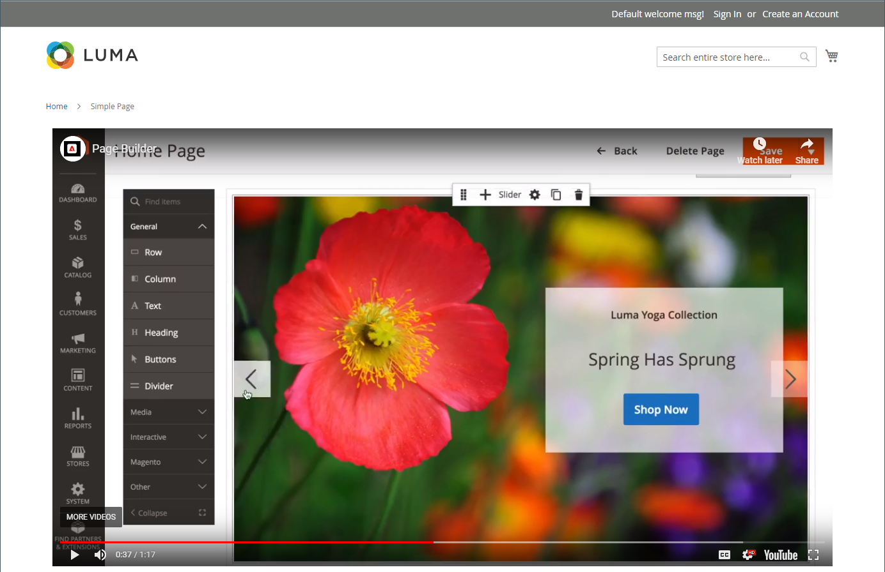

# 미디어 - 비디오

_Video_ 콘텐츠 형식을 사용하여 [YouTube](https://www.youtube.com/) 또는 [Vimeo](https://vimeo.com/)에서 호스팅되는 비디오를 [[!DNL Page Builder] 단계](workspace.md#stage)에 추가하십시오. 페이지나 블록 또는 제품 및 카테고리 설명에 비디오를 쉽게 포함할 수 있습니다.

{width="700" zoomable="yes"}

{{$include /help/_includes/page-builder-save-timeout.md}}

## 비디오 도구 상자

{width="600" zoomable="yes"}

| 도구 | 아이콘 | 설명 |
|--- |--- |--- |
| 이동 | {width="25"} | 비디오를 스테이지의 다른 위치로 이동합니다. |
| (레이블) | [!UICONTROL Video] | 현재 콘텐츠 컨테이너를 비디오로 식별합니다. 이미지 컨테이너 위로 마우스를 가져가면 도구 상자를 볼 수 있습니다. |
| 설정 | {width="25"} | 비디오 및 컨테이너의 속성을 변경할 수 있는 _[!UICONTROL Edit Video]_페이지를 엽니다. |
| 숨기기 | {width="25"} | 현재 비디오를 숨깁니다. |
| 표시 | {width="25"} | 숨겨진 비디오를 표시합니다. |
| 복제 | {width="25"} | 비디오를 복사합니다. |
| 제거 | {width="25"} | 스테이지에서 비디오를 삭제합니다. |

{style="table-layout:auto"}

{{$include /help/_includes/page-builder-hidden-element-note.md}}

## 비디오 추가

1. 시작하기 전에 포함할 [YouTube](https://www.youtube.com/) 또는 [Vimeo](https://vimeo.com/) 비디오로 이동한 다음 링크를 복사합니다.

   또는 직접 링크를 유효한 비디오 파일로 복사할 수도 있습니다. 올바른 링크는 [기본 비디오 설정](#basic-video-settings)을 참조하세요.

1. [!DNL Commerce] 관리자의 경우 비디오를 추가하려는 [!DNL Page Builder] 작업 영역으로 돌아갑니다.

1. [!DNL Page Builder] 패널에서 **[!UICONTROL Media]**&#x200B;을(를) 확장하고 **[!UICONTROL Video]** 자리 표시자를 스테이지로 드래그합니다.

   {width="600" zoomable="yes"}

1. 비디오 컨테이너 위로 마우스를 가져가 도구 상자를 표시하고 _설정_( {width="20"} ) 아이콘을 선택합니다.

1. **[!UICONTROL Video URL]**&#x200B;의 경우 복사한 비디오의 URL을 붙여넣습니다.

   이 예제에 사용된 [!DNL Page Builder] 비디오의 URL은 `https://www.youtube.com/watch?v=Y0KNS7C5dZA`입니다.

1. 비디오의 **[!UICONTROL Maximum Width]**&#x200B;을(를) 제한하려면 최대 너비를 픽셀 단위로 입력하십시오.

   비어 있는 경우 비디오가 컨테이너에서 허용하는 만큼 너비가 넓어 여백과 패딩을 허용합니다.

1. 오른쪽 상단 모서리에서 **[!UICONTROL Save]**&#x200B;을(를) 클릭하여 설정을 적용하고 [!DNL Page Builder] 작업 영역으로 돌아갑니다.

## 비디오 설정 변경

1. 비디오 컨테이너 위로 마우스를 가져가 도구 상자를 표시하고 _설정_( {width="20"} ) 아이콘을 선택합니다.

1. 다음 섹션에 따라 설정을 수정합니다.

   - [기본](#basic-video-settings)
   - [고급](#advanced)

1. 오른쪽 상단 모서리에서 **[!UICONTROL Save]**&#x200B;을(를) 클릭하여 설정을 적용하고 [!DNL Page Builder] 작업 영역으로 돌아갑니다.

### 기본 비디오 설정

1. 현재 비디오를 변경하려면 **[!UICONTROL Video URL]**&#x200B;을(를) 업데이트하세요.

   올바른 비디오 URL을 입력하십시오. 유효한 비디오 URL은 다음에 대한 링크일 수 있습니다.

   - YouTube 비디오: `https://youtu.be/CoDhMRUUjeI`
   - Vimeo 비디오: `https://vimeo.com/190156113`
   - 올바른 비디오 파일(`.mp4`개 권장): `https://myvideos.com/spiral.mp4`

1. 상점 앞 비디오에 허용되는 너비를 변경하려면 새 **[!UICONTROL Maximum Width]**&#x200B;을(를) 픽셀 단위로 입력하십시오.

   비어 있는 경우 비디오가 컨테이너의 전체 너비를 확장하므로 여백과 패딩에 대한 허용이 줄어듭니다.

1. 페이지가 로드된 후 비디오를 자동으로 시작하려면 **[!UICONTROL Autoplay]**&#x200B;을(를) `Yes`(으)로 설정합니다.

   자동 재생이 `Yes`(으)로 설정된 경우 정책에 따라 재생 시 비디오가 음소거됩니다. 그러나 이 설정을 사용하더라도 모바일 장치에서는 비디오를 자동으로 재생할 수 없습니다. 이러한 정책에 대한 자세한 내용은 다음 개발자 리소스를 참조하십시오.

   - [Vimeo의 자동 재생 정책](https://vimeo.zendesk.com/hc/en-us/articles/115004485728-Autoplaying-and-looping-embedded-videos)
   - [Google(Chrome/YouTube)의 자동 재생 정책](https://developer.chrome.com/blog/autoplay/)
   - [로컬 비디오에 대한 자동 재생 정책](https://developer.mozilla.org/en-US/docs/Web/Media/Autoplay_guide)

   자동 재생이 `No`(으)로 설정되어 있으면 사용자의 요구에만 비디오가 재생됩니다.

### [!UICONTROL Advanced]

1. 컨테이너 내에서 비디오의 가로 위치를 제어하려면 **[!UICONTROL Alignment]**&#x200B;을(를) 선택하세요.

   | 옵션 | 설명 |
   | ------ | ----------- |
   | `Default` | 현재 테마의 스타일시트에 지정된 정렬 기본 설정을 적용합니다. |
   | `Left` | 지정된 패딩을 허용하여 비디오 컨테이너의 왼쪽 테두리를 따라 콘텐츠를 정렬합니다. |
   | `Center` | 지정된 패딩을 허용하도록 비디오 컨테이너의 가운데에 내용을 맞춥니다. |
   | `Right` | 지정된 패딩을 허용하여 비디오 컨테이너의 오른쪽 테두리를 따라 콘텐츠를 정렬합니다. |

   {style="table-layout:auto"}

- 비디오 컨테이너의 네 면 모두에 적용되는 **[!UICONTROL Border]** 스타일을 설정합니다.

  | 옵션 | 설명 |
  | ------ | ----------- |
  | `Default` | 연관된 스타일 시트에서 지정한 기본 테두리 스타일을 적용합니다. |
  | `None` | 컨테이너 테두리를 시각적으로 표시하지 않습니다. |
  | `Dotted` | 컨테이너 테두리가 점선으로 표시됩니다. |
  | `Dashed` | 컨테이너 테두리는 파선으로 표시됩니다. |
  | `Solid` | 컨테이너 테두리가 실선으로 표시됩니다. |
  | `Double` | 컨테이너 테두리는 이중 선으로 표시됩니다. |
  | `Groove` | 컨테이너 테두리는 홈이 있는 선으로 표시됩니다. |
  | `Ridge` | 컨테이너 테두리는 절선으로 표시됩니다. |
  | `Inset` | 컨테이너 테두리는 인세트 선으로 표시됩니다. |
  | `Outset` | 컨테이너 테두리는 외곽선으로 표시됩니다. |

  {style="table-layout:auto"}

- `None` 이외의 테두리 스타일을 설정하는 경우 테두리 표시 옵션을 완료하십시오.

  {width="600" zoomable="yes"}

  | 옵션 | 설명 |
  | ------ |------------ |
  | [!UICONTROL Border Color] | 색상 견본을 선택하거나 색상 선택기를 클릭하거나 유효한 색상 이름 또는 이에 해당하는 16진수 값을 입력하여 색상을 지정합니다. |
  | [!UICONTROL Border Width] | 테두리 라인 너비의 픽셀 수를 입력합니다. |
  | [!UICONTROL Border Radius] | 테두리의 각 모퉁이를 둥글게 만드는 데 사용되는 반경의 크기를 정의하려면 픽셀 수를 입력합니다. |

  {style="table-layout:auto"}

- (선택 사항) 비디오 컨테이너에 적용할 현재 스타일 시트의 **[!UICONTROL CSS classes]** 이름을 지정합니다.

  여러 클래스 이름은 공백으로 구분합니다.

- **[!UICONTROL Margins and Padding]**&#x200B;에 대한 값을 픽셀 단위로 입력하여 비디오 컨테이너의 외부 여백과 내부 패딩을 지정합니다.

  비디오 컨테이너 다이어그램에 해당하는 각 값을 입력합니다.

  | 컨테이너 영역 | 설명 |
  | -------------- | ----------- |
  | [!UICONTROL Margins] | 컨테이너의 모든 면 바깥쪽 가장자리에 적용되는 빈 공간의 양입니다. |
  | [!UICONTROL Padding] | 컨테이너의 모든 측면 안쪽 가장자리에 적용되는 빈 공간의 양입니다. |

  {style="table-layout:auto"}

## 비디오 이동

1. 비디오 컨테이너 위로 마우스를 가져가 도구 상자를 표시하고 _이동_( {width="20"} ) 아이콘을 선택합니다.

   {width="500" zoomable="yes"}

1. 비디오를 선택하고 빨간색 지침 바로 아래의 새 위치로 드래그합니다.

   {width="500" zoomable="yes"}

## 스테이지에서 비디오 제거

1. 비디오 컨테이너 위로 마우스를 가져가 도구 상자를 표시하고 _제거_() 아이콘을 선택합니다.

1. 확인 메시지가 표시되면 **[!UICONTROL OK]**&#x200B;을(를) 클릭합니다.

<!-- Last updated from includes: 2023-09-11 14:30:19 -->
