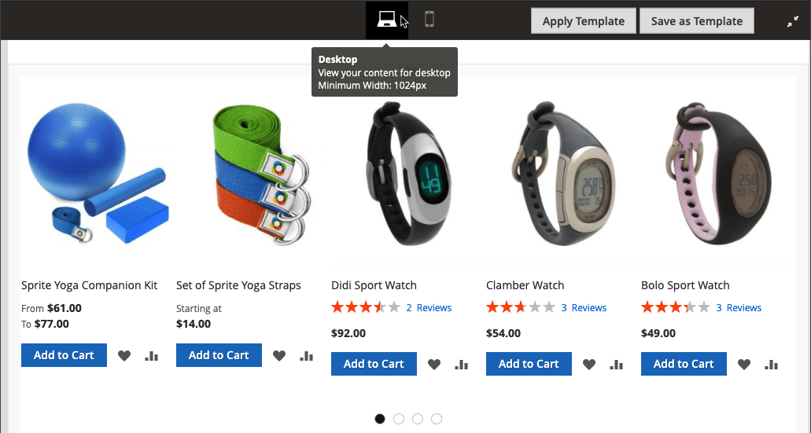

# [!DNL Page Builder] 작업 영역

날짜 [[!DNL Page Builder] 활성화됨](setup.md), _[!UICONTROL Content]_섹션 및 콘텐츠 작성 프로세스가 고급 기능을 활용하도록 수정되었습니다. [!DNL Page Builder] cms용 도구 [페이지](../content-design/page-add.md), [제품](../catalog/product-content.md) 및 [범주](../catalog/categories-content-settings.md) 페이지, [블록](../content-design/block-add.md), 및 [동적 블록](../content-design/dynamic-blocks.md). 이 섹션에는_&#x200B;컨텐츠 제목&#x200B;_필드, 콘텐츠 미리보기 및 전체 화면에 대한 쉬운 액세스 [!DNL Page Builder] 작업 영역.

![콘텐츠 섹션( [!DNL Page Builder] 미리보기](./assets/pb-content-preview.png){width="700" zoomable="yes"}

## 컨텐츠 제목

검색 엔진은 수준 1(H1) 제목을 검색하므로 수준 1 제목을 추가하면 페이지가 올바르게 색인화됩니다.

>[!NOTE]
>
>다음 _[!UICONTROL Content Heading]_페이지 맨 위에 표시되는 필드는 이전에 로 만든 콘텐츠를 지원하는 레거시 필드입니다 [!DNL Commerce] 릴리스. 그러나 이것의 일부분은 아닙니다 [!DNL Page Builder]. 다음 [!UICONTROL Content Heading] 는 현재 테마와 연결된 스타일 시트에 따라 H1 머리글로 서식이 지정됩니다. 에 의해 정의된 활성 콘텐츠 영역 바로 위에 위치합니다. [!DNL Page Builder] 스테이지.

모든 수준의 머리글 위치 및 서식을 가장 잘 제어하려면 _[!UICONTROL Content Heading]_필드가 비어 있고 [!DNL Page Builder] [제목](heading.md) 컨텐츠 유형.

{width="700" zoomable="yes"}

## 미리보기

를 확장할 때 _[!UICONTROL Content]_섹션과 함께 만들어진 기존 콘텐츠 있음 [!DNL Page Builder]에는 페이지에 표시되는 대로 콘텐츠 미리보기가 표시됩니다. 클릭&#x200B;**[!UICONTROL Edit with Page Builder]**또는 콘텐츠 미리보기 영역 내에서 [!DNL Page Builder] 필요한 업데이트를 수행할 수 있는 작업 영역입니다.

{width="500" zoomable="yes"}

>[!NOTE]
>
>제품 및 카테고리 양식의 경우 이 콘텐츠 미리보기는 기본적으로 활성화되지만 비활성화될 수 있습니다. 미리보기 로드로 인해 성능이 저하되는 경우 [콘텐츠 관리 구성](../configuration-reference/general/content-management.md#advanced-content-tools) 설정.

## 단계

를 열 때 [!DNL Page Builder] 미리보기의 작업 영역에서 스테이지는 콘텐츠를 만들고 형식을 지정하며 라이브 콘텐츠를 빠르게 편집할 수 있는 기본 작업 영역입니다. 스테이지는 처음에 비어 있으며 왼쪽 패널에서 행, 열 및 탭을 드래그할 수 있는 디자인 화면을 제공합니다.

>[!NOTE]
>
>2.4.1 릴리스부터 이제 콘텐츠 편집은에서 제어하는 모든 영역에 대해서만 전체 화면으로 제공됩니다 [!DNL Page Builder]- CMS 페이지, 제품 및 카테고리 페이지, 블록 및 동적 블록 전체 화면 편집은 콘텐츠에 중점을 두며 상점의 사용자 경험과 더 잘 일치하는 보기를 제공합니다.

{width="600" zoomable="yes"}

{{$include /help/_includes/page-builder-save-timeout.md}}

## 뷰포트

A _뷰포트_ 는 사용자에게 표시되는 웹 페이지의 표시 영역입니다. 전체 화면 디자인 모드에서 뷰포트 버튼은 [!DNL Page Builder] 스테이징하여 사이트 사용자가 상점 전면에서 볼 때 콘텐츠를 표시합니다.

{width="500" zoomable="yes"}

[!DNL Page Builder] 뷰포트의 중단점도 정의합니다. 중단점은 특정 스타일이 적용되는 최소 및 최대 폭을 정의합니다. 다음 [!DNL Page Builder] 뷰포트는 다음과 같은 콘텐츠 중단점을 제공합니다.

- **데스크톱 중단점**—`min-width: 1024px`. 이 중단점은 1024픽셀 및 더 넓게 측정되는 뷰포트 너비에 대해 정의된 스타일을 적용합니다.
- **모바일 중단점**—`max-width: 768px, min-width: 640px`. 이 중단점은 768픽셀과 640픽셀 사이의 뷰포트 너비에 대해 정의된 스타일을 적용합니다.

[!DNL Page Builder] 뷰포트는 다음 두 가지 기능을 제공합니다. **_콘텐츠 미리보기_** 및 **_중단점 설정_**.

### 콘텐츠 미리보기

기본적으로, [!DNL Page Builder] 는 두 개의 뷰포트 미리보기를 제공합니다.

- **데스크탑** — 미리 정의된 너비 없이 컨텐츠 미리 보기를 표시합니다. 데스크탑 정의 스타일(중단점 최소 너비 1024픽셀 사용)은 여전히 페이지에 적용됩니다. 그러나 데스크톱 뷰포트 너비는 행과 같은 컨테이너 콘텐츠 유형에 대한 설정으로 정의됩니다. 데스크탑 뷰포트를 선택하면 브라우저 페이지 너비가 1024픽셀 이상일 때 컨텐츠가 상점 첫 화면에서 어떻게 스타일링되는지 보여줍니다.

  {width="500" zoomable="yes"}

- **모바일** — 미리 정의된 너비 768픽셀로 컨텐트 미리보기를 표시합니다. 데스크탑 뷰포트와 달리 모바일 뷰포트에는 768픽셀(최대) 및 640픽셀(최소)의 중단점 너비에 대해 정의된 스타일과 함께 768픽셀 너비의 페이지 콘텐츠가 표시됩니다.

  {width="500" zoomable="yes"}

### 중단점 설정

뷰포트 버튼은 선택한 뷰포트를 기반으로 다양한 중단점 스타일을 콘텐츠 유형에 적용하는 옵션을 제공합니다. 기본적으로, [!DNL Page Builder] 에 중단점 설정을 제공합니다. _[!UICONTROL Minimum Height]_행, 열, 탭, 탭 항목, 배너, 슬라이더 및 슬라이드 필드. 모바일 뷰포트를 선택한 다음 이러한 컨텐츠 유형 중 하나에 대한 편집기를 열면 모바일 뷰포트 중단점과 관련된 필드 값을 입력할 수 있습니다. 특정 중단점 설정을 허용하는 콘텐츠 유형 필드는 행의 다음 예제와 유사하게 필드 오른쪽에 아이콘을 표시합니다.

{width="400"}

## 패널

다음 [!DNL Page Builder] 패널은 스테이지의 왼쪽에 있으며 스테이지로 드래그할 수 있는 컨텐츠 유형을 포함합니다. 그런 다음 콘텐츠 유형에 해당하는 컨테이너가 옵션 도구 상자와 함께 표시됩니다. 컨텐츠 유형은 다음과 같이 패널에 구성됩니다.

### 레이아웃

다음 _[!UICONTROL Layout]_의 섹션 [!DNL Page Builder] 패널은 단계에 행, 열 또는 탭을 추가하는 데 사용됩니다. 패널에서 스테이지로 콘텐츠 유형을 드래그하면 콘텐츠 유형에 해당하는 옵션 도구 상자가 있는 컨테이너가 나타납니다.

기본적으로 [!DNL Page Builder] 스테이지가 비어 있습니다. 패널에서 스테이지로 레이아웃 콘텐츠 유형을 드래그할 때 페이지의 다른 레이아웃 컨테이너 위, 아래 또는 내부에 배치할 수 있습니다. 행은 스테이지에 직접 추가될 수만 있습니다.

![[!DNL Page Builder] 레이아웃 컨텐츠 유형 및 단계가 있는 패널](./assets/pb-stage-toolbox.png){width="600" zoomable="yes"}

| 레이아웃 컨텐츠 유형 | 설명 |
| ------------------- |------------ |
| [행](row.md) | 새 행은 패널에서 스테이지로 드래그할 수만 있고 다른 행, 탭 또는 열 그룹의 위나 아래에 배치할 수 있습니다. 복제 옵션을 사용하여 기존 행의 복사본을 만들 수도 있습니다. |
| [열](column.md) | 열을 패널에서 스테이지로 드래그하거나 행 및 탭으로 드래그할 수 있습니다. 추가할 수 있는 최대 열 수는 [구성](setup.md). |
| [탭](tabs.md) | 단일 탭을 패널에서 스테이지로 드래그하거나 행 및 열로 드래그할 수 있습니다. 도구 상자에서 추가 탭을 추가할 수 있습니다. |

{style="table-layout:auto"}

### 요소

사용 _[!UICONTROL Elements]_의 섹션 [!DNL Page Builder] 패널 : 텍스트, 머리글, 단추, 디바이더 및 HTML 코드를 [[!DNL Page Builder] 단계](workspace.md#stage). 패널에서 콘텐트 유형을 행이나 열 또는 스테이지의 탭 세트로 드래그하면 컨테이너가 나타납니다. 콘텐츠 유형 도구 상자를 사용하여 해당 유형과 관련된 설정에 액세스합니다.

![[!DNL Page Builder] 요소 콘텐츠 유형이 있는 패널](./assets/pb-elements.png){width="600" zoomable="yes"}

| 요소 콘텐츠 유형 | 설명 |
| -------------------- | ----------- |
| [텍스트](text.md) | 텍스트 컨테이너 및 편집기를 스테이지에 추가합니다. |
| [제목](heading.md) | 스테이지에 제목 컨테이너를 추가합니다. |
| [버튼](buttons.md) | 개별 단추 또는 단추 세트에 대한 컨테이너를 스테이지에 추가합니다. |
| [분할자](divider.md) | 분할자의 컨테이너를 스테이지에 추가합니다. |
| [HTML 코드](html-code.md) | HTML 코드의 컨테이너를 스테이지에 추가합니다. |

{style="table-layout:auto"}

### 미디어

사용 _[!UICONTROL Media]_의 섹션 [!DNL Page Builder] 이미지, 비디오, 배너, 슬라이더 및 [!DNL Google Maps] 을(를) 의 모든 레이아웃 컨테이너에 [[!DNL Page Builder] 단계](workspace.md#stage). 미디어 콘텐츠 유형을 패널에서 스테이지로 드래그하면 콘텐츠 유형에 해당하는 옵션 도구 상자가 있는 컨테이너가 표시됩니다.

![[!DNL Page Builder] 미디어 콘텐츠 유형이 있는 패널](./assets/pb-media-content-types.png){width="600" zoomable="yes"}

| 미디어 콘텐츠 유형 | 설명 |
| ------------------- | ------------------------------------------ |
| [이미지](image.md) | 이미지 컨테이너를 스테이지에 추가합니다. |
| [비디오](video.md) | 비디오 컨테이너를 스테이지에 추가합니다. |
| [배너](banner.md) | 배너 컨테이너를 스테이지에 추가합니다. |
| [슬라이더](slider.md) | 스테이지에 슬라이더 컨테이너를 추가합니다. |
| [맵](map.md) | 를 추가합니다. [!DNL Google Maps] 컨테이너를 스테이지에 추가합니다. |

{style="table-layout:auto"}

### 콘텐츠 추가

사용 _[!UICONTROL Add Content]_의 섹션 [!DNL Page Builder] 패널에 기존 콘텐츠 추가 [[!DNL Page Builder] 단계](workspace.md#stage). 패널에서 미디어 콘텐츠 유형을 스테이지로 드래그하면 컨테이너가 나타납니다. 콘텐츠 유형 도구 상자를 사용하여_&#x200B;설정&#x200B;_유형에 따라 다릅니다.

![[!DNL Page Builder] 패널(콘텐츠 유형 추가)](./assets/pb-add-content.png){width="600" zoomable="yes"}

| 컨텐츠 유형 | 설명 |
| ---------------------------------------------------------------- | -------------------------------------------- |
| [차단](block.md) | 기존 블록을 스테이지에 추가합니다. |
| [동적 블록](dynamic-block.md) | 기존 동적 블록을 스테이지에 추가합니다. |
| [제품](products.md) | 제품 목록을 단계에 추가합니다. |
|  [제품 Recommendations](recommendations.md) | 스테이지에 추천 단위를 추가합니다. |

{style="table-layout:auto"}

## Toolbox

스테이지의 각 콘텐츠 컨테이너에는 옵션 도구 상자가 있습니다. 옵션은 콘텐츠 유형에 따라 다르지만, 일반적으로 이동, 설정, 숨기기/표시, 복제 및 제거를 포함합니다.

### 도구 상자 표시

도구 상자를 표시하고 옵션을 선택하려면 컨테이너 위로 마우스를 가져갑니다.

{width="600" zoomable="yes"}

### 도구 상자 옵션

| 옵션 | 아이콘 | 설명 |
| --------- | ---------------------------------------- | ------------ |
| 이동 | {width="25"} | 현재 콘텐츠 컨테이너를 스테이지의 다른 위치로 이동합니다. |
| 추가 | {width="25"} | 단추, 슬라이드 또는 탭과 같은 하위 요소를 추가합니다. |
| (레이블) |           | 컨테이너 콘텐츠 유형을 식별합니다. |
| 설정 | {width="25"} | 콘텐츠 컨테이너 속성을 편집 모드로 엽니다. |
| 숨기기 | {width="25"} | 현재 콘텐츠 컨테이너를 숨깁니다. |
| 표시 | {width="25"} | 현재 콘텐츠 컨테이너를 표시합니다. |
| 복제 | {width="25"} | 현재 콘텐츠 컨테이너의 복사본을 만듭니다. |
| 제거 | {width="25"} | 스테이지에서 현재 콘텐츠 컨테이너를 삭제합니다. |

{style="table-layout:auto"}

{{$include /help/_includes/page-builder-hidden-element-note.md}}
