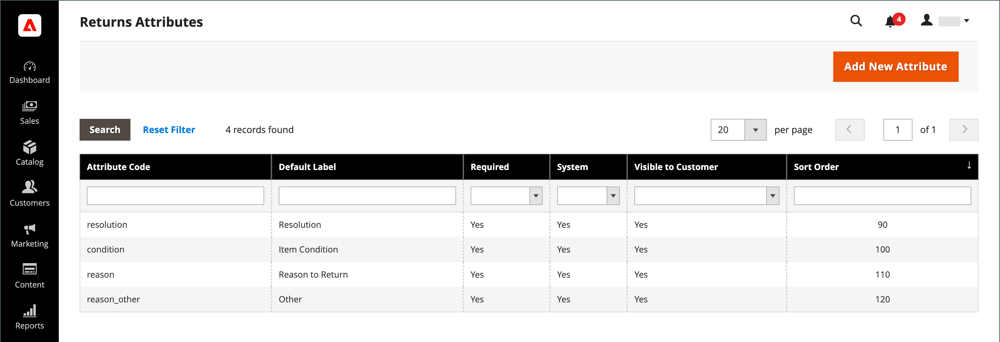

# 속성을 반환합니다.

{{ee-feature}}

반환 특성은 제품 반환 프로세스 중에 필요한 정보를 저장하는 데 사용됩니다. 기본 속성에는 반환된 제품의 상태, 반환 이유 및 반환이 해결된 방법을 나타내는 필드가 포함됩니다. 반환 특성을 만드는 프로세스는 [고객 특성](../customers/attribute-properties.md)을(를) 만드는 것과 비슷합니다.

{width="700" zoomable="yes"}

## 반환 속성 만들기

1. _관리자_ 사이드바에서 **[!UICONTROL Stores]** > _[!UICONTROL Attributes]_>**[!UICONTROL Returns]**(으)로 이동합니다.

1. 오른쪽 상단에서 **[!UICONTROL Add New Attribute]**&#x200B;을(를) 클릭합니다.

   {width="600" zoomable="yes"}

### 속성 정의

1. 데이터를 입력하는 동안 특성을 식별하려면 **[!UICONTROL Default Label]**&#x200B;을(를) 설정합니다.

1. **[!UICONTROL Attribute Code]**&#x200B;에 대해 시스템 내에서 특성을 식별하는 코드를 입력합니다.

1. 데이터 입력에 사용되는 입력 컨트롤의 형식을 확인하려면 **[!UICONTROL Input Type]**&#x200B;을(를) 다음 중 하나로 설정하십시오.

   - `Text Field`
   - `Text Area`
   - `Dropdown`
   - `Yes/No`
   - `File`
   - `Image File`

1. 필드를 필수 항목으로 만들려면 **[!UICONTROL Values Required]**&#x200B;을(를) `Yes`(으)로 설정하십시오.

1. 필드에 초기 값을 할당하려면 **[!UICONTROL Default Value]**&#x200B;을(를) 입력하십시오.

1. 레코드를 저장하기 전에 필드에 입력한 데이터의 정확성을 확인하려면 **[!UICONTROL Input Validation]**&#x200B;을(를) 다음 중 하나로 설정합니다.

   - `None`
   - `Alphanumeric`
   - `Alphanumeric with Space`
   - `Numeric Only`
   - `Alpha Only`
   - `URL`
   - `Email`

1. `Text Field` 및 `Text Area` 입력 유형에 대해 **[!UICONTROL Minimum Text Length]** 및 **[!UICONTROL Maximum Text Length]**&#x200B;을(를) 입력하십시오.

1. 전처리 필터를 적용하려면 **[!UICONTROL Input/Output Filter]**&#x200B;을(를) 다음 중 하나로 설정합니다.

   - `None`
   - `Strip HTML Tags`
   - `Escape  HTML Entities`

1. 특성이 고객에게 표시되도록 하려면 _[!UICONTROL Storefront Properties]_섹션에서&#x200B;**[!UICONTROL Show on Storefront]**을(를) `Yes`(으)로 설정하십시오.

1. (선택 사항) **[!UICONTROL Sort Order]**&#x200B;에 숫자를 입력하여 페이지의 동일한 부분에 있는 다른 속성과 관련하여 이 특성이 표시되는 위치를 결정합니다. (`0` = 첫 번째, `1` = 두 번째, `2` = 세 번째 등)

### 레이블/옵션 관리

1. 왼쪽 패널에서 **[!UICONTROL Manage Labels/Options]**&#x200B;을(를) 선택합니다.

1. **[!UICONTROL Manage Titles (Size, Color, etc.)]** 섹션에서 각 스토어 보기에 대한 레이블을 입력합니다.

   {width="600" zoomable="yes"}

1. 특성에 대한 **[!UICONTROL Input Type]**&#x200B;이(가) `Dropdown`인 경우 **[!UICONTROL Manage Options (Values of Your Attribute)]** 섹션에서 옵션을 관리합니다.

   - 옵션을 추가하려면 **[!UICONTROL Add Option]**&#x200B;을(를) 클릭하고 관리자 및 각 스토어 보기에 대한 레이블을 입력하십시오.
   - 선택한 기본값을 사용하려면 **[!UICONTROL Is Default]**&#x200B;을(를) 선택하십시오.
   - 옵션을 제거하려면 **[!UICONTROL Delete]**&#x200B;을(를) 클릭합니다.

1. 변경 내용을 저장하려면 **[!UICONTROL Save Attribute]**&#x200B;을(를) 클릭합니다.
