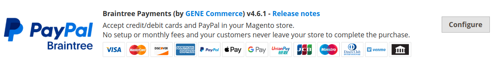
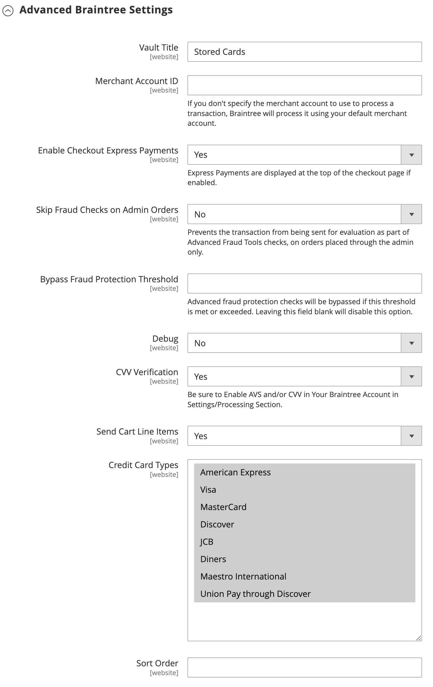
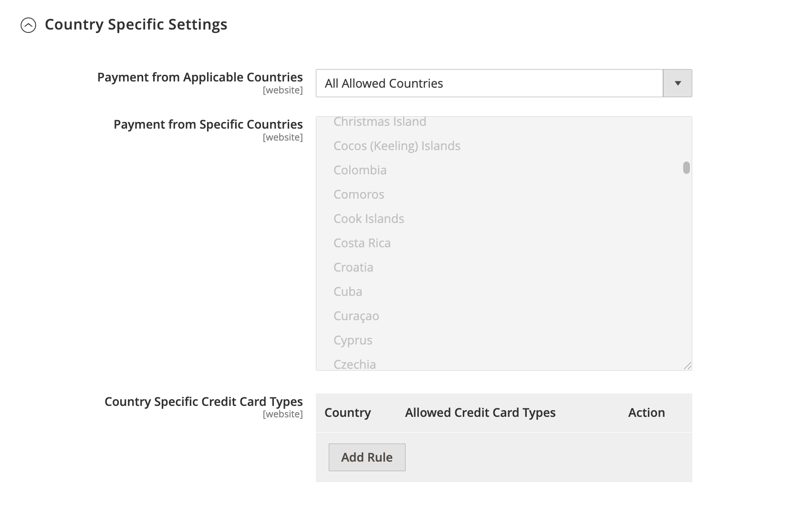
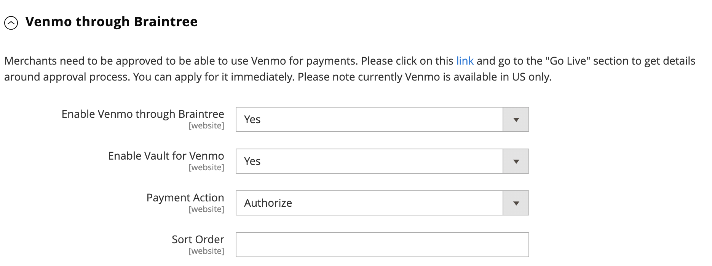
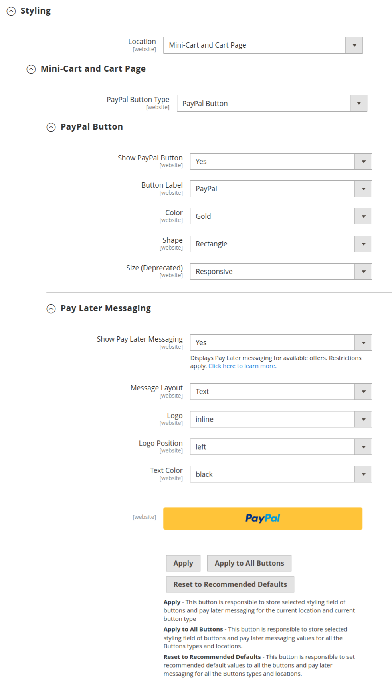

# Braintree

>[!IMPORTANT]
>
>예기치 않은 카드 요금에 대한 도움이 필요한 경우 [구독 취소](https://helpx.adobe.com/kr/manage-account/using/cancel-subscription.html) 페이지를 방문하여 도움을 받으십시오.

Braintree은 사기 행위 감지 및 PayPal 통합을 통해 사용자 지정 가능한 체크아웃 경험을 제공합니다. [!DNL Apple Pay], [!DNL Google Pay], ACH, Venmo 및 로컬 결제 방법을 지원합니다. Braintree은 거래가 Braintree 시스템에서 이루어지기 때문에 가맹점의 PCI 규정 준수 부담을 줄입니다. Braintree Payments 통합은 [GENE Commerce](https://www.gene.co.uk/gene-braintree-payments/)에서 개발되었습니다.

>[!NOTE]
>
>Commerce Marketplace의 Braintree 확장이 설치된 이전 버전의 Adobe Commerce 또는 Magento Open Source에서 2.4.x로 업그레이드하는 경우 이 페이지의 끝에 있는 [2.4 업그레이드 정보](#24-upgrade-notes)를 참조하십시오.

## 1단계: Braintree 자격 증명 가져오기

[Braintree 결제][1]&#x200B;(으)로 이동하여 계정에 등록하십시오.

## 2단계: 기본 설정 완료

1. _관리자_ 사이드바에서 **[!UICONTROL Stores]** > _[!UICONTROL Settings]_>**[!UICONTROL Configuration]**(으)로 이동합니다.

1. 왼쪽 패널에서 **[!UICONTROL Sales]**&#x200B;을(를) 확장하고 **[!UICONTROL Payment Methods]**&#x200B;을(를) 선택합니다.

   - Commerce 설치 시 왼쪽 상단 모서리에서 구성이 적용되는 **[!UICONTROL Store View]**&#x200B;을(를) 선택하십시오.

   - _[!UICONTROL Merchant Location]_&#x200B;섹션에서&#x200B;**[!UICONTROL Merchant Country]**&#x200B;이(가) 회사 위치로 설정되어 있는지 확인합니다.

1. _[!UICONTROL Recommended Solutions]_&#x200B;의_[!UICONTROL Braintree Payments] ([GENE Commerce](https://www.gene.co.uk/gene-braintree-payments/) v4.7.0 - [릴리스 정보](https://support.gene.co.uk/support/solutions/articles/35000278668)_섹션)에서&#x200B;**[!UICONTROL Configure]**&#x200B;을(를) 클릭합니다.

   {width="600" zoomable="yes"}

1. **[!UICONTROL Title]**&#x200B;의 경우 체크아웃 중에 결제 옵션으로 Braintree을 식별하는 제목을 입력하십시오.

1. Braintree 트랜잭션에 대한 현재 운영 체제 **[!UICONTROL Environment]**&#x200B;을(를) `Sandbox` 또는 `Production`(으)로 설정

   샌드박스에서 구성을 테스트할 때 Braintree에서 권장하는 [신용 카드 번호][2]만 사용하십시오. Braintree을 사용하여 프로덕션으로 이동할 준비가 되면 **[!UICONTROL Environment]**&#x200B;을(를) `Production`(으)로 설정하십시오.

   {width="600" zoomable="yes"}

1. **[!UICONTROL Payment Action]**&#x200B;을(를) 다음 중 하나로 설정합니다.

   - `Authorize Only` - 구매를 승인하고 자금을 보류합니다. 판매자가 _회수_&#x200B;할 때까지 고객의 은행 계좌에서 금액이 인출되지 않습니다.|
   - `Intent Sale` - 구매 금액이 승인되어 고객 계정에서 즉시 인출됩니다. **_참고:_** 이 값은 2.3.x 및 이전 릴리스의 _승인 및 캡처_&#x200B;입니다.|

1. Braintree 계정의 **[!UICONTROL Sandbox Merchant ID / Merchant ID]**&#x200B;을(를) 입력하십시오.

1. Braintree 계정에서 다음 자격 증명을 입력합니다.

   - **[!UICONTROL Sandbox Public Key / Public Key]**
   - **[!UICONTROL Sandbox Private Key / Private Key]**

   >[!NOTE]
   >
   >**(샌드박스 및 프로덕션)** 환경 모두에 대해 별도의 필드가 있으며, 다른 필드는 선택한 환경에 따라 렌더링됩니다.

1. 구성을 저장하기 전에 **[!UICONTROL Validate Credentials]**&#x200B;을(를) 클릭하여 자격 증명의 유효성을 검사합니다.

1. **[!UICONTROL Enable Card Payments]**&#x200B;을(를) `Yes`(으)로 설정합니다.

1. 고객이 구매할 때마다 다시 입력할 필요가 없도록 고객 정보를 안전하게 저장하려면 **[!UICONTROL Enable Vault for Card Payments]**&#x200B;을(를) `Yes`(으)로 설정하십시오.

1. 고객이 구매할 때마다 저장된 카드의 CVV 번호를 확인하려면 **[!UICONTROL Enable Vault CVV Re-verification]**&#x200B;을(를) `Yes`(으)로 설정하십시오.

## 3단계: 고급 설정 완료

1. **[!UICONTROL Advanced Braintree Settings]** 섹션에서 를 확장합니다.

   {width="550" zoomable="yes"}

1. **[!UICONTROL Vault Title]**&#x200B;의 경우 고객 카드 정보가 저장된 자격 증명 모음을 식별하는 참조를 설명하는 제목을 입력합니다.

1. Braintree 계정의 **[!UICONTROL Merchant Account ID]**&#x200B;을(를) 입력하십시오.

   사용할 머천트 계정을 지정하지 않는 경우 Braintree은 기본 머천트 계정을 사용하여 거래를 처리합니다.

1. PayPal, PayLater, Apple Pay 및 Google Pay를 포함하여 체크아웃 프로세스가 시작될 때 빠른 결제 옵션을 통해 더 빠른 체크아웃 환경을 제공하려면 **[!UICONTROL Enable Checkout Express Payments]**&#x200B;을(를) `Yes`(으)로 설정하십시오.

1. 관리자를 통해 주문한 주문에 대해 고급 사기 도구 검사의 일부로 평가를 위해 트랜잭션을 보내지 못하게 하려면 **[!UICONTROL Skip Fraud Checks on Admin Orders]**&#x200B;을(를) `Yes`(으)로 설정하십시오.

1. 임계값이 충족되거나 초과될 때 `Advanced Fraud Protection` 검사를 무시하도록 **[!UICONTROL Bypass Fraud Protection Threshold]**&#x200B;을(를) 설정하십시오.

   이 필드를 비워 두면 이 옵션이 비활성화됩니다.

1. 스토어와 Braintree 간의 상호 작용에 대한 로그 파일을 저장하려면 **[!UICONTROL Debug]**&#x200B;을(를) `Yes`(으)로 설정하십시오.

1. 고객이 신용 카드 뒷면에서 3자리 보안 코드를 제공하도록 하려면 **[!UICONTROL CVV Verification]**&#x200B;을(를) `Yes`(으)로 설정합니다.

   CVV 인증을 사용하는 경우 Braintree 계정의 _설정/처리_ 섹션에서 AVS 및/또는 CVV를 사용하도록 설정하십시오.

1. 모든 결제 방법에 대해 장바구니 라인 항목을 보내려면 **[!UICONTROL Send Card Line Items]**&#x200B;을(를) `Yes`(으)로 설정하십시오.

1. **[!UICONTROL Credit Card Types]**&#x200B;의 경우 스토어에서 Braintree을 통한 결제로 수락할 각 신용 카드를 선택하십시오.

   여러 카드 유형을 선택하려면 Ctrl 키(PC) 또는 Command 키(Mac)를 누른 채 각 옵션을 클릭합니다.

1. **[!UICONTROL Sort Order]**&#x200B;의 경우 체크아웃 중에 다른 결제 방법과 함께 나열될 때 Braintree이 표시되는 순서를 확인하려면 번호를 입력하십시오.

## 4단계: Braintree 웹후크 설정 완료

{width="600" zoomable="yes"}

1. 사기 방지, ACH 결제 및 로컬 결제 방법을 위해 웹후크 기능을 사용하려면 **[!UICONTROL Enable Webhook]**&#x200B;을(를) `Yes`(으)로 설정하십시오.

1. **[!UICONTROL Fraud Protection URL]** 필드의 URL을 복사하여 Braintree 계정에 _[!UICONTROL Webhook Destination URL]_(으)로 추가하십시오.

   >[!IMPORTANT]
   >
   >이 URL은 안전하고 공개적으로 액세스할 수 있어야 합니다.

1. **[!UICONTROL Fraud Protection Approve Order Status]** 필드를 설정하여 Braintree에서 사기 행위 보호를 승인하는 시기를 확인합니다.

   선택한 주문 상태가 Commerce 주문에 할당됩니다.

1. **[!UICONTROL Fraud Protection Reject Order Status]** 필드를 설정하여 Braintree에서 사기 행위 보호를 거부하는 시기를 확인합니다.

   선택한 주문 상태가 Commerce 주문에 할당됩니다.

## 5단계: 국가별 설정 완료

1. **[!UICONTROL Payment from Applicable Countries]**&#x200B;을(를) 다음 중 하나로 설정합니다.

   - `All Allowed Countries` - 스토어 구성에 지정된 모든 [국가](../getting-started/store-details.md#country-options)의 고객이 이 결제 방법을 사용할 수 있습니다.
   - `Specific Countries` - 이 옵션을 선택하면 _[!UICONTROL Payment from Specific Countries]_&#x200B;목록이 나타납니다. Ctrl 키(PC) 또는 Command 키(Mac)를 누른 채로 목록에서 고객이 스토어에서 구매할 수 있는 각 국가를 선택합니다.

   {width="600" zoomable="yes"}

1. **[!UICONTROL Country Specific Credit Card Types]**&#x200B;을(를) 설정하려면:

   - **[!UICONTROL Add]**&#x200B;을(를) 클릭합니다.

   - **[!UICONTROL Country]**&#x200B;을(를) 설정하고 각 **[!UICONTROL Allowed Credit Card Type]**&#x200B;을(를) 선택하십시오.

   - 각 국가에서 수락하는 신용 카드를 식별하려면 이 단계를 반복합니다.

## 6단계: Braintree 설정을 통해 ACH 완료

{width="600" zoomable="yes"}

1. ACH를 Braintree의 결제 옵션으로 포함하려면 **[!UICONTROL Enable ACH Direct Debit]**&#x200B;을(를) `Yes`(으)로 설정하십시오.

1. 고객은 일회용 ACH 직불 결제 방법을 보관하고 나중에 사용할 수 있도록 저장할 수 있습니다. 저장하면 **[!UICONTROL Enable Vault for ACH Direct Debit]**&#x200B;을(를) `Yes`(으)로 설정한 경우 고객이 결제 정보를 다시 입력하거나 인증할 필요 없이 ACH 직불카드를 다시 사용할 수 있습니다.

1. **[!UICONTROL Sort Order]**&#x200B;의 경우 체크아웃 중에 다른 결제 옵션과 함께 나열될 때 Braintree ACH 결제 옵션이 표시되는 순서를 결정하는 숫자를 입력합니다.

## 7단계: Braintree 설정을 통해 [!UICONTROL Apple Pay] 완료

{width="600" zoomable="yes"}

1. Braintree에서 결제 옵션으로 [!DNL Apple Pay]을(를) 포함하려면 **[!UICONTROL Enable ApplePay through Braintree]**&#x200B;을(를) `Yes`(으)로 설정하십시오.

   먼저 Braintree 계정에서 [도메인 이름을 확인](https://developer.paypal.com/braintree/docs/guides/apple-pay/configuration/javascript/v3)하세요.

1. 고객이 Apple Pay를 사용하여 구매할 때마다 다시 입력할 필요가 없도록 고객 정보를 안전하게 저장하려면 **[!UICONTROL Enable Vault for ApplePay]**&#x200B;을(를) `Yes`(으)로 설정하십시오.

1. **[!UICONTROL Payment Action]**&#x200B;을(를) 다음 중 하나로 설정합니다.

   - `Authorize Only` - 구매를 승인하고 자금을 보류합니다. 판매자가 판매를 _캡처_&#x200B;할 때까지 고객의 은행 계좌에서 금액이 인출되지 않습니다.
   - `Intent Sale` - 구매 금액이 승인되어 고객 계정에서 즉시 인출됩니다.

1. **[!UICONTROL Merchant Name]**&#x200B;의 경우 Apple 결제 대화 상자에서 고객에게 표시되는 레이블을 지정하는 텍스트를 입력하십시오.

1. **[!UICONTROL Sort Order]**&#x200B;의 경우 체크아웃 중에 다른 결제 옵션과 함께 나열될 때 [!DNL Apple Pay] 결제 옵션이 표시되는 순서를 결정하려면 숫자를 입력하십시오.

## 8단계: 로컬 결제 방법 설정 완료

1. 로컬 결제 방법을 Braintree의 결제 방법으로 포함하려면 **[!UICONTROL Enable Local Payment Methods]**&#x200B;을(를) `Yes`(으)로 설정하십시오.

1. **[!UICONTROL Title]**&#x200B;의 경우 체크아웃 결제 방법 섹션에 나타나는 레이블에 사용할 텍스트를 입력하십시오(기본값: `Local Payments`).

1. **[!UICONTROL Fallback Button Text]**&#x200B;에 대해 대체 Braintree 페이지에 나타나는 단추에 사용할 텍스트를 입력하여 고객을 웹 사이트로 다시 안내합니다(예: `Complete Checkout`).

1. **[!UICONTROL Redirect on Fail]**&#x200B;에 로컬 결제 방법 트랜잭션이 취소되거나 실패하거나 오류가 발생할 때 고객을 리디렉션해야 하는 URL을 입력하십시오. 결제 페이지(예: `https://www.domain.com/checkout#payment`)여야 합니다.

1. **[!UICONTROL Allowed Payment Methods]**&#x200B;에 대해 사용할 로컬 결제 방법을 선택하십시오.

   옵션: `Bancontact` / `EPS` / `giropay` / `iDeal` / `Klarna Pay Now` / `SOFORT` / `MyBank` / `P24` / `SEPA/ELV Direct Debit` (아직 지원되지 않음)

   {width="600" zoomable="yes"}

   >[!NOTE]
   >
   >번들형 Braintree 확장은 [Braintree 개발자 설명서](https://developer.paypal.com/braintree/docs/guides/local-payment-methods/overview)에 나열된 모든 로컬 결제 방법을 지원하지 않습니다. 다른 로컬 결제 방법은 향후 릴리스에서 지원될 예정입니다.

1. **[!UICONTROL Sort Order]**&#x200B;의 경우 체크아웃 중에 다른 결제 옵션과 함께 나열될 때 로컬 결제 방법이 표시되는 순서를 결정하려면 숫자를 입력하십시오.

## 9단계: Braintree 설정을 통해 [!DNL Google Pay] 완료

{width="600" zoomable="yes"}

1. Braintree에서 결제 옵션으로 [!DNL Google Pay]을(를) 포함하려면 **[!UICONTROL Enable GooglePay Through Braintree]**&#x200B;을(를) `Yes`(으)로 설정하십시오.

1. 고객이 Google Pay를 사용하여 구매할 때마다 다시 입력할 필요가 없도록 고객 정보를 안전하게 저장하려면 **[!UICONTROL Enable Vault for GooglePay]**&#x200B;을(를) `Yes`(으)로 설정하십시오.

1. **[!UICONTROL Payment Action]**&#x200B;을(를) 다음 중 하나로 설정합니다.

   - `Authorize Only` - 구매를 승인하고 자금을 보류합니다. 판매자가 판매를 _캡처_&#x200B;할 때까지 고객의 은행 계좌에서 금액이 인출되지 않습니다.
   - `Intent Sale` - 구매 금액이 승인되어 고객 계정에서 즉시 인출됩니다.

1. **[!UICONTROL Button Color]**&#x200B;을(를) 설정하여 [!DNL Google Pay] 단추의 색을 결정합니다. `White` 또는 `Black`

1. **[!UICONTROL Merchant ID]**&#x200B;의 경우 MerchantID(Google 제공)를 입력하십시오.

1. **[!UICONTROL Accepted Cards]**&#x200B;의 경우 고객이 [!DNL Google Pay]을(를) 사용하여 주문하는 데 사용할 수 있는 카드 유형을 선택하십시오.

   옵션: `Visa` / `MasterCard` / `AMEX` / `Discover` / `JCB`

1. **[!UICONTROL Sort Order]**&#x200B;의 경우 체크아웃 중에 다른 결제 옵션과 함께 나열될 때 [!DNL Google Pay]이(가) 표시되는 순서를 확인하려면 숫자를 입력하세요.

## 10단계: Braintree 설정을 통해 Venmo 완료

1. Braintree에서 결제 옵션으로 Venmo를 포함하려면 **[!UICONTROL Enable Venmo through Braintree]**&#x200B;을(를) `Yes`(으)로 설정하십시오.

1. **[!UICONTROL Enable Vault for Venmo]**&#x200B;을(를) `Yes`(으)로 설정하여 고객의 Venmo 계정을 저장할 수 있도록 하여 고객이 향후 트랜잭션을 위해 Venmo 계정에 다시 로그인할 필요가 없도록 합니다.

   {width="600" zoomable="yes"}

1. **[!UICONTROL Payment Action]**&#x200B;을(를) 다음 중 하나로 설정합니다.

   - `Authorize Only` - 구매를 승인하고 자금을 보류합니다. 판매자가 판매를 _캡처_&#x200B;할 때까지 고객의 은행 계좌에서 금액이 인출되지 않습니다.
   - `Intent Sale` - 구매 금액이 승인되어 고객 계정에서 즉시 인출됩니다.

1. **[!UICONTROL Sort Order]**&#x200B;의 경우 체크아웃 중에 다른 결제 옵션과 함께 나열될 때 Venmo가 표시되는 순서를 확인하려면 숫자를 입력하세요.

## 11단계: Braintree 설정을 통해 PayPal 완료

{width="550" zoomable="yes"}

1. PayPal을 Braintree의 결제 옵션으로 포함하려면 **[!UICONTROL Enable PayPal through Braintree]**&#x200B;을(를) `Yes`(으)로 설정하십시오.

1. Braintree 결제 방법을 통해 PayPal을 지정하십시오.

   >[!NOTE]
   >
   >**[!DNL PayPal Credit]** 또는 **[!DNL PayPal PayLater]**&#x200B;을(를) 사용하도록 설정할 수 있습니다. 두 메서드를 동시에 활성화할 수 없습니다.

   - Braintree에서 결제 옵션으로 [!DNL PayPal Credit]을(를) 포함하려면 **[!UICONTROL Enable PayPal Credit through Braintree]**&#x200B;을(를) `Yes`(으)로 설정하십시오.

     **Braintree을 통해 PayPal 사용**&#x200B;을(를) `Yes`(으)로 설정하면 이 필드만 표시됩니다.

     >[!NOTE]
     >
     >PayPal 크레딧은 미국과 영국에서만 사용할 수 있습니다. _[!UICONTROL Merchant Country]_&#x200B;필드에 대해 선택한 값이 `US` 또는 `UK`이(가) 아닌 경우 PayPal 크레딧을 사용할 수 없습니다.

   - Braintree에서 결제 옵션으로 [!DNL PayPal PayLater]을(를) 포함하려면 **[!UICONTROL Enable PayPal PayLater through Braintree]**&#x200B;을(를) `Yes`(으)로 설정하십시오.

     **[!UICONTROL Enable PayPal PayLater through Braintree]**&#x200B;을(를) `Yes`(으)로 설정하면 이 필드만 표시됩니다.

     _3_&#x200B;에서 지불(Pay in 3)과 같은 오퍼에 대해 사이트에 PayLater 메시지를 표시하여 고객이 무이자 월별 3회 지불로 결제할 수 있습니다. Braintree 통합은 이 기능을 홍보하기 위해 사이트에 메시지를 표시할 수 있습니다. 다른 콘텐츠, 마케팅 또는 자료와 함께 PayLater 오퍼를 홍보할 수 없습니다.

1. **[!UICONTROL Title]**&#x200B;의 경우 체크아웃 중에 PayPal로 결제하는 Braintree 결제 방법을 나타내는 제목을 입력하십시오.

1. **[!UICONTROL Vault Enabled]**&#x200B;을(를) `Yes`(으)로 설정하여 고객의 PayPal 계정을 저장하는 보안 자격 증명 모음을 사용하도록 설정합니다. 저장된 PayPal 계정은 향후 거래에 사용할 수 있으며, 이렇게 하면 고객의 단계 수가 줄어듭니다.

1. **[!UICONTROL Send Cart Line Items for PayPal]**&#x200B;을(를) `Yes`(으)로 설정하여 PayPal에 기프트 카드, 항목에 대한 선물 포장, 주문에 대한 선물 포장, 스토어 크레딧, 배송 및 세금과 함께 라인 항목(주문 항목)을 보냅니다.

1. **[!UICONTROL Sort Order]**&#x200B;의 경우 체크아웃 중에 다른 결제 옵션과 함께 나열될 때 Braintree PayPal 결제 옵션이 표시되는 순서를 결정하려면 숫자를 입력하십시오.

1. 판매자 이름을 [스토어 구성](../getting-started/store-details.md#store-information)에 정의된 것과 다르게 표시하려면 **[!UICONTROL Override Merchant Name]** 필드에 표시할 이름을 입력하십시오.

1. **[!UICONTROL Payment Action]**&#x200B;을(를) 다음 중 하나로 설정합니다.

   - `Authorize Only` - 구매를 승인하고 자금을 보류합니다. 판매자가 판매를 _캡처_&#x200B;할 때까지 고객의 은행 계좌에서 금액이 인출되지 않습니다.
   - `Authorize and Capture` - 구매 금액이 승인되어 고객 계정에서 즉시 인출됩니다.

1. PayPal에서 처리하는 Braintree 트랜잭션에 대해 **[!UICONTROL Payment from Applicable Countries]**&#x200B;을(를) 다음 중 하나로 설정합니다.

   - `All Allowed Countries` - 스토어 구성에 지정된 모든 [국가](../getting-started/store-details.md#country-options)의 고객이 이 결제 방법을 사용할 수 있습니다.
   - `Specific Countries` - 이 옵션을 선택하면 _[!UICONTROL Payment from Specific Countries]_&#x200B;목록이 나타납니다. Ctrl 키(PC) 또는 Command 키(Mac)를 누른 채로 목록에서 고객이 스토어에서 구매할 수 있는 각 국가를 선택합니다.

   {width="550" zoomable="yes"}

1. 고객이 청구 주소를 제공하도록 하려면 **[!UICONTROL Require Customer's Billing Address]**&#x200B;을(를) `Yes`(으)로 설정하십시오.

   >[!NOTE]
   >
   >이 기능은 PayPal 기술 지원에서 계정에 대해 활성화해야 합니다.

1. PayPal Express의 주문 검토 페이지를 건너뛰려면 **[!UICONTROL Skip Order Review Step]**&#x200B;을(를) `Yes`(으)로 설정하십시오.

   PayPal Express로 결제하는 고객의 경우: 결제를 완료하기 전에 고객이 리뷰 페이지로 리디렉션되도록 하려면 `No`(으)로 설정하십시오. 고객이 검토 페이지를 건너뛰도록 하려면 `Yes`(으)로 설정하십시오.

1. Braintree을 통해 스토어와 PayPal 간의 상호 작용에 대한 로그 파일을 저장하려면 **[!UICONTROL Debug]**&#x200B;을(를) `Yes`(으)로 설정합니다.

1. 미니 장바구니와 장바구니 페이지 모두에 PayPal 단추를 표시하려면 **[!UICONTROL Display on Shopping Cart]**&#x200B;을(를) `Yes`(으)로 설정하십시오.

1. 패키지 추적 정보를 PayPal로 보내려면 **[!UICONTROL Send Package Tracking]**&#x200B;을(를) `Yes`(으)로 설정하십시오.

   패키지 추적 정보는 PayPal 거래/주문에 대해서만 PayPal로 전송됩니다. [!UICONTROL Package Tracking] 기능이 제대로 작동하려면 [!UICONTROL Send Cart Line Items for PayPal] 구성 필드를 활성화해야 합니다.

1. PayPal을 통해 구매자나 결제자에게 패키지 추적 업데이트를 알리려면 **[!UICONTROL Use PayPal's "Notify Payer" functionality]**&#x200B;을(를) `Yes`(으)로 설정하십시오.

## 12단계: 스타일 설정 설정

1. **[!UICONTROL Location]**&#x200B;의 경우 PayPal 단추 및 메시지를 렌더링할 위치를 선택하십시오. `Mini-Cart and Cart Page`, `Checkout Page` 또는 `Product Page`

   {width="600" zoomable="yes"}

### [!UICONTROL Mini-Cart and Cart Page]

이 섹션의 옵션 및 설정은 _[!UICONTROL Location]_&#x200B;필드의 설정에 따라 다릅니다.

1. **[!UICONTROL PayPal Button Type]**&#x200B;을(를) 다음 세 가지 유형의 단추 중 하나로 설정합니다. `PayPal Button` / `PayPal Pay Later Button` / `PayPal Credit Button`

**[!UICONTROL PayPal Button]**

이 섹션의 옵션 및 설정은 _[!UICONTROL PayPal Button Type]_&#x200B;필드에서 선택한 단추 유형에 따라 다릅니다.

1. 선택한 위치의 상점 앞에 PayPal 단추를 표시하려면 **[!UICONTROL Show PayPal Button]**&#x200B;을(를) `Yes`(으)로 설정하십시오.

1. **[!UICONTROL Button Label]**&#x200B;에 대해 PayPal 단추 레이블 `Paypal`, `Checkout`, `Buynow` 또는 `Pay`을(를) 선택하십시오.

1. **[!UICONTROL Color]**&#x200B;의 경우 PayPal 단추 색상: `Blue`, `Black`, `Gold` 또는 `Silver`을(를) 선택하십시오.

1. **[!UICONTROL Shape]**&#x200B;에 대해 PayPal 단추 셰이프 `Pill` 또는 `Rectangle`을(를) 선택하십시오.

1. **[!UICONTROL Size (Deprecated)]**&#x200B;의 경우 PayPal 단추 크기(`Medium`, `Large` 또는 `Responsive`)를 선택하십시오.

>[!NOTE]
>
>**[!DNL Size(Deprecated)]** 구성 필드는 더 이상 사용되지 않으며 PayPal 단추 스타일에 사용되지 않습니다.

이러한 옵션이 설정되면 PayPal 버튼의 미리 보기를 볼 수 있습니다. 설정을 적용하거나 값을 재설정하는 데 사용할 수 있는 컨트롤이 있습니다.

- 단추 및 PayLater 메시지에 대해 선택한 스타일 설정을 저장하고 현재 위치 및 현재 단추 유형에 적용하려면 **[!UICONTROL Apply]**&#x200B;을(를) 클릭합니다.

- 단추 및 PayLater 메시지 값에 대해 선택한 스타일 설정을 저장하고 모든 단추 유형 및 위치에 적용하려면 **[!UICONTROL Apply to All Buttons]**&#x200B;을(를) 클릭합니다.

- 단추 및 PayLater 메시지에 대한 권장 기본값으로 스타일 설정을 반환하고 모든 단추 유형 및 위치에 적용하려면 **[!UICONTROL Reset to Recommended Defaults]**&#x200B;을(를) 클릭합니다.

## 13단계: 나중에 결제 메시지

**[!UICONTROL Product Page]**

{width="600" zoomable="yes"}

1. 제품 페이지의 상점 첫 화면에 [!DNL Pay Later] 메시지를 표시하려면 **[!UICONTROL Show PayLater Messaging]**&#x200B;을(를) `Yes`(으)로 설정하십시오.

   사용 가능한 오퍼에 대해 나중에 지급 메시지를 표시합니다. 제한이 적용됩니다. [PayPal 설명서](https://developer.paypal.com/studio/checkout/pay-later/us)를 참조하세요.

1. **[!UICONTROL Message Layout]**&#x200B;의 경우 [!DNL Pay Later] 메시지 레이아웃을 선택하십시오. `Text` 또는 `Flex`

1. **[!UICONTROL Logo]**&#x200B;의 경우 PayPal 로고 형식(`Inline`, `Primary`, `Alternative` 또는 `None`)을 선택하십시오.

1. **[!UICONTROL Logo Position]**&#x200B;의 경우 PayPal 로고 위치: `Left`, `Right` 또는 `Top`을(를) 선택하십시오.

1. **[!UICONTROL Text Color]**&#x200B;의 경우 [!DNL PayLater] 메시지 텍스트 색(`Black`, `White`, `Monochrome` 또는 `Grayscale`)을 선택하십시오.

**[!UICONTROL Cart]**

{width="600" zoomable="yes"}

1. 미니 장바구니 또는 장바구니 페이지의 상점 첫 화면에 [!DNL Pay Later] 메시지를 표시하려면 **[!UICONTROL Show PayLater Messaging]**&#x200B;을(를) `Yes`(으)로 설정하십시오.

   사용 가능한 오퍼에 대해 나중에 지급 메시지를 표시합니다. 제한이 적용됩니다. [PayPal 설명서](https://developer.paypal.com/studio/checkout/pay-later/us)를 참조하세요.

1. **[!UICONTROL Message Layout]**&#x200B;의 경우 [!DNL Pay Later] 메시지 레이아웃을 선택하십시오. `Text` 또는 `Flex`

1. **[!UICONTROL Logo]**&#x200B;의 경우 PayPal 로고 형식(`Inline`, `Primary`, `Alternative` 또는 `None`)을 선택하십시오.

1. **[!UICONTROL Logo Position]**&#x200B;의 경우 PayPal 로고 위치: `Left`, `Right` 또는 `Top`을(를) 선택하십시오.

1. **[!UICONTROL Text Color]**&#x200B;의 경우 [!DNL PayLater] 메시지 텍스트 색(`Black`, `White`, `Monochrome` 또는 `Grayscale`)을 선택하십시오.

**[!UICONTROL Checkout]**

{width="600" zoomable="yes"}

1. 체크아웃 시 상점 첫 화면에서 [!DNL Pay Later] 메시지를 표시하려면 **[!UICONTROL Show PayLater Messaging]**&#x200B;을(를) `Yes`(으)로 설정하십시오.

   사용 가능한 오퍼에 대해 나중에 지급 메시지를 표시합니다. 제한이 적용됩니다. [PayPal 설명서](https://developer.paypal.com/studio/checkout/pay-later/us)를 참조하세요.

1. **[!UICONTROL Text Align]**&#x200B;의 경우 [!DNL Pay Later] 메시지에 대해 텍스트 정렬을 선택하십시오. `Text` 또는 `Center` 또는 `Right`

1. **[!UICONTROL Text Color]**&#x200B;의 경우 [!DNL Pay Later] 메시지 텍스트 색: `Black`, `White`을(를) 선택하십시오.

## 14단계: 3D 확인 설정 완료

1. 인증 프로그램(예: _VISA에서 확인_)에 등록된 신용 카드를 사용하는 고객에 대한 인증 단계를 추가하려면 **[!UICONTROL 3D Secure Verification]**&#x200B;을(를) `Yes`(으)로 설정하십시오.

   이 프로세스 중에 검증을 위해 제출된 트랜잭션 금액이 승인을 위해 전송된 금액과 대조됩니다.

2. 모든 트랜잭션에 대해 항상 3D 보안 요청에 도전하려면 **[!UICONTROL Always request 3DS]**&#x200B;을(를) `Yes`(으)로 설정합니다.

3. **[!UICONTROL Threshold Amount]**&#x200B;의 경우 3D 확인을 트리거하는 데 필요한 최소 주문 수량을 입력하십시오.

4. **[!UICONTROL Verify for Applicable Countries]**&#x200B;을(를) 다음 중 하나로 설정합니다.

   - `All Allowed Countries` - 스토어 구성에 지정된 모든 [국가](../getting-started/store-details.md#country-options)의 고객이 이 결제 방법을 사용할 수 있습니다.
   - `Specific Countries` - 이 옵션을 선택하면 _[!UICONTROL Verify for Specific Countries]_&#x200B;목록이 나타납니다. Ctrl 키(PC) 또는 Command 키(Mac)를 누른 채로 목록에서 고객이 스토어에서 구매할 수 있는 각 국가를 선택합니다.

   {width="600" zoomable="yes"}

## 15단계: Braintree 동적 설명자 설정

다음 설명자는 고객 신용 카드 명세서에서의 구매를 식별하는 데 사용됩니다. 각 구매와 연관된 회사를 명확하게 식별하여 충전의 수를 줄일 수 있습니다. 계정에 대해 동적 설명자가 활성화되지 않은 경우 Braintree 지원 센터에 문의하십시오.

{width="600" zoomable="yes"}

1. 다음 지침에 따라 **[!UICONTROL Name]**, **[!UICONTROL Phone]** 및 **[!UICONTROL URL]**&#x200B;에 대한 동적 설명자를 입력하십시오.

   - **[!UICONTROL Name]** - 이름 설명자에 별표(*)로 구분된 두 부분이 있습니다. For example:

     `company*myproduct`

     설명자의 첫 번째 부분은 회사 또는 DBA를 식별하고 두 번째 부분은 제품을 식별합니다. 설명자의 `company` 및 `product` 부분의 길이는 최대 22자의 조합 길이에 대해 다음과 같은 방법으로 할당할 수 있습니다.

     **_이름 설명자의 문자_**

     _옵션 1:_ `Company`은(는) 3자여야 하며 `Product`은(는) 최대 18자일 수 있습니다.

     _옵션 2:_ `Company`은(는) 7자여야 하며 `Product`은(는) 최대 14자일 수 있습니다.

     _옵션 3_: `Company`은(는) 12자여야 하며 `Product`은(는) 9자까지 가능합니다.

   - **[!UICONTROL Phone]** - 전화 설명자 길이는 10~14자여야 하며 숫자, 대시, 괄호 및 마침표만 포함할 수 있습니다. For example:

     `9999999999`

     `(999) 999-9999`

     `999.999.9999`

   - **[!UICONTROL URL]** - URL 설명자는 도메인 이름을 나타내며 최대 13자까지 가능합니다. For example:

     `company.com`

1. Braintree 구성이 완료되면 **[!UICONTROL Save Config]**&#x200B;을(를) 클릭합니다.

## 2.4 업그레이드 정보

Adobe Commerce 및 Magento Open Source 2.4.0부터 Braintree 확장이 릴리스에 포함됩니다. Marketplace Braintree 확장이 설치된 2.4.0 이전 버전에서 Commerce 2.4.x로 마이그레이션하는 경우 해당 확장(`paypal/module-braintree` 또는 `gene/module-braintree`)을 제거하고 `Magento_Braintree` 대신 `PayPal_Braintree` 네임스페이스를 사용하도록 코드 사용자 지정을 업데이트해야 합니다. Commerce Marketplace에 배포된 핵심 Commerce Braintree 결제 번들 확장 기능 및 확장 기능의 구성 설정이 유지되며 이러한 이전 버전과 함께 배치된 결제는 정상적으로 캡처, 무효화 또는 환급될 수 있습니다.

[1]: https://www.braintreepayments.com/
[2]: https://developers.braintreepayments.com/reference/general/testing/php
