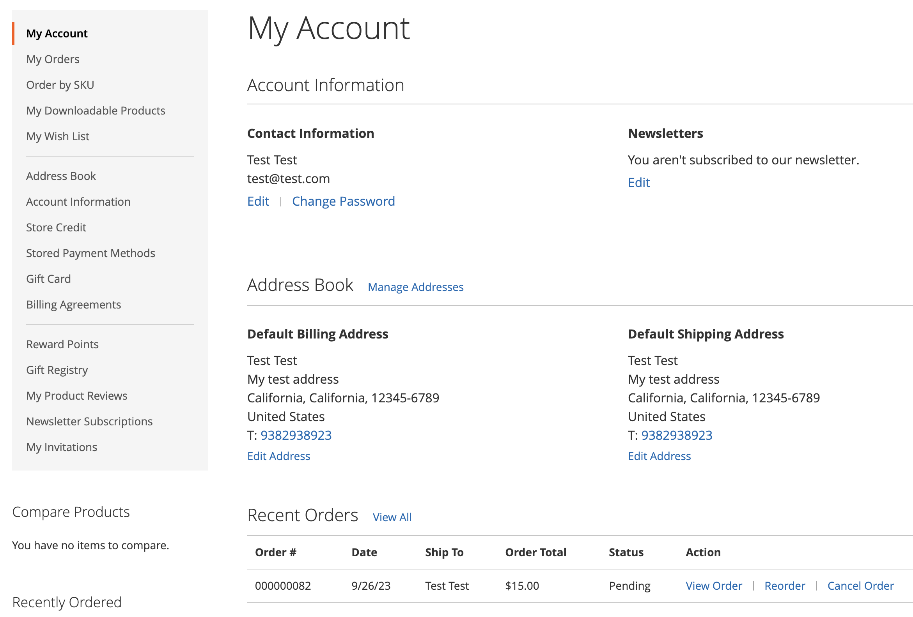

# 주문 취소 허용

활성화되면 고객 계정에서 직접 주문을 취소할 수 있습니다. 취소는 기본적으로 비활성화되어 있습니다.

## 주문에 대해 사용할 수 있는 취소 기준

- 다음 _주문 취소 허용_ 구성 옵션을 활성화해야 합니다.

- 주문된 경우 `Hold`, `Canceled`, `Complete`, 또는 `Closed` 상태: 상점 전면에서 취소 옵션이 비활성화됩니다.

- 주문된 제품 중 하나라도 배송된 경우 상점 전면에서 취소 옵션이 비활성화됩니다.

- 일부 유료 항목이 있는 경우 취소 옵션이 활성화되고 해당 항목에 대한 환불이 생성됩니다.

- 주문된 경우 `Pending` 또는 `Processing` 상태: 상점에서 취소 옵션이 활성화됩니다.

## 고객이 취소할 수 있도록 를 구성하고 취소 이유를 사용자 지정합니다.

1. 다음에서 _관리자_ 사이드바, 이동 **[!UICONTROL Stores]** > _[!UICONTROL Settings]_>**[!UICONTROL Configuration]**.

1. 왼쪽 패널에서 를 확장합니다. **[!UICONTROL Sales]** 및 선택 **[!UICONTROL Sales]**.

1. 확장  다음 **[!UICONTROL Order cancellation]** 섹션.

   {width="600" zoomable="yes"}

1. 설정 **[!UICONTROL Order cancellation through GraphQL]** 끝 `Yes`.

   이 설정을 사용하면 상점 첫 화면에서 고객 계정의 취소 기능을 사용할 수 있습니다.

1. 다음에서 **[!UICONTROL Order Order cancellation reasons]** 취소 사유를 추가, 삭제 또는 수정할 수 있습니다.

   이 설정을 사용하면 고객이 주문을 취소할 때 취소 사유가 상점 앞에 표시됩니다.
이유를 하나 이상 지정했는지 확인하십시오.

1. 클릭 **[!UICONTROL Save Config]**.

## 상점에서 취소

고객은 다음 세 페이지에서 특정 주문에 대한 취소 기능을 시작할 수 있습니다.

- _내 주문_ 페이지

- _주문 보기_ 페이지

- _내 계정_ 페이지

### 내 주문

다음 _주문 취소_ 주문이 취소될 수 있는 경우 내 주문 페이지에 버튼이 표시됩니다.

{width="700" zoomable="yes"}

### 주문 보기 페이지

다음 _주문 취소_ 주문이 취소될 수 있는 경우 [주문 보기] 페이지에 단추가 표시됩니다.

{width="700" zoomable="yes"}

### 내 계정

다음 _주문 취소_ 주문이 취소될 수 있는 경우 [내 계정] 페이지의 [최근 주문] 섹션에 단추가 표시됩니다.

{width="700" zoomable="yes"}

