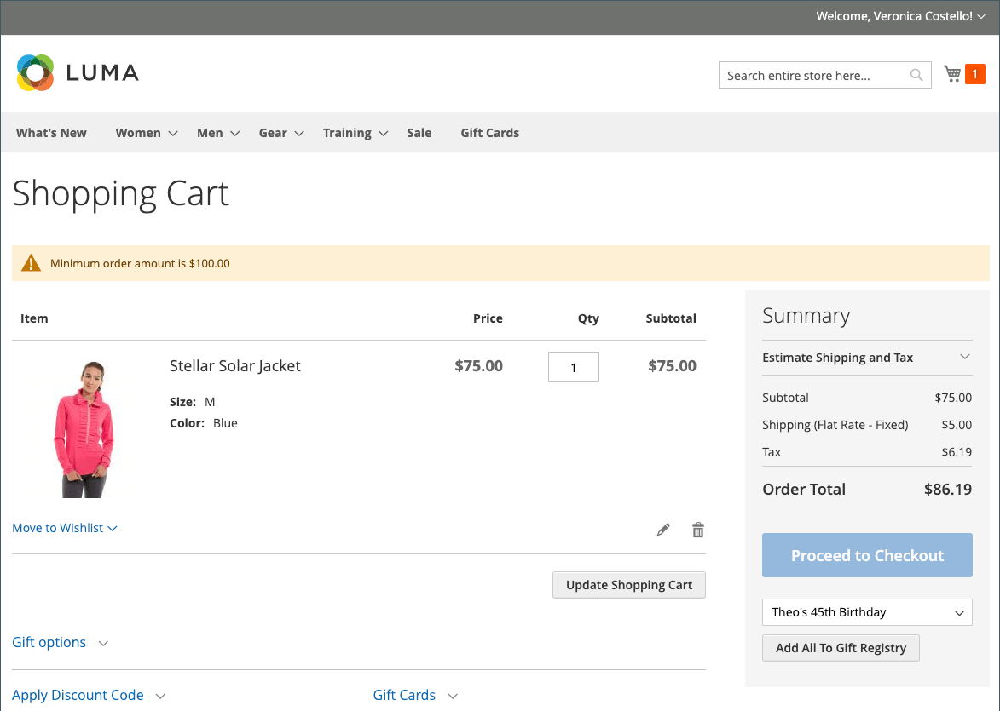
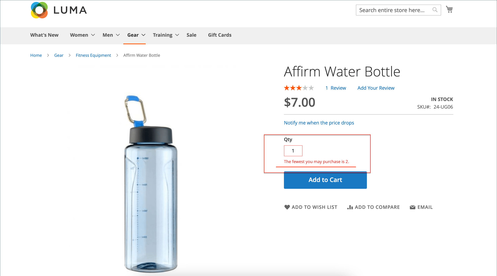

# 장바구니 구성

장바구니 구성은 고객이 장바구니 페이지로 리디렉션되는 시기와 제품 썸네일에 사용되는 이미지를 포함하여 스토어 고객에게 장바구니가 작동하는 방식을 결정합니다. 또한 체크아웃 프로세스가 시작되기 전에 최소 금액에 도달하도록 주문하고, 견적 가격이 유효한 일수를 지정하고, _주문 합계_ 섹션.

[**미니 카트**](#mini-cart) - 이 옵션을 구성하여 장바구니 링크/아이콘에 장바구니에 있는 다른 제품(또는 SKU)의 수 또는 모든 항목의 총 수량이 표시되는지 확인합니다.

[**미니 장바구니 링크**](#configure-the-cart-link) - 이 옵션을 구성하여 고객이 스토어 페이지 상단에 있는 장바구니 아이콘의 항목 수를 클릭할 때 미니 장바구니가 표시되는지 확인합니다.

[**장바구니로 리디렉션**](#redirect-to-cart)- 이 옵션을 구성하여 장바구니에 항목이 추가될 때마다 장바구니 페이지가 표시되는지 또는 고객이 페이지로 이동하기로 선택한 경우에만 표시되는지 여부를 결정합니다.

[**견적 라이프타임**](#quote-lifetime) - 가격이 유효한 기간을 지정하려면 이 옵션을 구성합니다.

[**최소 주문 금액**](#minimum-order-amount) - 이러한 옵션을 구성하여 할인이 적용된 후 주문 소계를 충족해야 하는 최소 금액과 장바구니에 표시되는 메시지를 지정합니다.

[**최소 주문 수량**](#minimum-order-quantity) - 이러한 옵션을 구성하여 주문하는 데 필요한 최소 항목 수를 지정합니다.

[**장바구니 썸네일**](#cart-thumbnails)  - 장바구니 썸네일 옵션을 구성하여 그룹화되거나 구성 가능한 제품의 장바구니에 표시되는 썸네일을 결정합니다.

[**선물 옵션**](#gift-options) - 선물 옵션을 구성하여 고객이 선물 메시지 또는 인사말 카드를 추가할 수 있는지 여부 및 선물 포장 옵션을 사용할 수 있는지 여부를 결정합니다.

>[!NOTE]
>
>체크아웃 프로세스 구성에 대한 자세한 내용은 [체크아웃 옵션](checkout-process.md).

## 미니 카트

다음 _미니 카트_ 장바구니에 있는 항목의 요약을 표시합니다. 기본적으로 활성화되어 있으며 페이지 상단의 장바구니 링크를 클릭하면 표시됩니다.
장바구니에 있는 다른 제품(또는 SKU)의 수 또는 모든 항목의 총 수량을 표시하도록 링크를 구성할 수 있습니다.

{width="700" zoomable="yes"}

>[!NOTE]
>
>의 경우 _등록됨_ 고객, 여러 디바이스 및 브라우저에서 미니 장바구니가 자동으로 동기화되지 않는 경우가 있습니다. 이러한 경우 Mini Cart를 동기화하려면 [장바구니](cart.md) 해당 디바이스 또는 브라우저의 페이지입니다.

### 미니 장바구니 구성

1. 다음에서 _관리자_ 사이드바, 이동 **[!UICONTROL Stores]** > _[!UICONTROL Settings]_>**[!UICONTROL Configuration]**.

1. 왼쪽 패널에서 를 확장합니다. **[!UICONTROL Sales]** 및 선택 **[!UICONTROL Checkout]**.

1. 확장  다음 _[!UICONTROL Mini Cart]_섹션.

   {width="600" zoomable="yes"}

1. 특정 스토어 보기에 대한 설정인 경우 [스토어 보기 선택](../configuration-reference/scope-change.md#set-the-scope) 구성이 적용되는 위치입니다.

   메시지가 표시되면 **[!UICONTROL OK]** 계속합니다.

1. 설정 **[!UICONTROL Display Mini Cart]** 다음 중 하나를 수행합니다.

   - `Yes` - 스토어 페이지에 미니 장바구니를 표시합니다. 사이드바의 모양은 테마에 따라 다릅니다.
   - `No` - 스토어 페이지에서 미니 장바구니 표시를 비활성화합니다.

1. 표시가 활성화된 경우 다른 옵션을 업데이트하여 표시를 구성합니다.

   - 대상 **[!UICONTROL Number of Items to Display Scrollbar]**&#x200B;스크롤바가 트리거되기 전에 사이드바에 나타날 수 있는 항목 수를 입력합니다.
   - 대상 **[!UICONTROL Maximum Display Recently Added Item(s)]**&#x200B;미니 장바구니에 표시할 최근에 추가된 최대 항목 수를 입력합니다.

1. 클릭 **[!UICONTROL Save Config]**.

### 장바구니 링크 구성

1. 다음에서 _관리자_ 사이드바, 도착 **[!UICONTROL Stores]** > _[!UICONTROL Settings]_>**[!UICONTROL Configuration]**.

1. 왼쪽 패널에서 를 확장합니다. **[!UICONTROL Sales]** 및 선택 **[!UICONTROL Checkout]**.

1. 확장  다음 **[!UICONTROL My Cart Link]** 섹션.

1. 설정 **[!UICONTROL Display Cart Summary]** 다음 설정 중 하나로 설정합니다.

   - `Display item quantities` - 이 설정은 각 제품에 대한 수량을 추가하여 장바구니에 있는 총 제품 수를 표시합니다.
   - `Display number of items in cart` - 이 설정은 수량에 관계없이 장바구니에 있는 제품 항목의 수를 표시합니다.

   {width="600" zoomable="yes"}

1. 클릭 **[!UICONTROL Save Config]**.

## 장바구니로 리디렉션

장바구니 페이지는 항목이 장바구니에 추가될 때마다 또는 고객이 페이지로 이동하기로 선택한 경우에만 나타나도록 구성할 수 있습니다. 현재 장바구니에 있는 항목에 대한 기본 정보는 항상 [미니 카트](#mini-cart). 이러한 결정은 고객이 체크아웃을 계속 진행할 수 있도록 유도하는 이점과 고객이 쇼핑을 계속할 수 있도록 하는 이점의 균형을 맞추는 문제입니다. 그것은 개인적인 선호의 단순한 문제일 수도 있다. 그러나 숫자로 백업하려는 경우 A/B 테스트를 실행하여 전환율이 더 높은 접근 방식을 확인할 수 있습니다.

**_장바구니가 표시되는 시기를 구성하려면 다음 작업을 수행하십시오._**

1. 다음에서 _관리자_ 사이드바, 이동 **[!UICONTROL Stores]** > _[!UICONTROL Settings]_>**[!UICONTROL Configuration]**.

1. 왼쪽 패널에서 를 확장합니다. **[!UICONTROL Sales]** 및 선택 **[!UICONTROL Checkout]**.

1. 확장  다음 **[!UICONTROL Shopping Cart]** 섹션.

   {width="600" zoomable="yes"}

1. 특정 스토어 보기에 대한 설정인 경우 [스토어 보기 선택](../configuration-reference/scope-change.md#set-the-scope) 구성이 적용되는 위치입니다.

   메시지가 표시되면 **[!UICONTROL OK]** 계속합니다.

1. 설정 **[!UICONTROL After Adding a Product Redirect to Shopping Cart]** 다음 중 하나를 수행합니다.

   - `Yes` - 제품이 장바구니에 추가되면 바로 장바구니 페이지를 표시합니다.
   - `No` - 장바구니에 제품을 추가한 후 장바구니로 리디렉션을 비활성화합니다.

1. 클릭 **[!UICONTROL Save Config]**.

## 견적 라이프타임

Adobe Commerce용 B2B를 설치하고 활성화하면 _따옴표_ 기능. 이 기능을 사용하면 승인된 구매자가 장바구니에서 요청을 제출하여 가격 협상 프로세스를 시작할 수 있습니다. 다음 _따옴표_ 그리드는 수신된 각 견적을 나열하고 구매자와 판매자 간의 통신 내역을 유지합니다. B2B 기능에 대한 자세한 내용은 [협상된 견적](../b2b/quotes.md) 다음에서 _Adobe Commerce용 B2B 사용 안내서_.

구성에서 장바구니 견적 라이프타임을 설정하여 가격이 유효한 기간을 결정할 수 있습니다. 예를 들어, 쇼핑객이 며칠 후 장바구니를 무인 상태로 두는 경우, 일부 품목의 견적 가격이 더 이상 동일하지 않을 수 있습니다. 기본적으로 견적 수명은 30일로 설정됩니다.

**_견적 라이프타임을 구성하려면_**

1. 다음에서 _관리자_ 사이드바, 이동 **[!UICONTROL Stores]** > _[!UICONTROL Settings]_>**[!UICONTROL Configuration]**.

1. 왼쪽 패널에서 를 확장합니다. **[!UICONTROL Sales]** 및 선택 **[!UICONTROL Checkout]**.

1. 확장  다음 **[!UICONTROL Shopping Cart]** 섹션.

   {width="600" zoomable="yes"}

1. 특정 스토어 보기에 대한 설정인 경우 [스토어 보기 선택](../configuration-reference/scope-change.md#set-the-scope) 구성이 적용되는 위치입니다.

   메시지가 표시되면 **[!UICONTROL OK]** 계속합니다.

1. 대상 **[!UICONTROL Quote Lifetime (days)]**&#x200B;견적 가격이 유효한 일 수를 입력합니다.

1. 클릭 **[!UICONTROL Save Config]**.

## 최소 주문 금액

이 구성을 통해 할인이 적용된 후 주문 소계를 충족해야 하는 최소 금액을 지정할 수 있습니다. 여러 주소로 배송된 주문은 주소당 최소 주문 금액을 충족해야 할 수 있습니다. 체크아웃 버튼은 최소 주문 금액에 도달한 후에만 사용할 수 있습니다.

{width="700" zoomable="yes"}

**_최소 주문 금액을 구성하려면_**

1. 다음에서 _관리자_ 사이드바, 이동 **[!UICONTROL Stores]** > _[!UICONTROL Settings]_>**[!UICONTROL Configuration]**.

1. 왼쪽 패널에서 를 확장합니다. **[!UICONTROL Sales]** 및 선택 **[!UICONTROL Sales]** 밑에.

1. 확장  다음 **[!UICONTROL Minimum Order Amount]** 섹션.

   {width="600" zoomable="yes"}

1. 최소 주문 금액을 요구하려면 다음을 설정합니다. **[!UICONTROL Enable]** 끝 `Yes`.

1. 최소 주문이 활성화된 경우 다음 옵션을 설정하여 요구 사항을 구성합니다.

   - 다음을 입력합니다. **[!UICONTROL Minimum Amount]** 할인이 적용된 후 소계에 필수입니다.

   - 설정 **[!UICONTROL Include Discount Amount]** 다음 중 하나를 수행합니다.

      - `Yes` - 소계가 할인 포함 최소 금액을 충족해야 합니다. 최소 $50의 예를 사용하여 장바구니에 25% 할인이 적용된 $60 상단이 포함된 경우 결과 소계는 $45이고 장바구니가 최소값을 충족하지 않습니다.
      - `No` - 소계가 할인 없이 최소 금액을 충족해야 합니다.

   - 설정 **[!UICONTROL Include Tax to Amount]** 다음 중 하나를 수행합니다.

      - `Yes` - 세금이 포함된 최소 금액을 충족하는 소계가 필요합니다.
      - `No` - 소계가 세금 없이 최소 금액을 충족하도록 요구합니다.

1. 필요한 경우 최소 주문 금액 메시지 설정을 사용자 정의합니다.

   - 대상 **[!UICONTROL Description Message]**&#x200B;에 소계가 최소 금액을 충족하지 않을 때 장바구니 상단에 표시되는 메시지를 사용자 지정하는 데 사용할 텍스트를 입력합니다.

   - 대상 **[!UICONTROL Error to Show in Shopping Cart]**&#x200B;장바구니 오류 메시지를 사용자 지정하는 데 사용할 텍스트를 입력합니다.

   기본 메시지를 사용하려면 메시지 설명 필드를 비워 둡니다.

1. 필요한 경우 다중 주소 주문에 대한 최소 주문 금액 설정을 구성합니다.

   - 다중 주소 순서의 각 주소가 최소 주문 금액을 충족하도록 하려면 다음을 설정합니다. **[!UICONTROL Validate Each Address Separately in Multi-address Checkout]** 끝 `Yes`.

   - 필요한 경우 최소 주문 금액 메시지 설정을 사용자 정의합니다.

      - **[!UICONTROL Multi-address Description Message]** - 장바구니 상단에 표시되는 메시지를 사용자 지정하는 데 사용할 텍스트를 입력합니다. 이 텍스트는 최소값에 맞지 않습니다.

      - **[!UICONTROL Multi-address Error to Show in Shopping Cart]** - 최소값을 충족하지 않는 복수 주소 주문에 대한 장바구니 오류 메시지를 사용자 정의하는 데 사용할 텍스트를 입력하고 상자에 텍스트를 입력합니다.

     기본 메시지를 사용하려면 메시지 설명 필드를 비워 둡니다.

1. 클릭 **[!UICONTROL Save Config]**.

## 최소 주문 수량

주문에 허용된 최소 수량을 설정할 수 있습니다. 각 고객 그룹에 따라 최소 수량을 구성할 수도 있습니다.

1. 다음으로 이동 **[!UICONTROL Stores]** > _[!UICONTROL Settings]_>**[!UICONTROL Configuration]**.

1. 왼쪽 패널에서 를 확장합니다. **[!UICONTROL Catalog]** 및 선택 **[!UICONTROL Inventory]**.

1. 확장  다음 **[!UICONTROL Product Stock Options]** 섹션.

   {width="600" zoomable="yes"}

1. 대상 **[!UICONTROL Minimum Qty Allowed in Shopping Cart]**&#x200B;를 설정하고, 주문에 대한 제품의 최소 수량을 설정합니다.

   필요한 경우 **[!UICONTROL Use system value]** 확인란을 선택하여 이 설정을 수정합니다.

   - 변경 **[!UICONTROL Customer Group]** 특정 그룹으로 설정하고 다음을 입력합니다. **[!UICONTROL Minimum Qty]** 해당 그룹용. 다른 그룹 및 수량 제한을 추가하려면 **[!UICONTROL Add Minimum Qty]**.

   - 모든 고객에 대해 동일한 최소 수량 제한을 설정하려면 `ALL GROUPS` 을(를) 선택하고 **[!UICONTROL Minimum Qty]**.

1. 클릭 **[!UICONTROL Save Config]**.

   {width="700" zoomable="yes"}

## 장바구니 썸네일

 (Adobe Commerce 전용)

장바구니에 표시되는 썸네일 이미지는 고객이 구매하려는 항목에 대한 빠른 개요를 제공합니다. 그러나 옵션이 여러 개인 제품의 경우 이미지가 장바구니에 있는 제품의 변형과 일치하지 않을 수 있습니다. 고객이 특정 색상의 품목을 구매하는 경우 장바구니에 있는 썸네일이 일치하는 것이 이상적입니다.

그룹화되고 구성 가능한 제품 모두에 대한 썸네일 이미지를 설정하여 &quot;상위&quot; 제품 또는 제품 변형의 이미지를 표시할 수 있습니다.

{width="700" zoomable="yes"}

**_장바구니 축소판을 구성하려면:_**

1. 다음에서 _관리자_ 사이드바, 이동 **[!UICONTROL Stores]** > _[!UICONTROL Settings]_>**[!UICONTROL Configuration]**.

1. 왼쪽 패널에서 를 확장합니다. **[!UICONTROL Sales]** 및 선택 **[!UICONTROL Checkout]**.

1. 확장  다음 **[!UICONTROL Shopping Cart]** 섹션.

   {width="600" zoomable="yes"}

1. 설정 **[!UICONTROL Grouped Product Image]** 장바구니에 사용되는 썸네일을 확인하려면 [그룹화된 제품](../catalog/product-create-grouped.md):

   - `Product Thumbnail Itself` - 장바구니에 추가된 제품 변형에 할당된 썸네일을 사용합니다.
   - `Parent Product Thumbnail` - 상위 제품에 할당된 썸네일을 사용합니다.

1. 설정 **[!UICONTROL Configurable Product Image]** 장바구니에 사용되는 썸네일을 확인하려면 [구성 가능한 제품](../catalog/product-create-configurable.md):

   - `Product Thumbnail Itself` - 장바구니에 추가된 제품 변형에 할당된 썸네일을 사용합니다.
   - `Parent Product Thumbnail` - 상위 제품에 할당된 썸네일을 사용합니다.

1. 클릭 **[!UICONTROL Save Config]**.

## 선물 옵션

사용 가능한 선물 옵션 선택은 체크아웃 프로세스가 시작되기 전에 장바구니에 표시됩니다. 선물 옵션 구성은 고객이 선물 메시지나 인사말 카드를 추가할 수 있는지 여부와 선물 포장 옵션을 사용할 수 있는지 여부를 결정합니다. 각각의 상품은 별도의 메시지와 선물 포장을 할 수 있습니다. 전체 주문에 적용하면 고객이 선물 영수증과 인사카드도 추가할 수 있다.

{width="700" zoomable="yes"}

선물 옵션 구성은 전체 웹 사이트에 적용되지만 제품 수준에서 재정의할 수 있습니다.

### 선물 옵션 활성화

1. 다음에서 _관리자_ 사이드바, 이동 **[!UICONTROL Stores]** > _[!UICONTROL Settings]_>**[!UICONTROL Configuration]**.

1. 왼쪽 패널에서 를 확장합니다. **[!UICONTROL Sales]** 및 선택 **[!UICONTROL Sales]** 밑에.

1. 확장  **[!UICONTROL Gift Options]** 페이지에서 참조할 수 있습니다.

   {width="600" zoomable="yes"}

1. 기프트 메시지 옵션을 원하는 대로 설정합니다.

   - 대상 **[!UICONTROL Allow Gift Messages on Order Level]**, 선택 `Yes` 전체 주문에 대해 단일 선물 메시지를 사용할 수 있도록 설정.
   - 대상 **[!UICONTROL Allow Gift Messages for Order Items]**, 선택 `Yes` 고객 장바구니에서 개별 항목에 대한 별도의 선물 메시지를 추가할 수 있습니다.

1.  (Adobe Commerce만 해당) 기호에 따라 선물 포장 옵션을 설정합니다.

   - 대상 **[!UICONTROL Allow Gift Wrapping on Order Level]**, 선택 `Yes` 전체 주문에 대해 단일 선물 포장을 활성화합니다.
   - 대상 **[!UICONTROL Allow Gift Wrapping for Order Items]**, 선택 `Yes` 선물 포장을 고객 장바구니의 각 항목에 개별적으로 추가할 수 있습니다.

   다른 을 정의할 수도 있습니다 [선물 포장 디자인](#gift-wrap) 고객이 포장을 선택할 수 있도록.

1.  (Adobe Commerce만 해당) 고객에게 선물 영수증을 포함할 수 있는 옵션을 제공하려면 다음을 설정하십시오. **[!UICONTROL Allow Gift Receipt]** 끝 `Yes`.

1.  (Adobe Commerce만 해당) 인쇄 카드를 포함할 수 있는 옵션을 고객에게 제공하려면 다음을 설정하십시오. **[!UICONTROL Allow Printed Card]** 끝 `Yes`.

1.  (Adobe Commerce만 해당) **[!UICONTROL Default Price for Printed Card]**.

1. 클릭 **[!UICONTROL Save Config]**.

### 선물 포장

 (Adobe Commerce 전용)

선물 포장은 배송이 가능한 제품이면 누구나 가능하며, 개별 상품 또는 전체 주문 시 제공이 가능하다. 각 선물 포장 디자인에 대해 별도의 가격을 부과하고, 장바구니에서 제품에 대한 옵션으로 표시되는 각 디자인에 대한 썸네일 이미지를 업로드할 수 있습니다. 고객이 선물 포장 썸네일을 클릭하면 전체 크기 이미지가 표시됩니다. 체크아웃 검토 중에 기프트 랩 비용이 다른 기사와 함께 표시됩니다 [체크아웃 합계](checkout-totals-sort-order.md) 다음에서 _주문 요약_ 섹션.

선물 포장 이미지는 반복 패턴을 표시하는 견본이어야 하며, 사용할 리본 샘플을 포함할 수도 있습니다. 종이를 스캔하거나 포장된 패키지를 촬영할 수 있습니다. 업로드된 이미지는 GIF, JPG 또는 PNG 이미지일 수 있으며 정사각형이어야 합니다. 다음 예에서 업로드된 선물 포장 이미지는 230 x 230픽셀입니다.

{width="700" zoomable="yes"}

#### 선물 포장 디자인 추가

1. 다음에서 _관리자_ 사이드바, 이동 **[!UICONTROL Stores]** > _[!UICONTROL Other Settings]_>**[!UICONTROL Gift Wrapping]**.

   {width="700" zoomable="yes"}

1. 오른쪽 위 모서리에서 을(를) 클릭합니다. **[!UICONTROL Add Gift Wrapping]**.

1. 에 대한 이름을 입력합니다. **[!UICONTROL Gift Wrapping Design]** 체크아웃하는 동안 표시됩니다.

   필요한 경우 **[!UICONTROL Scope]** 각 스토어 보기에 대해 다른 이름을 구성합니다.

1. 다음 항목 선택 **[!UICONTROL Websites]** 선물 포장 디자인을 사용할 수 있는 곳.

1. 설정 **[!UICONTROL Status]** 끝 `Enabled`.

   계절 포장 옵션이 있는 경우 다음으로 설정할 수 있습니다. `Disabled` 옵션을 사용하지 않으려는 경우.

1. 다음을 입력합니다. **[!UICONTROL Price]** 선물 포장 디자인의

   이 설정은 제품 수준에서 설정된 선물 포장 가격으로 대체할 수 있습니다.

   {width="600" zoomable="yes"}

1. 썸네일을 업로드하려면 **[!UICONTROL Image]** 선물 포장 중 **[!UICONTROL Choose File]** 디렉토리에서 업로드할 파일을 선택합니다.

   이미지의 썸네일이 _[!UICONTROL Gift Wrapping Information]_레코드가 저장된 후.

1. 클릭 **[!UICONTROL Save]**.

#### 선물 포장 디자인 편집

1. 다음에서 _관리자_ 사이드바, 이동 **[!UICONTROL Stores]** > _[!UICONTROL Other Settings]_>**[!UICONTROL Gift Wrapping]**.

1. 목록에서 선물 포장 기록을 찾습니다.

1. 다음에서 _작업_ 열, 클릭 **[!UICONTROL Edit]**.

   {width="600" zoomable="yes"}

1. 필요한 사항을 변경합니다.

1. 클릭 **[!UICONTROL Save]**.

#### 선물 포장 디자인 삭제

포함 _선물 포장_ 격자를 연 상태에서 다음 방법 중 하나를 사용하여 줄 바꿈 디자인을 삭제합니다.

**_방법 1: 단일 선물 포장 디자인 삭제_**

1. 편집 모드에서 선물 포장 디자인을 엽니다.

1. 작업 공간 맨 위에서 **[!UICONTROL Delete]**.

1. 메시지가 표시되면 **[!UICONTROL OK]** 확인할 수 있습니다.

**_방법 2: 여러 선물 포장 디자인 삭제_**

1. 다음에서 _선물 포장_ 그리드에서 삭제할 각 선물 포장 디자인의 확인란을 선택합니다.

1. 설정 **[!UICONTROL Actions]** 제어 대상 `Delete`.

1. 클릭 **[!UICONTROL Submit]**.

### 선물 옵션 세금

 (Adobe Commerce 전용)

선물 포장과 인쇄된 기프트 카드 가격은 세금을 포함하거나 제외하거나 두 옵션을 모두 표시하도록 구성할 수 있습니다. 전역 또는 웹 사이트 레벨에서 이러한 항목에 대한 세금 분류를 지정할 수도 있습니다.

**_증여 옵션 세금을 구성하려면_**

1. 다음에서 _관리자_ 사이드바, 이동 **[!UICONTROL Stores]** > _[!UICONTROL Settings]_>**[!UICONTROL Configuration]**.

1. 왼쪽 패널에서 를 확장합니다. **[!UICONTROL Sales]** 및 선택 **[!UICONTROL Tax]**.

1. 확장  다음 **[!UICONTROL Tax Classes]** 섹션.

   {width="600" zoomable="yes"}

1. 설정 **[!UICONTROL Tax Class for Gift Options]** 해당 세금 분류에 대해.

1. 확장  다음 **[!UICONTROL Orders, Invoices, Credit Memos Display Settings]** 섹션.

   {width="600" zoomable="yes"}

1. 설정 **[!UICONTROL Display Gift Wrapping Prices]** 다음 중 하나를 수행합니다.

   - `Excluding Tax`
   - `Including Tax`
   - `Including and Excluding Tax`

1. 설정 **[!UICONTROL Display Printed Card Prices]** 다음 중 하나를 수행합니다.

   - `Excluding Tax`
   - `Including Tax`
   - `Including and Excluding Tax`

1. 클릭 **[!UICONTROL Save Config]**.
