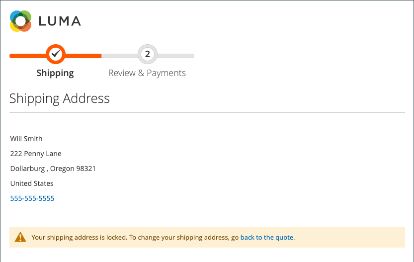

# 체크아웃 시 주소 검색

{{ee-feature}}

고객은 주소록에 저장된 주소 및 정보를 많이 가질 수 있으며, 특히 재방문 고객이나 회사가 여러 개의 주문 및 선적 위치를 입력할 수 있습니다. 많은 주소를 표시하면 체크아웃 로드 속도가 느려지고 처리 속도가 상당히 빨라져 쇼핑 환경이 나빠질 수 있습니다. 체크아웃 응답성을 높이려면 사이트에 대한 주소 검색을 활성화하고 구성하는 것이 좋습니다.

>[!NOTE]
>
>주소 검색은 기본적으로 활성화되어 있지 않습니다. 사이트에 기능을 포함하도록 이 기능을 구성할 수 있습니다.

이 기능을 활성화하고 고객의 저장된 주소 수가 구성된 제한을 충족하거나 초과하면 _배송_ 및 _검토 및 결제_ 단계에는 하나의 주소(기본값)만 표시됩니다. 고객은 다음을 클릭하여 선택한 주소를 변경할 수 있습니다. **주소 변경** 그리고 도시, 주, 거리 또는 우편번호를 기준으로 올바른 주소를 검색합니다. 이 기능은 또한 선물 레지스트리 체크 아웃에 대한 주소 선택을 지원합니다.

{width="700" zoomable="yes"}

고객에게 기본 배송 주소가 없는 경우 _배송_ 페이지 표시 _선택한 주소 없음_. 이 경우 고객은 **주소 변경** 저장된 주소를 선택하거나 **새 주소** 체크아웃을 진행하기 전에 주소를 추가하고 선택합니다. 고객에게 기본 청구 주소가 없는 경우 _검토 및 결제_ 이 페이지에는 배송을 위해 선택한 주소가 _주소 변경_ 옵션을 선택합니다.

{width="600" zoomable="yes"}

## 견적에 대해 잠긴 주소 검색

 (Adobe Commerce B2B에서만 사용 가능)

주소 검색을 활성화하면 고객의 저장된 주소 수가 구성된 한도를 충족하거나 초과하는 견적에서 생성된 주문에 대한 체크아웃에도 영향을 줍니다. 견적이 완료되고 고객이 체크아웃을 진행하면 선택한 배송 주소만 표시됩니다. 배송 주소가 잠겨 있으며 견적에서만 변경할 수 있다는 메시지도 표시됩니다.

{width="600" zoomable="yes"}

## 주소 검색 활성화

1. 다음에서 _관리자_ 사이드바, 이동 **[!UICONTROL Stores]** > _[!UICONTROL Settings]_>**[!UICONTROL Configuration]**.

1. 왼쪽 패널에서 를 확장합니다. **[!UICONTROL Sales]** 및 선택 **[!UICONTROL Checkout]**.

1. 확장  다음 **[!UICONTROL Checkout Options]** 섹션.

   {width="700" zoomable="yes"}

   이러한 각 구성 설정에 대한 자세한 설명은 을 참조하십시오. [체크아웃 옵션](../configuration-reference/sales/checkout.md#checkout-options) 다음에서 _구성 참조 안내서_.

1. 설정 **[!UICONTROL Enable Address Search]** 끝 `Yes`.

1. 주소 검색 기능을 포함하는 임계값을 지정하려면 **[!UICONTROL Number of Customer Addresses Limit]** 옵션을 선택합니다.

   필요한 경우 **[!UICONTROL Use system value]** 확인란을 선택하여 이 변경 작업을 수행합니다.

   고객의 저장된 주소 수가 이 제한을 충족하거나 초과하면 페이지에 기본 주소(고객이 있는 경우) 또는 _선택한 주소 없음_ (으)로 _주소 변경_ 옵션을 선택합니다. 기본 제한은 입니다. `10`.

1. 클릭 **[!UICONTROL Save Config]**.
