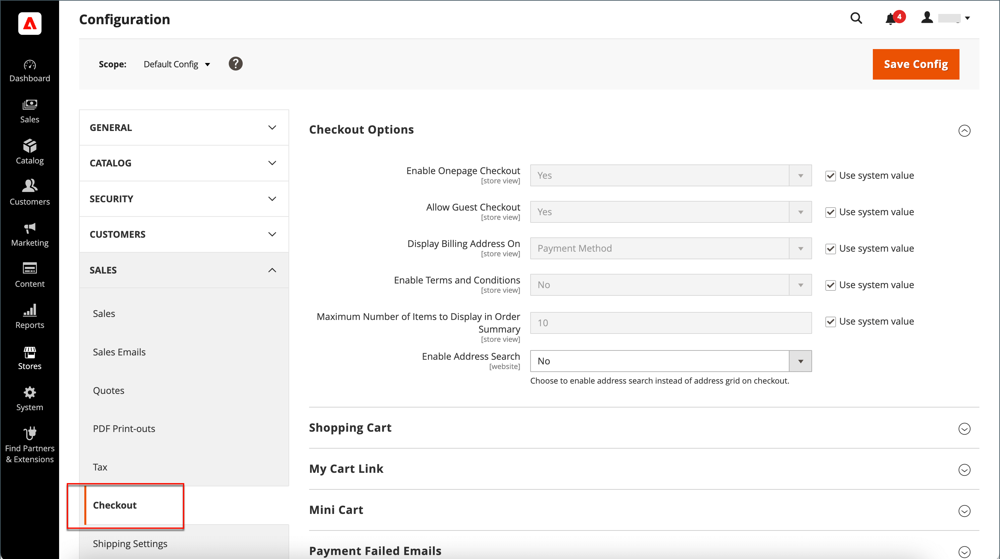

# 게스트 체크아웃

구매하기 전에 쇼핑객이 계정을 개설하도록 스토어를 구성할 수 있습니다. 기본 설정을 사용하면 게스트가 결제 프로세스를 완료한 후 계정을 등록할 수 있는 옵션과 함께 구매를 수행할 수 있습니다.

{width="600" zoomable="yes"}

**_게스트 체크아웃을 비활성화하려면:_**

1. 다음에서 _관리자_ 사이드바, 이동 **[!UICONTROL Stores]** > _[!UICONTROL Settings]_>**[!UICONTROL Configuration]**.

1. 왼쪽 패널에서 를 확장합니다. **[!UICONTROL Sales]** 및 선택 **[!UICONTROL Checkout]**.

1. 확장  다음 **[!UICONTROL Checkout Options]** 섹션.

   {width="700" zoomable="yes"}

이러한 각 구성 설정에 대한 자세한 설명은 을 참조하십시오. [체크아웃 옵션](../configuration-reference/sales/checkout.md#checkout-options) 다음에서 _구성 참조 안내서_.

1. 특정 스토어 보기에 대한 설정인 경우 [스토어 보기 선택](../configuration-reference/scope-change.md#set-the-scope) 구성이 적용되는 위치입니다.

   메시지가 표시되면 **[!UICONTROL OK]** 계속합니다.

1. 설정 **[!UICONTROL Allow Guest Checkout]** 끝 `No`.

   필요한 경우 **[!UICONTROL Use system value]** 확인란을 선택하여 이 설정을 변경할 수 있습니다.

1. 클릭 **[!UICONTROL Save Config]**.
