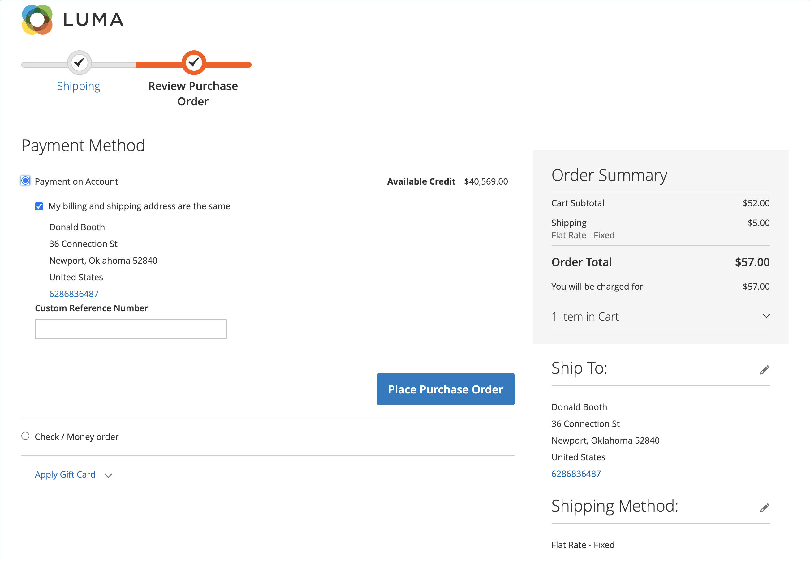

# 체크아웃 프로세스 및 옵션

체크아웃 프로세스가 시작되면 트랜잭션이 안전한 암호화 채널로 이동합니다. 브라우저의 주소 표시줄에 자물쇠 기호가 나타나고 URL이 `http`에서 `https`(으)로 변경됩니다.

## 프로세스

체크아웃 프로세스의 목표는 트랜잭션을 완료하는 데 필요한 정보를 수집하는 것입니다. _체크아웃_ 페이지는 프로세스의 각 단계를 안내합니다. 이미 많은 정보가 계정에 있기 때문에 계정에 로그인한 고객은 빠르게 체크아웃을 완료할 수 있습니다. 구매 주문을 사용하는 회사 계정과 연결된 고객의 워크플로는 약간 다릅니다.

### 배송

체크아웃 프로세스의 첫 단계는 고객이 배송 주소 정보를 완성하고 배송 방법을 선택하는 것입니다. 고객이 계정을 보유한 경우 배송 주소가 자동으로 입력되지만 필요한 경우 변경할 수 있습니다.

(Adobe Commerce만 해당) 받는 사람과 보낸 사람의 주소 형식은 [고객 주소 특성](../customers/address-attributes.md)의 속성에 의해 결정됩니다. 입력 유효성 검사 설정은 배송 주소에 사용할 수 있는 올바른 문자를 결정합니다.

페이지 상단에 있는 진행률 표시줄은 체크아웃 프로세스의 각 단계를 따르며, 주문 요약에는 지금까지 입력한 정보가 표시됩니다.

{width="600" zoomable="yes"}

#### 다른 주소로 배송

1. 주소록에 추가 항목이 있으면 고객은 주문을 배송할 주소를 찾습니다.

1. 주소를 선택하려면 **[!UICONTROL Ship Here]**&#x200B;을(를) 클릭합니다.

#### 주소 추가

1. _[!UICONTROL Shipping Address]_&#x200B;섹션 아래쪽에서 고객이&#x200B;**[!UICONTROL + New Address]**&#x200B;을(를) 클릭합니다.

1. _[!UICONTROL Shipping Address]_&#x200B;양식을 완료합니다.

   기본적으로 고객의 이름과 성은 양식에 나타납니다.

   {width="600" zoomable="yes"}

1. 새 주소를 주소록에 저장하려면 양식 하단에 있는 확인란을 선택합니다.

1. **[!UICONTROL Save Address]**&#x200B;을(를) 클릭합니다.

   이제 새 주소가 배송 주소로 선택됩니다.

   {width="600" zoomable="yes"}

#### 배송 방법 선택

1. [shipping](delivery.md) 메서드 목록에서 고객이 사용할 옵션을 선택합니다.

   {width="600" zoomable="yes"}

1. 계속하려면 **[!UICONTROL Next]**&#x200B;을(를) 클릭합니다.

### 검토 및 지급 - 정규 주문

체크아웃 프로세스의 두 번째 단계에서 고객은 [결제 방법](payments.md)을 선택하고 프로모션 코드가 있는 모든 쿠폰을 구매에 적용합니다. 모든 정보를 검토하고 필요한 경우 편집할 수 있습니다. 활성화된 경우 고객은 주문을 하기 전에 판매 약관에 동의해야 합니다.

>[!NOTE]
>
>Commerce에서는 여러 쿠폰 코드를 구성할 수 있지만, 고객은 하나의 쿠폰 코드만 장바구니에 적용할 수 있습니다. 자세한 내용은 [쿠폰 코드](../merchandising-promotions/price-rules-cart-coupon.md)를 참조하십시오.

{width="700" zoomable="yes"}

### 검토 및 지급 - 구매 발주

(Adobe Commerce B2B에서만 사용 가능)

고객이 [구매 주문](../b2b/purchase-order-flow.md)을 사용하도록 설정한 회사와 연결되어 있으면 모든 주문이 구매 주문으로 처리됩니다. 사용 가능한 결제 방법은 회사 계정 설정에 따라 결정됩니다.

1. 고객이 결제 방법을 선택합니다.

   _계정에서 결제_ 방법을 사용하는 경우 [!UICONTROL Custom Reference Number] 필드를 사용하여 송장 번호를 참조할 수 있습니다.

1. 고객이 **[!UICONTROL Place Purchase Order]**&#x200B;을(를) 클릭합니다.

   구매 발주가 이루어집니다.

회사가 [승인 규칙](../b2b/account-dashboard-approval-rules.md)을 설정한 경우 구매 주문은 승인 프로세스를 거칩니다. 그렇지 않으면 즉시 처리됩니다.

{width="700" zoomable="yes"}

### 주문 요약에 표시되는 항목 수

관리자는 체크아웃 시 주문 요약에 표시되는 최대 항목 수를 변경하여 적은 수의 제품으로 표시를 간소화할 수 있습니다. 기본적으로 이 값은 10으로 설정됩니다.

{width="700" zoomable="yes"}

1. _관리자_ 사이드바에서 **[!UICONTROL Stores]** > _[!UICONTROL Settings]_>**[!UICONTROL Configuration]**(으)로 이동합니다.

1. 왼쪽 패널에서 **[!UICONTROL Sales]**&#x200B;을(를) 확장하고 **[!UICONTROL Checkout]**&#x200B;을(를) 선택합니다.

1. **[!UICONTROL Checkout Options]** 섹션에서 를 확장합니다.

1. **[!UICONTROL Maximum Number of Items to Display in Order Summary]**&#x200B;에 표시할 최대 항목 수를 입력하십시오.

1. **[!UICONTROL Save Config]**&#x200B;을(를) 클릭합니다.

   이 업데이트에서는 체크아웃 중에 표시되는 주문 요약이 지정된 품목 수량으로 제한됩니다.

### 주문 확인

주문이 배치되면 주문 확인이 나타납니다. 등록된 고객의 경우, 이 페이지에는 고객 계정에 대한 링크와 영수증 생성 링크가 있는 주문 번호가 포함됩니다. 등록된 고객은 이메일로 주문 확인 및 추적 정보를 기대하라고 합니다. 고객은 주문을 추적할 계정을 만드는 것이 좋습니다. 등록된 고객은 링크를 클릭하여 영수증을 생성할 수 있습니다.

주문 확인 페이지는 _성공_ 페이지라고도 하며 Analytics 프로그램에서 전환을 추적하는 데 사용됩니다.

{width="700" zoomable="yes"}

## 체크아웃 옵션

체크아웃 옵션은 레이아웃을 포함하여 체크아웃 페이지에 대한 다양한 속성을 제어합니다. 게스트 체크아웃 허용 및 약관 계약 적용을 포함하여 체크아웃 시 제한을 두도록 구성할 수 있는 옵션이 있습니다. 체크아웃 프로세스 중에 정보 표시를 제어하는 옵션도 있습니다.

{width="700" zoomable="yes"}

이러한 각 구성 설정에 대한 자세한 설명은 _구성 참조 안내서_&#x200B;의 [체크아웃 옵션](../configuration-reference/sales/checkout.md#checkout-options)을 참조하세요.

### 체크아웃 옵션 변경

1. _관리자_ 사이드바에서 **[!UICONTROL Stores]** > _[!UICONTROL Settings]_>**[!UICONTROL Configuration]**(으)로 이동합니다.
1. 왼쪽 패널에서 **[!UICONTROL Sales]**&#x200B;을(를) 확장하고 **[!UICONTROL Checkout]**&#x200B;을(를) 선택합니다.
1. 필요한 다음 옵션 중 하나를 설정합니다.
1. **[!UICONTROL Save Config]**&#x200B;을(를) 클릭합니다.

1. **[!UICONTROL Checkout Options]** 섹션에서 를 확장합니다.

1. 특정 스토어 보기에 대한 설정인 경우 구성이 적용되는 [스토어 보기를 선택](../configuration-reference/scope-change.md#set-the-scope)합니다.

   메시지가 표시되면 **[!UICONTROL OK]**&#x200B;을(를) 클릭하여 계속합니다.

1. 체크아웃 옵션을 설정합니다.

1. **[!UICONTROL Save Config]**&#x200B;을(를) 클릭합니다.

### 사용 가능한 체크아웃 옵션

| 필드 | [범위](../getting-started/websites-stores-views.md#scope-settings) | 설명 |
|--- |--- |--- |
| [!UICONTROL Enable Onepage Checkout] | 스토어 뷰 | [한 페이지 체크아웃](checkout-one-page.md)이 기본 체크아웃 형식인지 여부를 결정합니다. 옵션: 예 / 아니요 |
| [!UICONTROL Allow Guest Checkout] | 스토어 뷰 | 게스트가 스토어에 계정을 등록하지 않고 [체크아웃을 할 수 있는지](checkout-guest.md)을(를) 결정합니다. 옵션: `Yes` / `No` |
| [!UICONTROL Enable Terms and Conditions] | 스토어 뷰 | 고객이 구매하기 전에 판매의 [약관](terms-and-conditions.md)에 동의해야 하는지 여부를 결정합니다. 옵션: `Yes` / `No` |
| [!UICONTROL Display Billing Address On] | 스토어 뷰 | 체크아웃하는 동안 청구 주소의 위치를 결정합니다. 옵션: `Payment Method` / `Payment Page` |
| [!UICONTROL Maximum Number of Items to Display in Order Summary] | 스토어 뷰 | 체크아웃 중에 주문 요약에 표시할 수 있는 최대 항목 수를 결정합니다. 기본값은 `10`입니다. |
| [!UICONTROL Enable Address Search] | 웹 사이트 | (Adobe Commerce만 해당) 고객이 _배송_&#x200B;과 _검토 및 결제_ 단계에 [주소 검색](checkout-address-search.md) 기능을 사용할 수 있는지 여부를 결정합니다. 이 기능을 사용하도록 설정하면 _[!UICONTROL Number of Customer Addresses Limit]_&#x200B;을(를) 사용하여 체크 아웃 중에 이 기능을 활성화하는 데 필요한 저장된 주소 수를 설정합니다. 옵션: `Yes` / `No` |
| [!UICONTROL Number of Customer Addresses Limit] | 웹 사이트 | (Adobe Commerce만 해당) 주소 검색이 **[!UICONTROL Enabled]**&#x200B;인 경우 체크 아웃 중에 이 기능을 활성화하는 데 필요한 저장된 주소 수를 결정합니다. 고객의 저장된 주소 수가 이 수를 충족하거나 초과하면 _배송_ 및 _검토 및 결제_ 단계에서 기본 주소만 렌더링됩니다. 고객은 검색 기능을 사용하여 선택한 주소를 변경할 수 있습니다. 기본값은 10입니다. |

{style="table-layout:auto"}
