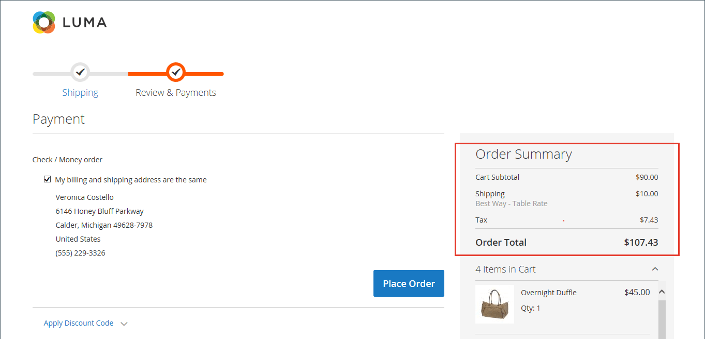

# 체크아웃 합계를 위한 정렬 순서

주문 검토 중에 합계가 주문 하단에 표시되며 할인, 운송비, 상점 대변 및 세금이 조정됩니다. 각 항목의 순서는 계산의 순서를 결정하며, 각 항목에 지정된 번호로 구성에 설정됩니다. 예를 들어 소계는 섹션의 첫 번째 항목이며 10이라는 값이 지정됩니다. 총계는 마지막으로 나타나고 100이라는 값이 할당됩니다. 합계 섹션의 다른 모든 항목에는 해당 값 사이의 값이 지정됩니다.

{width="700" zoomable="yes"}

**_체크아웃 합계 정렬 순서를 구성하려면 다음을 수행합니다._**

1. 다음에서 _관리자_ 사이드바, 이동 **[!UICONTROL Stores]** > _[!UICONTROL Settings]_>**[!UICONTROL Configuration]**.

1. 왼쪽 패널에서 를 확장합니다. **[!UICONTROL Sales]** 섹션 및 선택 **[!UICONTROL Sales]** 밑에.

1. 확장  다음 **[!UICONTROL Checkout Totals Sort Order]** 섹션.

   {width="600" zoomable="yes"}

   이러한 각 구성 설정에 대한 자세한 설명은 을 참조하십시오. [체크아웃 합계 정렬 순서](../configuration-reference/sales/sales.md#checkout-totals-sort-order) 다음에서 _구성 참조 안내서_.

1. 특정 스토어 보기에 대한 설정인 경우 [스토어 보기 선택](../configuration-reference/scope-change.md#set-the-scope) 구성이 적용되는 위치입니다.

   메시지가 표시되면 **[!UICONTROL OK]** 계속합니다.

1. 에서 순서를 결정하려면 _총계_ 섹션에서 각 항목에 지정된 번호를 변경합니다.

   값이 낮을수록 목록에서 배치가 빨라집니다. 기본 구성에서 소계(`10`)는 첫 번째 총계 및 총계(`100`)가 마지막 입니다.

   필요한 경우 **[!UICONTROL Use system value]** 확인란을 선택하여 이러한 변경 사항을 완료합니다.

1. 클릭 **[!UICONTROL Save Config]**.
