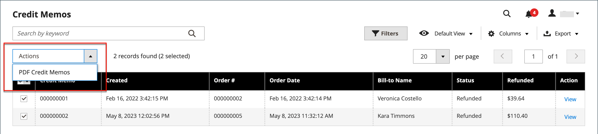

# 대변 메모 발행

대변 메모를 인쇄하려면 먼저 [인보이스 발행 주문](invoices.md#create-an-invoice)에 대해 대변 메모를 생성해야 합니다. 결제 방법에 따라 개설된 대변 메모에서 온라인 및 오프라인 환불(부분 또는 전체)을 모두 발행할 수 있습니다.

- (Adobe Commerce만 해당) 환불은 스토어 크레딧에 적용할 수 있습니다.
- (Adobe Commerce B2B에서 사용 가능) 환불은 회사 크레딧에 적용할 수 있습니다.
- 신용카드로 구매한 물품은 온라인 또는 오프라인에서 환불이 가능하다.
- 수표나 금전 주문으로 구입한 물품은 오프라인에서 환불해야 합니다.

[진행 중 상태](order-status.md)인 모든 메모에 미결제 환불 기한이 있습니다.

대변 메모를 사용하여 다음을 수행할 수 있습니다.

- 인보이스 전액을 환불해 주세요.
- 송장의 일부 금액을 환불합니다.
- 송장의 복수 부분 금액을 환불합니다.
- 총 주문 금액을 초과하지 않도록 주문당 복수 송장을 환불합니다.
- 셔츠 다섯 개 중 세 개를 주문하는 것과 같이, 한 라인 물품에 대한 수량의 일부를 환불해 주십시오.

자세한 내용은 [인보이스 만들기](invoices.md#create-an-invoice)를 참조하세요.

## 결제 작업 설정

신용 카드로 결제된 주문에 대한 환불 워크플로는 사용 가능한 각 결제 방법에 대한 구성에서 [결제 작업 설정](../configuration-reference/sales/payment-methods.md#payment-actions)에 의해 결정됩니다. 거래가 정산될 때까지 환불을 할 수 없습니다.

{width="600" zoomable="yes"}

- 구성된 결제 방법에 대한 결제 작업이 `Authorize`(으)로 설정된 경우 먼저 책임자로부터 송장을 생성해야 대변 메모를 만들 수 있습니다.
- 구성된 결제 방법에 대한 결제 작업이 `Authorize and Capture`(으)로 설정된 경우 결제 프로세서에서 이미 송장을 생성했지만 거래가 결제될 때까지 자금을 사용할 수 없습니다. 이 짧은 대기 기간은 많은 결제 처리자가 보안 수단으로 권장하며 일반적으로 자동으로 처리할 수 있습니다. 또한 거래는 결제 프로세서를 통해 판매자 계정에서 수동으로 정산할 수 있습니다.
- (Adobe Commerce만 해당) 선물 옵션이 포함된 주문에 대한 신용 메모를 만드는 경우 선물 포장 및/또는 인쇄된 카드에 대한 환불이 신용 메모의 환불 합계 섹션에 표시됩니다. 이러한 비용을 환불할 금액에서 제외하려면 금액을 조정 수수료로 입력합니다. 동일한 주문에 대해 여러 개의 대변 메모가 발행된 경우, 선물 옵션에 대한 환불이 첫 번째 대변 메모에만 나타납니다.

## 대변 메모 만들기

[신용 구매](#issue-a-refund-for-a-credit-purchase) 또는 [확인 또는 주문](#issue-an-offline-refund-for-check-or-money-order)에 대해 발급할 환불 유형을 결정하고 대변 메모를 생성하고 환불을 발급합니다.

### 신용 구매에 대한 환불 발행

1. _관리자_ 사이드바에서 **[!UICONTROL Sales]** > **[!UICONTROL Orders]**(으)로 이동합니다.

   {width="700" zoomable="yes"}

1. 그리드에서 순서를 찾아 **[!UICONTROL View]**&#x200B;을(를) 클릭합니다.

1. 단추 모음에 _[!UICONTROL Credit Memo]_&#x200B;단추가 표시되면 다음 중 하나를 실행하십시오.

   - `offline` 환불을 발급하려면 #6단계로 이동하십시오.
   - `online` 환불을 발급하려면 #4단계를 계속 진행하십시오.

   오프라인 및 온라인 환불에 대한 자세한 내용은 [신용 메모](credit-memos.md)를 참조하십시오.

1. 왼쪽 패널에서 **[!UICONTROL Invoices]**&#x200B;을(를) 클릭합니다.

1. 그리드에서 송장을 찾은 다음 **[!UICONTROL View]**&#x200B;을(를) 클릭합니다.

   {width="700" zoomable="yes"}

1. 인보이스의 **[!UICONTROL Invoice Totals]** 섹션까지 아래로 스크롤하여 인보이스가 `Capture Online`(으)로 설정되어 있는지 확인하고 **[!UICONTROL Submit Invoice]**&#x200B;을(를) 클릭합니다.

   {width="600" zoomable="yes"}

   해당 옵션을 사용할 수 없는 경우 송장이 이미 생성되었습니다. 다음 단계로 진행합니다.

1. 송장 상단의 단추 모음에서 **[!UICONTROL Credit Memo]**&#x200B;을(를) 클릭합니다.

1. **[!UICONTROL Items to Refund]** 섹션에서 정보를 확인하고 해당하는 경우 다음을 수행합니다.

   - 제품을 인벤토리로 되돌리려면 **[!UICONTROL Return to Stock]** 확인란을 선택하십시오.

     _제품 재고 옵션_&#x200B;이 `Automatically Return Credit Memo Item to Stock`(으)로 설정된 경우 제품이 자동으로 재고로 돌아옵니다. [Inventory management이 활성화됨](../inventory-management/enable.md)인 경우 항목이 선적을 보낸 소스로 반환됩니다.

   - **[!UICONTROL Qty to Refund]**&#x200B;을(를) 업데이트하고 **[!UICONTROL Update Qty's]**&#x200B;을(를) 클릭합니다.

     {width="600" zoomable="yes"}

1. **[!UICONTROL Refunds Totals]** 섹션을 다음과 같이 업데이트합니다.

   - **[!UICONTROL Refund Shipping]**&#x200B;의 경우 배송비에서 환불될 금액을 입력하십시오.

     이 필드에는 처음에 환불 가능한 주문의 총 배송 금액이 표시됩니다. 이미 환불된 배송금액을 제외하고 주문에서 전체 배송금액과 같습니다. 양과 마찬가지로 양을 줄일 수는 있지만 늘릴 수는 없습니다.

   - **[!UICONTROL Adjustment Refund]**&#x200B;의 경우 주문의 특정 부분(배송, 품목 또는 세금)에 적용되지 않는 추가 환급으로 총 환불 금액에 추가할 값을 입력하십시오. 또한 관리자가 비가상부담금 결제수단을 우선 환급하고자 할 때 상품권 등 가상화폐로 부분 환급하는 데도 활용할 수 있다.

     입력한 금액은 총 환불을 지급된 금액보다 높게 올릴 수 없습니다.

   - **[!UICONTROL Adjustment Fee]**&#x200B;에 대해 총 환불 금액에서 뺄 값을 입력하십시오.

     이 금액은 배송, 품목 또는 세금 등 주문의 특정 섹션에서 공제되지 않습니다.

1. 댓글을 추가하려면 **[!UICONTROL Credit Memo Comments]** 상자에 텍스트를 입력하십시오.

   - 고객에게 전자 메일 알림을 보내려면 **[!UICONTROL Email Copy of Credit Memo]** 확인란을 선택하십시오.

1. **[!UICONTROL Update Totals]**&#x200B;을(를) 클릭합니다.

1. 해당되는 경우 다음을 수행합니다.

   - (Adobe Commerce만 해당) 고객의 스토어 크레딧으로 금액을 환불하려면 **[!UICONTROL Refund to Store Credit]** 확인란을 선택하십시오.

   - (Adobe Commerce B2B에서 사용 가능) 고객의 회사 크레딧에 금액을 환급하려면 **[!UICONTROL Refund to Company Credit]** 확인란을 선택하십시오.

   - 오프라인 환불을 하려면 **[!UICONTROL Refund Offline]**&#x200B;을(를) 클릭하십시오.

   - 온라인 환불을 하려면 **[!UICONTROL Refund]**&#x200B;을(를) 클릭하십시오.

   - (Adobe Commerce B2B에서 사용 가능) 구매가 회사 크레딧으로 지불된 경우 **[!UICONTROL Refund to Company Credit]**&#x200B;을(를) 클릭합니다.

   오프라인 및 온라인 환불에 대한 자세한 내용은 [신용 메모](credit-memos.md)를 참조하십시오.

   {width="600" zoomable="yes"}

### 수표 또는 금전 주문에 대한 오프라인 환불 발행

1. _관리자_ 사이드바에서 **[!UICONTROL Sales]** > **[!UICONTROL Orders]**(으)로 이동합니다.

1. 그리드에서 완료된 순서를 찾아 **[!UICONTROL View]** 링크를 클릭하여 엽니다.

1. 페이지 상단의 단추 모음에서 **[!UICONTROL Invoice]**&#x200B;을(를) 클릭합니다.

1. 페이지 아래쪽으로 스크롤하여 **[!UICONTROL Submit Invoice]**&#x200B;을(를) 클릭합니다.

1. 송장 상단의 단추 모음에서 **[!UICONTROL Credit Memo]**&#x200B;을(를) 클릭합니다.

   {width="600" zoomable="yes"}

1. **[!UICONTROL Items to Refund]** 섹션에서 정보를 확인하고 해당하는 경우 다음을 수행합니다.

   {width="600" zoomable="yes"}

   - 반환된 제품을 재고로 반품하려면 **[!UICONTROL Return to Stock]** 확인란을 선택하십시오.

     Inventory management이 활성화된 경우, 재고 수량이 납품을 보낸 출처로 반환됩니다. [제품 재고 옵션](../inventory-management/enable.md)이 `Automatically Return Credit Memo Item to Stock`(으)로 설정된 경우 제품이 자동으로 재고로 돌아옵니다.

   - **[!UICONTROL Qty to Refund]**&#x200B;을(를) 업데이트하고 **[!UICONTROL Update Qty's]**&#x200B;을(를) 클릭합니다.

     차감 금액은 환불 가능한 최대 금액을 초과할 수 없습니다.

1. 해당되는 경우 **[!UICONTROL Refunds Totals]** 섹션을 업데이트하십시오.

   - **[!UICONTROL Refund Shipping]**&#x200B;의 경우 배송비에서 환불될 금액을 입력하십시오.

     이 필드에는 처음에 환불 가능한 주문의 총 배송 금액이 표시됩니다. 이미 환불된 배송금액을 제외하고 주문에서 전체 배송금액과 같습니다. 양과 마찬가지로 양을 줄일 수는 있지만 늘릴 수는 없습니다.

   - **[!UICONTROL Adjustment Refund]**&#x200B;의 경우 주문의 특정 부분(배송, 품목 또는 세금)에 적용되지 않는 추가 환급으로 총 환불 금액에 추가할 값을 입력하십시오. 또한 관리자가 비가상부담금 결제수단을 우선 환급하고자 할 때 상품권 등 가상화폐로 부분 환급하는 데도 활용할 수 있다.

     입력한 금액은 총 환불을 지급된 금액보다 높게 올릴 수 없습니다.

   - **[!UICONTROL Adjustment Fee]**&#x200B;에 대해 총 환불 금액에서 뺄 값을 입력하십시오.

     이 금액은 배송, 품목 또는 세금 등 주문의 특정 섹션에서 공제되지 않습니다.

   - 구매가 스토어 크레딧으로 지불된 경우 **[!UICONTROL Refund to Store Credit]** 확인란을 선택하여 해당 금액을 고객 계정 잔액에 크레딧합니다.

1. 댓글을 추가하려면 **[!UICONTROL Credit Memo Comments]** 상자에 텍스트를 입력하고 다음을 수행합니다.

   - 고객에게 전자 메일 알림을 보내려면 **[!UICONTROL Email Copy of Credit Memo]** 확인란을 선택하십시오.

   - 전자 메일에 입력한 설명을 포함하려면 **[!UICONTROL Append Comments]** 확인란을 선택하십시오.

     대변 메모 통지의 상태는 대변 메모 번호 옆에 완료된 대변 메모에 나타납니다.

     {width="600" zoomable="yes"}

1. 프로세스를 완료하고 환불을 발급하려면 **[!UICONTROL Refund Offline]**&#x200B;을(를) 클릭하십시오.

## 필드 설명

### [!UICONTROL Order & Account Information]

| 필드 | 설명 |
|--- |--- |
| [!UICONTROL Order Number] | 주문 번호가 _주문 및 계정 정보_&#x200B;에 나타나고 확인 전자 메일이 전송되었는지 여부를 나타내는 메모가 표시됩니다. |
| [!UICONTROL Order Date] | 주문이 이루어진 날짜와 시간. |
| [!UICONTROL Order Status] | 주문 상태를 `Complete`(으)로 나타냅니다. |
| [!UICONTROL Purchased From] | 주문이 이루어진 웹 사이트, 스토어 및 스토어 보기를 나타냅니다. |
| [!UICONTROL Placed from IP] | 주문이 이루어진 컴퓨터의 IP 주소를 나타냅니다. |

{style="table-layout:auto"}

### [!UICONTROL Account Information]

| 필드 | 설명 |
|--- |--- |
| [!UICONTROL Customer Name] | 주문을 한 고객 또는 구매자의 이름. 고객 이름은 고객 프로필에 연결됩니다. |
| [!UICONTROL Email] | 고객 또는 구매자의 이메일 주소. 이메일 주소가 연결되어 새 이메일 메시지를 열 수 있습니다. |
| [!UICONTROL Customer Group] | 고객이 할당된 고객 그룹 또는 공유 카탈로그의 이름. |
| [!UICONTROL Company Name] | (Adobe Commerce B2B와 함께 사용 가능) 구매자와 연결된 회사 이름으로, 주문을 대행하는 회사입니다. 회사 이름이 회사 프로필에 연결됩니다. |

{style="table-layout:auto"}

### [!UICONTROL Address Information]

| 필드 | 설명 |
|--- |--- |
| [!UICONTROL Billing Address] | 주문을 한 고객 또는 구매자의 이름, 대금 청구 주소, 전화 번호 및 [VAT](vat.md)(해당되는 경우)가 차례로 표시됩니다. 전화 번호는 모바일 장치에서 자동 다이얼에 연결됩니다. |
| [!UICONTROL Shipping Address] | 주문에 주의해서 배송해야 하는 사람의 이름, 그 뒤에 배송지 주소 및 전화번호가 옵니다. 전화 번호는 모바일 장치에서 자동 다이얼에 연결됩니다. |

{style="table-layout:auto"}

### [!UICONTROL Payment & Shipping Method]

| 필드 | 설명 |
|--- |--- |
| [!UICONTROL Payment Information] | 주문에 사용할 결제 방법, 해당하는 경우 구매 주문 번호, 주문에 사용된 통화 뒤 [계정 결제](../b2b/enable-basic-features.md#configure-payment-on-account)를 사용하여 주문이 회사 크레딧에 청구되는 경우 계정에 청구되는 금액이 표시됩니다. |
| [!UICONTROL Shipping & Handling Information] | 사용할 배송 방법 및 적용 가능한 모든 취급 수수료. |

{style="table-layout:auto"}

### [!UICONTROL Items to Refund]

| 필드 | 설명 |
|--- |--- |
| [!UICONTROL Product] | 제품 이름, SKU 및 옵션(해당되는 경우). |
| [!UICONTROL Price] | 항목의 구매 가격. Adobe Commerce B2B의 경우, 이 값은 적용 가능한 경우 공유 카탈로그의 항목에 적용된 할인을 반영합니다. |
| [!UICONTROL Qty] | 주문한 수량입니다. |
| [!UICONTROL Return to Stock] | 반환된 항목이 재고로 반환되는지 여부를 나타내는 확인란입니다. |
| [!UICONTROL Qty to Refund] | 제품의 반환되는 단위 수를 나타냅니다. |
| [!UICONTROL Subtotal] | 소계는 구매 가격에 반환된 제품 단위의 수량을 곱한 것입니다. |
| [!UICONTROL Tax Amount] | 반환된 항목에 십진수 값으로 적용되는 세액. |
| [!UICONTROL Tax Percent] | 반환된 항목에 적용된 세금의 백분율입니다. |
| [!UICONTROL Discount Amount] | 반환된 항목에 적용되는 모든 할인. |
| [!UICONTROL Row Total] | 반환된 제품 레벨에 대해 납부해야 하는 적용 가능한 세금을 포함한 라인 항목 합계에서 할인이 줄어듭니다. |
| 총 _주문_ |  |

{style="table-layout:auto"}

### [!UICONTROL Credit Memo Comments]

| 필드 | 설명 |
|--- |--- |
| [!UICONTROL Comment Text] | 고객에게 대변 메모에 대한 설명을 입력하는 데 사용되는 텍스트 상자입니다. |

{style="table-layout:auto"}

### [!UICONTROL Refund Totals]

| 필드 | 설명 |
|--- |--- |
| [!UICONTROL Refund Shipping] | 환불할 배송 금액. |
| [!UICONTROL Adjustment Refund] | 배송, 품목 또는 세금 등 주문의 특정 부분에 적용되지 않는 추가 환급금으로 총 환불 금액에 추가되는 금액. 입력한 금액은 총 환불을 지불한 금액보다 높게 올릴 수 없습니다. |
| [!UICONTROL Adjustment Fee] | 재입고 수수료 등 총 환불 금액에서 차감하는 금액 또는 선물 포장 또는 선물 옵션과 관련된 금액. |
| [!UICONTROL Grand Total] | 환불해야 할 총 금액 |
| [!UICONTROL Append Comments] | 메모가 대변 메모에 포함되는지 여부를 결정하는 확인란입니다. |
| [!UICONTROL Email Copy of Credit Memo] | 대변 메모의 사본이 전자 메일로 전송되는지 여부를 결정하는 확인란입니다. |
| [!UICONTROL Refund to Store Credit] | (Adobe Commerce만 해당) 체크박스로 전체 금액을 [스토어 크레딧](../customers/store-credit-using.md)으로 환불할지 여부를 결정합니다. |
| [!UICONTROL Subtotal] | (Adobe Commerce B2B에서 사용 가능) 환불할 모든 라인 항목의 합계입니다. |

{style="table-layout:auto"}

### 환불 버튼

주문에 사용된 결제 방법에 따라 대변 메모에 사용할 수 있는 환불 버튼이 결정됩니다.

| 단추 | 설명 |
|--- |--- |
| **[!UICONTROL Refund]** | 최초 구매액이 결제 게이트웨이를 통해 신용카드로 결제된 경우 환불 금액은 결제 처리자가 관리한다. 환불을 관리하려면 결제 제공업체에서 제공한 설명서를 참조하십시오. |
| **[!UICONTROL Refund Offline]** | 당초의 구매대금이 수표나 금전주문으로 지급된 것이라면, 환불 대금은 수표나 상품권, 현금처럼 점포가 있을 경우 직접 고객에게 지급된다. 대변 메모는 오프라인 거래의 기록 역할을 한다. |
| **[!UICONTROL Refund to Company Credit]** | (Adobe Commerce B2B에서 사용 가능) 구매가 회사 크레딧에 청구된 경우 환불은 [회사 계정](../b2b/credit-company.md)으로 반환됩니다. |

{style="table-layout:auto"}

## 대변 메모 인쇄

완료된 대변 메모를 인쇄하거나 보려면 PDF 판독기가 설치되어 있어야 합니다. [Adobe Reader][1]을(를) 무료로 다운로드할 수 있습니다.

1. _관리자_ 사이드바에서 **[!UICONTROL Sales]** > _[!UICONTROL Operations]_>**[!UICONTROL Credit Memos]**(으)로 이동합니다.

1. 다음 방법 중 하나를 사용하여 대변 메모를 인쇄합니다.

### 방법 1: 현재 대변 메모 인쇄

1. 그리드에서 대변 메모를 엽니다.

1. **[!UICONTROL Print]**&#x200B;을(를) 클릭합니다.

   {width="600" zoomable="yes"}

### 방법 2: 복수 대변 메모 인쇄

1. 목록에서 인쇄할 각 대변 메모의 체크박스를 선택합니다.

1. **[!UICONTROL Actions]** 컨트롤을 `PDF Credit Memos`(으)로 설정하고 **[!UICONTROL Submit]**&#x200B;을(를) 클릭합니다.

   {width="600" zoomable="yes"}

1. 메시지가 표시되면 다음 중 하나를 수행합니다.

   - 문서를 저장하려면 **[!UICONTROL Save]**&#x200B;을(를) 클릭하고 프롬프트에 따라 파일을 컴퓨터에 저장합니다. 다운로드가 완료되면 Adobe Reader에서 PDF을 열고 문서를 인쇄합니다.

   - 문서를 보려면 **[!UICONTROL Open]**&#x200B;을(를) 클릭합니다. 인쇄용 PDF 대변 메모가 Adobe Reader에서 열립니다. 여기에서 대변 메모를 인쇄하거나 컴퓨터에 저장할 수 있습니다.

[1]: https://www.adobe.com/acrobat/pdf-reader.html "Adobe Reader 가져오기"
