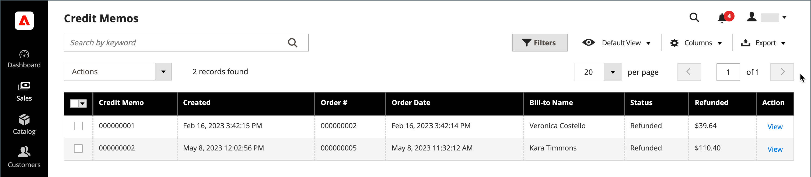

# 대변 메모

A _대변 메모_ 는 전체 또는 부분 환불을 위해 고객이 지불해야 하는 금액을 보여 주는 문서입니다. 해당 금액은 구매에 적용되거나 고객에게 환불될 수 있습니다. 단일 주문이나 복수 주문에 대한 대변 메모를 배치로 인쇄할 수 있습니다. 대변 메모를 인쇄하기 전에 주문에 대해 먼저 생성해야 합니다. 다음 _대변 메모_ 페이지에 고객에게 발행된 대변 메모가 나열됩니다.

{width="700" zoomable="yes"}

## 환불 방법

다음 [결제 방법](payments.md) 주문의 경우 어느 정도 주문 환불 방법을 결정합니다.

다음 세 가지 방법으로 주문을 환불할 수 있습니다.

- 계정 대변—대변 계정을 사용하여 지급한 주문은 계정 대변으로 환불될 수 있습니다.
   -  (Adobe Commerce 전용) [스토어 크레딧](../customers/store-credit-using.md)
   -  (Adobe Commerce용 B2B와 함께 사용 가능) [계정입금](../b2b/enable-basic-features.md#configure-payment-on-account) (오프라인 메서드)
   -  (Adobe Commerce용 B2B와 함께 사용 가능) [회사 신용](../b2b/credit-company.md)
- [온라인 환불](payments.md#online-payment-methods)—PayPal 또는 Braintree과 같은 결제 게이트웨이를 통해 신용카드로 결제된 주문은 결제 프로세서를 통해 온라인으로 환불됩니다.
- [오프라인 환불](payments.md#offline-payment-methods)—배달 시 현금으로 지불되는 주문([대구](cash-on-delivery.md)) 또는 [수표 또는 우편환](check-money-order.md) 오프라인에서 환불됩니다.

결제 방법에 대해 오프라인 환불 또는 계정 크레딧(활성화된 경우)을 발행할 수 있습니다.

배달 시 현금으로 지불된 주문([대구](cash-on-delivery.md)) 또는 [수표 또는 우편환](check-money-order.md) 은(는) 오프라인에서 환불됩니다.

## 환불 워크플로우

1. **결제 작업** - 다음과 같은 경우 [결제 작업](credit-memo-create.md#payment-action-setting) 구성이 다음으로 설정됨 `Authorize`- 대변 메모를 생성하기 전에 송장을 생성해야 합니다. 2단계로 진행합니다. 로 설정된 경우 `Authorize and Capture`송장이 이미 생성되었습니다. 3단계로 진행하십시오.

1. **송장 생성** - [송장 만들기](invoices.md#create-an-invoice) 주문의 경우, 귀하가 대금메모를 통해 고객에게 환불을 보낼 수 있도록 하십시오.

1. **대변 메모 만들기** - [대변 메모 발행](credit-memo-create.md) 을(를) 위한 관리자 [신용 구매](credit-memo-create.md#issue-a-refund-for-a-credit-purchase)또는 [수표 또는 우편환](credit-memo-create.md#issue-an-offline-refund-for-check-or-money-order).

## 열 설명

| 열 | 설명 |
|--- |--- |
| [!UICONTROL Select] | 작업을 적용할 대변 메모 항목의 확인란을 선택하거나 열 머리글에서 선택 컨트롤을 사용합니다. 옵션: `Select All` / `Deselect All` |
| [!UICONTROL Credit Memo] | 대변 메모에 대한 요청이 제출될 때 할당되는 고유한 숫자 식별자입니다. |
| [!UICONTROL Created] | 구매자가 대변 메모에 대한 요청을 최초로 제출한 일자와 시간. |
| [!UICONTROL Order#] | 제품이 반환되는 주문의 주문 ID. |
| [!UICONTROL Order Date] | 구매자가 주문한 날짜와 시간. |
| [!UICONTROL Bill-to Name] | 주문에 대한 결제 책임이 있는 사람의 이름. |
| [!UICONTROL Status] | 대변 메모 요청의 현재 상태를 나타냅니다. |
| [!UICONTROL Refunded] | 주문에서 환불된 총 금액입니다. |
| [!UICONTROL Actions] | **[!UICONTROL View]** - 대변 메모에 대한 요청을 열고 구매자와 판매자 간의 협상 레코드를 유지합니다. |
| [!UICONTROL Order Status] | 주문 상태를 나타냅니다. |
| [!UICONTROL Purchased From] | 주문이 이루어진 웹 사이트, 스토어 및 스토어 보기를 나타냅니다. |
| [!UICONTROL Billing Address] | 주문한 고객의 청구 주소. |
| [!UICONTROL Shipping Address] | 주문이 배송될 주소입니다. |
| [!UICONTROL Customer Name] | 주문한 고객의 이름과 성입니다. |
| [!UICONTROL Email] | 주문한 사람의 이메일 주소입니다. |
| [!UICONTROL Customer Group] | 고객이 할당된 고객 그룹. |
| [!UICONTROL Payment Method] | 지급에 사용할 결제 방법. |
| [!UICONTROL Shipping Information] | 주문을 출하하는 데 사용할 방법입니다. |
| [!UICONTROL Subtotal] | 배송 및 취급 없이 주문 소계 및 세금. |
| [!UICONTROL Shipping & Handling] | 배송 및 처리에 대해 청구된 금액. |
| [!UICONTROL Adjustment Refund] | 총 환불 금액에 추가 환불 금액으로 추가된 금액입니다. |
| [!UICONTROL Adjustment Fee] | 환불 총액에서 차감하는 금액. |
| [!UICONTROL Grand Total] | 주문 총계. |

{style="table-layout:auto"}
