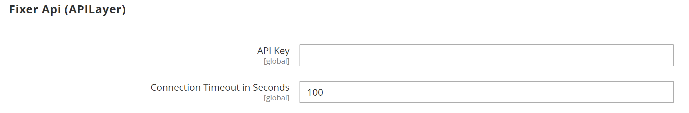

# 통화 구성

개별 통화 환율을 설정하기 전에 먼저 [기본 통화](../configuration-reference/general/currency-setup.md)의 범위를 설정해야 합니다. 기본적으로 Global로 설정되어 전체 [스토어 계층 구조](../getting-started/websites-stores-views.md)에 기본 통화 설정을 적용합니다. 다중 사이트 Adobe Commerce 또는 Magento Open Source을 설치한 경우 범위를 웹 사이트 수준으로 설정하여 여러 기본 통화를 관리할 수 있습니다.

허용되는 통화와 스토어에서 [가격](../catalog/catalog-price-scope.md)을 표시하는 데 사용할 통화도 지정합니다. 다음 다이어그램에서는 기본 통화의 범위가 웹 사이트 수준에서 설정되어 있으므로 각 웹 사이트가 다른 기본 통화를 가질 수 있습니다.

{width="600" zoomable="yes"}

## 1단계: 수락된 통화 선택

1. _관리자_ 사이드바에서 **[!UICONTROL Stores]** > _[!UICONTROL Settings]_>**[!UICONTROL Configuration]**(으)로 이동합니다.

1. 왼쪽 상단 모서리에서 구성이 적용되는 저장소 보기로 **[!UICONTROL Scope]**&#x200B;을(를) 설정합니다.

1. _일반_ 아래의 왼쪽 패널에서 **[!UICONTROL Currency Setup]**&#x200B;을(를) 선택합니다.

1. **[!UICONTROL Currency Options]** 섹션에서 를 확장하고 다음 옵션을 설정합니다.

   - **[!UICONTROL Base Currency]** — 온라인 거래에 사용하는 기본 통화로 설정합니다.

   - **[!UICONTROL Default Display Currency]** — 스토어 보기에 가격을 표시하는 데 사용하는 통화로 설정합니다.

   - **[!UICONTROL Allowed Currencies]** — 스토어 보기에서 지불로 수락하는 모든 통화를 선택합니다. 기본 통화도 선택해야 합니다.

     여러 통화의 경우 Ctrl 키(PC) 또는 Command 키(Mac)를 누른 채 각 옵션을 클릭합니다.

   {width="600" zoomable="yes"}

   이러한 각 구성 설정에 대한 자세한 설명은 _구성 참조 안내서_&#x200B;의 [통화 옵션](../configuration-reference/general/currency-setup.md)을 참조하세요.

1. 캐시를 새로 고치라는 메시지가 표시되면 시스템 메시지의 오른쪽 상단에서 _닫기_(  )를 클릭합니다.

   나중에 [캐시를 새로 고칩니다](../systems/cache-management.md).

1. 기본 통화의 범위를 정의합니다.

   - 왼쪽 패널에서 **[!UICONTROL Catalog]**&#x200B;을(를) 확장하고 아래의 **[!UICONTROL Catalog]**&#x200B;을(를) 선택합니다.

   - 아래로 스크롤하여 **[!UICONTROL Price]** 섹션에서 를 확장합니다. 이 섹션은 범위가 **[!UICONTROL Store View:]** _기본 구성_(으)로 설정된 경우에만 나타납니다.

   - **[!UICONTROL Catalog Price Scope]**&#x200B;을(를) `Global` 또는 `Website`(으)로 설정합니다.

   {width="600" zoomable="yes"}

## 2단계: 가져오기 연결 구성

1. 페이지 맨 위로 스크롤합니다.

1. 왼쪽 패널에서 **[!UICONTROL General]**&#x200B;을(를) 확장하고 **[!UICONTROL Currency Setup]**&#x200B;을(를) 선택합니다.

1. 통화 서비스 연결을 구성합니다.

   세 가지 서비스 옵션이 있습니다. _[!UICONTROL Fixer.io (legacy)]_,_[!UICONTROL Fixer Api (APILayer)]_ 및 _[!UICONTROL Currency Converter API]_

   >[!IMPORTANT]
   >
   >2.4.6 릴리스부터 [[!DNL Fixer.io]](https://fixer.io/) 서비스는 더 이상 사용되지 않으며 [[!DNL Fixer API] (APILayer)](https://apilayer.com/marketplace/fixer-api) 서비스로 대체됩니다. 더 이상 사용되지 않는 [!DNL Fixer.io] 계정 대신 APILayer 계정을 사용하는 것이 좋습니다.

   - _[fixer.io 서비스에 연결하려면](https://fixer.io/):_

      - **[!UICONTROL Fixer.io]** 섹션에서 를 확장합니다.

      - fixer.io **[!UICONTROL API key]**&#x200B;을(를) 입력하십시오.

      - **[!UICONTROL Connection Timeout in Seconds]**&#x200B;에 연결 시간이 초과되기 전에 허용할 비활성 시간(초)을 입력합니다.

     {width="600" zoomable="yes"}

   - _[[!DNL Fixer Api (APILayer)] 서비스](https://apilayer.com/)에 연결하려면:_

      - **[!UICONTROL Fixer Api (APILayer)]** 섹션에서 를 확장합니다.

      - [!DNL APILayer] **[!UICONTROL API key]**&#x200B;을(를) 입력하십시오.

      - **[!UICONTROL Connection Timeout in Seconds]**&#x200B;에 연결 시간이 초과되기 전에 허용할 비활성 시간(초)을 입력합니다.

     {width="600" zoomable="yes"}

   - _[[!DNL Currency Convertor API] 서비스](https://free.currencyconverterapi.com/)에 연결하려면:_

      - **[!UICONTROL Currency Convertor API]** 섹션에서 를 확장합니다.

      - 통화 전환기 **[!UICONTROL API key]**&#x200B;을(를) 입력하십시오.

      - **[!UICONTROL Connection Timeout in Seconds]**&#x200B;에 연결 시간이 초과되기 전에 허용할 비활성 시간(초)을 입력합니다.

     {width="600" zoomable="yes"}

## 3단계: 예약된 가져오기 설정 구성

1. 통화 설정을 계속하고 **[!UICONTROL Scheduled Import Settings]** 섹션에서 를 확장합니다.

   {width="600" zoomable="yes"}

1. 환율을 자동으로 업데이트하려면 **[!UICONTROL Enabled]**&#x200B;을(를) `Yes`(으)로 설정하십시오.

1. 업데이트 옵션을 설정합니다.

   - **[!UICONTROL Service]** — 비율 공급자로 설정합니다. 기본값은 `Fixer.io (legacy)`입니다.

   - **[!UICONTROL Start Time]** — 시간, 분, 초로 설정하면 요금이 일정에 따라 업데이트됩니다.

   - **[!UICONTROL Frequency]** — 요금이 업데이트되는 빈도를 확인하려면 다음 중 하나로 설정하십시오.

      - `Daily`
      - `Weekly`
      - `Monthly`

   - **[!UICONTROL Error Email Recipient]** — 가져오기 프로세스 중에 오류가 발생하는 경우 이메일 알림을 받을 사람의 이메일 주소를 입력합니다.

     여러 이메일 주소를 입력하려면 각 주소를 쉼표로 구분하십시오.

   - **[!UICONTROL Error Email Sender]** — 오류 알림의 발신자로 표시되는 [스토어 연락처](../getting-started/store-details.md#store-email-addresses)(으)로 설정합니다.

   - **[!UICONTROL Error Email Template]** — 오류 알림에 사용되는 전자 메일 템플릿으로 설정합니다.

1. 완료되면 **[!UICONTROL Save Config]**&#x200B;을(를) 클릭합니다.

1. 캐시를 업데이트하라는 메시지가 표시되면 **[!UICONTROL Cache Management]** 링크를 클릭하고 잘못된 캐시를 새로 고칩니다.

   {width="600" zoomable="yes"}

## 4단계: 환율 업데이트

통화 환율은 현재 값으로 업데이트해야 적용됩니다. [요금을 수동으로 업데이트](currency-update.md)하거나 요금을 자동으로 가져옵니다.

## 5단계: 통화 기호 사용자 정의(선택 사항)

통화 기호 관리를 통해 스토어에서 결제로 수락되는 각 통화와 연관된 기호를 사용자 정의할 수 있습니다.

{width="600" zoomable="yes"}

1. _관리자_ 사이드바에서 **[!UICONTROL Stores]** > _[!UICONTROL Currency]_>**[!UICONTROL Currency Symbols]**(으)로 이동합니다.

   스토어에 사용할 수 있는 각 통화가 _[!UICONTROL Currency]_목록에 나타납니다.

1. 필요에 따라 목록에서 설정을 변경합니다.

   - 사용할 각 통화에 대해 사용자 지정 기호를 입력하거나 각 통화에 대해 **[!UICONTROL Use Standard]** 확인란을 선택하십시오.

   - 기본 기호를 재정의하려면 _[!UICONTROL Use Standard]_확인란의 선택을 취소하고 사용할 기호를 입력합니다.

   >[!NOTE]
   >
   >통화 기호의 정렬을 왼쪽에서 오른쪽으로 변경할 수 없습니다.

1. 완료되면 **[!UICONTROL Save Currency Symbols]**&#x200B;을(를) 클릭합니다.

1. 캐시를 업데이트하라는 메시지가 표시되면 **[!UICONTROL Cache Management]** 링크를 클릭하고 잘못된 캐시를 새로 고칩니다.
