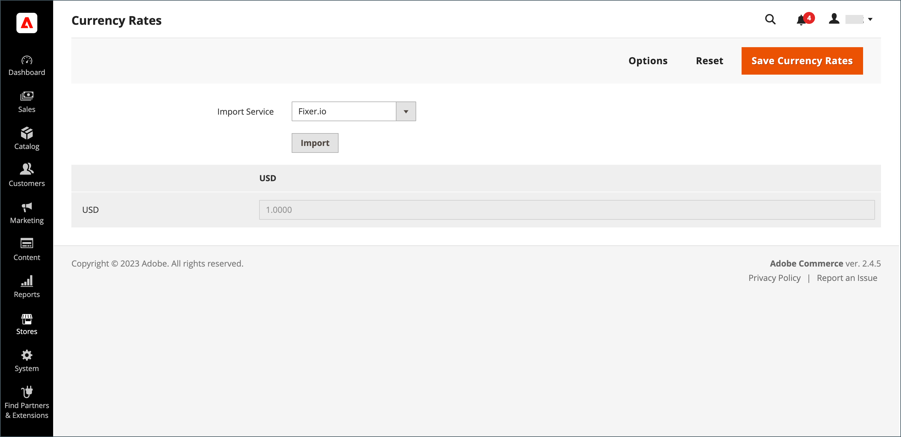

# 환율 업데이트

환율은 수동으로 설정하거나 스토어로 가져올 수 있습니다. 스토어에서 최신 환율을 사용하도록 하려면 일정에 따라 통화 환율을 자동으로 업데이트하도록 구성할 수 있습니다.

환율을 가져오기 전에 [환율 설정](currency-configuration.md)을 완료하여 수락하는 통화를 지정하고 가져오기 연결 및 일정을 설정하십시오.

{width="600" zoomable="yes"}

## 수동으로 환율 업데이트

1. _관리자_ 사이드바에서 **[!UICONTROL Stores]** > _[!UICONTROL Currency]_>**[!UICONTROL Currency Rates]**(으)로 이동합니다.

1. 변경할 환율을 클릭하고 지원되는 각 통화에 대한 새 값을 입력합니다.

1. 완료되면 **[!UICONTROL Save Currency Rates]**&#x200B;을(를) 클릭합니다.

## 환율 가져오기

1. _관리자_ 사이드바에서 **[!UICONTROL Stores]** > _[!UICONTROL Currency]_>**[!UICONTROL Currency Rates]**(으)로 이동합니다.

1. **[!UICONTROL Import Service]**&#x200B;을(를) 환율 공급자로 설정합니다.

   기본 공급자는 `fixer.io (legacy)`입니다.

   >[!IMPORTANT]
   >
   >2.4.6 릴리스부터 [[!DNL Fixer.io]](https://fixer.io/) 서비스는 더 이상 사용되지 않으며 [[!DNL Fixer API] (APILayer)](https://apilayer.com/marketplace/fixer-api) 서비스로 대체됩니다. 더 이상 사용되지 않는 [!DNL Fixer.io] 계정 대신 APILayer 계정을 사용하는 것이 좋습니다.

1. **[!UICONTROL Import]**&#x200B;을(를) 클릭합니다.

   업데이트된 요금이 _[!UICONTROL Currency Rates]_목록에 나타납니다. 마지막 업데이트 이후 요금이 변경된 경우 이전 요금이 참조용으로 아래에 표시됩니다.

1. 완료되면 **[!UICONTROL Save Currency Rates]**&#x200B;을(를) 클릭합니다.

1. 캐시를 업데이트하라는 메시지가 표시되면 **[!UICONTROL Cache Management]** 링크를 클릭하고 잘못된 캐시를 새로 고칩니다.

   {width="600" zoomable="yes"}

## 일정에 따라 통화 환율 가져오기

1. 스토어에 대해 [Cron](../systems/cron.md)이(가) 활성화되어 있는지 확인하십시오.

1. 허용되는 통화를 지정하고 가져오기 연결과 일정을 설정하려면 [환율 설정](currency-configuration.md)을 완료하십시오.

1. 요금을 일정에 따라 가져오는지 확인하려면 _[!UICONTROL Currency Rates]_목록을 확인하십시오.

1. 일정에 대해 설정된 빈도 설정의 기간을 기다렸다가 요금을 다시 확인합니다.
