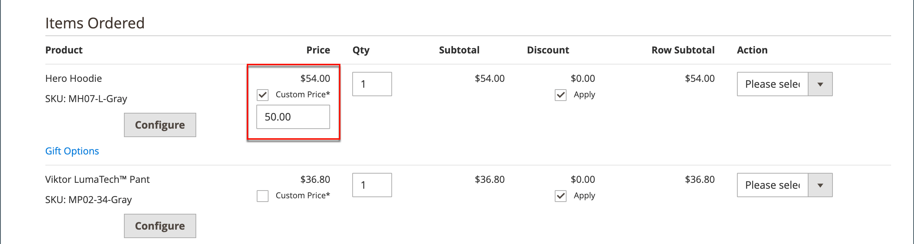

# 주문 만들기

지원이 필요한 등록 고객의 경우 책임자로부터 직접 전체 주문을 만들 수 있습니다. _[!UICONTROL Create New Order]_양식에는 고객 계정 대시보드의 활동 요약과 함께 일반 체크아웃 프로세스에 필요한 모든 정보가 포함되어 있습니다.

{width="700" zoomable="yes"}

## 1단계: 주문 만들기

1. _관리자_ 사이드바에서 **[!UICONTROL Customers]**&#x200B;을(를) 클릭합니다.

1. 그리드에서 고객을 찾습니다.

1. _Action_ 열에서 **[!UICONTROL Edit]**&#x200B;을(를) 클릭합니다.

1. 작업 영역 헤더에서 **[!UICONTROL Create Order]**&#x200B;을(를) 클릭합니다.

   {width="700" zoomable="yes"}

   **[!UICONTROL Create New Order]**&#x200B;을(를) 클릭하여 [작업 영역 순서 지정](orders.md#orders-workspace)에서 순서를 만들 수도 있습니다.

## 2단계: 제품 추가

스토어에 여러 개의 보기가 있는 경우 주문을 넣을 스토어 보기를 선택합니다.

### [!UICONTROL Customer's Activities] 사이드바에서 제품 추가

고객의 위시리스트나 최근에 본 항목, 비교한 항목 또는 주문한 항목을 장바구니에 전송할 수 있습니다.

1. 를 다음 섹션 중 하나로 확장합니다.

   - **[!UICONTROL Wish List]**
   - **[!UICONTROL Last Ordered Items]**
   - **[!UICONTROL Products in Comparison List]**
   - **[!UICONTROL Recently Compared Products]**
   - **[!UICONTROL Recently Viewed Products]**

1. 왼쪽 패널에서 각 제품의 확인란을 선택합니다.

1. 아래로 스크롤하여 **[!UICONTROL Update Changes]**&#x200B;을(를) 클릭합니다.

   항목이 주문 양식에 나타납니다.

   {width="600" zoomable="yes"}

### 카탈로그에서 제품 추가

1. **[!UICONTROL Add Products]**&#x200B;을(를) 클릭합니다.

   {width="600" zoomable="yes"}

1. 그리드에서 장바구니에 추가할 각 제품의 확인란을 선택하고 구매할 **[!UICONTROL Qty]**&#x200B;을(를) 입력합니다.

   {width="600" zoomable="yes"}

   >[!NOTE]
   >
   >제품 선택 그리드는 항상 할인과 장바구니 또는 그룹 가격 규칙이 적용되지 않은 제품에 대한 일반 기본 가격을 표시합니다. 최종 제품 가격은 제품이 주문/장바구니에 추가된 경우에만 계산됩니다.

1. 사용 가능한 제품 옵션 구성:

   - **[!UICONTROL Configure]**&#x200B;을(를) 클릭합니다.

   - 필요에 따라 옵션을 완료합니다.

   - **[!UICONTROL OK]**&#x200B;을(를) 클릭합니다.

   - **[!UICONTROL Add Selected Product(s) to Order]**&#x200B;을(를) 클릭하여 장바구니를 업데이트합니다.

1. 제품이 [선물 옵션](../catalog/product-gift-options.md)에 대해 구성된 경우 필요에 따라 옵션을 설정하십시오.

1. 필요한 경우 품목 가격 대체:

   - **[!UICONTROL Custom Price]** 확인란을 선택하고 아래 상자에 새 가격을 입력하십시오.

   - 장바구니 합계를 업데이트하려면 **[!UICONTROL Update Items and Quantities]**&#x200B;을(를) 클릭합니다.

   {width="600" zoomable="yes"}

1. 주문에 필요한 경우 다음 섹션을 완료합니다.

   - [!UICONTROL Order Currency]
   - [!UICONTROL Apply Coupon Codes / Gift Card Code]
   - [!UICONTROL Payment Method]
   - [!UICONTROL Shipping Method]
   - [!UICONTROL Order Comments]

>[!NOTE]
>
>결제 서비스 확장을 설치하고 구성할 때 이 기능을 지원하는 결제 방법에 대한 자세한 내용은 [결제 서비스 안내서](https://experienceleague.adobe.com/en/docs/commerce/payment-services/guide-overview)를 참조하십시오.

## 3단계: 주문 실행

**[!UICONTROL Submit Order]**&#x200B;을(를) 클릭합니다.

확인이 고객에게 전송되고 고객은 계정에서 주문 세부 사항을 볼 수 있습니다.
