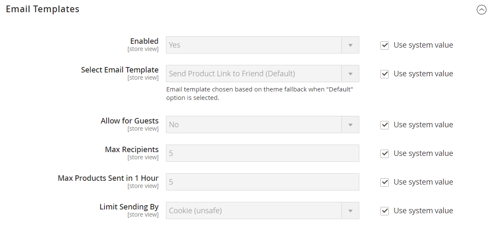

# 친구에게 이메일 보내기

이메일 링크를 사용하면 고객이 제품에 대한 링크를 친구와 쉽게 공유할 수 있습니다. 데모 Luma 스토어에서 이메일 링크는 봉투 아이콘으로 표시됩니다. 메시지 템플릿은 사용자의 음성 및 브랜드에 맞게 사용자 지정할 수 있습니다. 스팸 메일을 방지하기 위해 각 이메일에 대한 수신자 수와 1시간 기간 동안 공유할 수 있는 제품 수를 제한할 수 있습니다.

{width="700" zoomable="yes"}

## e-메일-a-friend 구성

1. _관리자_ 사이드바에서 **[!UICONTROL Stores]** > _[!UICONTROL Settings]_>**[!UICONTROL Configuration]**(으)로 이동합니다.

1. 왼쪽 패널에서 **[!UICONTROL Catalog]**&#x200B;을(를) 확장하고 **[!UICONTROL Email to a Friend]**&#x200B;을(를) 선택합니다.

1. **[!UICONTROL Email Templates]** 섹션에서 를 확장하고 옵션을 설정합니다.

   {width="600" zoomable="yes"}

   이러한 각 구성 설정에 대한 자세한 설명은 _구성 참조 안내서_&#x200B;의 [전자 메일 템플릿](../configuration-reference/catalog/email-to-a-friend.md)을 참조하세요.

   필드의 기본 설정을 변경하려면 **[!UICONTROL Use system value]** 확인란의 선택을 취소하여 필드를 편집할 수 있도록 합니다.

   - **[!UICONTROL Enabled]**&#x200B;을(를) `Yes`(으)로 설정합니다.

   - 메시지의 기반으로 사용할 템플릿에 **[!UICONTROL Select Email Template]**&#x200B;을(를) 설정합니다.

   - 등록된 고객만 친구에게 전자 메일을 보내도록 하려면 **[!UICONTROL Allow for Guests]**&#x200B;을(를) `No`(으)로 설정하십시오.

   - **[!UICONTROL Max Recipients]**&#x200B;의 경우 메시지 한 개에 대한 메일 그룹에 포함될 수 있는 최대 친구 수를 입력합니다.

   - **[!UICONTROL Max Products Sent in 1 Hour]**&#x200B;의 경우 한 사용자가 친구와 1시간 동안 공유할 수 있는 최대 제품 수를 입력하십시오.

   - 전자 메일 보낸 사람을 식별하려면 **[!UICONTROL Limit Sending By]**&#x200B;을(를) 다음 방법 중 하나로 설정하십시오.

     `IP Address` - (권장) 전자 메일을 보내는 데 사용되는 컴퓨터의 IP 주소로 보낸 사람을 식별합니다.

     `Cookie (unsafe)` - 브라우저 쿠키로 보낸 사람을 식별합니다. 이 방법은 발신자가 쿠키를 삭제하여 제한을 무시할 수 있으므로 효율성이 떨어집니다.

1. 완료되면 **[!UICONTROL Save Config]**&#x200B;을(를) 클릭합니다.

## 상점 전면의 친구에게 이메일 보내기

이 기능이 구성되면 스토어 고객은 다음 단계에 따라 친구와 제품 정보를 공유합니다.

1. 카탈로그 페이지에서 고객이 **[!UICONTROL Email]** 링크를 클릭합니다.

1. 기능이 등록된 사용자에 대해서만 구성된 경우 다음 중 하나를 수행합니다.

   - 고객 계정에 로그인합니다.
   - 새 계정을 등록합니다.

1. **[!UICONTROL Message]**&#x200B;을(를) 완료하고 받는 사람 **[!UICONTROL Name]** 및 **[!UICONTROL Email Address]**&#x200B;을(를) 입력합니다.

   필요한 경우 고객이 수신자를 추가할 수 있습니다.

   - **[!UICONTROL Add Invitee]**&#x200B;을(를) 클릭합니다.

   - 추가 사용자의 **[!UICONTROL Name]** 및 **[!UICONTROL Email Address]**&#x200B;을(를) 입력합니다.

     구성을 통해 허용된 만큼 추가 사용자에게 메시지를 보낼 수 있습니다. **[!DNL Remove]** 링크를 클릭하여 추가된 초대장을 제거할 수 있습니다.

1. 메시지를 보낼 준비가 되면 **[!UICONTROL Send Email]**&#x200B;을(를) 클릭합니다.

   {width="700" zoomable="yes"}
