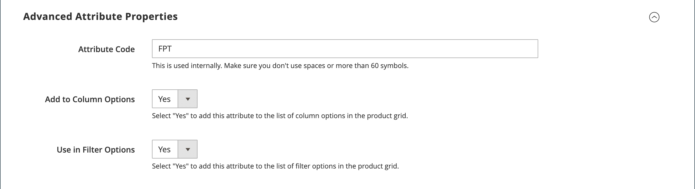
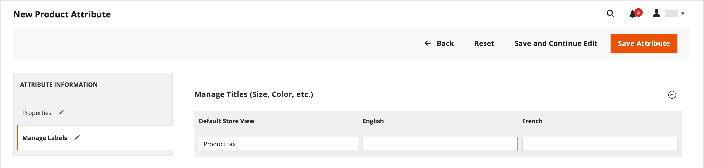
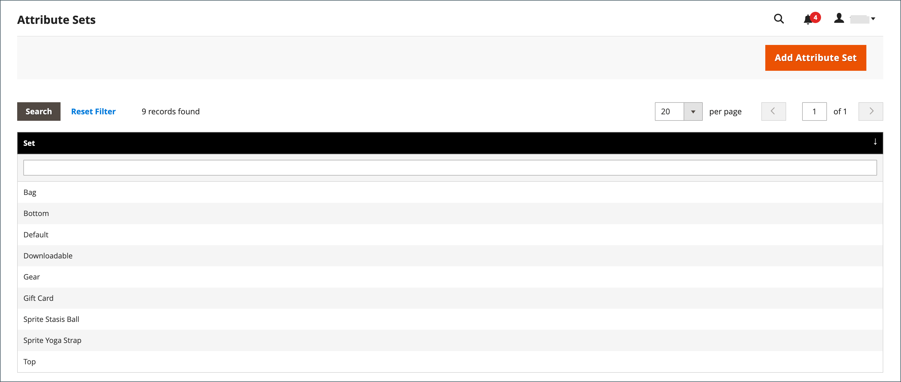
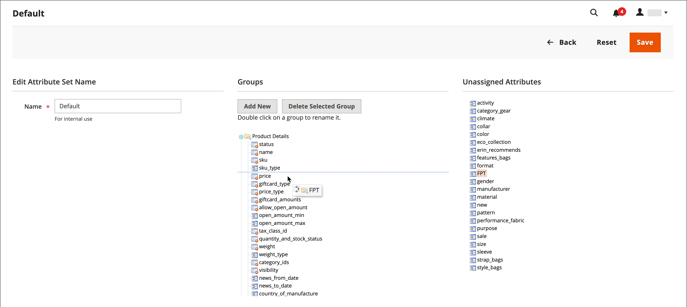

# 고정 제품 세금(FPT)

일부 과세관할에는 특정 유형의 상품에 추가되어야 하는 고정세가 있다. 필요에 따라 스토어의 세금 계산에 필요한 _고정 제품 세금_(FPT)을 설정할 수 있습니다. 일부 국가에서는 FPT를 사용하여 Waste Electrical and Electronic Equipment (WEEE) 세금을 책정할 수 있습니다. 이 세금은 _생태 세금_ 또는 _생태 세금_&#x200B;이라고도 하며, 재활용 비용을 상쇄하기 위해 특정 유형의 전자 제품에 대해 징수됩니다. 제품 가격의 백분율이 아닌 고정 금액입니다.

고정 제품 세금은 제품을 기준으로 품목 레벨에서 적용됩니다. 일부 관할권에서는 이 세금에 대해 추가 % 세금 계산이 적용됩니다. 세금 관할 구역에는 세금이 있든 없든 제품 가격이 고객에게 표시되는 방식에 대한 규칙도 있을 수 있습니다. 규칙을 이해하고 그에 따라 FPT 표시 옵션을 설정해야 합니다.

이메일에서 FPT 가격을 인용할 때에는 가격의 차이가 주문에 대한 고객의 신뢰도에 영향을 미칠 수 있으므로 주의하십시오. 예를 들어 FPT를 표시하지 않고 주문 검토 가격을 표시하는 경우 관련 FPT가 있는 품목을 구매하는 고객은 FPT 세액이 포함된 합계를 볼 수 있지만 항목별 분류는 없습니다. 가격 차이로 인해 일부 고객은 총 금액이 예상 금액과 다르기 때문에 카트를 포기해야 할 수 있습니다.

## FPT 표시 가격

| FPT | 설정 및 계산 표시 | |
|--- |--- |---|
| 과세되지 않음 | **[!UICONTROL Excluding FPT]** | FPT는 장바구니에 별도의 행으로 표시되며 값은 적절한 세금 계산에 사용됩니다. |
| | **[!UICONTROL Including FPT]** | FPT는 항목의 기준 가격에 추가되지만 세금 규칙 기반 계산에는 포함되지 않습니다. |
| | **[!UICONTROL Excluding FPT, FPT Description, Final Price]** | 가격은 FPT 금액이나 설명 없이 나타납니다. FPT는 세금 규칙 기반 계산에 포함되지 않습니다. |
| 과세 | **[!UICONTROL Excluding FPT]** | FPT는 장바구니에 별도의 행으로 표시되며 값은 적절한 세금 계산에 사용됩니다. |
| | **[!UICONTROL Including FPT]** | FPT는 품목의 가격에 포함되므로 세금 계산에 대한 변경은 필요하지 않습니다. |
| | **[!UICONTROL Excluding FPT, FPT Description, Final Price]** | 가격은 FPT 금액이나 설명 없이 나타납니다. 그러나 FPT는 세금 규칙 기반 계산에 포함됩니다. |

{style="table-layout:auto"}

## FPT 구성

FPT(Fixed Product Tax) [입력 유형](../catalog/attributes-input-types.md)은(는) 각 지역의 세금 관리를 위한 필드 섹션을 만듭니다.

다음 지침은 &quot;에코 세금&quot;을 예로 사용하여 스토어에 대한 고정 제품 세금을 설정하는 방법을 보여 줍니다. 세금의 범위와 세금이 적용되는 국가 및 주를 설정한 후 선택한 옵션에 따라 입력 필드가 현지 요구 사항에 따라 변경될 수 있습니다. 자세한 내용은 [제품 특성 만들기](../catalog/attribute-product-create.md)를 참조하세요.

### 1단계: 고정 제품 세금 사용

1. _관리자_ 사이드바에서 **[!UICONTROL Stores]** > _[!UICONTROL Settings]_>**[!UICONTROL Configuration]**(으)로 이동합니다.

1. 왼쪽 패널에서 **[!UICONTROL Sales]**&#x200B;을(를) 확장하고 **[!UICONTROL Tax]**&#x200B;을(를) 선택합니다.

1. **[!UICONTROL Fixed Product Taxes]** 섹션에서 를 확장합니다.

1. **[!UICONTROL Enable FPT]**&#x200B;을(를) `Yes`(으)로 설정합니다.

1. 고정 제품 세금이 매장 가격에 사용되는 방법을 결정하려면 다음 가격 표시 위치 각각에 대한 FPT 설정을 선택합니다.

   - **[!UICONTROL Display Prices in Product Lists]**
   - **[!UICONTROL Display Prices on Product View Page]**
   - **[!UICONTROL Display Prices in Sales Modules]**
   - **[!UICONTROL Display Prices in Emails]**

   옵션(각각에 대해 동일함):

   - `Including FPT Only`
   - `Including FPT and FPT description`
   - `Excluding FPT. Including FPT description and final price`
   - `Excluding FPT`

1. 필요에 따라 **[!UICONTROL Apply Tax to FPT]**&#x200B;을(를) 설정합니다.

1. 필요에 따라 **[!UICONTROL Include FPT in Subtotal]**&#x200B;을(를) 설정합니다.

   {width="600" zoomable="yes"}

   이러한 각 구성 설정에 대한 자세한 설명은 _구성 참조 안내서_&#x200B;에서 [고정 제품 세금](../configuration-reference/sales/tax.md#fixed-product-taxes)을 참조하십시오.

1. 완료되면 **[!UICONTROL Save Config]**&#x200B;을(를) 클릭합니다.

### 2단계: FPT 속성 만들기

1. _관리자_ 사이드바에서 **[!UICONTROL Stores]** > _[!UICONTROL Attributes]_>**[!UICONTROL Product]**(으)로 이동합니다.

1. 오른쪽 상단 모서리에서 **[!UICONTROL Add New Attribute]**&#x200B;을(를) 클릭하고 다음을 수행합니다.

   - **[!UICONTROL Default Label]**&#x200B;에 대해 특성을 식별하는 레이블을 입력하십시오.

   - **[!UICONTROL Catalog Input for Store Owner]**&#x200B;을(를) `Fixed Product Tax`(으)로 설정합니다.

   {width="600" zoomable="yes"}

1. **[!UICONTROL Advanced Attribute Properties]** 섹션에서 를 확장하고 속성 옵션을 설정합니다.

   - **[!UICONTROL Attribute Code]** - 고유 식별자를 공백이나 특수 문자 없이 소문자로 입력하십시오. 최대 길이는 30자입니다. 기본 레이블 필드의 텍스트에 필드를 비워 둘 수 있습니다.

   - **[!UICONTROL Add to Column Options]** - FPT 필드를 [제품 목록](../catalog/products-list.md)에 표시하려면 `Yes`(으)로 설정하십시오.

   - **[!UICONTROL Use in Filter Options]** - FPT 필드의 값을 기준으로 그리드에서 제품을 [필터링](../getting-started/admin-workspace.md)할 수 있도록 하려면 `Yes`(으)로 설정합니다.

   {width="600" zoomable="yes"}

1. (선택 사항) 왼쪽 패널에서 **[!UICONTROL Manage Labels]**&#x200B;을(를) 선택하고 각 스토어 보기에 대한 기본 레이블 대신 사용할 레이블을 입력합니다.

   {width="600" zoomable="yes"}

1. 완료되면 **[!UICONTROL Save Attribute]**&#x200B;을(를) 클릭합니다.

1. 메시지가 표시되면 [캐시](../systems/cache-management.md)를 새로 고치십시오.

### 3단계: 속성 세트에 FPT 속성 추가

1. _관리자_ 사이드바에서 **[!UICONTROL Stores]** > _[!UICONTROL Attributes]_>**[!UICONTROL Attribute Set]**(으)로 이동합니다.

1. 목록에서 속성 세트를 클릭하여 레코드를 편집 모드로 엽니다.

   {width="600" zoomable="yes"}

1. 오른쪽의 **[!UICONTROL Unassigned Attributes]** 목록에서 가운데 열의 **[!UICONTROL Groups]** 목록으로 FPT 특성을 끌어 놓습니다.

   각 그룹 폴더는 제품 정보의 섹션에 해당합니다. 편집 모드에서 제품이 열려 있을 때 속성을 표시할 위치에 배치할 수 있습니다.

   {width="600" zoomable="yes"}

1. 완료되면 **[!UICONTROL Save]**&#x200B;을(를) 클릭합니다.

1. 고정 제품 세금을 포함해야 하는 각 속성 세트에 대해 이 단계를 반복합니다.

### 4단계: 특정 제품에 FPT 적용

1. _관리자_ 사이드바에서 **[!UICONTROL Catalog]** > **[!UICONTROL Products]**(으)로 이동합니다.

1. 편집 모드에서 고정 제품 세금이 필요한 제품을 엽니다.

1. 특성 집합에 추가한 필드의 **[!UICONTROL FPT]** 섹션을 찾아 **[!UICONTROL Add Tax]**&#x200B;을(를) 클릭합니다.

1. 제품에 적용할 세금을 지정합니다.

   {width="600" zoomable="yes"}

   - Commerce 인스턴스에 여러 웹 사이트가 있는 경우 적절한 **[!UICONTROL Website]** 및 기본 통화를 선택합니다. 이 예제에서는 필드가 기본적으로 `All Websites [USD]`(으)로 설정됩니다.

   - 고정 제품 세금이 적용되는 지역으로 **[!UICONTROL Country/State]**&#x200B;을(를) 설정합니다.

   - **[!UICONTROL Tax]**&#x200B;의 경우 고정 제품 세금을 십진법으로 입력하십시오.

1. 고정 제품 세금을 더 추가하려면 **[!UICONTROL Add Tax]**&#x200B;을(를) 클릭하고 프로세스를 반복합니다.

1. 완료되면 **[!UICONTROL Save]**&#x200B;을(를) 클릭합니다.
