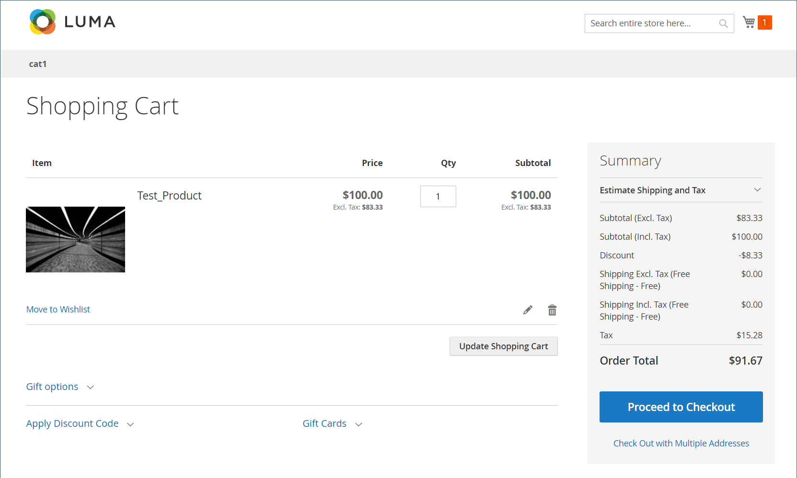

# 숨겨진 세금 계산

_숨겨진 세금_ 은 할인 금액이 있는 VAT 금액입니다. 다음 조건이 모두 true인 경우 0이 아닙니다.

- 카탈로그 가격에는 세금이 포함되어 있습니다
- 부가세 세율은 0이 아닙니다
- 할인 선물이 있습니다

세금이 포함된 할인이 있으면 Commerce는 _숨겨진 세금_ 할인된 가격으로 계산하면 다시 추가가 됩니다.

`discountedItemPrice = fullPriceWithoutTax - discountAmountOnFullPriceWithoutTax + vatAmountOnDiscountedPrice + hiddenTax`

## 예

1. 항목의 전체 가격(세금 포함): $100
1. VAT: 20%
1. 세금을 제외한 품목 가격에 대해 10% 할인 적용:

### 잘못된 예상 결과

- 할인 없이 세후 품목 가격=100 USD
- 할인 없는 세전 품목 가격=100/1.2=83.33 USD
- 할인=83.33 \ *0.1=8.33 USD
- Tax=(83.33-8.33) \ *0.2=**15 USD(무효)**
- 주문 합계(세금 제외)=83.33-8.33=**75 USD(무효)**
- 주문 합계(세금 포함)=75+15=**90 USD(무효)**

### 장바구니의 유효한 실제 결과

{width="700" zoomable="yes"}

### 유효한 계산

1. 세금 없이 항목의 전체 가격: $100 / 1.2 = **US$83.33**

1. 전체 품목 가격의 VAT 금액: $100 - $83.33 = $16.67

   _$100 \ * (1 - 1/1.2)로 계산할 수도 있습니다._

1. $83.33에서 10% 할인: **US$8.33** (세금이 할인되지 않을 때)

1. 세금이 포함된 항목의 할인 가격: $100 - $8.33 = $91.67

   >[!NOTE]
   >
   >이 식은 할인이 어떻게 적용되는지에 대한 고객의 인식을 보여준다.

1. 세금이 없는 항목의 할인 가격: $91.67 / 1.2 = $76.39

1. 할인된 가격의 VAT 금액: $91.67 - $76.39 = **US$15.28 (유효)**

   _$91.67 \ * (1 - 1/1.2)로 계산할 수도 있습니다._

1. 숨겨진 세금 또는 _할인 세금 보상_ 전체 가격과 할인된 가격의 VAT 금액 차이: $16.67 - $15.28 = **US$1.39**

   _다른 방법 : 숨겨진 세금 $8.33 할인 내에서 이월 VAT 금액 $8.33 \* (1 - 1/1.2)._

1. 고객이 일반적으로 할인된 가격을 이해하는 방법(주문 총액):

   _세금을 포함한 품목의 전체 가격&#x200B;**간단히**할인 금액: $100 - $8.33 = $91.67_

1. **Commerce에서 할인된 가격을 계산하는 방법** (공식은 앞 부분 참조):

   _$83.33 - $8.33 + 15.28 + 1.39 =**$91.67***_
