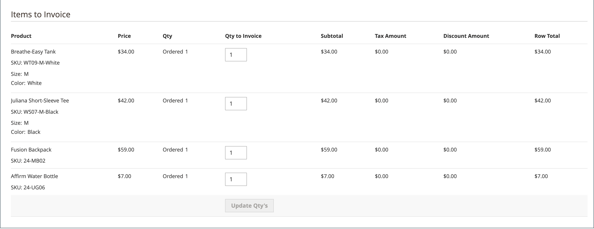
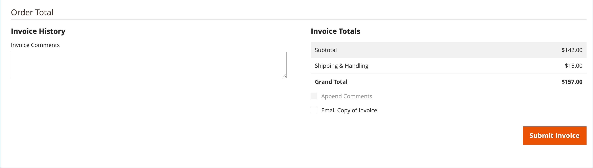

# 인보이스

송장은 주문에 대한 지급 기록 레코드입니다. 단일 주문에 대해 여러 개의 송장을 [생성](#create-an-invoice)할 수 있으며, 각 송장에는 사용자가 지정한 구매 제품을 많거나 적을 수 있습니다. [인쇄용 PDF 송장](#print-invoices)을(를) 고객에 대한 판매 문서로 만들 수도 있습니다.

_관리자_ 사이드바에서 **[!UICONTROL Sales]** > _작업_ > **인보이스**(으)로 이동하여 _인보이스_ 그리드를 열고 만든 인보이스에 액세스합니다.

{width="700" zoomable="yes"}

## 열 설명

| 열 | 설명 |
|--- |--- |
| [!UICONTROL Select] | 견적에 대한 확인란을 선택하여 작업에 적용하거나 열 머리글에서 선택 컨트롤을 사용합니다. 옵션: `Select All` / `Deselect All` |
| [!UICONTROL Invoice] | 관리자로부터 송장이 제출될 때 할당되는 고유 숫자 식별자입니다. 송장 상세내역을 볼 때 이 번호는 견적명 대신 페이지 상단에 나타납니다. |
| [!UICONTROL Invoice Date] | 관리자가 송장을 처음 제출한 날짜와 시간. |
| [!UICONTROL Order#] | 구매자가 주문을 할 때 할당되는 고유 숫자 식별자입니다. 송장 세부 정보를 볼 때 이 번호는 주문 및 계정 정보 블록에 링크로 표시됩니다. |
| [!UICONTROL Order Date] | 고객이 처음 주문한 날짜와 시간. |
| [!UICONTROL Bill-to Name] | 주문에 대한 결제 책임이 있는 사람의 이름. |
| [!UICONTROL Status] | 송장의 현재 상태를 나타냅니다. 매수인 또는 매도인 측의 행위에 의해서만 지위의 변경이 가능하다. |
| [!UICONTROL Grand Total (Base)] | 구매할 제품의 총 가격. 총 금액은 웹 사이트의 기본 통화 및 상점 통화로 표시됩니다. |
| [!UICONTROL Grand Total (purchase)] | 주문에서 구매한 제품의 총 합계입니다. 총 금액은 웹 사이트의 기본 통화 및 상점 통화로 표시됩니다. |
| [!UICONTROL Purchased From] | 송장이 생성된 웹 사이트/스토어/스토어 조회수. |
| [!UICONTROL Billing Address] | 주문한 고객의 청구 주소. |
| [!UICONTROL Shipping Address] | 주문이 배송될 주소입니다. |
| [!UICONTROL Customer Name] | 송장을 수령하는 고객의 이름과 성. |
| [!UICONTROL Email] | 송장을 받은 고객의 이메일 주소. |
| [!UICONTROL Customer Group] | 송장을 수령하는 고객에게 지정된 고객 그룹. |
| [!UICONTROL Payment Method] | 지급에 사용할 결제 방법. |
| [!UICONTROL Shipping Information] | 주문을 출하하는 데 사용할 방법입니다. |
| [!UICONTROL Subtotal] | 배송 및 취급 없이 주문 소계 및 세금. |
| [!UICONTROL Shipping and Handling] | 배송 및 처리에 대해 청구된 금액. |
| [!UICONTROL Action] | **[!UICONTROL View]** - 편집 모드에서 송장을 엽니다. |

{style="table-layout:auto"}

## 송장 만들기

주문에 대한 송장을 생성하면 해당 주문을 취소하거나 변경할 수 없는 상태로 이동합니다. 새 송장 페이지는 일부 추가 필드가 있는 완료된 주문과 유사합니다. 주문과 관련된 모든 활동은 송장의 설명 섹션에 기재되어 있습니다.

일반적으로 주문은 배송 프로세스가 시작되면 송장이 발행되고 캡처됩니다. 결제 방법이 구매 주문이거나 [결제 작업](../configuration-reference/sales/payment-methods.md#payment-actions)이(가) `Authorize and Capture`(으)로 설정된 경우 주문이 송장으로 처리되며 결제 시 결제가 캡처됩니다. 포장 명세서가 있는 송장을 생성하고 운송업체 계정에서 운송 라벨을 인쇄할 수도 있습니다. 단일 주문은 부분 배송으로 나눌 수 있으며, 필요한 경우 별도로 청구됩니다.

새 주문의 상태가 `Processing`(으)로 설정되면 구성에서 _모든 항목에 대한 자동 인보이스_ 옵션을 사용할 수 있습니다. [결제 작업](../configuration-reference/sales/payment-methods.md#payment-actions)이 `Authorize and Capture`(으)로 설정된 경우 일부 신용 카드 결제 방법이 프로세스의 일부로 송장 발부 단계를 완료합니다. 이런 경우 송장 버튼이 나타나지 않고 주문이 배송될 준비가 된 것입니다.

>[!NOTE]
>
>`Gift Card`, `Store Credit`, `Reward Points` 또는 기타 오프라인 결제 방법을 사용하여 수행한 주문에 대해 송장이 자동으로 만들어지지 않습니다.

주문에 대한 송장을 인쇄하려면 먼저 생성해야 합니다. PDF을 보거나 인쇄하려면 먼저 [Adobe Acrobat Reader](https://www.adobe.com/acrobat/pdf-reader.html "Adobe Reader 가져오기")와 같은 PDF 리더를 다운로드하여 설치하십시오.

**_주문 송장 발부:_**

1. _관리자_ 사이드바에서 **[!UICONTROL Sales]** > _[!UICONTROL Operations]_>**[!UICONTROL Orders]**(으)로 이동합니다.

1. 표에서 `Processing` 상태의 판매 주문을 찾습니다. 그런 다음 다음을 수행합니다.

1. _Action_ 열에서 **[!UICONTROL View]**&#x200B;을(를) 클릭합니다.

1. 판매 주문 헤더에서 **[!UICONTROL Invoice]** 옵션을 선택합니다.

   >[!NOTE]
   >
   >특정 _[!UICONTROL Invoice]_&#x200B;결제 방법[에 대한 &#x200B;](../configuration-reference/sales/payment-methods.md#payment-actions)결제 작업[이(가) &#x200B;](../configuration-reference/sales/payment-methods.md)(으)로 설정되어 송장이 자동 생성되면 `Authorize and Capture` 옵션이 표시되지 않습니다. 또한 주문이 수행되고 결제 방법에 대한 결제 작업이 `Authorize`(으)로 설정되어 있고 주문에 대한 송장이 발행된 경우에도 마찬가지입니다.

   {width="700" zoomable="yes"}

   새 송장 페이지는 편집할 수 있는 추가 필드가 있는 완료된 주문 페이지와 유사합니다.

1. 품목이 출하될 준비가 되면 송장을 생성하는 동시에 선적에 대한 포장 명세서를 생성합니다.

   - _배송 정보_ 섹션에서 **[!UICONTROL Create Shipment]** 확인란을 클릭하여 선택합니다.

     송장이 생성됨과 동시에 선적 레코드가 생성됩니다.

   - 추적 번호 포함:

      - **[!UICONTROL Add Tracking Number]**&#x200B;을(를) 클릭합니다.
      - 추적 정보 입력: _[!UICONTROL Carrier]_,_[!UICONTROL Title]_ 및 _[!UICONTROL Number]_

     {width="600" zoomable="yes"}

   - 부분 송장을 생성합니다(선택적).

      - _인보이스에 대한 항목_ 섹션에서 인보이스에 특정 항목만 포함하도록 **[!UICONTROL Qty to Invoice]** 열을 업데이트하십시오.
      - **[!UICONTROL Update Qty's]**&#x200B;을(를) 클릭합니다.

        {width="600" zoomable="yes"}

1. 온라인 결제 방법을 주문에 사용한 경우 **[!UICONTROL Amount]**&#x200B;을(를) 적절한 옵션으로 설정하십시오.

1. 송장이 생성될 때 이메일로 고객에게 알리려면 다음을 수행합니다.

   - **[!UICONTROL Email Copy of Invoice]** 확인란을 선택합니다.

   - **[!UICONTROL Invoice Comments]** 입력 알림 전자 메일에 설명을 포함하려면 **[!UICONTROL Append Comments]** 확인란을 표시하십시오.

1. 완료되면 페이지 하단의 **[!UICONTROL Submit Invoice]**&#x200B;을(를) 클릭합니다.

   **_온라인 결제 방법:_**

   {width="600" zoomable="yes"}

   **_오프라인 결제 방법:_**

   {width="600" zoomable="yes"}

   주문 상태가 `Pending`에서 `Complete`(으)로 변경됩니다.

   {width="600" zoomable="yes"}

## 인보이스 인쇄

송장은 개별적으로 또는 배치로 인쇄할 수 있습니다. 그러나 송장을 인쇄하려면 먼저 주문에 대해 송장을 생성해야 합니다. 인쇄용 PDF 송장에 고해상도 로고를 업로드하고 헤더에 [주문 ID](../stores-purchase/sales-documents.md#add-reference-ids)을 포함할 수 있습니다. 로고 및 주소를 사용하여 인보이스 템플릿을 사용자 지정하려면 [PDF 로고 요구 사항](../stores-purchase/sales-documents.md#image-formats)을 참조하세요.

>[!NOTE]
>
>PDF을 보거나 인쇄하려면 PDF 판독기가 있어야 합니다. [Adobe Reader](https://www.adobe.com/acrobat/pdf-reader.html "Adobe Reader 가져오기")를 무료로 다운로드할 수 있습니다.

### 단일 청구서 인쇄

1. _관리자_ 사이드바에서 **[!UICONTROL Sales]** > _[!UICONTROL Operations]_>**[!UICONTROL Invoices]**(으)로 이동합니다.

1. _[!UICONTROL Invoices]_&#x200B;그리드에서 송장을 찾은 다음&#x200B;**[!UICONTROL View]**&#x200B;작업_ 열에서 _을(를) 클릭합니다.

1. 송장의 맨 위에서 **[!UICONTROL Print]**&#x200B;을(를) 클릭하여 송장의 PDF을 생성합니다.

1. 생성된 PDF을 파일에 저장하거나 인쇄합니다.

### 여러 송장 인쇄

1. _관리자_ 사이드바에서 **[!UICONTROL Sales]** > _[!UICONTROL Operations]_>**[!UICONTROL Invoices]**(으)로 이동합니다.

1. _[!UICONTROL Invoices]_&#x200B;그리드에서 인쇄할 각 송장의 확인란을 선택합니다.

1. **[!UICONTROL Actions]** 컨트롤을 `PDF Invoices`(으)로 설정합니다.

   {width="600" zoomable="yes"}

인보이스는 프린터로 보내거나 저장할 수 있는 단일 PDF 파일에 저장됩니다.

## 사용자 정의 캡처 금액

[!BADGE SaaS만]{type=Positive url="https://experienceleague.adobe.com/ko/docs/commerce/user-guides/product-solutions" tooltip="Adobe Commerce as a Cloud Service 프로젝트에만 적용됩니다(Adobe 관리 SaaS 인프라)."}

판매자에게 부분 캡처 및 특수 결제 시나리오에 대한 보다 높은 유연성을 제공하기 위해 Invoice API는 확장 속성을 사용하여 사용자 정의 캡처 금액을 지원합니다.

송장을 생성할 때 사용자 정의 금액을 수집하기 위해 REST를 호출할 수 있습니다.  [`POST V1/order/:orderId/invoice`](https://developer.adobe.com/commerce/webapi/reference/rest/saas/) REST 끝점을 사용하고 페이로드의 `extension_attributes.custom_capture_amount` 필드에 사용자 지정 양을 지정하십시오.

>[!NOTE]
>
>이 기능을 활성화하려면 지원 담당자에게 문의하십시오.
>
>법적 제한으로 인해 사용자 정의 캡처 금액은 북미(NA) 지역 및 결제 오버캡처가 허용된 기타 지역에서만 사용할 수 있습니다.
