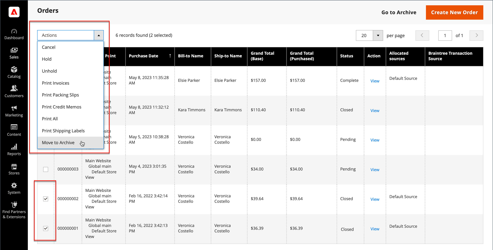
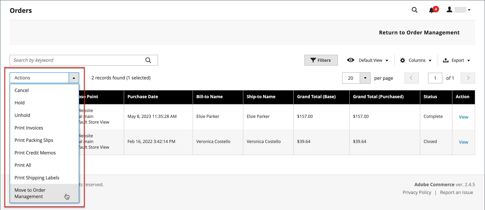

# 주문 보관

{{ee-feature}}

정기적으로 주문을 아카이빙하면 성능이 향상되고 불필요한 정보가 작업 공간에 남아 있지 않으므로 현재 비즈니스에 집중할 수 있습니다. 송장, 선적 및 대변 메모는 자동 또는 수동으로 보관할 수 있으며 언제든지 조회할 수 있습니다.

>[!NOTE]
>
>_[!UICONTROL Archive]_&#x200B;옵션은 보관이 [사용](../configuration-reference/sales/sales.md)인 경우에만 [[!UICONTROL Sales] 메뉴에 나타납니다](sales-menu.md).

## 주문 아카이브 구성

지정된 일수가 지난 후 주문, 송장, 선적 및 대변 메모를 보관하도록 스토어를 구성할 수 있습니다. 주문 및 주문 관련 문서를 아카이브로 이동하거나 이전 상태로 복원할 수 있습니다. 보관된 주문은 삭제되지 않고 관리자로부터 계속 사용할 수 있습니다. 보관된 데이터를 CSV 파일로 내보내고 스프레드시트로 열 수 있습니다. 활성화하면 _보관_ 작업이 작업 영역의 맨 위에 나타납니다.

1. _관리자_ 사이드바에서 **[!UICONTROL Stores]** > _[!UICONTROL Settings]_>**[!UICONTROL Configuration]**(으)로 이동합니다.

1. 왼쪽 패널에서 **[!UICONTROL Sales]** 섹션을 확장하고 아래의 **[!UICONTROL Sales]**&#x200B;을(를) 선택합니다.

1. **[!UICONTROL Orders, Invoices, Shipments, Credit Memos Archiving]** 섹션에서 를 확장합니다.

   {width="600" zoomable="yes"}

1. **[!UICONTROL Enable Archiving]**&#x200B;을(를) `Yes`(으)로 설정합니다.

   >[!NOTE]
   >
   >나중에 보관을 해제하기로 결정한 경우 보관된 모든 주문이 이전 상태로 복원됩니다.

1. 완료된 주문이 보관되기 전에 대기할 일 수로 **[!UICONTROL Archive Orders Purchased]**&#x200B;을(를) 설정하십시오.

   기본적으로 주문은 구매 후 30일 후에 보관됩니다.

1. **[!UICONTROL Order Statuses to be Archived]** 목록에서 보관할 주문을 식별하는 데 사용할 각 주문 상태를 선택합니다.

   여러 항목을 선택하려면 Ctrl 키(Windows) 또는 Command 키(Mac)를 누른 채 각 항목을 클릭합니다.

1. **[!UICONTROL Save Config]**&#x200B;을(를) 클릭합니다.

1. 메시지가 표시되면 잘못된 캐시를 새로 고칩니다.

## 보관된 문서 보기

1. _[!UICONTROL Archive]_&#x200B;아래의&#x200B;_[!UICONTROL Sales]_ 메뉴에서 다음 중 하나를 선택합니다.

   - **[!UICONTROL Orders]**
   - **[!UICONTROL Invoices]**
   - **[!UICONTROL Shipments]**
   - **[!UICONTROL Credit Memos]**

1. 세부 정보를 보려면 목록에서 보관된 문서를 클릭합니다.

## 보관된 문서에 작업 적용

각 문서를 작업 대상으로 선택하고 다음 **[!UICONTROL Actions]** 중 하나를 선택하십시오.

- `Cancel`
- `Hold`
- `Unhold`
- `Print`
- `Move to Orders Management`

## 문서 수동 보관

1. 다음 중에서 보관할 문서 유형을 선택합니다.

   - **[!UICONTROL Orders]**
   - **[!UICONTROL Invoices]**
   - **[!UICONTROL Shipments]**
   - **[!UICONTROL Credit Memos]**

1. 보관하려는 각 항목의 확인란을 선택합니다.

1. 오른쪽 상단 모서리에서 **[!UICONTROL Actions]**&#x200B;을(를) `Move to Archive`(으)로 설정합니다.

1. 선택한 문서를 보관하려면 **[!UICONTROL Submit]**&#x200B;을(를) 클릭하십시오.

## 보관된 문서 복원

1. 복원할 문서 유형을 선택합니다.

1. 다음 옵션 중 하나를 사용하여 문서를 선택합니다.

   - 보이는 모든 문서를 선택하려면 왼쪽 상단 모서리에서 **[!UICONTROL Select Visible]**&#x200B;을(를) 클릭합니다.

   - 복원할 각 문서의 확인란을 수동으로 선택합니다.

1. 오른쪽 상단에서 **[!UICONTROL Action]**&#x200B;을(를) `Move to Orders Management`(으)로 설정합니다.

1. 문서를 복원하려면 **[!UICONTROL Submit]**&#x200B;을(를) 클릭하십시오.

## 보관된 문서 내보내기

1. 내보낼 문서 유형을 선택합니다.

1. 오른쪽 위 메뉴에서 **[!UICONTROL Export to:]**&#x200B;을(를) 다음 값 중 하나로 설정합니다.

   - `CSV`
   - `Excel`

1. **[!UICONTROL Export]**&#x200B;을(를) 클릭합니다.

지정된 일수가 지난 후 주문, 송장, 선적 및 대변 메모를 보관하도록 스토어를 구성할 수 있습니다. 주문 및 주문 관련 문서를 아카이브로 이동하거나 이전 상태로 복원할 수 있습니다. 보관된 주문은 삭제되지 않고 관리자로부터 계속 사용할 수 있습니다. 보관된 데이터를 CSV 파일로 내보내고 스프레드시트로 열 수 있습니다. 활성화하면 작업 영역의 맨 위에 _[!UICONTROL Archive]_&#x200B;명령이 나타납니다.

## 수동으로 주문 보관

1. _관리자_ 사이드바에서 **[!UICONTROL Sales]** > _[!UICONTROL Operations]_>**[!UICONTROL Orders]**(으)로 이동합니다.

1. 그리드에서 순서를 선택하려면 첫 번째 열에서 확인란을 선택합니다.

1. **[!UICONTROL Actions]** 컨트롤을 `Move to Archive`(으)로 설정하고 순서가 보관된 메시지를 찾습니다.

   {width="700" zoomable="yes"}

>[!TIP]
>
>보관할 수 있는 주문 상태 목록을 지정하려면 [주문 보관 구성](#configure-the-order-archive)을 참조하세요.

## 보관된 주문 보기

1. 다음 방법 중 하나를 사용하여 아카이브 보기를 엽니다.

   - _[!UICONTROL Orders]_&#x200B;눈금 위의 단추 모음에서&#x200B;**[!UICONTROL Go to Archive]**&#x200B;을(를) 클릭합니다.

   - _관리자_ 사이드바에서 **[!UICONTROL Sales]** > _[!UICONTROL Archive]_>**[!UICONTROL Orders]**(으)로 이동합니다.

   >[!NOTE]
   >
   >주문 페이지와 마찬가지로 보관된 주문 페이지의 제목은 _[!UICONTROL Orders]_&#x200B;입니다. 유일한 차이는&#x200B;_[!UICONTROL Return to Orders Management]_&#x200B;에 대한 단추 모음의 옵션입니다. 또한 페이지의 URL은 주문 보관 상태임을 나타냅니다.

1. _Action_ 열에서 **[!UICONTROL View]**&#x200B;을(를) 클릭합니다.

   {width="600" zoomable="yes"}

## 보관된 주문 복원

>[!NOTE]
>
>보관된 주문에서 복원된 주문은 [!UICONTROL Archive Orders Purchased] 설정에 구성된 일 수에 따라 다시 보관됩니다([주문 보관 구성](#configure-the-order-archive) 참조). 일 수는 주문의 [!UICONTROL Updated At] 날짜에 대해 계산되며, 이 값은 보관 위치에서 주문이 이동될 때 변경됩니다.

1. _관리자_ 사이드바에서 **[!UICONTROL Sales]** > _[!UICONTROL Operations]_>**[!UICONTROL Orders]**(으)로 이동합니다.

1. 단추 모음에서 **[!UICONTROL Go to Archive]**&#x200B;을(를) 클릭합니다.

1. 복원할 레코드를 찾은 다음 확인란을 클릭하여 선택합니다.

   {width="600" zoomable="yes"}

1. **[!UICONTROL Actions]** 컨트롤 값을 `Move to Order Management`(으)로 설정합니다.

아카이브된 주문이 아카이브에서 제거되었다는 메시지를 찾습니다.

## 보관된 주문 내보내기

1. _관리자_ 사이드바에서 **[!UICONTROL Sales]** > _[!UICONTROL Operations]_>**[!UICONTROL Orders]**(으)로 이동합니다.

1. 작업 메뉴에서 **[!UICONTROL Export]**&#x200B;을(를) 클릭하고 원하는 형식을 선택합니다.
