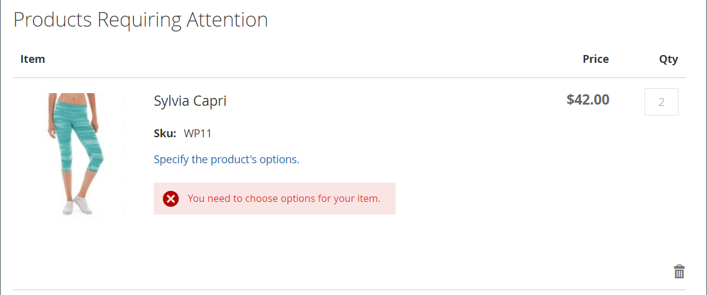

# SKU별 주문

{{ee-feature}}

&#39;SKU&#39;는 &#39;Stock Keeping Unit&#39;입니다. SKU는 일반적으로 온라인 판매자가 크기, 색상, 가격 및 재료와 같은 가장 중요한 제품 특성을 식별하는 데 도움이 됩니다. 제품 ID가 SKU와 다릅니다.

- 다음 `Product ID` 는 제품을 식별하기 위해 내부적으로 사용되며 고객이 사용할 수 없는 일련의 수입니다.
- 다음 `SKU` 는 일반적으로 마케팅 또는 내부 추적을 위한 제품 이름 및 속성을 기반으로 판매자가 생성합니다. 예: 파란색, 면 T-셔츠, 크기: T-COT-MED-BL. 필요한 경우 판매자가 SKU를 변경할 수 있습니다.

일반적으로, SKU는 제품의 구별되는 특성을 나타내는 약어 세트를 포함한다. 최대 SKU 길이는 64자입니다. SKU는 인벤토리를 효과적으로 추적 및 관리하는 데 중요하므로 전자 상거래에 올바르게 설정하는 것이 중요합니다.

_SKU별 주문_ 다음 값: [위젯](../content-design/widgets.md) 모든 쇼핑객을 위한 편의로 상점에 표시하거나 특정 고객 그룹의 쇼핑객만 사용할 수 있도록 할 수 있습니다. 구매자는 SKU별 주문 블록에 SKU 및 수량 정보를 직접 입력하거나 고객 계정에서 csv 파일을 업로드할 수 있습니다. 구성에 관계없이 저장소 관리자는 항상 SKU로 주문할 수 있습니다.

{width="700" zoomable="yes"}

## SKU별 주문 구성

1. 다음에서 _관리자_ 사이드바, 이동 **[!UICONTROL Stores]** > _[!UICONTROL Settings]_>**[!UICONTROL Configuration]**.

1. 왼쪽 패널에서 를 확장합니다. **[!UICONTROL Sales]** 섹션 및 선택 **[!UICONTROL Sales]** 밑에.

1. 확장  다음 **[!UICONTROL Order by SKU Settings]** 섹션.

1. 설정 **[!UICONTROL Enable Order by SKU on my Account in Storefront]** 다음 중 하나를 수행합니다.

   - `Yes, for Everyone` - SKU별 주문 블록은 모든 구매자가 매장에서 사용할 수 있습니다.
   - `Yes, for Specified Customer Groups` - SKU별 주문은 다음과 같은 특정 고객 그룹의 멤버만 사용할 수 있습니다. `Wholesale`.
   - `No` - SKU별 주문 블록이 상점 앞에 표시되지 않으며 고객 계정에서 SKU별 주문 페이지를 사용할 수 없습니다.

   {width="600" zoomable="yes"}

1. 클릭 **[!UICONTROL Save Config]**.

 (B2B - Adobe Commerce 전용) _**SKU별 주문 기능을 활성화하려면 빠른 주문 기능을 비활성화합니다.**_

1. 다음으로 이동 **[!UICONTROL Stores]** > _[!UICONTROL Settings]_>**[!UICONTROL Configuration]**.

1. 아래의 왼쪽 패널에서 _[!UICONTROL General]_, 선택&#x200B;**[!UICONTROL B2B Features]**

1. 확장  다음 **[!UICONTROL B2B Features]** 섹션.

1. 설정 **[!UICONTROL Enable Quick Order]** 끝 `No`.

   다음 [빠른 주문 기능](../b2b/quick-order.md) 고객과 게스트가 SKU 또는 제품 이름을 기반으로 신속하게 주문할 수 있도록 합니다.

## Storefront 경험

스토어에 대해 기능이 구성되면 고객은 다음을 포함하는 모든 페이지에서 SKU로 주문할 수 있습니다. _SKU별 주문_ 위젯 또는 해당 계정 대시보드의 위젯.

### 페이지 블록에서 SKU로 주문

1. 다음에서 _SKU별 주문_ 차단하면 고객이 **[!UICONTROL SKU]** 및 **[!UICONTROL Qty]** 을(를) 참조하십시오.

1. 다른 항목을 추가하려면 를 클릭합니다 **[!UICONTROL Add Row]** 이 과정을 반복합니다.

1. 클릭수 **[!UICONTROL Add to Cart]**.

### 고객 계정에서 SKU로 주문

1. 상점에서 고객은 계정에 로그인합니다.

1. 왼쪽 패널에서 을 선택합니다. **[!UICONTROL Order by SKU]**.

1. 환경 설정에 따라 개별 항목을 추가합니다.

   _**SKU별로 각 항목을 추가합니다.**_

   - 다음을 입력합니다. **[!UICONTROL SKU]** 및 **[!UICONTROL Qty]** 을(를) 참조하십시오.

   - 필요에 따라 항목을 추가하려면 를 클릭합니다. _행 추가_  필요한 만큼 여러 항목에 대해 를 반복합니다.

   - 클릭수 **[!UICONTROL Add to Cart]**.

   _**여러 항목의 CSV 파일을 업로드합니다.**_

   - 준비 [데이터 CSV 가져오기](../systems/data-csv.md) (쉼표로 구분된 값)에 대한 열을 포함하는 파일 `SKU` 및 `Qty`.

   {width="500" zoomable="yes"}

   - CSV 파일을 업로드하려면 를 클릭합니다 **[!UICONTROL Choose File]** 업로드할 파일을 선택합니다.

   - 클릭수 **[!UICONTROL Add to Cart]**.

   추가 옵션이 있는 제품이 있는 경우, 장바구니에서 제품에 주의가 필요하다는 메시지가 고객에게 표시됩니다.

   {width="600" zoomable="yes"}

   >[!NOTE]
   >
   >중복 SKU가 있는 경우 수량은 장바구니에서 하나의 라인 항목으로 결합됩니다. 고객은 품목의 수량을 변경하고 **[!UICONTROL Update Shopping Cart]** 을 클릭하여 합계를 다시 계산합니다.

