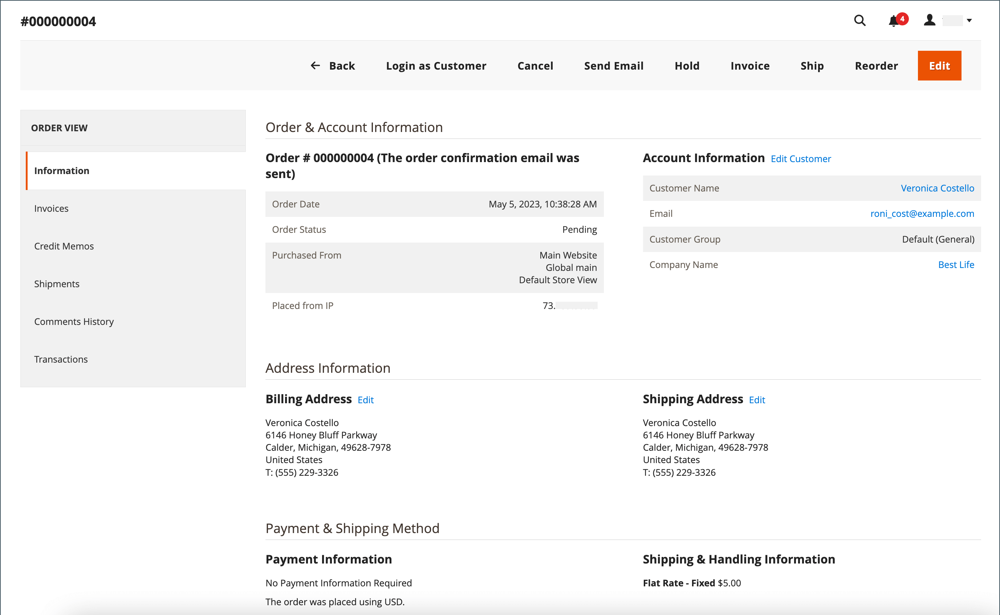

# 주문 작업 과정 및 처리

고객이 주문하면 판매 주문이 거래의 임시 레코드로 생성됩니다. 주문 그리드에서 판매 주문은 처음에 &quot;보류 중&quot; 상태이며 결제가 처리될 때까지 언제든지 취소할 수 있습니다. 결제가 확인되면 주문에 대한 인보이스를 발행하고 배송할 수 있습니다.

**1단계: 주문** - 체크아웃 프로세스는 구매자가 장바구니 페이지에서 **[!UICONTROL Go to Checkout]**&#x200B;을(를) 클릭하거나 고객 계정에서 직접 [재주문](reorders-allow.md)을(를) 클릭하면 시작됩니다.

**2단계: 주문 보류** 중 - 초기 판매 주문 상태는 `Pending`입니다. 이 상태에서는 결제가 처리되지 않았으며 주문을 편집하거나 취소할 수 있습니다. 이 상태는 결제 수단이 인증 모드로 구성될 때 발생합니다.

**3단계: 결제** 받기 - 주문 상태가 결제가 접수되거나 승인될 때로 `Processing` 변경됩니다. 결제 방법에 따라 거래가 승인되거나 처리될 때 알림 알림을 받을 수 있습니다. 이 상태는 결제 방법이 매입 또는 판매 의도 모드로 구성될 때 자동으로 발생합니다.

**4단계: 인보이스 주문** - 주문은 일반적으로 결제가 접수된 후 인보이스가 발행됩니다. 결제 방법은 주문에 필요한 송장 발행 옵션을 결정합니다. 송장이 생성되어 제출되면 사본이 고객에게 전송됩니다. 지불 방법이 or `intent sale` 지불 작업으로 `capture` 구성된 경우 지불이 승인되고 매입될 때 송장이 자동으로 생성됩니다.

>[!NOTE]
>
>인보이스는 , `Store Credit`, `Reward Points`또는 기타 오프라인 결제 방법을 사용하여 `Gift Card`발주한 주문에 대해서는 자동으로 생성되지 않습니다.

**5단계: 단일 배송** 예약 - 주문 상태는 배송 상세 정보가 완료되고, 배송이 예약되고, 배송이 설정되는 시점으로 `Complete` 변경됩니다. 인쇄된 포장 명세서 및 배송 라벨로 배송 요구 사항을 충족하거나 _픽업_ 준비 완료 알림이 선택되어 있습니다(스토어 내 배송 방법). 고객이 알림 받고 패키지가 배송됩니다. 추적 번호를 사용하는 경우 고객의 계정 계정에서 배송을 추적할 수 있습니다.

>[!NOTE]
>
>주문 상태 및 결제 방법 구성 옵션에 대한 자세한 내용은 주문 상태](order-status.md) 및 [결제를](payments.md) 참조하십시오[.

## 주문 보기

1. 관리자 사이드바에서 > _[!UICONTROL Operations]_>**[!UICONTROL Orders]**로 이동합니다&#x200B;**[!UICONTROL Sales]**._ _

1. 그리드에서 주문을 찾습니다.

1. 열 _[!UICONTROL Action]_에서 을 클릭합니다&#x200B;**[!UICONTROL View]**.

1. 주문 상태 확인:

   - `Pending` 주문을 수정하거나, 보류하거나, 취소하거나, 송장을 발행하여 배송할 수 있습니다.

   - 주문은 `Processing` 더 이상 실질적으로 편집하거나 취소할 수 없지만 과금 및 배송 주소는 편집할 수 있습니다.

   - 주문은 `Completed` 다시 주문할 수 있습니다.

주문 작업 과정의 언제든지 고객을 편집하여 고객의 이메일을 편집할 수 있습니다. 게스트가 주문한 경우 이메일을 편집할 수 없습니다.

미결 주문의 왼쪽 패널에서는 주문과 관련된 다양한 유형의 정보에 액세스할 수 있습니다.

{width="700" zoomable="yes"}

## 주문 처리

고객이 주문하면 판매 주문이 거래의 임시 레코드로 생성됩니다. 판매 오더의 상태는 결제가 이루어질 때까지입니다 `Pending` . 상태에 있는 `Pending` 동안 결제가 접수되고 송장이 생성될 때까지 주문을 편집하거나 취소할 수 있습니다. 쉽게 생각할 수 있는 방법은 주문이 송장이 되고 송장이 배송이 된다는 것입니다. 주문 표에는 작업 과정 내 위치에 관계없이 모든 주문이 나열됩니다. 주문 관련 고객 지원 방법에 대한 자세한 내용은 [주문 업데이트](order-update.md)를 참조하세요.

{width="700" zoomable="yes"}

`Pending` 주문을 열려면 오른쪽 상단의 **[!UICONTROL Edit]**&#x200B;을(를) 클릭합니다.

>[!NOTE]
>
>주문은 `Pending` 상태에서만 편집할 수 있습니다. 다른 상태의 주문이나 [협상된 견적](../b2b/quotes.md)을(를) 기반으로 하는 주문에 대해서는 편집 단추가 표시되지 않습니다.

{width="600" zoomable="yes"}

참조를 위해 필드 설명을 사용하여 판매 오더의 다음 섹션을 검토합니다.

### 주문 보기 설명

| 탭 | 설명 |
|--- |--- |
| [!UICONTROL Information] | 과금 및 배송 주소, 지불 및 배송 방법, 품목 주문, 합계 및 메모를 포함하여 주문 및 계정 에 대한 자세한 정보를 표시합니다. |
| [!UICONTROL Invoices] | 주문과 연관된 각 송장을 나열합니다. |
| [!UICONTROL Credit Memos] | 주문과 연관된 각 대변 메모를 나열합니다. |
| [!UICONTROL Shipments] | 주문과 관련된 각 배송 레코드를 나열합니다. |
| [!UICONTROL Comments History] | 주문과 관련된 모든 메모를 나열합니다. |

{style="table-layout:auto"}

>[!NOTE]
>
>관리자 사용자 사용자 역할 범위에 대한 권한이 있어야 **[!UICONTROL Sales / Archive]** 송장&#x200B;_,_&#x200B;대변 메모&#x200B;_및_&#x200B;발송물&#x200B;_주문 탭을 볼_&#x200B;수 있습니다.

### 버튼 막대

| 단추 | 설명 |
|--- |--- |
| **[!UICONTROL Back]** | 변경 사항을 저장하지 않고 주문 페이지로 돌아갑니다. |
| **[!UICONTROL Cancel]** | 판매 주문을 취소합니다. |
| **[!UICONTROL Send Email]** | 주문에 대한 이메일을 고객에게 보냅니다. |
| **[!UICONTROL Hold]** / **[!UICONTROL Unhold]** | 판매 오더 `On Hold`의 상태를 로 변경합니다. 판매 오더에 대한 보류를 해제하려면 을 선택합니다 **[!UICONTROL Unhold]**. |
| **[!UICONTROL Invoice]** | 주문을 송장으로 변환하여 판매 주문에서 송장을 생성합니다. |
| **[!UICONTROL Ship]** | 주문에 대한 배송 레코드를 생성합니다. |
| **[!UICONTROL Notify Order is Ready for Pickup]** | 주문이 스토어 내 배송인 경우에만 나타납니다. 고객에게 주문을 픽업할 준비가 되었음을 알립니다. |
| **[!UICONTROL Reorder]** | 현재 오더를 기준으로 판매 오더를 생성합니다. |
| **[!UICONTROL Edit]** | 편집 모드에서 보류 중인 주문을 엽니다. 편집 버튼 상태 `Processing`의 주문 또는 협상된 견적을 기반으로 하는 주문에 대해서는 표시되지 않습니다. |

{style="table-layout:auto"}

### 주문 취소

아직 송장이 발행되지 않은 주문은 취소](order-update.md)할 수 있습니다[. [송장이 발행된(결제가 매입된) 후 고객이 주문을 취소하려는 경우 대변 메모](credit-memos.md)를 발행해야 합니다.

주문이 `Pending` 또는 `Processing` 이고 결제가 매입되지 않았거나 완전히 매입되지 않은 경우 주문을 취소하는 대신 주문을](#void-an-order) 무효화할 수 있습니다[.

취소된 주문을 복원하려면 버튼 을 클릭하면 **[!UICONTROL Reorder]** 상태 `Pending`의 새 주문이 생성됩니다.

>[!NOTE]
>
>주문을 취소해도 주문이 무효화되지만 주문을 무효화해도 취소가 트리거되지 않습니다.

### 주문 무효화

송장이 발행되지 않고 상태가 `Processing`이며 [지급 통합 설정이 `Authorize`](../configuration-reference/sales/payment-methods.md#payment-actions)인 판매 오더만 무효화](order-update.md#void-a-processing-order)할 [수 있습니다. 주문을 취소한 후 취소할 수 있습니다.

### [!UICONTROL Order and Account Information]

{width="600" zoomable="yes"}

#### 주문 정보

| 밭 | 설명 |
|--- |--- |
| [!UICONTROL Order Number] | 주문 번호는 판매 주문 상단에 표시되며, 그 뒤에 확인 이메일이 전송되었는지 여부를 나타내는 메모가 표시됩니다. |
| [!UICONTROL Order Date] | 주문이 이루어진 날짜와 시간. |
| [!UICONTROL Purchased From] | 주문한 웹 사이트, 스토어 및 스토어 보기를 나타냅니다. |
| [!UICONTROL Placed from IP] | 주문한 컴퓨터의 IP 주소를 나타냅니다. |
| [!UICONTROL Order Placed from Quote] | (Adobe Systems Commerce B2B에서 사용 가능) 해당하는 경우 주문이 생성된 견적을](../b2b/quotes.md) 나타냅니다[. 견적 이름은 견적에 연결됩니다. |

{style="table-layout:auto"}

#### 계정 정보

| 밭 | 설명 |
|--- |--- |
| [!UICONTROL Customer Name] | 주문한 고객 또는 구매자의 이름입니다. 고객 이름은 고객 프로필에 연결되어 있습니다. |
| [!UICONTROL Email] | 고객 또는 구매자의 이메일 주소입니다. 이메일 주소가 연결되어 새 이메일 메시지를 엽니다. |
| [!UICONTROL Customer Group] | 고객이 지정된 고객 그룹 또는 공유 카탈로그의 이름입니다. |
| [!UICONTROL Company Name] |  (Adobe Systems Commerce B2B에서 사용 가능) 구매자와 연관되어 있고 주문을 대신하는 회사의 이름입니다. 회사 이름은 회사 프로필에 연결되어 있습니다. |

{style="table-layout:auto"}

### [!UICONTROL Address Information]

{width="600" zoomable="yes"}

| 밭 | 설명 |
|--- |--- |
| [!UICONTROL Billing Address] | 주문한 고객 또는 구매자의 이름, 과금 주소, 전화번호 및 [VAT](vat.md)(해당하는 경우)가 차례입니다. 전화 번호는 모바일 디바이스 장치의 자동 다이얼에 연결되어 있습니다. |
| [!UICONTROL Shipping Address] | 주문에 주의해서 배송해야 하는 사람의 이름, 그 뒤에 배송지 주소 및 전화번호가 옵니다. 전화 번호는 모바일 장치에서 자동 다이얼에 연결됩니다. |

{style="table-layout:auto"}

### [!UICONTROL Payment & Shipping Method]

{width="600" zoomable="yes"}

| 필드 | 설명 |
|--- |--- |
| [!UICONTROL Payment Information] | 주문에 사용할 결제 방법, 해당하는 경우 구매 주문 번호, 주문에 사용된 통화 뒤 [계정 결제](../b2b/enable-basic-features.md#configure-payment-on-account)를 사용하여 주문이 회사 크레딧에 청구되는 경우 계정에 청구되는 금액이 표시됩니다. |
| [!UICONTROL Shipping & Handling Information] | 사용할 배송 방법 및 적용 가능한 취급 수수료. |

{style="table-layout:auto"}

### 주문한 항목 검토

{width="600" zoomable="yes"}

섹션에서 **[!UICONTROL Order Total]** 다음을 수행합니다.

1. 주문에 포함할 a **[!UICONTROL Comment]** 를 입력합니다.

1. 고객에게 의견을 이메일로 보내려면 확인란을 선택합니다 **[!UICONTROL Notify Customer by Email]** .

1. 고객 계정 내에서 설명을 보려면 확인란을 선택합니다 **[!UICONTROL Visible on Storefront]** .

   {width="600" zoomable="yes"}

1. 주문에 대한 인보이스를 발행할 준비가 되었으면 을 클릭하고 **[!UICONTROL Invoice]** 지침에 팔로우하여 [인보이스](invoices.md#create-an-invoice)를 생성합니다.

#### [!UICONTROL Items Ordered]

| 밭 | 설명 |
|--- |--- |
| [!UICONTROL Product] | 제품 이름, SKU 및 옵션(해당하는 경우). |
| [!UICONTROL Item Status] | 항목의 상태를 나타냅니다. 값: `Ordered` |
| [!UICONTROL Original Price] | 할인 전 품목의 최초 카탈로그 가격. |
| [!UICONTROL Price] | 항목의 구매 가격. 이 값은 적용 가능한 경우 공유 카탈로그의 항목에 적용된 할인을 반영합니다. |
| [!UICONTROL Qty] | 주문한 수량. |
| [!UICONTROL Subtotal] | 소계는 구매 가격에 수량 값을 곱한 값입니다. |
| [!UICONTROL Tax Amount] | 항목에 적용되는 세액(10진수 값)입니다. |
| [!UICONTROL Tax Percent] | 이 항목에 적용된 세금의 백분율(백분율)입니다. |
| [!UICONTROL Discount Amount] | 이 항목에 적용되는 할인입니다. 주문이 견적을 기준으로 하는 경우 할인 값은 0입니다. |
| [!UICONTROL Row Total] | 제품 수준에서 지불해야 하는 관련 세금을 포함한 라인 항목 합계에서 할인을 뺀 금액입니다. |

{style="table-layout:auto"}

#### [!UICONTROL Notes for this Order]

| 밭 | 설명 |
|--- |--- |
| [!UICONTROL Status] | 판매 오더의 상태를 표시합니다. |
| [!UICONTROL Comment] | 주문과 함께 고객에게 보내는 설명을 입력하는 데 사용되는 텍스트 상자입니다.  **[!UICONTROL Notify Customer by Email]**- 댓글을 고객에게 별도의 이메일로 보내려면 확인란을 선택합니다. **[!UICONTROL Visible on Storefront]** - 고객의 계정 계정에서 댓글을 표시하려면 확인란을 선택합니다.  **[!UICONTROL Update]**- 해당하는 경우 댓글을 추가하고 이메일을 보냅니다. |

{style="table-layout:auto"}

#### [!UICONTROL Order Totals]

| 밭 | 설명 |
|--- |--- |
| [!UICONTROL Shipping & Handling] | 배송 및 취급 수수료로 청구되는 금액입니다. |
| [!UICONTROL Tax] | 해당되는 경우 주문에 적용되는 세액입니다. |
| [!UICONTROL Grand Total] | 주문 총계. |
| [!UICONTROL Total Paid] | 해당되는 경우 주문에 대해 지불한 총 금액입니다. |
| [!UICONTROL Total Refunded] | 해당되는 경우 주문에서 환불된 총 금액입니다. |
| [!UICONTROL Total Due] | 지불해야 하는 총 금액입니다. |
| [!UICONTROL Store Credit] |  (Adobe Systems Commerce만 해당) 해당하는 경우 주문에 적용되는 사용 가능한 스토어 크레딧 금액입니다. |
| [!UICONTROL Catalog Total Price] | (Adobe Commerce B2B에서 사용 가능) 견적의 기본으로 사용되는 공유 카탈로그 또는 표준 카탈로그의 가격책정에 따라 세금 없이 견적에 포함된 항목의 총 가격입니다. 상점 표시 통화가 기본 통화와 다른 경우 값은 두 통화로 표시되며 상점 표시는 대괄호 안에 표시됩니다. |
| [!UICONTROL Negotiated Discount] |  (Adobe Systems Commerce B2B에서 사용 가능) 구매자와 판매자 간에 협상된 견적의 결과인 할인입니다. 상점 표시 통화가 기본 통화와 다른 경우 값은 두 통화로 표시되며 상점 표시는 대괄호 안에 표시됩니다. |
| [!UICONTROL Subtotal] |  (Adobe Systems Commerce B2B에서 사용 가능) 카탈로그 총 가격에서 협상 할인을 제한 금액입니다. |

{style="table-layout:auto"}

## 주문 처리 데모

이 비디오를 시청하고 주문 처리 및 상태에 대해 자세히 알아보십시오.

>[!VIDEO](https://video.tv.adobe.com/v/343935/?quality=12&learn=on)
