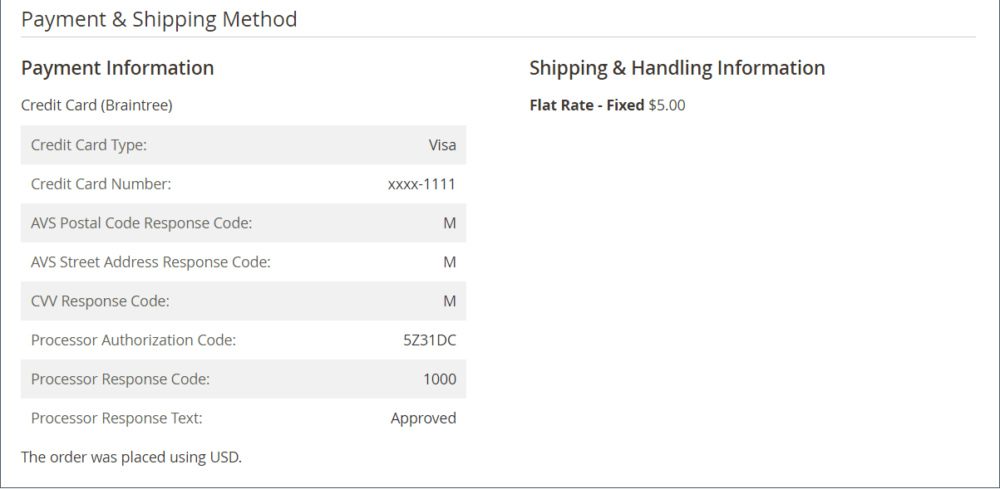
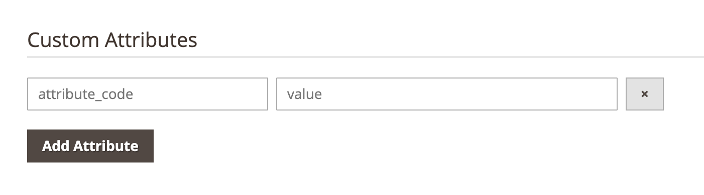

# 주문 워크플로우 및 처리

고객이 주문을 하면 판매 주문이 임시 트랜잭션 레코드로 생성됩니다. 주문 그리드에서 판매 주문은 처음에 &quot;보류 중&quot; 상태이며, 지급이 처리될 때까지 언제든지 취소할 수 있습니다. 결제가 확정된 후 주문서는 인보이스를 발행하여 발송할 수 있습니다.

**1단계: 주문** - 체크아웃 프로세스는 구매자가 장바구니 페이지에서 **[!UICONTROL Go to Checkout]**&#x200B;을(를) 클릭하거나 고객 계정에서 직접 [재주문](reorders-allow.md)을(를) 클릭하면 시작됩니다.

**2단계: 주문 보류 중** - 초기 판매 주문 상태는 `Pending`입니다. 이 상태에서는 결제가 처리되지 않고 주문이 여전히 편집되거나 취소될 수 있다. 이 상태는 결제 방법이 권한 부여 모드로 구성된 경우 발생합니다.

**3단계: 결제 받기** - 결제 수신 또는 승인 시 주문 상태가 `Processing`(으)로 변경됩니다. 결제 방법에 따라 거래가 승인되거나 처리될 때 알림을 받을 수 있습니다. 이 상태는 결제 방법이 캡처 또는 인텐트 판매 모드로 구성된 경우 자동으로 발생합니다.

**4단계: 송장 주문** - 일반적으로 주문은 대금을 받은 후에 송장이 발행됩니다. 결제 방법은 주문에 필요한 송장 발행 옵션을 결정합니다. 송장이 생성되고 제출되면 사본이 고객에게 전송됩니다. 결제 방법이 `capture` 또는 `intent sale` 결제 작업으로 구성된 경우 결제 승인 및 캡처되면 송장이 자동으로 생성됩니다.

>[!NOTE]
>
>`Gift Card`, `Store Credit`, `Reward Points` 또는 기타 오프라인 결제 방법을 사용하여 수행한 주문에 대해 송장이 자동으로 만들어지지 않습니다.

**5단계: 단일 배송 예약** - 배송 세부 정보가 완료되고, 배송이 예약되고, 배송이 설정되면 주문 상태가 `Complete`(으)로 변경됩니다. 배송 요구 사항이 인쇄된 포장 명세서 및 배송 라벨을 충족하거나 _픽업 준비 알림_&#x200B;을(를) 선택합니다(매장 배송 방법). 고객이 알림을 받고 패키지가 배송됩니다. 추적 번호를 사용하는 경우 고객의 계정에서 배송을 추적할 수 있습니다.

>[!NOTE]
>
>주문 상태 및 결제 방법 구성 옵션에 대한 자세한 내용은 [주문 상태](order-status.md) 및 [결제](payments.md)를 참조하십시오.

## 주문 보기

1. _관리자_ 사이드바에서 **[!UICONTROL Sales]** > _[!UICONTROL Operations]_>**[!UICONTROL Orders]**(으)로 이동합니다.

1. 표에서 순서를 찾습니다.

1. _[!UICONTROL Action]_&#x200B;열에서&#x200B;**[!UICONTROL View]**&#x200B;을(를) 클릭합니다.

1. 주문 상태 확인:

   - `Pending` 주문은 수정, 보류, 취소 또는 송장 발행되어 배송될 수 있습니다.

   - `Processing` 주문은 더 이상 실질적으로 편집하거나 취소할 수 없지만 청구 및 배송 주소는 편집할 수 있습니다.

   - `Completed` 주문의 순서를 변경할 수 있습니다.

고객을 편집하여 주문 워크플로의 어느 시점에서든 고객의 이메일을 편집할 수 있습니다. 고객이 주문한 경우 이메일을 편집할 수 없습니다.

열린 순서에 대한 왼쪽 패널에서는 순서와 관련된 다양한 유형의 정보에 액세스할 수 있습니다.

{width="700" zoomable="yes"}

## 주문 처리

고객이 주문을 하면 판매 주문이 임시 트랜잭션 레코드로 생성됩니다. 결제를 받을 때까지 판매 주문의 상태는 `Pending`입니다. `Pending` 상태에 있는 동안 결제를 받고 송장이 생성될 때까지 주문을 편집하거나 취소할 수 있습니다. 쉽게 생각할 수 있는 방법은 주문은 송장이 되고 송장은 발송이 되는 것입니다. 주문 그리드는 워크플로우의 위치에 관계없이 모든 주문을 나열합니다. 주문 관련 고객 지원 방법에 대한 자세한 내용은 [주문 업데이트](order-update.md)를 참조하세요.

{width="700" zoomable="yes"}

`Pending` 주문을 열려면 오른쪽 상단의 **[!UICONTROL Edit]**&#x200B;을(를) 클릭합니다.

>[!NOTE]
>
>주문은 `Pending` 상태에서만 편집할 수 있습니다. 다른 상태의 주문이나 [협상된 견적](../b2b/quotes.md)을(를) 기반으로 하는 주문에 대해서는 편집 단추가 표시되지 않습니다.

{width="600" zoomable="yes"}

참조용으로 필드 설명을 사용하여 판매 주문에서 다음 섹션을 검토합니다.

### 주문 보기 설명

| 탭 | 설명 |
|--- |--- |
| [!UICONTROL Information] | 청구 및 배송 주소, 결제 및 배송 방법, 품목 주문, 합계 및 메모를 포함하여 주문 및 계정에 대한 자세한 정보를 표시합니다. |
| [!UICONTROL Invoices] | 주문과 연관된 각 송장을 나열합니다. |
| [!UICONTROL Credit Memos] | 주문과 연관된 각 대변 메모를 나열합니다. |
| [!UICONTROL Shipments] | 주문과 연관된 각 선적 레코드를 나열합니다. |
| [!UICONTROL Comments History] | 주문과 관련된 모든 메모를 나열합니다. |

{style="table-layout:auto"}

>[!NOTE]
>
>**[!UICONTROL Sales / Archive]**&#x200B;송장[, &#x200B;](../systems/permissions-user-roles.md)대변 메모&#x200B;_및_&#x200B;배송&#x200B;_주문 탭을 보려면 관리자 사용자에게 역할 범위에 대한_&#x200B;개의 _권한_&#x200B;이 있어야 합니다.

### 단추 막대

| 단추 | 설명 |
|--- |--- |
| **[!UICONTROL Back]** | 변경 사항을 저장하지 않고 주문 페이지로 돌아갑니다. |
| **[!UICONTROL Cancel]** | 판매 주문을 취소합니다. |
| **[!UICONTROL Send Email]** | 주문에 대한 이메일을 고객에게 보냅니다. |
| **[!UICONTROL Hold]** / **[!UICONTROL Unhold]** | 판매 주문의 상태를 `On Hold`(으)로 변경합니다. 판매 주문에 대한 보류를 해제하려면 **[!UICONTROL Unhold]**&#x200B;을(를) 선택하십시오. |
| **[!UICONTROL Invoice]** | 주문을 송장으로 변환하여 판매 주문에서 송장을 생성합니다. |
| **[!UICONTROL Ship]** | 주문에 대한 출하 레코드를 생성합니다. |
| **[!UICONTROL Notify Order is Ready for Pickup]** | 주문이 매장 배송으로 배치되는 경우에만 나타납니다. 고객에게 주문이 픽업 준비가 되었음을 알립니다. |
| **[!UICONTROL Reorder]** | 현재 주문을 기반으로 판매 주문을 생성합니다. |
| **[!UICONTROL Edit]** | 편집 모드에서 보류 중인 주문을 엽니다. 상태가 `Processing`인 주문이나 협상된 견적을 기반으로 하는 주문의 경우 [편집] 단추가 표시되지 않습니다. |

{style="table-layout:auto"}

### 주문 취소

아직 송장이 발행되지 않은 주문을 [취소](order-update.md)할 수 있습니다. 주문이 송장 발행(결제 캡처) 후 고객이 취소하려는 경우 [대변 메모](credit-memos.md)를 발행해야 합니다.

주문이 `Pending` 또는 `Processing`이고 결제가 캡처되지 않았거나 완전히 캡처되지 않은 경우 주문을 취소하는 대신 [주문을 무효화](#void-an-order)할 수 있습니다.

취소된 주문을 복원하려면 **[!UICONTROL Reorder]** 단추를 클릭하면 새 주문이 `Pending` 상태로 만들어집니다.

>[!NOTE]
>
>주문을 취소하면 공백도 생성되지만, 주문을 취소하면 취소가 트리거되지 않습니다.

### 주문 무효화

송장이 발행되지 않았고 상태가 `Processing`이고 [결제 통합 설정이 `Authorize`](../configuration-reference/sales/payment-methods.md#payment-actions)인 판매 주문만 [무효화](order-update.md#void-a-processing-order)될 수 있습니다. 주문을 취소하시면 취소가 가능합니다.

### [!UICONTROL Order and Account Information]

{width="600" zoomable="yes"}

#### 주문 정보

| 필드 | 설명 |
|--- |--- |
| [!UICONTROL Order Number] | 주문 번호가 판매 주문 상단에 나타나고 확인 이메일이 전송되었는지 보여 주는 메모가 표시됩니다. |
| [!UICONTROL Order Date] | 주문이 이루어진 날짜와 시간. |
| [!UICONTROL Purchased From] | 주문이 이루어진 웹 사이트, 스토어 및 스토어 보기를 나타냅니다. |
| [!UICONTROL Placed from IP] | 주문이 이루어진 컴퓨터의 IP 주소를 나타냅니다. |
| [!UICONTROL Order Placed from Quote] | (Adobe Commerce B2B에서 사용 가능)은 주문이 생성된 [견적](../b2b/quotes.md)을(를) 나타냅니다(해당하는 경우). 견적명이 견적에 연결됩니다. |

{style="table-layout:auto"}

#### 계정 정보

| 필드 | 설명 |
|--- |--- |
| [!UICONTROL Customer Name] | 주문을 한 고객 또는 구매자의 이름. 고객 이름은 고객 프로필에 연결됩니다. |
| [!UICONTROL Email] | 고객 또는 구매자의 이메일 주소. 이메일 주소가 연결되어 새 이메일 메시지를 열 수 있습니다. |
| [!UICONTROL Customer Group] | 고객이 할당된 고객 그룹 또는 공유 카탈로그의 이름. |
| [!UICONTROL Company Name] | (Adobe Commerce B2B에서 사용 가능) 구매자와 연결되어 있고 해당 구매자를 대신하여 주문을 받는 회사의 이름입니다. 회사 이름이 [회사 프로필](../b2b/account-companies.md)에 연결되어 있습니다. |

{style="table-layout:auto"}

### [!UICONTROL Address Information]

{width="600" zoomable="yes"}

| 필드 | 설명 |
|--- |--- |
| [!UICONTROL Billing Address] | 주문을 한 고객 또는 구매자의 이름, 대금 청구 주소, 전화 번호 및 [VAT](vat.md)(해당되는 경우)가 차례로 표시됩니다. 전화 번호는 모바일 장치에서 자동 다이얼에 연결됩니다. |
| [!UICONTROL Shipping Address] | 주문에 주의해서 배송해야 하는 사람의 이름, 그 뒤에 배송지 주소 및 전화번호가 옵니다. 전화 번호는 모바일 장치에서 자동 다이얼에 연결됩니다. |

{style="table-layout:auto"}

### [!UICONTROL Payment & Shipping Method]

{width="600" zoomable="yes"}

| 필드 | 설명 |
|--- |--- |
| [!UICONTROL Payment Information] | 주문에 사용할 결제 방법, 해당하는 경우 구매 주문 번호, 주문에 사용된 통화 뒤 [계정 결제](../b2b/enable-basic-features.md#configure-payment-on-account)를 사용하여 주문이 회사 크레딧에 청구되는 경우 계정에 청구되는 금액이 표시됩니다. |
| [!UICONTROL Shipping & Handling Information] | 사용할 배송 방법 및 적용 가능한 모든 취급 수수료. |

{style="table-layout:auto"}

### 사용자 지정 순서 특성

[!BADGE SaaS만]{type=Positive url="https://experienceleague.adobe.com/ko/docs/commerce/user-guides/product-solutions" tooltip="Adobe Commerce as a Cloud Service 프로젝트에만 적용됩니다(Adobe 관리 SaaS 인프라)."}

사용자 정의 주문 속성을 사용하면 비즈니스 요구 사항에 관련된 추가 정보를 주문과 연결할 수 있습니다.

{width="600" zoomable="yes"}

**[!UICONTROL Custom Order Attributes]** 섹션에서 모든 사용자 지정 순서 특성과 현재 값을 표시합니다.

새 사용자 지정 순서 특성을 만들려면 **[!UICONTROL Attribute Code]** 및 **[!UICONTROL Value]**&#x200B;을(를) 입력하십시오.

추가 사용자 지정 순서 특성을 만들려면 **[!UICONTROL Add Attribute]**&#x200B;을(를) 클릭합니다.

사용자 지정 순서 특성을 제거하려면 **[!UICONTROL X]** 아이콘을 클릭하십시오.

>[!NOTE]
>
>사용자 지정 순서 특성은 순서가 `Pending` 상태일 때만 편집할 수 있습니다. 다른 상태의 주문에 대해서는 속성 값을 볼 수 있지만 수정할 수는 없습니다.

### 순서가 지정된 항목 검토

{width="600" zoomable="yes"}

**[!UICONTROL Order Total]** 섹션에서 다음을 수행합니다.

1. 주문에 포함할 **[!UICONTROL Comment]**&#x200B;을(를) 입력하십시오.

1. 고객에게 전자 메일을 보내려면 **[!UICONTROL Notify Customer by Email]** 확인란을 선택하십시오.

1. 고객 계정에 댓글을 표시하려면 **[!UICONTROL Visible on Storefront]** 확인란을 선택하십시오.

   총 {width="600" zoomable="yes"}

1. 주문 송장을 발행할 준비가 되었으면 **[!UICONTROL Invoice]**&#x200B;을(를) 클릭하고 지침에 따라 [송장을 만들기](invoices.md#create-an-invoice)하십시오.

#### [!UICONTROL Items Ordered]

| 필드 | 설명 |
|--- |--- |
| [!UICONTROL Product] | 제품 이름, SKU 및 옵션(해당하는 경우). |
| [!UICONTROL Item Status] | 항목의 상태를 나타냅니다. 값: `Ordered` |
| [!UICONTROL Original Price] | 할인 전 품목의 최초 카탈로그 가격. |
| [!UICONTROL Price] | 항목의 구매 가격. 이 값은 적용 가능한 경우 공유 카탈로그의 항목에 적용된 할인을 반영합니다. |
| [!UICONTROL Qty] | 주문한 수량입니다. |
| [!UICONTROL Subtotal] | 소계는 구매 가격에 수량을 곱한 값입니다. |
| [!UICONTROL Tax Amount] | 항목에 십진수 값으로 적용되는 세액입니다. |
| [!UICONTROL Tax Percent] | 백분율로 표시된 이 항목에 적용되는 세금의 백분율입니다. |
| [!UICONTROL Discount Amount] | 이 항목에 적용되는 할인입니다. 주문이 견적을 기준으로 하는 경우 할인 값은 0입니다. |
| [!UICONTROL Row Total] | 제품 수준에서 만기가 도래하는 적용 가능한 세금을 포함한 라인 항목 합계는 할인을 감소시킵니다. |

{style="table-layout:auto"}

#### [!UICONTROL Notes for this Order]

| 필드 | 설명 |
|--- |--- |
| [!UICONTROL Status] | 판매 주문 상태를 표시합니다. |
| [!UICONTROL Comment] | 주문과 함께 제공되는 고객에 대한 설명을 입력하는 데 사용되는 텍스트 상자입니다.  **[!UICONTROL Notify Customer by Email]**- 댓글을 고객에게 별도의 이메일로 보내려면 확인란을 선택합니다. **[!UICONTROL Visible on Storefront]** - 고객 계정에서 댓글을 표시하려면 확인란을 선택합니다.  **[!UICONTROL Update]**- 댓글을 추가하고 해당하는 경우 이메일을 보냅니다. |

{style="table-layout:auto"}

#### [!UICONTROL Order Totals]

| 필드 | 설명 |
|--- |--- |
| [!UICONTROL Shipping & Handling] | 배송 및 취급 수수료에 대해 청구된 금액. |
| [!UICONTROL Tax] | 주문에 적용되는 세액(해당하는 경우). |
| [!UICONTROL Grand Total] | 주문 총계. |
| [!UICONTROL Total Paid] | 해당되는 경우 주문에 대해 지불된 총 금액. |
| [!UICONTROL Total Refunded] | 해당하는 경우 주문에서 환불된 총 금액. |
| [!UICONTROL Total Due] | 기한이 도래하는 총 금액. |
| [!UICONTROL Store Credit] | (Adobe Commerce만 해당) 주문에 적용되는 사용 가능한 스토어 크레딧 양입니다. |
| [!UICONTROL Catalog Total Price] | (Adobe Commerce B2B에서 사용 가능) 견적의 기본으로 사용되는 공유 카탈로그 또는 표준 카탈로그의 가격책정에 따라 세금 없이 견적에 포함된 항목의 총 가격입니다. 상점 표시 통화가 기준 통화와 다를 경우 값은 두 통화로 표시되며 상점 표시는 대괄호로 표시됩니다. |
| [!UICONTROL Negotiated Discount] | (Adobe Commerce B2B에서 사용 가능) 구매자와 판매자 간에 협상된 견적의 결과인 할인. 상점 표시 통화가 기준 통화와 다를 경우 값은 두 통화로 표시되며 상점 표시는 대괄호로 표시됩니다. |
| [!UICONTROL Subtotal] | (Adobe Commerce B2B와 함께 사용 가능) 카탈로그 총 가격에서 협상된 할인을 뺀 값입니다. |

{style="table-layout:auto"}

## 주문 처리 데모

이 비디오를 통해 주문 처리 및 상태에 대해 자세히 알아보십시오.

>[!VIDEO](https://video.tv.adobe.com/v/3410801/?quality=12&learn=on&captions=kor)
