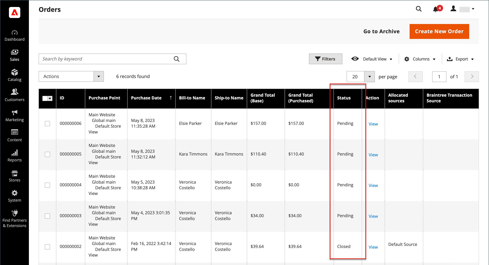
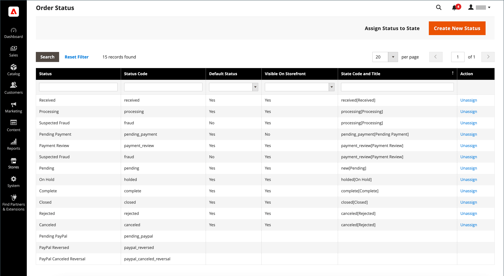
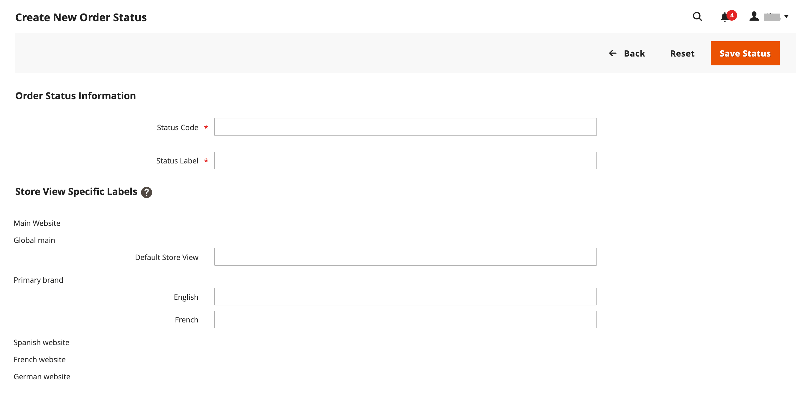
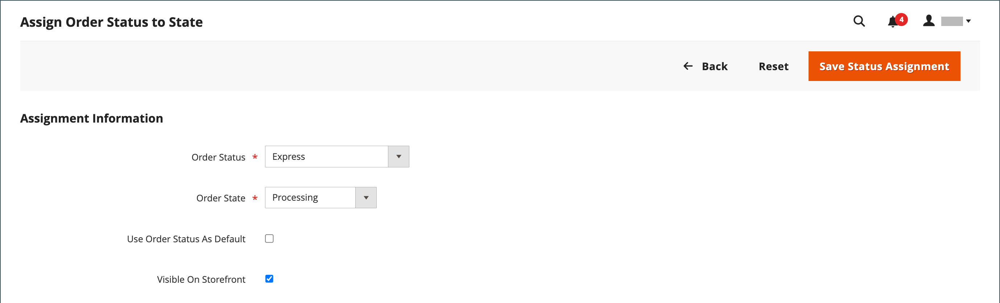

# 주문 상태

모든 주문에는 주문 처리 [워크플로](order-processing.md)의 단계와 연결된 주문 상태가 있습니다.\
순서 상태와 순서 상태의 차이점은 **[!UICONTROL order states]**이(가) 프로그래밍 방식으로 사용된다는 것입니다. 그렇지 않습니다.
고객 또는 관리자 사용자에게 표시됩니다. 주문의 흐름과 다음에 대해 가능한 작업을 결정합니다.
특정 상태에서 주문.\
**[!UICONTROL Order statuses]**은(는) 고객 및 관리자 사용자에게 주문 상태를 전달하는 데 사용됩니다.
운영 요구 사항에 맞게 추가 주문 상태를 생성할 수 있습니다. 주문 상태를 표시하기 편리함
Adobe Commerce 이외의 진행률(예: 주문 피킹 및 납품 진행률). 그 주문은 주문에 영향을 미치지 않습니다
처리 워크플로우입니다.\
각 주문 상태는 주문 상태와 연관됩니다. 스토어에는 사전 정의된 주문 상태 및
주문 상태 설정입니다.

{width="700" zoomable="yes"}

각 주문의 상태는 _주문_ 그리드의 _상태_ 열에 표시됩니다.

{width="700" zoomable="yes"}

>[!TIP]
>
>부분 환불 주문은 **_모두_**&#x200B;개 주문 항목(환불 항목 포함)이 배송될 때까지 `Processing` 상태로 유지됩니다. 주문의 모든 항목이 배송될 때까지 주문 상태가 `Complete`(으)로 변경되지 않습니다.

## 주문 상태 워크플로

## 사전 정의된 상태

| 주문 상태 | 상태 코드 |                                                                                                                                                                                                                                                                                        |
|--------------------------|----------------------------|----------------------------------------------------------------------------------------------------------------------------------------------------------------------------------------------------------------------------------------------------------------------------------------|
| 받음 | `received` | 이 상태는 비동기 주문 배치가 활성화된 경우 주문의 초기 상태입니다. |
| 사기 혐의 | `fraud` | 경우에 따라 PayPal 또는 다른 결제 게이트웨이를 통해 결제된 주문은 _사기 의심_(으)로 표시됩니다. 이 상태는 주문에 발급된 송장이 없으며 확인 이메일도 전송되지 않음을 의미합니다. |
| 처리 중 | `processing` | 새 주문의 상태가 &#39;처리 중&#39;으로 설정되면 구성에서 _모든 항목에 대한 자동 인보이스_ 옵션을 사용할 수 있습니다. 인보이스는 기프트 카드, 스토어 크레딧, 보상 포인트 또는 기타 오프라인 결제 방법을 사용하여 수행한 주문에 대해 자동으로 생성되지 않습니다. |
| 보류 중인 결제 | `pending_payment` | 주문이 생성되고 PayPal 또는 유사한 결제 방법이 사용되는 경우 이 상태가 사용됩니다. 고객이 결제 게이트웨이 홈페이지로 이동했지만 아직 반품 정보가 들어오지 않았다는 의미다. 이 상태는 고객이 결제할 때 변경됩니다. |
| 결제 검토 | `payment_review` | 이 상태는 PayPal 결제 검토가 켜져 있을 때 나타납니다. |
| 보류 중 | `pending` | 이 상태는 송장 및 선적이 실행되지 않았음을 나타냅니다. |
| 보류 중 | `holded` | 이 상태는 수동으로만 할당할 수 있습니다. 어떤 주문이든 보류하실 수 있습니다. |
| 완료 | `complete` | 이 상태는 주문이 생성되고 지급되며 고객에게 출하되었음을 의미합니다. |
| 종료됨 | `closed` | 이 상태는 주문에 대변 메모가 지정되었고 고객이 환불을 받았음을 나타냅니다. |
| 취소됨 | `canceled` | 이 상태는 고객이 지정된 시간 내에 지불하지 않을 때 관리자에서 수동으로 할당되거나 일부 결제 게이트웨이의 경우 할당됩니다. |
| 거부됨 | `rejected` | 이 상태는 비동기 주문 처리 중 주문이 거부되었음을 의미합니다. 이 문제는 비동기 주문 배치 중에 오류가 발생할 때 발생합니다. |
| PayPal 취소 취소 | `paypay_canceled_reversal` | 이 상태는 PayPal이 취소를 취소했음을 의미합니다. |
| 보류 중인 PayPal | `pending_paypal` | 이 상태는 PayPal로 주문을 받았지만 아직 결제가 처리되지 않았음을 의미합니다. |
| PayPal 취소됨 | `paypal_reversed` | 이 상태는 PayPal이 거래를 취소했음을 의미합니다. |

{style="table-layout:auto"}

## 사용자 정의 주문 상태

사전 설정된 주문 상태 설정 외에도 사용자 지정 주문 상태 설정을 만들어 주문 상태에 할당하고 주문 상태에 대한 기본 주문 상태를 설정할 수 있습니다. 주문 상태는 주문 처리 워크플로우 내의 주문 위치를 나타내며 주문 상태는 주문 위치에 의미 있는 번역 가능한 레이블을 지정합니다. 예를 들어, `packaging"`, `backordered`과(와) 같은 사용자 지정 주문 상태 또는 필요에 따른 상태가 필요할 수 있습니다. 사용자 지정 상태에 대한 수사적 이름을 만들어 워크플로우의 관련 주문 상태에 할당할 수 있습니다.

>[!NOTE]
>
>주문 워크플로우에서는 기본 사용자 지정 주문 상태 값만 사용됩니다. 기본값으로 설정되지 않은 사용자 지정 상태 값은 순서의 설명 섹션에서만 사용할 수 있습니다.

{width="700" zoomable="yes"}

### 사용자 정의 주문 상태 만들기

1. _관리자_ 사이드바에서 **[!UICONTROL Stores]** > _[!UICONTROL Settings]_>**[!UICONTROL Order Status]**(으)로 이동합니다.

1. 오른쪽 상단에서 **[!UICONTROL Create New Status]**&#x200B;을(를) 클릭합니다.

   {width="600" zoomable="yes"}

1. _[!UICONTROL Order Status Information]_섹션 업데이트:

   - 내부 참조를 위해 **[!UICONTROL Status Code]**&#x200B;을(를) 입력하십시오. 첫 번째 문자는 문자(a-z)여야 하고 나머지 문자는 문자와 숫자의 모든 조합(0-9)일 수 있습니다. 공백 대신 밑줄 문자를 사용하십시오.

   - **[!UICONTROL Status Label]**&#x200B;에 대해 Admin과 Storefront 모두에서 상태 설정을 식별하는 레이블을 입력하십시오.

1. _[!UICONTROL Store View Specific Labels]_섹션에서 다른 저장소 보기에 필요한 레이블을 입력합니다.

1. **[!UICONTROL Save Status]**&#x200B;을(를) 클릭합니다.

### 상태에 주문 상태 할당

1. _주문 상태_ 페이지에서 **[!UICONTROL Assign Status to State]**&#x200B;을(를) 클릭합니다.

   {width="600" zoomable="yes"}

1. **[!UICONTROL Assignment Information]** 섹션을 업데이트하고 다음을 수행합니다.

   - 할당할 **[!UICONTROL Order Status]**&#x200B;을(를) 선택하십시오. 상태 레이블별로 나열됩니다.

   - **[!UICONTROL Order State]**&#x200B;을(를) 주문 상태가 속하는 워크플로의 위치로 설정합니다.

     >[!NOTE]
     >
     >**_[!UICONTROL Order State]_** 목록에 기본 할당된 주문 상태가 포함되어 있습니다. 예를 들어 `New` 주문 상태 값 대신 `Pending` 기본 주문 상태가 표시됩니다.

   - 이 상태를 주문 상태의 기본값으로 설정하려면 **[!UICONTROL Use Order Status as Default]** 확인란을 선택하십시오.

     >[!NOTE]
     >
     >주문 워크플로우에서는 기본 주문 상태만 사용됩니다. 기본값이 아닌 상태는 관리자의 **[!UICONTROL Order Comments]** 섹션에서만 설정할 수 있습니다.

   - 상점 전면에서 이 상태를 표시하려면 **[!UICONTROL Visible On Storefront]** 확인란을 선택하십시오.

   {width="600" zoomable="yes"}

1. **[!UICONTROL Save Status Assignment]**&#x200B;을(를) 클릭합니다.

### 기존 주문 상태 편집

1. _[!UICONTROL Order Status]_그리드에서 상태 레코드를 편집 모드로 엽니다.

1. 필요에 따라 상태 설정을 업데이트합니다.

1. **[!UICONTROL Save Status]**&#x200B;을(를) 클릭합니다.

### 지정된 상태에서 주문 상태 제거

>[!NOTE]
>
>상태가 사용 중이면 상태에서 상태 설정을 할당 해제할 수 없습니다.

1. _[!UICONTROL Order Status]_그리드에서 할당 해제할 주문 상태 레코드를 찾습니다.

1. 행의 오른쪽 끝에 있는 _[!UICONTROL Action]_열에서&#x200B;**[!UICONTROL Unassign]**링크를 클릭합니다.

   작업 영역 상단에 주문 상태가 할당 해제되었다는 메시지가 나타납니다. 주문 상태 레이블이 목록에 계속 표시되지만 더 이상 상태에 할당되지 않습니다. 주문 상태 설정은 삭제할 수 없습니다.

>[!NOTE]
>
>기본 주문 상태가 주문 상태에서 할당 해제된 경우 _**다른**_ 주문 상태는 이 주문 상태의 기본값으로 _**자동으로 설정**_&#x200B;됩니다.

## 알림

구성에서 주문 RSS 피드가 활성화된 경우 고객이 [RSS 피드](../merchandising-promotions/social-rss.md)별로 주문 상태를 추적할 수 있습니다. 활성화하면 각 주문에 RSS 피드에 대한 링크가 나타납니다.

### 주문 상태 알림 활성화

1. _관리자_ 사이드바에서 **[!UICONTROL Stores]** > _[!UICONTROL Settings]_>**[!UICONTROL Configuration]**(으)로 이동합니다.

1. 왼쪽 패널에서 **[!UICONTROL Catalog]**&#x200B;을(를) 확장하고 아래의 **[!UICONTROL RSS Feeds]**&#x200B;을(를) 선택합니다.

1. **[!UICONTROL Order]** 섹션에서 를 확장합니다.

1. **[!UICONTROL Customer Order Status Notification]**&#x200B;을(를) `Enable`(으)로 설정합니다.

   {width="600" zoomable="yes"}

1. 완료되면 **[!UICONTROL Save Config]**&#x200B;을(를) 클릭합니다.

### 새 주문 이메일 알림 구성

1. _관리자_ 사이드바에서 **[!UICONTROL Stores]** > _[!UICONTROL Settings]_>**[!UICONTROL Configuration]**(으)로 이동합니다.

1. 왼쪽 패널에서 **[!UICONTROL Sales]**&#x200B;을(를) 확장하고 아래의 **[!UICONTROL Sales Emails]**&#x200B;을(를) 선택합니다.

1. **[!UICONTROL Order]** 섹션에서 를 확장합니다.

   {width="600" zoomable="yes"}

1. **[!UICONTROL New Order Confirmation Email Sender]**&#x200B;을(를) 다음 중 하나로 설정합니다.

   - `General Contact`
   - `Sales Representative`
   - `Customer Support`
   - `Custom Email 1`
   - `Custom Email 2`

1. 각 고객 유형에 사용할 템플릿을 선택합니다.

   - **[!UICONTROL New Order Confirmation Template]** - 스토어 계정이 등록된 고객에 사용할 템플릿을 선택하십시오.
   - **[!UICONTROL New Order Confirmation Template for Guest]** - 등록된 스토어 계정이 없는 게스트 고객에 사용할 템플릿을 선택하십시오.

1. 다른 사람(예: 비즈니스 관리자)에게 새 주문을 알리려면 **[!UICONTROL Send Order Email Copy To]**&#x200B;에 전자 메일 주소를 입력하십시오.

   두 명 이상의 수신자가 필요한 경우 여러 개의 이메일 주소를 추가할 수 있습니다.

1. **[!UICONTROL Send Order Email Copy Method]**&#x200B;을(를) 다음 중 하나로 설정합니다.

   - `Bcc` - 새 주문에 대한 하나의 전자 메일만 고객과 추가 받는 사람 모두에게 전송되지만 고객은 받은 전자 메일이 추가 받는 사람에게도 전송되었는지 확인하지 않습니다.
   - `Separate Email` - 두 개의 개별 전자 메일이 전송됩니다(한 개는 수신자에게, 한 개는 고객에게).

1. 완료되면 **[!UICONTROL Save Config]**&#x200B;을(를) 클릭합니다.
