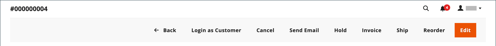

# 주문 업데이트

주문한 고객을 도울 때는 주문 상태를 확인해야 합니다. `Pending` 주문에 사용할 수 있는 옵션이 `Processing` 주문에 사용할 수 있는 옵션과 다릅니다. 자세한 내용은 [주문 처리](order-processing.md)를 참조하세요.

## 보류 중인 주문

고객이 주문을 한 후 결제를 받기 전에 주문은 `Pending` 상태입니다. 주문을 편집하거나, 보류하거나, 완전히 취소할 수 있습니다. 보류 중인 주문의 단추 모음에는 주문에 사용할 수 있는 작업이 나열됩니다.

{width="600" zoomable="yes"}

주문의 상당 부분을 수정하면 원래 주문이 취소되고 새 주문이 생성됩니다. 그러나 신규 주문을 생성하지 않고 청구 또는 운송 주소를 변경할 수 있습니다.

| 단추 | 설명 |
|--- |--- |
| **[!UICONTROL Back]** | 변경 사항을 저장하지 않고 주문 페이지로 돌아갑니다. |
| **[!UICONTROL Login as Customer]** | 관리자가 고객의 주문을 지원할 수 있습니다. |
| **[!UICONTROL Cancel]** | 보류 중인 주문을 취소합니다. |
| **[!UICONTROL Send Email]** | 보류 중인 주문에 대한 이메일을 고객에게 보냅니다. |
| **[!UICONTROL Hold]** / **[!UICONTROL Unhold]** | 보류 중인 주문의 상태를 `On Hold`(으)로 변경합니다. 보류를 해제하려면 _[!UICONTROL Unhold]_&#x200B;을(를) 선택하세요. |
| **[!UICONTROL Invoice]** | 주문을 인보이스로 전환하여 보류 중인 주문에서 [인보이스](invoices.md#create-an-invoice)를 만들고 주문 상태를 `processing`(으)로 변경합니다. |
| **[!UICONTROL Ship]** | 주문에 대한 [배송](shipments.md#create-a-shipment) 레코드를 만듭니다. |
| **[!UICONTROL Reorder]** | 현재 보류 주문과 중복되는 새 보류 주문을 만듭니다. |
| **[!UICONTROL Edit]** | 편집 모드에서 보류 중인 주문을 엽니다. 편집 단추는 보류 중인 주문이나 협상된 [견적](../b2b/quotes.md)을(를) 기반으로 하는 주문에만 사용할 수 있습니다. |

{style="table-layout:auto"}

## 주문 처리

다음 경우에 주문이 `Processing` 상태로 들어갑니다.

* 결제 작업이 `Authorize and Capture`(으)로 설정되면 주문에 대한 결제가 수신/캡처되고 송장이 생성됩니다.
* 주문 거래가 승인되었지만 결제 작업이 `Authorize`(으)로 설정된 경우 결제가 아직 캡처되지 않았습니다.

[결제 작업 구성](../configuration-reference/sales/payment-methods.md#payment-actions)은(는) 주문을 만든 후 사용할 수 있는 주문 작업을 결정합니다.

`Processing` 주문을 실질적으로 변경할 수 없지만 청구 및 배송 주소를 편집할 수 있습니다.

{width="600" zoomable="yes"}

>[!NOTE]
>
>결제 방법의 결제 작업이 `Authorize and Capture`(으)로 설정된 경우 고객이 주문을 하면 자동으로 송장이 생성됩니다. 이 경우 [대변 메모](credit-memo-create.md)를 사용하여 자금을 환불할 수 있지만 주문을 [취소](#cancel-a-pending-order) 또는 [무효](#void-a-processing-order)할 수 없습니다.

| 단추 | 설명 |
|--- |--- |
| **[!UICONTROL Back]** | 변경 사항을 저장하지 않고 주문 페이지로 돌아갑니다. |
| **[!UICONTROL Send Email]** | 주문에 대한 이메일을 고객에게 보냅니다. |
| **[!UICONTROL Void]** | 주문 트랜잭션 또는 부분 주문 트랜잭션을 [보이드](#void-a-processing-order). |
| **[!UICONTROL Credit Memo]** | [신용 메모](credit-memo-create.md)를 만드는 프로세스를 시작합니다. |
| **[!UICONTROL Hold]** / **[!UICONTROL Unhold]** | 판매 주문의 상태를 `On Hold`(으)로 변경합니다. 판매 주문에 대한 보류를 해제하려면 _[!UICONTROL Unhold]_&#x200B;을(를) 선택하십시오. |
| **[!UICONTROL Reorder]** | 현재 주문을 기반으로 새 보류 주문을 만듭니다. |
| **[!UICONTROL Create Returns]** | (Adobe Commerce만 해당) 주문에서 하나 이상의 항목을 [반환](returns.md)하는 프로세스를 시작합니다. |

{style="table-layout:auto"}

## 처리 순서 무효화

주문이 `Processing` 상태이고 결제 통합이 `Authorize and Capture`이(가) 아닌 `Authorize`(으)로 설정된 경우 거래를 무효화하거나 주문을 취소할 수 있습니다. [주문을 취소](#cancel-a-pending-order)하면 권한 부여도 중단됩니다.

결제 조치가 `Authorize and Capture`(으)로 설정된 결제 방법을 사용하여 주문이 이루어진 경우 대변 메모를 통해 자금을 환불할 수 있지만 송장이 발행되고 결제가 캡처되었기 때문에 취소할 수 없습니다.

결제 방법에 따라 사용 가능한 결제 조치가 결정됩니다. 자세한 내용은 [결제 작업](../configuration-reference/sales/payment-methods.md#payment-actions)을 참조하세요.

**_주문을 무효화하려면:_**

1. _관리자_ 사이드바에서 **[!UICONTROL Sales]** > _[!UICONTROL Operations]_>**[!UICONTROL Orders]**(으)로 이동합니다.

1. 편집할 순서에 대한 **[!UICONTROL Action]** 열에서 **[!UICONTROL View]**&#x200B;을(를) 클릭합니다.

1. 주문을 무효화하려면 **[!UICONTROL Void]**&#x200B;을(를) 클릭하십시오.

1. 프롬프트에서 **[!UICONTROL OK]**&#x200B;을(를) 클릭하여 주문을 무효화합니다.

자금이 회수된 후 [대변 메모](credit-memo-create.md)를 사용하여 필요한 환불을 발행할 수 있습니다. 제품 반품에 대해 발급된 [반품 RMA(상품 승인)](returns.md)도 만들 수 있습니다. 자세한 내용은 [주문 처리](order-processing.md)를 참조하세요.

## 보류 중인 주문 편집

1. _관리자_ 사이드바에서 **[!UICONTROL Sales]** > _[!UICONTROL Operations]_>**[!UICONTROL Orders]**(으)로 이동합니다.

1. 편집할 순서에 대한 **[!UICONTROL Action]** 열에서 **[!UICONTROL View]**&#x200B;을(를) 클릭합니다.

1. **[!UICONTROL Edit]**&#x200B;을(를) 클릭합니다.

   {width="600" zoomable="yes"}

1. 편집을 계속하려면 프롬프트에서 **[!UICONTROL OK]**&#x200B;을(를) 클릭하십시오.

1. 필요에 따라 주문을 업데이트합니다.

1. 변경 사항 적용:
   * 청구 또는 배송 주소에 대한 변경 내용을 저장하려면 **[!UICONTROL Save]**&#x200B;을(를) 클릭합니다.
   * 라인 항목에 대한 변경 내용을 저장하고 주문을 다시 처리하려면 **[!UICONTROL Submit Order]**&#x200B;을(를) 클릭합니다.

## 주문 보류

고객이 선호하는 결제 방법을 사용할 수 없거나 해당 품목이 일시적으로 품절된 경우 주문을 보류할 수 있다.

1. _주문_ 그리드에서 보류할 `Pending` 주문을 찾습니다.

1. _Action_ 열에서 **[!UICONTROL View]**&#x200B;을(를) 클릭합니다.

1. 주문을 보류하려면 **[!UICONTROL Hold]**&#x200B;을(를) 클릭하십시오.

주문 보류를 제거하려면 주문을 다시 편집하고 **[!UICONTROL Unhold]**&#x200B;을(를) 클릭합니다.

## 보류 중인 주문 취소

주문을 취소하면 주문 상태가 `Pending`에서 `Canceled`(으)로 변경됩니다.

1. _[!UICONTROL Orders]_&#x200B;그리드에서 취소할 보류 중인 주문을 찾습니다.

1. _[!UICONTROL Action]_&#x200B;열에서&#x200B;**[!UICONTROL View]**&#x200B;을(를) 클릭합니다.

1. 주문을 취소하려면 **[!UICONTROL Cancel]**&#x200B;을(를) 클릭하십시오.

현재 주문 상태는 `Canceled`입니다.
